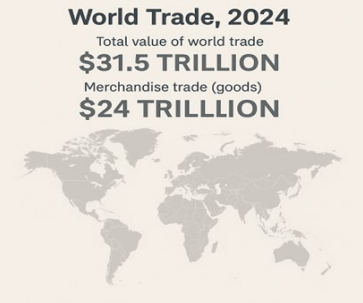

# Global Trade Trends and Tariff Impacts on Dry Bulk Shipping

**Date:** July 09, 2025  
**Publisher:** Breakwave Advisors | **Category:** Market Insights  
**Original URL:** [https://www.breakwaveadvisors.com/insights/2025/7/9/global-trade-trends-and-tariff-impacts-on-dry-bulk-shipping](https://www.breakwaveadvisors.com/insights/2025/7/9/global-trade-trends-and-tariff-impacts-on-dry-bulk-shipping)  

---

This week, the Allied QuantumSea Research Team steps back from rising geopolitical tensions to analyse the structure of global seaborne trade through the lens of the world’s leading exporters. Drawing on the World Trade Organization’s Global Trade Outlook (April 2025), we spotlight major players in both dry bulk and containerized maritime transportation, including China, the United States, India, Brazil, Russia, Indonesia, Australia, and Canada. Each of these countries exhibits a distinct maritime profile shaped by the composition of its export commodities.

In 2025, global export patterns continue to shape the backbone of dry bulk shipping demand. According to the latest data from the World Trade Organization, the total value of world trade including both goods and services reached approximately $31.5 trillion in 2024. Merchandise trade accounted for around $24 trillion while commercial services added roughly $7.5 trillion.

> **Figure 1: Στιγμιότυπο Οθόνης 2025 07 09 112750**  
> **Interactive Data & Source:** [Allied-shipbroking](https://www.allied-shipbroking.gr/) | [Local Asset](file:///C:/Users/Dell/Github/Shipping/corpus/03-breakwave/insights/2025/assets/2025-07-09_global-trade-trends-and-tariff-impacts-on-dry-bulk-shipping_img_cea3cf84ceb9ceb3cebcceb9cf8ccf84cf85_1c52be622e46.png)

### Global Export Leaders and Tradeflows

In 2025, global export patterns continue to shape core demand for dry bulk shipping. Among all continents, Asia stands as the most logical starting point for analysis, not only because it hosts several of the world’s top exporting countries, but also because it is the primary destination for seaborne dry bulk cargoes, particularly iron ore, coal, and grains. Asia’s industrial output, infrastructure development, and dependence on raw materials position it as the central hub of dry bulk demand and trade flows.

China, the world’s largest exporter with over $3.6 trillion in merchandise exports, dominates containerized shipping through electronics and machinery. It also plays a crucial role in the dry bulk segment. Exports of steel, along with moderate volumes of cement and aluminium products, support outbound bulk flows, while China’s massive demand for iron ore, coal, and bauxite fuels inbound Capesize and Panamax activity and particularly from Australia, Brazil, Indonesia, and Guinea. India, with approximately $443 billion in merchandise exports, supports dry bulk markets through shipments of rice and iron ore, while also influencing tanker markets via refined petroleum product exports. India’s growing role in manufacturing and energy exports further contributes to regional shipping flows, with outbound cargoes destined for Africa, the Middle East, and Southeast Asia.

Indonesia, exporting around $265 billion, is the world’s leading thermal coal exporter, making it a critical driver of Panamax demand and an important origin point in the Asian dry bulk ecosystem. Additionally, Indonesia is rapidly expanding its exports of bauxite and nickel, contributing to a broader regional surge in raw material flows. These outbound shipments are vital for countries like China, which rely on Indonesia for metal inputs in their industrial supply chains.

Moving to Oceania, Australia remains a bulk-export-driven economy with approximately $340 billion in merchandise exports. Its seaborne trade is heavily reliant on Capesize and Panamax vessels, primarily used to ship iron ore, coal, and bauxite to Northeast Asia. These flows are foundational to the structure of the global dry bulk market, with Australia–China iron ore shipments representing one of the most significant Capesize trades worldwide.

In South America, Brazil plays a central role with $337 billion in exports, much of which consists of dry bulk cargoes. As a top global supplier of iron ore and soybeans, Brazil relies on Capesize and Panamax vessels to connect with Asian buyers, particularly China. These long-haul voyages also contribute significantly to tonne-mile demand, reinforcing Brazil’s strategic importance in the global freight equation.

In North America, the United States with a massive $2 trillion in exports, balances its seaborne trade between agricultural commodities and manufactured goods. Bulk shipments, including grains, coal, and select mineral products, continue to support Supramax and Panamax demand on routes to Latin America, Europe, and Asia. Canada, exporting $568 billion, also has a mixed trade profile but contributes notably to the dry bulk sector through exports of forestry products, coal, and metals often shipped through Pacific ports to Asian destinations.

Lastly, Russia despite facing export constraints due to ongoing sanctions remains a major exporter with $417 billion in goods. Its coal and grain shipments from Baltic and Pacific ports are typically handled by dry bulk carriers. With European markets tightening, Russia has increasingly redirected its maritime flows eastward, strengthening trade ties with Asia and altering traditional shipping patterns, particularly in the Pacific.

Data Source:[Allied](https://www.allied-shipbroking.gr/)

---

**Tags:** Drybulk, Commodities, Shipping  
