# Spotlight on Brazilian Corn Shipments

**Date:** July 10, 2025  
**Publisher:** Breakwave Advisors | **Category:** Market Insights  
**Original URL:** [https://www.breakwaveadvisors.com/insights/2025/7/10/spotlight-on-brazilian-corn-shipments](https://www.breakwaveadvisors.com/insights/2025/7/10/spotlight-on-brazilian-corn-shipments)  

---

**WEEKLY DRY MARKET MONITOR**
*Spot Rates | Supply-Demand Trends | Port Congestion Overview*

Week 28, 2025 | Date: July 9, 2025

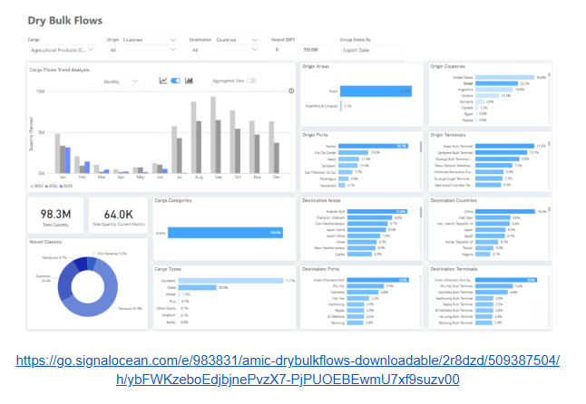

> **Figure 1: Στιγμιότυπο Οθόνης 2025 07 10 103619**  
> **Interactive Data & Source:** [Signal Ocean Platform](https://go.signalocean.com/e/983831/st-of-safrinha-corn-in-brazil-/2r8dzh/509387504/h/ybFWKzeboEdjbjnePvzX7-PjPUOEBEwmU7xf9suzv00) | [Local Asset](file:///C:/Users/Dell/Github/Shipping/corpus/03-breakwave/insights/2025/assets/2025-07-10_spotlight-on-brazilian-corn-shipments_img_cea3cf84ceb9ceb3cebcceb9cf8ccf84cf85_1c1ed249cbd9.png)

This week’s Chart Monitor highlights increasing constraints on Brazilian corn exports, even as the country nears its second-largest harvest on record. Brazil’s National Supply Company (Conab) projects 2024–2025 corn production at nearly 5 billion bushels (about 126.2 million metric tons), a 10% year-over-year increase fueled by favorable weather in April and May, which boosted yields across key producing states, especially for the[second crop](https://go.signalocean.com/e/983831/st-of-safrinha-corn-in-brazil-/2r8dzh/509387504/h/ybFWKzeboEdjbjnePvzX7-PjPUOEBEwmU7xf9suzv00)(safrinha), which makes up roughly 78% of national output.

Despite this bumper harvest, export momentum is waning. After peaking in the second half of 2023, corn shipments have slowed significantly throughout 2024 and are likely to stay subdued through 2025. The main reason is rising domestic demand, particularly from Brazil’s livestock sector and a rapidly growing corn ethanol industry, both of which are absorbing a larger share of the crop. As a result, the exportable surplus is shrinking, and Brazil is expected to focus more on domestic consumption rather than exports, possibly limiting its role as a global corn supplier through 2025.

Current dry bulk flow data from the Signal Ocean Platform confirms this slowdown. As of early July 2025, corn accounts for 26% of Brazil’s total agricultural shipments, with Panamax and Supramax vessel classes dominating at an 86% share. However, year-to-date volumes are trending at a multi-year low, especially when compared to the higher export activity seen in July, August, and September of 2023 and 2024. July had already started with extremely low shipment levels, marking a significant drop from seasonal norms and reinforcing expectations of subdued export flows for the rest of the year. The downward trend has also begun to be depicted in the growth of tonne days for agricultural shipments from Brazil to all destinations (as analyzed in the demand section).

The declining trend is now also reflected in the growth of tonne-days for Brazilian agricultural shipments across all destinations (as detailed in the demand section).

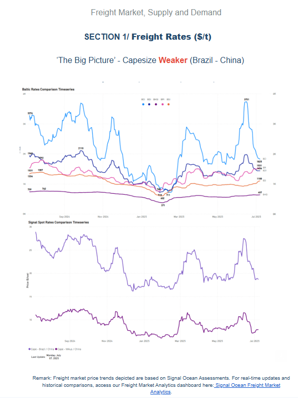

> **Figure 2: Στιγμιότυπο Οθόνης 2025 07 10 103854**  
> **Interactive Data & Source:** [Signal Ocean Platform](https://www.thesignalgroup.com/signal-ocean-platform) | [Local Asset](file:///C:/Users/Dell/Github/Shipping/corpus/03-breakwave/insights/2025/assets/2025-07-10_spotlight-on-brazilian-corn-shipments_img_cea3cf84ceb9ceb3cebcceb9cf8ccf84cf85_6b492f70e19d.png)

The Baltic Dry Index (BDI) continued to soften from mid-June, with the BCI dropping below the 1,500-point mark, as oversupply continues to weigh on sentiment, despite a demand boost from miners and a rise in shipments from Western Australia. Although June ended with approximately 31 million metric tons of**South Atlantic**cargo volumes bound for China, 7 million more than at the end of April, the increasing number of ballasters, currently estimated at around 260, is exerting downward pressure on Brazil–China freight rates, now at around $18.5/ton.

On the**C5**route, we’ve seen signs of firmness, with rates exceeding $7/ton, supported by June cargo volumes surpassing 60 million metric tons, up from 49 million metric tons at the end of April.

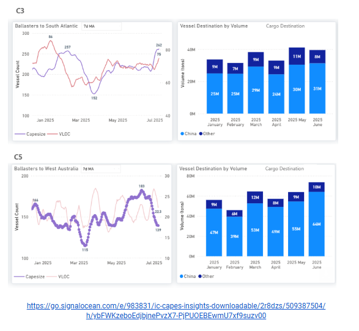

> **Figure 3: Στιγμιότυπο Οθόνης 2025 07 10 103958**  
> **Interactive Data & Source:** [Signal Ocean Platform](https://www.thesignalgroup.com/signal-ocean-platform) | [Local Asset](file:///C:/Users/Dell/Github/Shipping/corpus/03-breakwave/insights/2025/assets/2025-07-10_spotlight-on-brazilian-corn-shipments_img_cea3cf84ceb9ceb3cebcceb9cf8ccf84cf85_7f9206561696.png)

Panamax - ECSA / Far East**Firmer**

**Panamax**freight rates from East Coast South America (ECSA) to the Far East have regained ground, supported by firm demand that is helping to rebalance the continued rise in ballaster counts.**ECSA–Far East**spot rates rose by 8% week-on-week to reach $36/tonne, marking a 13% increase month-on-month.

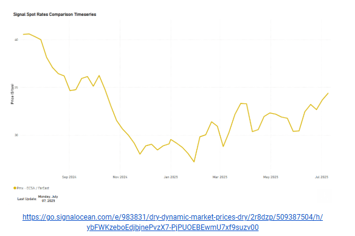

> **Figure 4: Στιγμιότυπο Οθόνης 2025 07 10 104117**  
> **Interactive Data & Source:** [Signal Ocean Platform](https://www.thesignalgroup.com/signal-ocean-platform) | [Local Asset](file:///C:/Users/Dell/Github/Shipping/corpus/03-breakwave/insights/2025/assets/2025-07-10_spotlight-on-brazilian-corn-shipments_img_cea3cf84ceb9ceb3cebcceb9cf8ccf84cf85_a76fd040fc29.png)

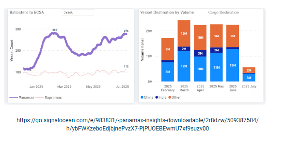

> **Figure 5: Στιγμιότυπο Οθόνης 2025 07 10 104124**  
> **Interactive Data & Source:** [Signal Ocean Platform](https://www.thesignalgroup.com/signal-ocean-platform) | [Local Asset](file:///C:/Users/Dell/Github/Shipping/corpus/03-breakwave/insights/2025/assets/2025-07-10_spotlight-on-brazilian-corn-shipments_img_cea3cf84ceb9ceb3cebcceb9cf8ccf84cf85_b8f2c78cd71d.png)

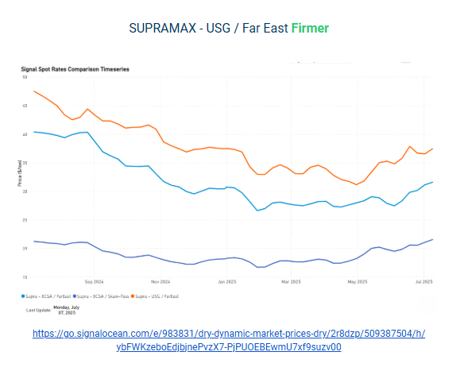

> **Figure 6: Στιγμιότυπο Οθόνης 2025 07 10 104131**  
> **Interactive Data & Source:** [Signal Ocean Platform](https://www.thesignalgroup.com/signal-ocean-platform) | [Local Asset](file:///C:/Users/Dell/Github/Shipping/corpus/03-breakwave/insights/2025/assets/2025-07-10_spotlight-on-brazilian-corn-shipments_img_cea3cf84ceb9ceb3cebcceb9cf8ccf84cf85_1a91afef28ef.png)

**Supramax**spot rates ex-USG to the Far East have risen to $39/tonne, marking an 8% weekly increase. An upward trend is also observed on the ECSA/Skaw-Pass and ECSA/Far East routes, likely supported by a downward correction in the number of ballasters to the USG/USEC, which has fallen to around 100. Meanwhile, monthly cargo volumes loaded at the end of June rose to approximately 7,7 million metric tons, matching the highs recorded in March and April, the strongest levels seen so far this year.

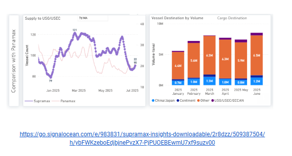

> **Figure 7: Στιγμιότυπο Οθόνης 2025 07 10 104233**  
> **Interactive Data & Source:** [Signal Ocean Platform](https://www.thesignalgroup.com/signal-ocean-platform) | [Local Asset](file:///C:/Users/Dell/Github/Shipping/corpus/03-breakwave/insights/2025/assets/2025-07-10_spotlight-on-brazilian-corn-shipments_img_cea3cf84ceb9ceb3cebcceb9cf8ccf84cf85_fff83c231bba.png)

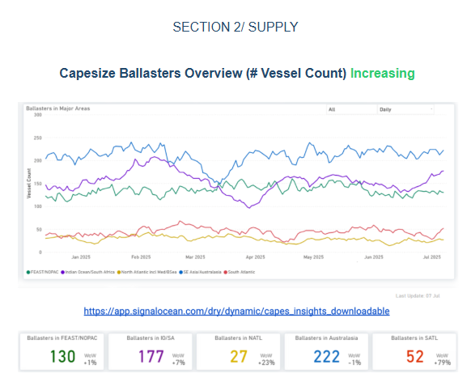

> **Figure 8: Στιγμιότυπο Οθόνης 2025 07 10 104242**  
> **Interactive Data & Source:** [Signal Ocean Platform](https://www.thesignalgroup.com/signal-ocean-platform) | [Local Asset](file:///C:/Users/Dell/Github/Shipping/corpus/03-breakwave/insights/2025/assets/2025-07-10_spotlight-on-brazilian-corn-shipments_img_cea3cf84ceb9ceb3cebcceb9cf8ccf84cf85_01650eaaceaf.png)

**Capesize ballasters view**: Capesize ballast availability in the Atlantic has risen, with the South Atlantic experiencing a much higher oversupply burden than the North Atlantic. In the Pacific, ballast vessel numbers remain elevated, especially in the Indian Ocean/South Africa region, where they now surpass 170 compared to 130 in the Far East/North Pacific.

​​​​​​

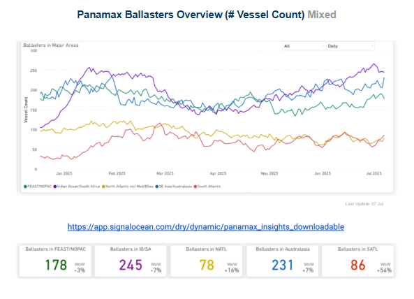

> **Figure 9: Στιγμιότυπο Οθόνης 2025 07 10 104334**  
> **Interactive Data & Source:** [Signal Ocean Platform](https://www.thesignalgroup.com/signal-ocean-platform) | [Local Asset](file:///C:/Users/Dell/Github/Shipping/corpus/03-breakwave/insights/2025/assets/2025-07-10_spotlight-on-brazilian-corn-shipments_img_cea3cf84ceb9ceb3cebcceb9cf8ccf84cf85_bcaabc89bb35.png)

**Panamax ballasters view**: Oversupply persists in the Pacific market, particularly in the Indian Ocean/South Africa, where levels remain high at 240, despite initial signs of a decline. Conversely, ballast figures in both the North and South Atlantic have decreased since mid-June.

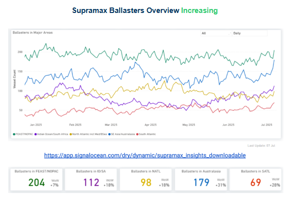

> **Figure 10: Στιγμιότυπο Οθόνης 2025 07 10 104425**  
> **Interactive Data & Source:** [Signal Ocean Platform](https://www.thesignalgroup.com/signal-ocean-platform) | [Local Asset](file:///C:/Users/Dell/Github/Shipping/corpus/03-breakwave/insights/2025/assets/2025-07-10_spotlight-on-brazilian-corn-shipments_img_cea3cf84ceb9ceb3cebcceb9cf8ccf84cf85_51e5f6e75af9.png)

**Supramax ballasters view**: Oversupply persists in the Pacific market, with over 200 vessels ballasting in the Far East/NOPAC, 180 in Australasia, and more than 100 in the Indian Ocean. Similarly, the Atlantic market faces significant oversupply, with over 90 vessels ballasting in the North Atlantic.

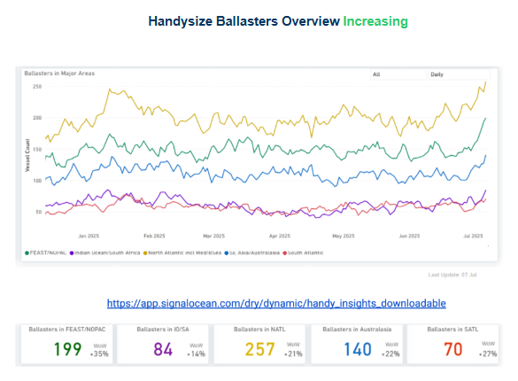

> **Figure 11: Στιγμιότυπο Οθόνης 2025 07 10 104645**  
> **Interactive Data & Source:** [Signal Ocean Platform](https://www.thesignalgroup.com/signal-ocean-platform) | [Local Asset](file:///C:/Users/Dell/Github/Shipping/corpus/03-breakwave/insights/2025/assets/2025-07-10_spotlight-on-brazilian-corn-shipments_img_cea3cf84ceb9ceb3cebcceb9cf8ccf84cf85_f4969d829d3a.png)

**Handysize ballasters**: Vessel oversupply has seen continuous and significant increases in both the Pacific and North Atlantic basins, reaching the highest levels observed since the start of the year. Specifically, the Far East/North Pacific region of the Pacific basin experienced a surge to approximately 200 vessels, while Australasia reached 140. In the North Atlantic, ballasters neared 260.

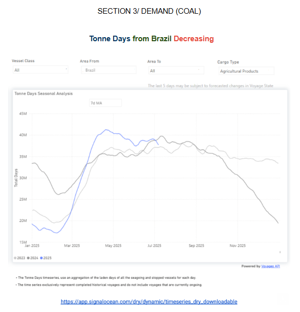

> **Figure 12: Στιγμιότυπο Οθόνης 2025 07 10 104735**  
> **Interactive Data & Source:** [Signal Ocean Platform](https://www.thesignalgroup.com/signal-ocean-platform) | [Local Asset](file:///C:/Users/Dell/Github/Shipping/corpus/03-breakwave/insights/2025/assets/2025-07-10_spotlight-on-brazilian-corn-shipments_img_cea3cf84ceb9ceb3cebcceb9cf8ccf84cf85_da1b680c0f7a.png)

At the close of Q1, Brazil's agricultural tonne-days demonstrated notable growth, outperforming the equivalent periods in April and May of both 2023 and 2024. However, June marked a downturn, aligning with forecasts for a substantial reduction in Brazilian corn shipments throughout the year. After peaking at 30M at the end of April, growth subsequently receded to 26M in recent days. This indicates that while soybean demand is strengthening, it is steadily being offset by the declining volume of corn shipments.

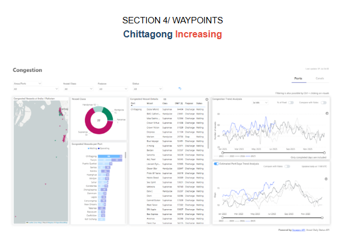

> **Figure 13: Στιγμιότυπο Οθόνης 2025 07 10 104822**  
> **Interactive Data & Source:** [Signal Ocean Platform](https://www.thesignalgroup.com/signal-ocean-platform) | [Local Asset](file:///C:/Users/Dell/Github/Shipping/corpus/03-breakwave/insights/2025/assets/2025-07-10_spotlight-on-brazilian-corn-shipments_img_cea3cf84ceb9ceb3cebcceb9cf8ccf84cf85_dced51bcaefb.png)

Chittagong Port is currently experiencing a significant increase in congestion, with 66 bulk vessels, mainly Supramax and Handysize, waiting offshore. This surge in delays is attributed to a confluence of factors: labor shortages during the Eid-ul-Azha holiday, heavy monsoon rainfall, and a prolonged strike by customs officials. These issues have severely impacted port efficiency, leading to substantial slowdowns in container handling, yard congestion exceeding 80% utilization, and extended queues of container ships awaiting berths. While the initial disruptions were concentrated in container logistics, the ripple effects have extended to the dry bulk segment. Limited berth availability, shared tug and pilot resources, and overall infrastructure strain at Chittagong have caused significant delays for dry bulk vessels. Trend analysis of estimated port days indicates a recent increase to 17 days, six more than at the beginning of April.

Data Source:[Signal Ocean Platform](https://www.thesignalgroup.com/signal-ocean-platform)

---

**Tags:** Drybulk, Commodities, Shipping  
