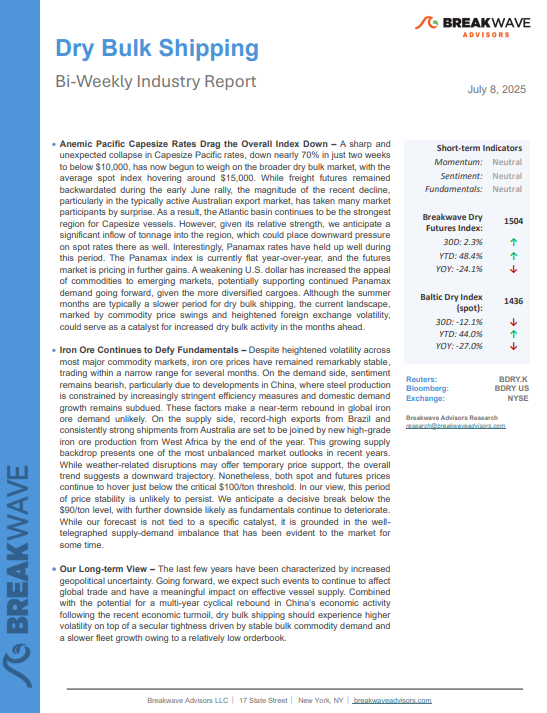
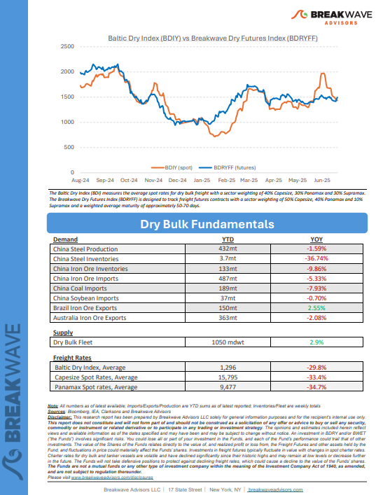
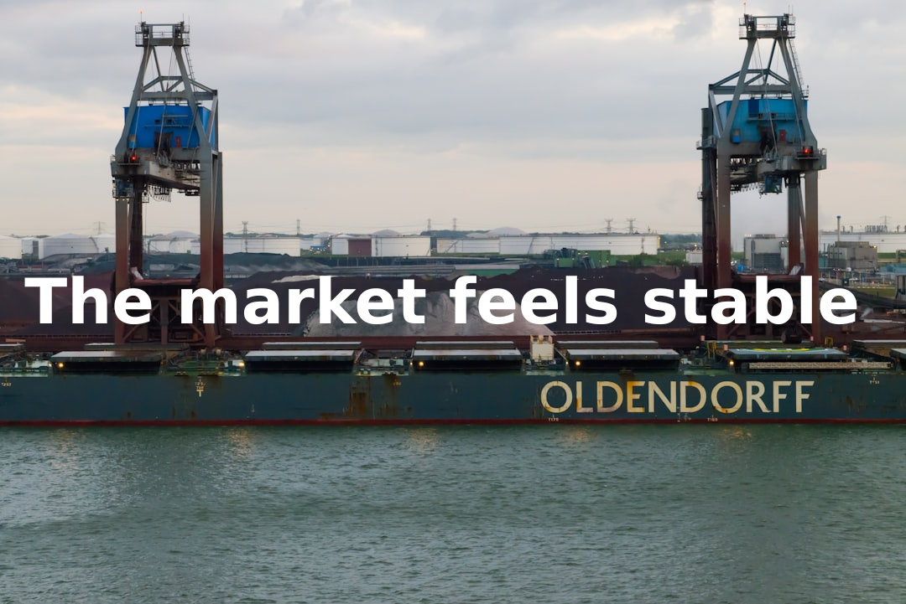
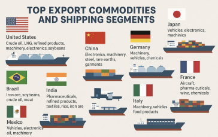
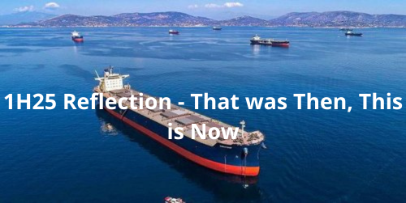

# Breakwave Weekend Read

**Date:** July 11, 2025  
**Publisher:** Breakwave Advisors | **Category:** Market Insights  
**Original URL:** [https://www.breakwaveadvisors.com/insights/2024/10/25/breakwave-weekend-read-547kk-rw7zy-awmfb-mf26k-dk29d-56ysb-x3jbe-xbwk9](https://www.breakwaveadvisors.com/insights/2024/10/25/breakwave-weekend-read-547kk-rw7zy-awmfb-mf26k-dk29d-56ysb-x3jbe-xbwk9)  

---

## Welcome Tobreakwave Advisorsweekend Read

***As the week comes to a close, take a moment to review the key insights from the past few days. Missed something? We've gathered all the top insights for you to catch up at your convenience.***

## Breakwave Shipping Report

**Anemic Pacific Capesize Rates Drag the Overall Index Down**– A sharp and unexpected collapse in Capesize Pacific rates, down nearly 70% in just two weeks to below $10,000, has now begun to weigh on the broader dry bulk market, with the average spot index hovering around $15,000.

[Read More](https://www.breakwaveadvisors.com/insights/202578-drybulk-kil-114klo)

> **Figure 1: Στιγμιότυπο Οθόνης 2025 07 11 135427**  
> **Interactive Data & Source:** [Breakwave Advisors Market Insights](https://www.breakwaveadvisors.com/insights/2025/7/7/he-market-feels-stable) | [Local Asset](file:///C:/Users/Dell/Github/Shipping/corpus/03-breakwave/insights/2025/assets/2025-07-11_breakwave-weekend-read-547kk-rw7zy-awmfb-mf26k-dk29d-56ysb-x3jbe-xbwk9_img_cea3cf84ceb9ceb3cebcceb9cf8ccf84cf85_f44cf2c39f9d.png)

> **Figure 2: Στιγμιότυπο Οθόνης 2025 07 11 135442**  
> **Interactive Data & Source:** [Breakwave Advisors Market Insights](https://www.breakwaveadvisors.com/insights/2025/7/7/he-market-feels-stable) | [Local Asset](file:///C:/Users/Dell/Github/Shipping/corpus/03-breakwave/insights/2025/assets/2025-07-11_breakwave-weekend-read-547kk-rw7zy-awmfb-mf26k-dk29d-56ysb-x3jbe-xbwk9_img_cea3cf84ceb9ceb3cebcceb9cf8ccf84cf85_029faba82121.png)

## Τhe Market Feels Stable

> **Figure 3: Ανώνυμο Σχέδιο (1)**  
> **Interactive Data & Source:** [Breakwave Advisors Market Insights](https://www.breakwaveadvisors.com/insights/2025/7/7/he-market-feels-stable) | [Local Asset](file:///C:/Users/Dell/Github/Shipping/corpus/03-breakwave/insights/2025/assets/2025-07-11_breakwave-weekend-read-547kk-rw7zy-awmfb-mf26k-dk29d-56ysb-x3jbe-xbwk9_img_ce91cebdcf8ecebdcf85cebccebfcf83cf87_fa5f2524f836.png)

As the Hellenic Shipbrokers Association reconvenes for its summer dinner, the atmosphere is more restrained than it was two years ago – not because the market is weaker, but because it remains directionless.

Doric Weekly Market Insights

## Excess Housing Supply Remains Extreme in China

> **Figure 4: Ανώνυμο Σχέδιο (2)**  
> **Interactive Data & Source:** [Breakwave Advisors Market Insights](https://www.breakwaveadvisors.com/insights/2025/7/7/excess-housing-supply-remains-extreme-in-china) | [Local Asset](file:///C:/Users/Dell/Github/Shipping/corpus/03-breakwave/insights/2025/assets/2025-07-11_breakwave-weekend-read-547kk-rw7zy-awmfb-mf26k-dk29d-56ysb-x3jbe-xbwk9_img_ce91cebdcf8ecebdcf85cebccebfcf83cf87_033a0ad57979.png)

As we discussed in Commodore Research's most recent Weekly China Report, excess housing oversupply remains extreme in China.

From Commodore's Weekly Dry Bulk Reports

## Rising Trade Tensions Push Metals Lower

> **Figure 5: Ανώνυμο Σχέδιο**  
> **Interactive Data & Source:** [Breakwave Advisors Market Insights](https://www.breakwaveadvisors.com/insights/2025/7/8/rising-trade-tensions-push-metals-lower) | [Local Asset](file:///C:/Users/Dell/Github/Shipping/corpus/03-breakwave/insights/2025/assets/2025-07-11_breakwave-weekend-read-547kk-rw7zy-awmfb-mf26k-dk29d-56ysb-x3jbe-xbwk9_img_ce91cebdcf8ecebdcf85cebccebfcf83cf87_be8456551261.png)

Renewed trade uncertainty pushed industrial commodities lower. Signs of tightness in the oil market offset concerns of higher output from OPEC.

Commodities Wrap

## Global Trade Trends and Tariff Impacts on Dry Bulk Shipping

> **Figure 6: Στιγμιότυπο Οθόνης 2025 07 09 112803**  
> **Interactive Data & Source:** [Breakwave Advisors Market Insights](https://www.breakwaveadvisors.com/insights/2025/7/9/global-trade-trends-and-tariff-impacts-on-dry-bulk-shipping) | [Local Asset](file:///C:/Users/Dell/Github/Shipping/corpus/03-breakwave/insights/2025/assets/2025-07-11_breakwave-weekend-read-547kk-rw7zy-awmfb-mf26k-dk29d-56ysb-x3jbe-xbwk9_img_cea3cf84ceb9ceb3cebcceb9cf8ccf84cf85_a608e1b879b3.png)

This week, the Allied QuantumSea Research Team steps back from rising geopolitical tensions to analyse the structure of global seaborne trade through the lens of the world’s leading exporters.

Allied Weekly Report

## China Is Entering a New Phase of Recalibration

> **Figure 7: Ανώνυμο Σχέδιο (3)**  
> **Interactive Data & Source:** [Breakwave Advisors Market Insights](https://www.breakwaveadvisors.com/insights/2025/7/2/china-is-entering-a-new-phase-of-recalibration) | [Local Asset](file:///C:/Users/Dell/Github/Shipping/corpus/03-breakwave/insights/2025/assets/2025-07-11_breakwave-weekend-read-547kk-rw7zy-awmfb-mf26k-dk29d-56ysb-x3jbe-xbwk9_img_ce91cebdcf8ecebdcf85cebccebfcf83cf87_1d643cae8456.png)

After setting an all-time high for coal imports in 2024, China appears to be entering a new phase of recalibration.

Intermodal Weekly Market Report

## Spotlight on Brazilian Corn Shipments

> **Figure 8: Προσθέστε Επικεφαλίδα**  
> **Interactive Data & Source:** [Breakwave Advisors Market Insights](https://www.breakwaveadvisors.com/insights/2025/7/10/spotlight-on-brazilian-corn-shipments) | [Local Asset](file:///C:/Users/Dell/Github/Shipping/corpus/03-breakwave/insights/2025/assets/2025-07-11_breakwave-weekend-read-547kk-rw7zy-awmfb-mf26k-dk29d-56ysb-x3jbe-xbwk9_img_cea0cf81cebfcf83ceb8ceadcf83cf84ceb5_82f060dc5a8b.png)

This week’s Chart Monitor highlights increasing constraints on Brazilian corn exports, even as the country nears its second-largest harvest on record.

Signal Ocean Dry Weekly Market Monitor

## All About Us

> **Figure 9: All About Us**  
> **Interactive Data & Source:** [Breakwave Advisors Market Insights](https://www.breakwaveadvisors.com/insights/2025/7/10/all-about-us) | [Local Asset](file:///C:/Users/Dell/Github/Shipping/corpus/03-breakwave/insights/2025/assets/2025-07-11_breakwave-weekend-read-547kk-rw7zy-awmfb-mf26k-dk29d-56ysb-x3jbe-xbwk9_img_allaboutus_8db342e93ba8.png)

Almost every year since 2020 has been a rollercoaster ride, and the first six months of 2025 were no different with a wide range of factors influencing the tanker markets.

Gibson Tanker Market Report

## The Big Picture: What Can Change China’s Coal Import Appetite?

> **Figure 10: Ανώνυμο Σχέδιο (4)**  
> **Interactive Data & Source:** [Breakwave Advisors Market Insights](https://www.breakwaveadvisors.com/insights/2025/7/11/the-big-picture-what-can-change-chinas-coal-import-appetite) | [Local Asset](file:///C:/Users/Dell/Github/Shipping/corpus/03-breakwave/insights/2025/assets/2025-07-11_breakwave-weekend-read-547kk-rw7zy-awmfb-mf26k-dk29d-56ysb-x3jbe-xbwk9_img_ce91cebdcf8ecebdcf85cebccebfcf83cf87_d103980f0f74.png)

Using industry price and Braemar’s own freight rate assessments as a basis, the current implied spot delivered price into South China of domestic thermal coal (6,000kc) is similar to the corresponding landed price for Indonesian material.

Braemar Weekly Dry Market Report

## 1h25 Reflection - That Was Then, This Is Now

> **Figure 11: Ανώνυμο Σχέδιο (5)**  
> **Interactive Data & Source:** [Breakwave Advisors Market Insights](https://www.breakwaveadvisors.com/insights/2025/7/11/1h25-reflection-that-was-then-this-is-now) | [Local Asset](file:///C:/Users/Dell/Github/Shipping/corpus/03-breakwave/insights/2025/assets/2025-07-11_breakwave-weekend-read-547kk-rw7zy-awmfb-mf26k-dk29d-56ysb-x3jbe-xbwk9_img_ce91cebdcf8ecebdcf85cebccebfcf83cf87_593fd5caba3a.png)

There are decades where nothing happens, and there are weeks where decades happen.

BRS Weekly Dry Bulk Newsletter

---

**Tags:** Shipping, Tankers, Drybulk  
