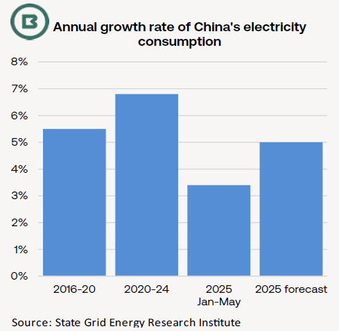
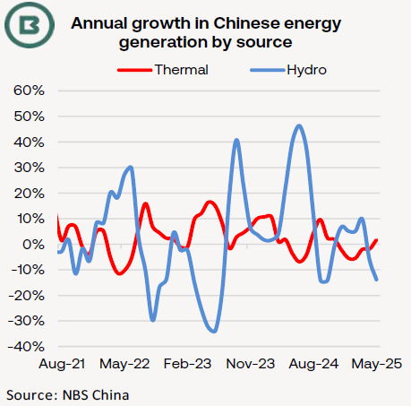

# The Big Picture: What can change China’s coal import appetite?

**Date:** July 11, 2025  
**Publisher:** Breakwave Advisors | **Category:** Market Insights  
**Original URL:** [https://www.breakwaveadvisors.com/insights/2025/7/11/the-big-picture-what-can-change-chinas-coal-import-appetite](https://www.breakwaveadvisors.com/insights/2025/7/11/the-big-picture-what-can-change-chinas-coal-import-appetite)  

---

- *Chinese coal imports have long been a crucial swing factor in shaping bulker demand, and, to date, this year has marked a downward correction from the annual all-time high in 2024.*
- *Comparisons of the implied spot delivered price into South China of domestic thermal coal loaded in the north of the country with its Indonesian equivalent show lower costs for domestic in 2025 relative to last year.*
- *Could more import interest in thermal coal be generated by a long, hot summer?*

Using industry price and Braemar’s own freight rate assessments as a basis, the current implied spot delivered price into South China of domestic thermal coal (6,000kc) is similar to the corresponding landed price for Indonesian material.

However, the same price comparison for**this point last year**showed**domestic coal to be costlier by more than $6/t**.

Such comparisons are risky. Of course, 6,000kc is a high cv (calorific value) coal, with most of Indonesia’s coal offered with lower cv, and we have not taken into account the involvement of term contracts, other differences in grade, plus costs such as taxes.

Nonetheless, the price comparison above illustrates a**shift in market dynamics**.

McCloskey observed that domestic coal production has been slow to pick up after recent mine safety and environmental checks, but new monthly output quotas could raise domestic supply.

The State Grid Energy Research Institute has forecast a 5% gain in China’s power demand this year, which would mark an acceleration from 3.4% annual growth rate in the first five months—implying faster growth of 6.1% in the rest of the year.

> **Figure 1: Db8a Image 0 1752162680664**  
> [Local Asset](file:///C:/Users/Dell/Github/Shipping/corpus/03-breakwave/insights/2025/assets/2025-07-11_the-big-picture-what-can-change-chinas-coal-import-appetite_img_db8a-image-0-1752162680664_55ffd9aa5ed9.png)

> **Figure 2: 5afc Image 1 1752162705536**  
> [Local Asset](file:///C:/Users/Dell/Github/Shipping/corpus/03-breakwave/insights/2025/assets/2025-07-11_the-big-picture-what-can-change-chinas-coal-import-appetite_img_5afc-image-1-1752162705536_2941364f769e.png)

For perspective, power demand rose at an annual rate of 5.5% in 2016-20 and 6.8% in 2020-24 inclusive (see chart below).

**Renewable energy’s share**of Chinese power capacity will continue to expand.

This month a senior representative from the National Coal Industry Association in China estimated that a yearly increase in generation from solar, wind, and hydropower during January-May had**displaced around 50m tonnes of coal burn**at power stations.

**Heatwaves**, which have pushed average temperatures across China some 0.9°C above the usual level, have already been linked to May’s rise in power demand and coal-fired generation.

**Hydro power generation**also fell by –14% YoY in May, supporting thermal generation (see second chart on page 1).

Earlier this year, the National Energy Administration forecast the average temperature to climb 0.5-1.5°C above the summer norm, with some northern and central regions experiencing extreme highs of 45°C.

Indeed, Chinese media reported that the national electricity load surged to record levels last week, as demand for air conditioning spiked amid close to record temperatures in parts of the country.

Given healthy inventory levels, much will depend on whether China’s domestic coal mines can lift production in coming weeks.

Alongside other swing factors, such as the duration of current port congestion at Newcastle and East Coast South American grain chartering activity (and potential for lengthening vessel queues),**China’s coal import interest**forms a**key influence for Panamax market balances in the Q3**.

---

**Tags:** Coal, China, Shipping  
