# Brazilian crude oil shipments

**Date:** July 14, 2025  
**Publisher:** Breakwave Advisors | **Category:** Market Insights  
**Original URL:** [https://www.breakwaveadvisors.com/insights/2025/7/14/brazilian-crude-oil-shipments](https://www.breakwaveadvisors.com/insights/2025/7/14/brazilian-crude-oil-shipments)  

---

## Tanker - Weekly Market Monitor

Snapshot of Crude and Product Freight Rates, Supply-Demand

Week 28, 10 July, 2025

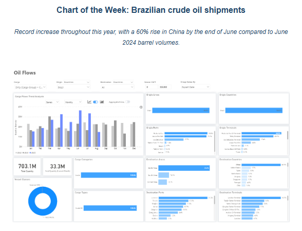

> **Figure 1: Στιγμιότυπο Οθόνης 2025 07 14 154033**  
> **Interactive Data & Source:** [Signal Ocean Platform](https://go.signalocean.com/e/983831/-05-06--utm-source-chatgpt-com/2r8jdz/509980814/h/tuX1FgfaP3E7MpsREmuGOlYmln7v9G0UqgYPVt732vE) | [Local Asset](file:///C:/Users/Dell/Github/Shipping/corpus/03-breakwave/insights/2025/assets/2025-07-14_brazilian-crude-oil-shipments_img_cea3cf84ceb9ceb3cebcceb9cf8ccf84cf85_4c5c3c77c087.png)

This week’s Chart Market Monitor highlights the significant increase in Brazilian crude oil shipments to China, which reached a record 93.6 million barrels in Q2 2025, marking a 53% rise from Q1 and a 60% year-on-year surge compared to Q2 2024. These are the highest second-quarter volumes recorded in recent years, far surpassing previous benchmarks from 2023 and 2024.

China now absorbs approximately 40% of Brazil’s crude exports, reinforcing its role as the dominant buyer. Major Chinese discharge ports include Lanshan, Tianjin, Ningbo, Yantai, Qingdao, and Dongjiakou, with the North China region accounting for 73% of total arrivals.

This trend reflects a crucial shift in China’s crude sourcing strategy. The country is increasingly prioritizing long-haul volumes from Brazil, almost entirely lifted on VLCCs. This is supported by Petrobras, which has expanded both term contracts and spot sales to Chinese buyers such as Unipec and Sinochem. Demand has also been driven by China’s continued efforts to rebuild its strategic petroleum reserves (SPRs), particularly amid price dips in early 2025, and by a rebound in buying activity from independent “teapot” refiners in Shandong province following the relaxation of import quotas and improved refinery margins.

In addition, recent corporate activity by the Brazilian energy group underscores the long-haul shift. Petrobras is actively courting Chinese investment to revitalize Brazil’s domestic shipbuilding industry. During the Brazil–China Naval Industry Forum, the company signed memoranda of understanding with Chinese shipyards as part of its broader strategy to commission 25 new vessels by 2030 via its shipping subsidiary,[Transpetro](https://go.signalocean.com/e/983831/-05-06--utm-source-chatgpt-com/2r8jdz/509980814/h/tuX1FgfaP3E7MpsREmuGOlYmln7v9G0UqgYPVt732vE).

[Petrobras](https://go.signalocean.com/e/983831/-07-05--utm-source-chatgpt-com/2r8jf3/509980814/h/tuX1FgfaP3E7MpsREmuGOlYmln7v9G0UqgYPVt732vE)is also restructuring its upstream portfolio, exploring the divestment of the Polo Bahia onshore fields to redirect capital toward export logistics and offshore production. At the same time, it has announced a R$26 billion (~US$4.8 billion) investment to integrate the Reduc refinery with the Boaventura logistics hub, enhancing flexibility in crude exports. On the exploration front, Petrobras and Chevron-led consortia secured rights to key offshore blocks in the Foz do Amazonas basin.

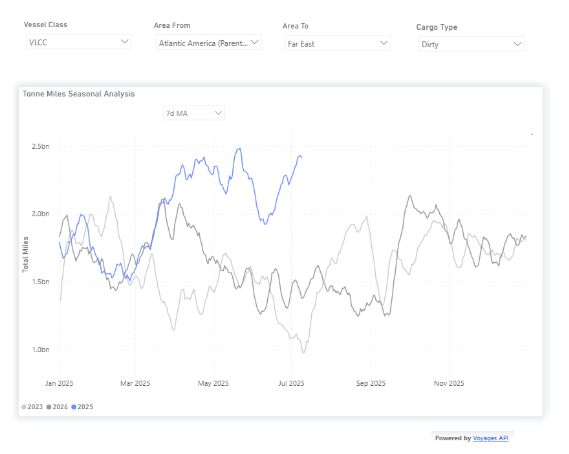

> **Figure 2: Στιγμιότυπο Οθόνης 2025 07 14 154134**  
> **Interactive Data & Source:** [Signal Ocean Platform](https://go.signalocean.com/e/983831/fd7376f-utm-source-chatgpt-com/2r8jf9/509980814/h/tuX1FgfaP3E7MpsREmuGOlYmln7v9G0UqgYPVt732vE) | [Local Asset](file:///C:/Users/Dell/Github/Shipping/corpus/03-breakwave/insights/2025/assets/2025-07-14_brazilian-crude-oil-shipments_img_cea3cf84ceb9ceb3cebcceb9cf8ccf84cf85_bb9e8029ead7.png)

The VLCC segment has already started experiencing a rise in the demand for the prospective trade route. Since March, the 7-day moving average of “dirty tonne-miles” for Brazil–China shipments has surpassed 2 billion nautical miles, up approximately 1 billion from the same period in 2023 and 2024. This surge is tightening VLCC availability, particularly in the Atlantic Basin, as voyages from Brazil to China take roughly 100 days round trip, compared to about 60 days for Middle East–Asia routes. As a result, freight rates for dirty VLCC cargoes may face upward pressure, especially in the Atlantic. If the strength of Brazil-to-China flows persists, the shift will not only reshape trade patterns but also exert a tightening movement on the AG VLCC supply.​​​​​

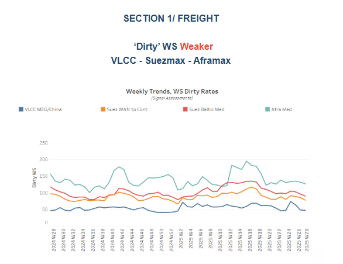

> **Figure 3: Στιγμιότυπο Οθόνης 2025 07 14 154225**  
> **Interactive Data & Source:** [Signal Ocean Platform](https://go.signalocean.com/e/983831/fd7376f-utm-source-chatgpt-com/2r8jf9/509980814/h/tuX1FgfaP3E7MpsREmuGOlYmln7v9G0UqgYPVt732vE) | [Local Asset](file:///C:/Users/Dell/Github/Shipping/corpus/03-breakwave/insights/2025/assets/2025-07-14_brazilian-crude-oil-shipments_img_cea3cf84ceb9ceb3cebcceb9cf8ccf84cf85_743a1e8f9034.png)

This week, the Baltic Dirty Tanker Index (BDTI) saw a modest 3% decline. The VLCC freight market from the Arabian Gulf (AG) to China continues its weakening trend, though it hasn't fallen further than last week. Ongoing threats in the[Red Sea](https://go.signalocean.com/e/983831/fd7376f-utm-source-chatgpt-com/2r8jf9/509980814/h/tuX1FgfaP3E7MpsREmuGOlYmln7v9G0UqgYPVt732vE), evidenced by recent Houthi attacks, are contributing to escalating insurance risk premiums. Meanwhile, an ongoing surplus of VLCCs in the AG, combined with the seasonal summer lull, is adding further downward pressure on dirty tanker rates.

VLCC freight rates on the MEG–China route have dropped to WS 49, a 4% decrease week-on-week but still 11% higher than a month ago. Suezmax rates on the West Africa–Europe route are at WS 80, maintaining a sentiment similar to that of a month ago, while Baltic–Mediterranean rates have fallen to WS 90, down 3% week-on-week. A downward trend is also seen in Aframax rates in the Mediterranean, which have dipped below WS 130, representing a 30% quarterly decline.

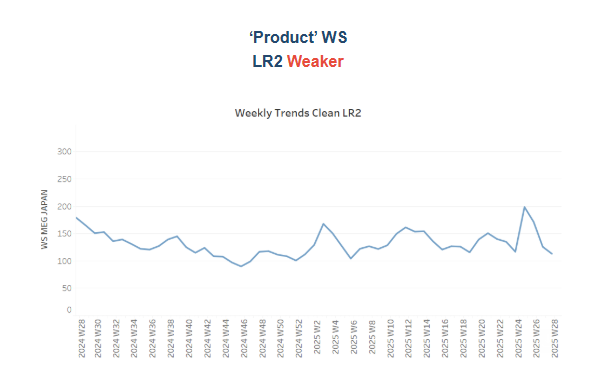

> **Figure 4: Στιγμιότυπο Οθόνης 2025 07 14 154328**  
> **Interactive Data & Source:** [Signal Ocean Platform](https://www.thesignalgroup.com/signal-ocean-platform) | [Local Asset](file:///C:/Users/Dell/Github/Shipping/corpus/03-breakwave/insights/2025/assets/2025-07-14_brazilian-crude-oil-shipments_img_cea3cf84ceb9ceb3cebcceb9cf8ccf84cf85_5b0772d7d6f9.png)

LR2 clean freight rates on the AG–Japan route have fallen sharply to around WS 110, marking an estimated 38% decline from their 2025 peak just before the end of week 26. The shift in sentiment appears linked to a rising number of vessels ballasting into the region two weeks prior, as seen in the supply indicators. Now, an early downward correction is underway, which could begin to divert recent weakness if vessel supply starts to ease.

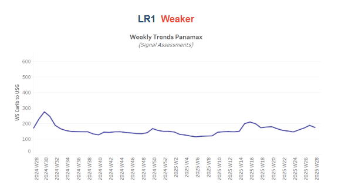

> **Figure 5: Στιγμιότυπο Οθόνης 2025 07 14 154450**  
> **Interactive Data & Source:** [Signal Ocean Platform](https://www.thesignalgroup.com/signal-ocean-platform) | [Local Asset](file:///C:/Users/Dell/Github/Shipping/corpus/03-breakwave/insights/2025/assets/2025-07-14_brazilian-crude-oil-shipments_img_cea3cf84ceb9ceb3cebcceb9cf8ccf84cf85_cdb797d28343.png)

Panamax Carib-to-USG rates fell by 16% week-on-week to WS160, reflecting a 20% quarterly decline in sentiment.

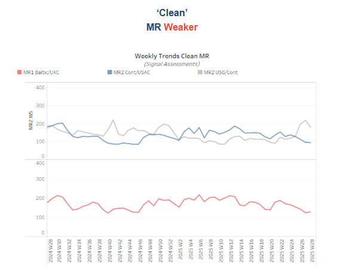

> **Figure 6: Στιγμιότυπο Οθόνης 2025 07 14 154532**  
> **Interactive Data & Source:** [Signal Ocean Platform](https://www.thesignalgroup.com/signal-ocean-platform) | [Local Asset](file:///C:/Users/Dell/Github/Shipping/corpus/03-breakwave/insights/2025/assets/2025-07-14_brazilian-crude-oil-shipments_img_cea3cf84ceb9ceb3cebcceb9cf8ccf84cf85_d683a45466ad.png)

Baltic–Continent MR1 freight rates have declined to WS 130, maintaining last week’s losses and marking a 19% drop on the month. MR2 rates on the Continent–USAC route also slipped below WS 100, reflecting a 30% monthly decline. Meanwhile, despite signs of a potential rebound in the prior week, MR2 rates on the USG–Continent route have recently fallen to WS 170, down 19% week-on-week.

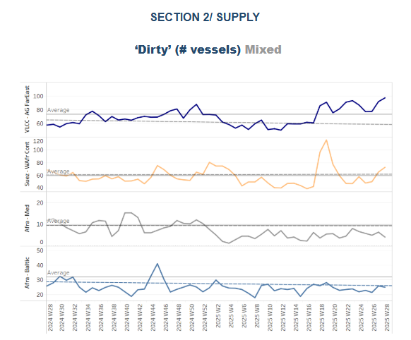

> **Figure 7: Στιγμιότυπο Οθόνης 2025 07 14 154617**  
> **Interactive Data & Source:** [Signal Ocean Platform](https://www.thesignalgroup.com/signal-ocean-platform) | [Local Asset](file:///C:/Users/Dell/Github/Shipping/corpus/03-breakwave/insights/2025/assets/2025-07-14_brazilian-crude-oil-shipments_img_cea3cf84ceb9ceb3cebcceb9cf8ccf84cf85_242c633033d6.png)

The recent bearish outlook for VLCC crude freight is reinforced by a surge in vessel availability in the Arabian Gulf. At Ras Tanura, the number of VLCCs has climbed to approximately 97 vessels, around 24 above the yearly average, increasing tonnage pressure in the region. In contrast, vessel availability in the Suezmax sector in West Africa jumped at the end of week 19 but has since eased back to levels nearly above the annual average of around 60 vessels. Meanwhile, Aframax availability in the Mediterranean remains significantly constrained, staying well below the historical benchmark of 10 vessels, and in the Baltic it remains below its average of 30.

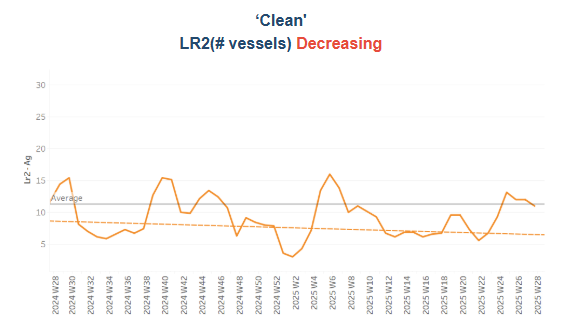

> **Figure 8: Στιγμιότυπο Οθόνης 2025 07 14 154708**  
> **Interactive Data & Source:** [Signal Ocean Platform](https://www.thesignalgroup.com/signal-ocean-platform) | [Local Asset](file:///C:/Users/Dell/Github/Shipping/corpus/03-breakwave/insights/2025/assets/2025-07-14_brazilian-crude-oil-shipments_img_cea3cf84ceb9ceb3cebcceb9cf8ccf84cf85_05dbddeb47c3.png)

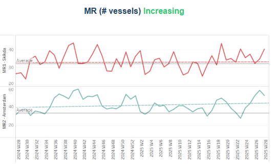

> **Figure 9: Στιγμιότυπο Οθόνης 2025 07 14 154719**  
> **Interactive Data & Source:** [Signal Ocean Platform](https://www.thesignalgroup.com/signal-ocean-platform) | [Local Asset](file:///C:/Users/Dell/Github/Shipping/corpus/03-breakwave/insights/2025/assets/2025-07-14_brazilian-crude-oil-shipments_img_cea3cf84ceb9ceb3cebcceb9cf8ccf84cf85_c5d60df9739a.png)

Clean tanker supply showed signs of decreasing toward the end of the second week of July, particularly for LR2 vessels. In the Arabian Gulf, LR2 availability in hovers at nearly the annual average of 11 vessels, and MR2 counts in Amsterdam, after reaching a peak of around 60 in the previous week, started to decelerate. In contrast, MR1 vessel activity at Skikda still hovered above the annual average of 32, following a similar notable spike in Week 19.

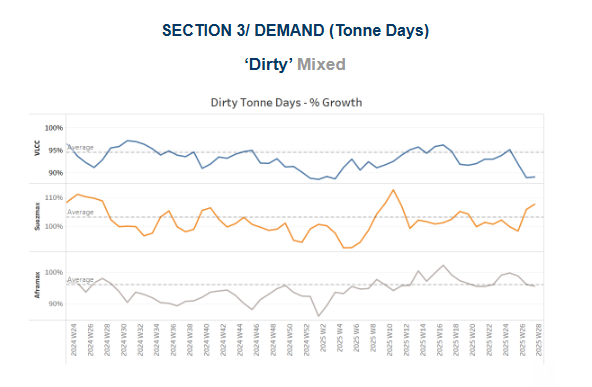

> **Figure 10: Στιγμιότυπο Οθόνης 2025 07 14 154809**  
> **Interactive Data & Source:** [Signal Ocean Platform](https://www.thesignalgroup.com/signal-ocean-platform) | [Local Asset](file:///C:/Users/Dell/Github/Shipping/corpus/03-breakwave/insights/2025/assets/2025-07-14_brazilian-crude-oil-shipments_img_cea3cf84ceb9ceb3cebcceb9cf8ccf84cf85_232fc49d20d8.png)

Dirty tonne days: The seasonal development of dirty tonne-days remains below the growth rate seen in the same week of July 2024 for the VLCC segment, as outlined in our previous weekly insights, with Suezmax indicating early signs above the annual trend. In the Aframax segment, tonne-days growth hovered nearly the average trend, without yet recording a significant spike.

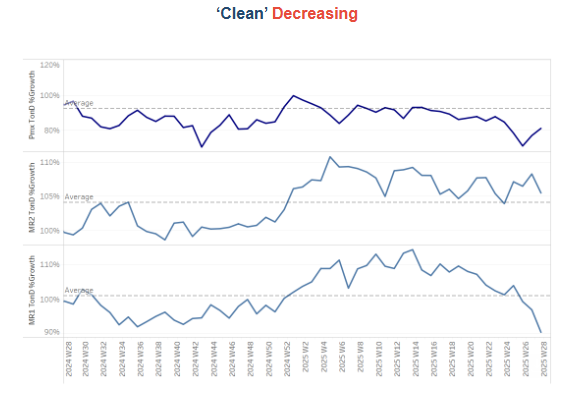

> **Figure 11: Στιγμιότυπο Οθόνης 2025 07 14 154909**  
> **Interactive Data & Source:** [Signal Ocean Platform](https://www.thesignalgroup.com/signal-ocean-platform) | [Local Asset](file:///C:/Users/Dell/Github/Shipping/corpus/03-breakwave/insights/2025/assets/2025-07-14_brazilian-crude-oil-shipments_img_cea3cf84ceb9ceb3cebcceb9cf8ccf84cf85_75f9e1e43a13.png)

The seasonal development of tonne-days in the clean tanker segment continues to show a significant decline from the levels across all vessel size categories, except the Panamax tonne-days, which, although weakening, have started to move above the historical one-year low seen at the end of week 26.

Data Source:[Signal Ocean Platform](https://www.thesignalgroup.com/signal-ocean-platform)

---

**Tags:** Tankers, Markets, Crude  
