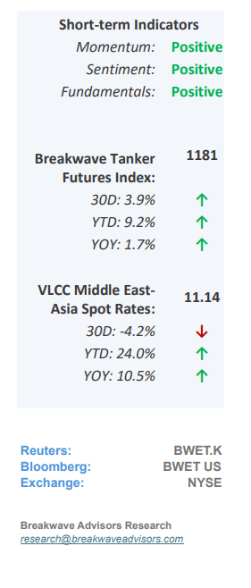
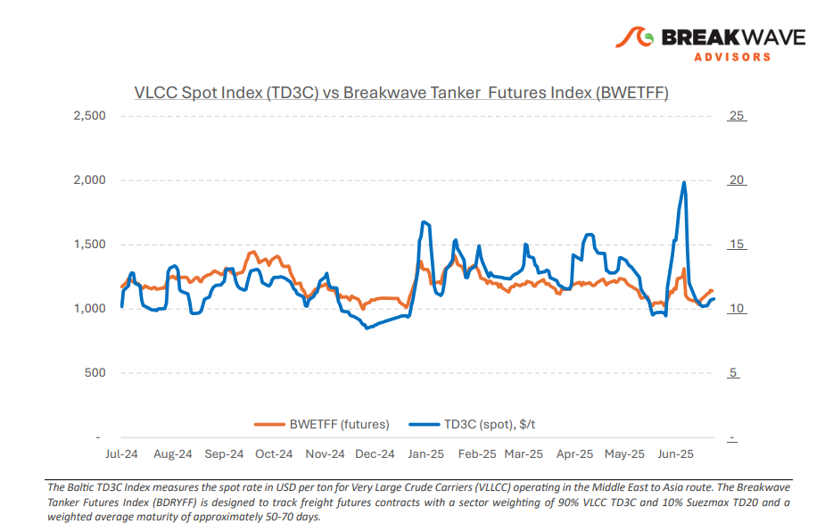
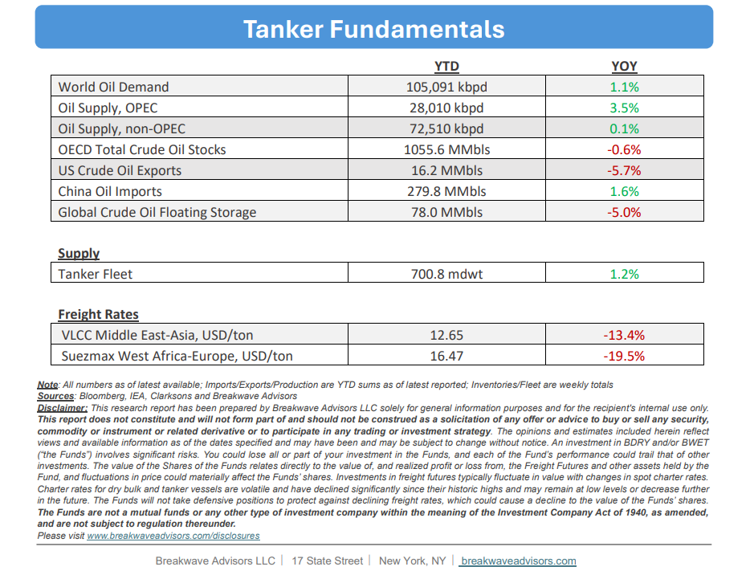

# Breakwave Bi-Weekly Tanker Report - July 15, 2025

**Date:** July 15, 2025  
**Publisher:** Breakwave Advisors | **Category:** Market Insights  
**Original URL:** [https://www.breakwaveadvisors.com/insights/2025157wreport114kio-j14](https://www.breakwaveadvisors.com/insights/2025157wreport114kio-j14)  

---

•**VLCC Freight Market Stabilizes Amid Geopolitics and Tariff Uncertainty**– The VLCC market continues to be**highly susceptible**to external**shocks**arising from geopolitical risks, escalating marine insurance costs, and potential tariff threats. Nevertheless, sentiment in the Asian trade corridor has shown gradual**improvement**, with AG/China and AG/Singapore freight rates inching higher compared to early July. This uptick is supported by increased third-decade July loadings, a tighter position list, and seasonal chartering activity, which collectively have provided short-term momentum. Overall, the**East**appears to be**spearheading**the recovery, while the West of Suez remains under pressure despite some recent near-term improvements. Looking ahead, a strong start to August, particularly if coupled with increased Chinese purchasing activity, could exert additional upward pressure on AG/China and AG/Singapore rates. In the longer term,**escalating geopolitical tensions**and ongoing security threats in the**Red Sea**are prompting owners to incorporate**higher war risk premiums**and account for longer ballast voyages, especially on West Africa routes. Although most VLCCs typically avoid Red Sea transits, the**ripple effects**include elevated insurance costs across adjacent regions, creating a psychological rate floor and discouraging eastward repositioning. Crude oil price volatility remains a significant wildcard, influenced by OPEC+ supply discipline and persistent uncertainty surrounding Chinese demand. Over the past two weeks, Brent crude has fluctuated between $67 and $71 per barrel. For the VLCC market, this volatility indirectly affects cargo volumes, complicating predictions regarding the timing, quantity, and direction of upcoming shipments, as traders and producers tend to delay decisions amidst shifting refinery margins and unclear arbitrage opportunities.

> **Figure 1: Στιγμιότυπο Οθόνης 2025 07 14 225029**  
> [Local Asset](file:///C:/Users/Dell/Github/Shipping/corpus/03-breakwave/insights/2025/assets/2025-07-15_2025157wreport114kio-j14_img_cea3cf84ceb9ceb3cebcceb9cf8ccf84cf85_d1f58b117bb5.png)

•**Oil Prices Top $70/bbl as Global Demand Shows Signs of Strength**– Despite**substantial monthly increases**in oil production by OPEC+, oil prices have demonstrated resilience amidst the expanded supply. Notably, Brent crude recently surpassed $70 per barrel, a relatively elevated level when excluding the recent geopolitical premiums associated with the Israel-Iran conflict. Additionally,**Saudi Arabia's crude exports**to China are projected to rise sharply in August to approximately 1.65 million barrels per day, reaching the**highest level since April 2023**. This increase is driven by heightened post-maintenance demand from Sinopec and Saudi Arabia’s efforts to rebalance flow dynamics amid the OPEC+ supply expansion. While optimism regarding a rebound in global demand is supporting higher oil prices, underlying Chinese economic fundamentals remain concerning. Any indications of a resumption of declining Chinese oil imports in the second half of the year could restore market anxiety about the overall balance.

•**Our Long-term View**– The tanker market is recovering from a long period of staggered rates as the growth in new vessel supply shrinks while oil demand remains elevated in line with the global economy. A historically low orderbook combined with favorable shifting trade patterns should continue to support increased spot rate volatility, which combined with the ongoing geopolitical turmoil, should sustain freight rates in the medium to long term.

> **Figure 2: Στιγμιότυπο Οθόνης 2025 07 14 225005**  
> [Local Asset](file:///C:/Users/Dell/Github/Shipping/corpus/03-breakwave/insights/2025/assets/2025-07-15_2025157wreport114kio-j14_img_cea3cf84ceb9ceb3cebcceb9cf8ccf84cf85_7ded4416606e.png)

> **Figure 3: Στιγμιότυπο Οθόνης 2025 07 14 225016**  
> [Local Asset](file:///C:/Users/Dell/Github/Shipping/corpus/03-breakwave/insights/2025/assets/2025-07-15_2025157wreport114kio-j14_img_cea3cf84ceb9ceb3cebcceb9cf8ccf84cf85_03294105a173.png)

### Subscribe:
