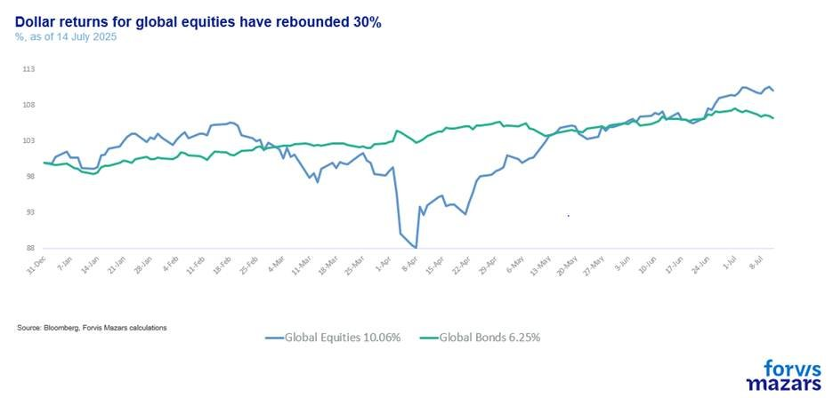
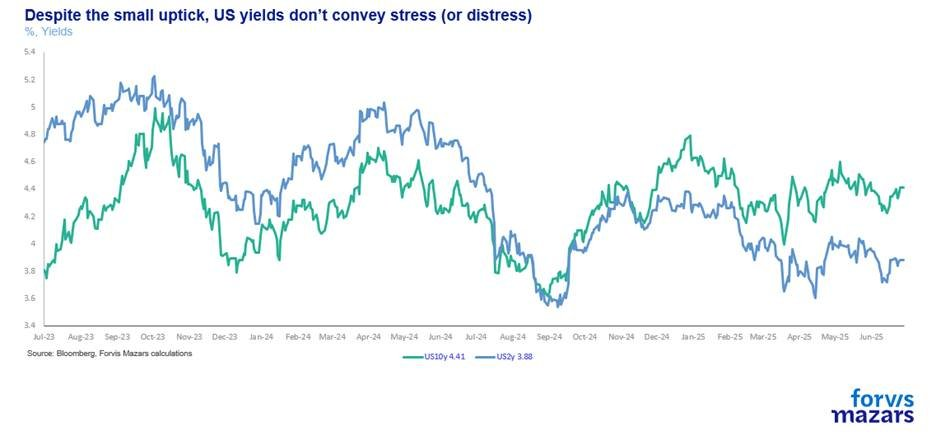
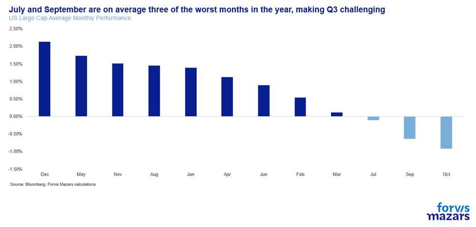
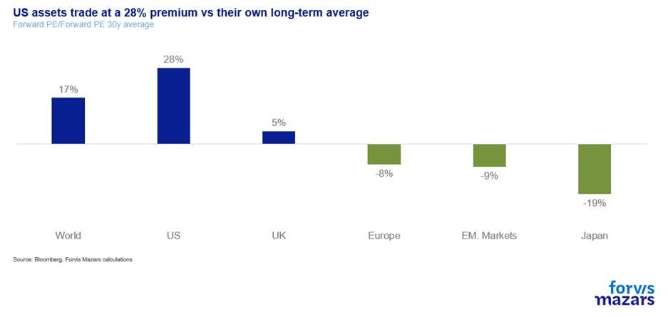

# TACOs are junk food. Diversification is salad.

**Date:** July 15, 2025  
**Publisher:** Breakwave Advisors | **Category:** Market Insights  
**Original URL:** [https://www.breakwaveadvisors.com/insights/2025/7/15/tacos-are-junk-food-diversification-is-salad](https://www.breakwaveadvisors.com/insights/2025/7/15/tacos-are-junk-food-diversification-is-salad)  

---

The three things investors should know about this week

1. Markets are essentially ignoring an escalation of the trade wars or the debt buildup. US equities are back to expensive territory, and bond yields don’t signal stress.
2. The probability of over- or underpricing risk becomes exponentially higher when the policy keeps shifting.
3. Investors and businesses are well to remember that the fact that we are still very much in the phase of negotiating, doesn’t mean that risks are off.

*By*[*George Lagarias*](https://www.linkedin.com/in/george-lagarias-mba-3baa769/)

*Summary*

*The White House’s hyperactive policy shifts—from tariffs on Brazil, the EU, and Mexico to pressure on the Fed and aggressive fiscal stimulus—are fueling economic volatility. The One Big Beautiful Bill, projected to add $3.4 trillion to the deficit, may do little to boost growth. Despite this, markets remain optimistic, with global equities up 10% year-to-date in US Dollar terms. However, reliance on unpredictable leadership risks investment complacency. Businesses and investors must avoid complacency and build up resilience by preparing for continued uncertainty. They can do so by diversifying portfolios, hedging currency exposure, strengthening supply chains, and managing inventories proactively. Predictability is lacking, and volatility is the only constant in this high-energy policy landscape.*

------------------------

Some brains are just uneasy. Whatever one thinks of the US President, we can all agree that he’s never content with a quiet day in the office. With anything, really. Like basketball's greatest player of all time, Michael Jordan, who always found some reason to be “insulted” just to up his game, the US President seems to find some slight, some problem, so that he can be involved with… well, everything. Trade wars hiatus? Not a problem, let’s focus on the Middle East. Iran-Israel truce? Let’s steamroll the One Big Beautiful Bill over friends and foes in Congress. That passed? It’s time to[pressure the Fed again](assets/2025-07-15_tacos-are-junk-food-diversification-is-salad_trump-can-fire-powell-if-theres-caus_f39b998503c2.html), and while he’s at it, more trade war threats by the day ([50% on Brazil](https://edition.cnn.com/2025/07/09/economy/tariff-letters-trump),[30% on EU and Mexico](https://www.reuters.com/business/trump-announces-30-tariffs-eu-2025-07-12/),[50% on copper](https://www.reuters.com/world/us/trump-announces-50-tariff-copper-effective-august-1-2025-07-10/)– more coming up surely). In his spare time (how??), he’s[on the podium](assets/2025-07-15_tacos-are-junk-food-diversification-is-salad_chelsea-players-react-donald-trump-0_54ad7ad6ae86.html)with Chelsea Players celebrating the Club World Cup. He’s just everywhere simultaneously, inexhaustibly. What would have been an annual report is now a weekly update for this -exhausted- writer.

Political views aside, one can’t help but admire the sheer energy. But that energy is also precisely the problem. Business requires a modicum of predictability. For a fund manager or a business to plan, some view of the future is required. While the most powerful man in the world is obviously having the time of his life, and changing direction often, the uncertainty factor grows just too large.

Correctly pricing risk is what allocators do for a living. It is easier when central banks underwrite some of that risk. But the probability of over- or underpricing risk becomes exponentially higher when policy keeps shifting.

The One Big Beautiful Bill Act is the law. It will likely add around $3.4tn to the deficit in the next decade out of the way, without improving growth too much, as it mainly constitutes an extension of previous tax cuts. High tariffs on Brazil, the EU and Mexico may well materialise. And then again, they may not.

In this environment, equities have chosen to believe that trade will resume as normal. Excluding the Dollar effect, which drags down all returns for non-US investors, global equities are up 10% since the beginning of the year.

> **Figure 1: Market Chart 1**  
> [Local Asset](file:///C:/Users/Dell/Github/Shipping/corpus/03-breakwave/insights/2025/assets/2025-07-15_tacos-are-junk-food-diversification-is-salad_img_image00528129_aceb92ddcb01.jpg)

And global bond markets have somehow shrugged off previous concerns about mounting US debt, or even the threat of loss of the central bank’s independence, which they previously fretted (and which would all other things being equal be inflationary).

> **Figure 2: Market Chart 2**  
> [Local Asset](file:///C:/Users/Dell/Github/Shipping/corpus/03-breakwave/insights/2025/assets/2025-07-15_tacos-are-junk-food-diversification-is-salad_img_image00628129_37073f008cf4.jpg)

We are still very much in the phase of negotiating, where tariff threats don’t necessarily reflect end outcomes and where deadlines are not set in stone. Financial markets have begun to assume that they can finally analyse and predict the psychosynthesis of the Oval Office, what is affectionately known as the ‘TACO trade’. They are essentially forecasting that stock market losses or economic malaise will be enough to deter the White House and that a few UK-style business deals will suffice for the trade wars to be over.

It may well be so. But then again, it may not. From an investment and business planning perspective, basing an investment strategy on assuming the actions of one single individual one has not met (and who in this case, has shown to be deeply unconventional) is wrong. Of course, markets can take bets either way. But it is one thing to assume that it will all resolve itself quietly, and quite another to fully price in this best-case scenario. The latter may be a sign of investment complacency.

The truth is, we don’t know how it will play out. US trade and economic policy is the result of two equal forces:

1. The US consumer’s demand for more fiscal outlays, affordable houses, better jobs and assertion of primacy over other consumers, especially those in China.
2. The US President’s ever-shifting view of the world.

The first force demands action, the second force provides just that, even if it does so in an unpredictable way. As long as they both remain in play, businesses and investors should have no clear expectations as to what the immediate future may bring. The only expectation should be one of persistent volatility.

The fact that we are entering July, the first of the “bad three months” for US large caps (the others are September and October), also adds the risk of additional seasonal forces against complacency.

> **Figure 3: Market Chart 3**  
> [Local Asset](file:///C:/Users/Dell/Github/Shipping/corpus/03-breakwave/insights/2025/assets/2025-07-15_tacos-are-junk-food-diversification-is-salad_img_image00728129_7a8cb6ebafd0.jpg)

When things are looking very bad, experienced managers look for opportunities. And when markets are very expensive and optimistic about the future, it is their job to ask, “How much potential bad news is priced in?”.

> **Figure 4: Market Chart 4**  
> [Local Asset](file:///C:/Users/Dell/Github/Shipping/corpus/03-breakwave/insights/2025/assets/2025-07-15_tacos-are-junk-food-diversification-is-salad_img_image00828129_2c80de1e270a.jpg)

Because of the wide range of outcomes, portfolios need to remain diversified, and managers need to remember that currency is a significant contributor to portfolio returns, especially at a time when the US seeks to monetise some of its debt. Similarly, businesses should seek to take advantage of trade war deferrals, build more robust supply chains and consider where they need to invest more in inventory.

Tacos are usually a fun dinner. Great, possibly once a month (before 40). But salad is a dish necessary to sustain life over the long term.

---

**Tags:** Macro, Economy, Markets  
