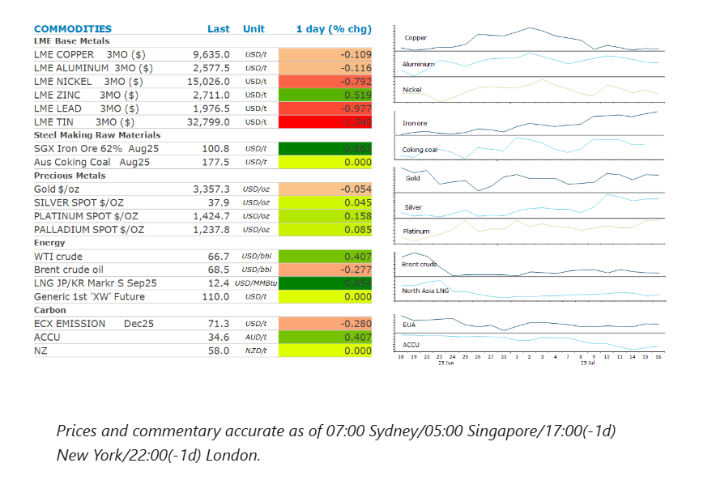
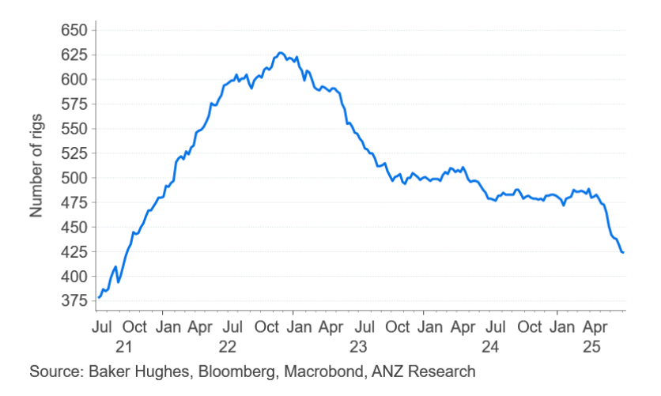

# Risk off tone weighs on sentiment

**Date:** July 17, 2025  
**Publisher:** Breakwave Advisors | **Category:** Market Insights  
**Original URL:** [https://www.breakwaveadvisors.com/insights/2025/7/17/risk-off-tone-weighs-on-sentiment](https://www.breakwaveadvisors.com/insights/2025/7/17/risk-off-tone-weighs-on-sentiment)  

---

A broad risk-off sentiment due to tariff concerns weighed on commodity prices. Renewed weakness in the USD supported precious metals.

*By*[*Daniel Hynes*](https://www.linkedin.com/in/dahynes/)

> **Figure 1: Στιγμιότυπο Οθόνης 2025 07 17 132949**  
> [Local Asset](file:///C:/Users/Dell/Github/Shipping/corpus/03-breakwave/insights/2025/assets/2025-07-17_risk-off-tone-weighs-on-sentiment_img_cea3cf84ceb9ceb3cebcceb9cf8ccf84cf85_21c6fc95c9c1.png)

### Market Commentary

**Crude oil**prices fell for the third consecutive session as investors turn cautious on the prospect of a market surplus later in the year. US crude inventories fell more than expected, by nearly 4mb to 422mbbl, this is the first draw on stocks in three weeks. However, the build in oil product inventories raised concerns of weakening demand from summer travel. Supply side news was not supportive either, as Russia’s crude exports climbed to a one-month high amid a sharp decline in domestic refinery activity. Exports averaged 3.23mb/d in the four weeks ending 13 July, up 3% from the previous period, according to Bloomberg’s tanker-tracking data. This increase came before Trump’s warning of potential secondary tariffs on buyers of Russian oil if Moscow fails to resolve its conflict with Ukraine.

**Global natural gas**prices edged up after outages at Norway’s Nyhamna processing plant due to power supply issues. European gas pared its losses by recovering to EUR35/MWh. While the disruption is likely to be short-lived, any delay could trigger further price increases given the tight supply conditions. Europe’s gas stockpiling is underway but competition shipments from Asian buyers is intensifying. Japan is increasing its buying as stockpiles fell to 1.88mt, slightly below the five-year seasonal average. There is a 70% probability of above-normal heat across eastern and western regions through to 11 August, according to the Japan Meteorological Agency. This could intensify energy consumption and LNG demand. China’s LNG imports continued to track 4% below the five-year seasonal average.

**Iron ore**futures rose above USD100/t as positive sentiment started building around demand amid improving mill margins. China’s imports of iron ore hit 106mt in June, up 1% y/y. Iron ore port inventories have continued to retreat, steel inventories at major Chinese mills fell 2.46% to 15.1mt in early July. However, steel production continued to disappoint, with crude steel output falling 9.2% y/y to 83.2mt in June, the biggest drop in 10 months. Year-to-date production fell by 3%y/y to 510mt, the weakest since 2020. This comes amid ongoing stress in the housing market. China’s cumulative new home sales by value in January–June fell 5.2% y/y to CNY3.88trn, according to China’s National Bureau of Statistics.

**Copper**prices fell to USD9,600/t as inventories at LME rose, particularly in Asia, with large deliveries into Hong Kong. We don’t expect the US copper market to be rebalanced by the proposed 50% tariffs on copper imports. Recent record copper imports into the US triggered a supply squeeze, prompting Chinese smelters to export metal to cover short positions. But these deliveries are likely to slow Consumers are now likely to draw on existing stockpiles, putting downward pressure on COMEX copper prices in the short term. We expect[**LME copper prices to come under pressure**](../pdfs/2025-07-17_risk-off-tone-weighs-on-sentiment_commodity-call-copper-s-tariff-ic-ou_baf5314c6a26.pdf)in the short term.

**Gold**regained its haven appeal on renewed trade tariffs concerns and Trump’s threat to remove Powell. Prices inched up to USD3,350/oz. ETF holdings continue to build up, while recovering spot premium is suggesting resilient imports in China and India. On the other hand, central bank net purchases rose in May.

### Chart of the Day

The number of rigs drilling for oil in the US continues to fall as shale oil operators react to the fall in oil prices. However, a new focus on gas rich regions as also played its part. This is likely to weigh on US oil output in coming months.

> **Figure 2: Στιγμιότυπο Οθόνης 2025 07 17 133140**  
> **Interactive Data & Source:** [Linkedin](https://www.linkedin.com/newsletters/commodities-wrap-6692196755876012032/?fbclid=IwAR3kiXJqZdxmp9ZcRwBNI7FsBySI-XSC0pfPur1qzjt7OZp7PTE59Tsl1QI) | [Local Asset](file:///C:/Users/Dell/Github/Shipping/corpus/03-breakwave/insights/2025/assets/2025-07-17_risk-off-tone-weighs-on-sentiment_img_cea3cf84ceb9ceb3cebcceb9cf8ccf84cf85_701b827dba11.png)

Data source:[Commodities Wrap](https://www.linkedin.com/newsletters/commodities-wrap-6692196755876012032/?fbclid=IwAR3kiXJqZdxmp9ZcRwBNI7FsBySI-XSC0pfPur1qzjt7OZp7PTE59Tsl1QI)

---

**Tags:** Shipping, Commodities, Markets  
