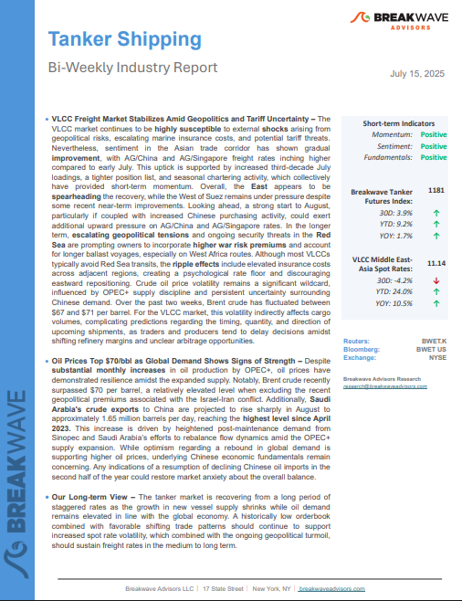
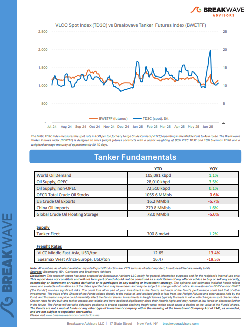
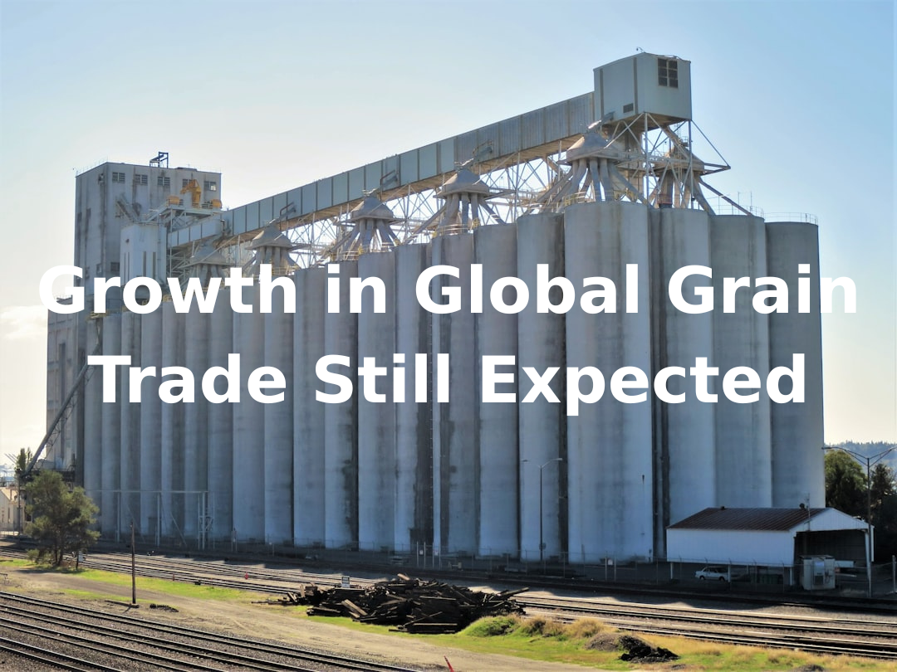

# Breakwave Weekend Read

**Date:** July 18, 2025  
**Publisher:** Breakwave Advisors | **Category:** Market Insights  
**Original URL:** [https://www.breakwaveadvisors.com/insights/2024/10/25/breakwave-weekend-read-547kk-rw7zy-awmfb-mf26k-dk29d-56ysb-x3jbe-xbwk9-dnpbr](https://www.breakwaveadvisors.com/insights/2024/10/25/breakwave-weekend-read-547kk-rw7zy-awmfb-mf26k-dk29d-56ysb-x3jbe-xbwk9-dnpbr)  

---

## Welcome Tobreakwave Advisorsweekend Read

***As the week comes to a close, take a moment to review the key insights from the past few days. Missed something? We've gathered all the top insights for you to catch up at your convenience.***

## Breakwave Shipping Report

**VLCC Freight Market Stabilizes Amid Geopolitics and Tariff Uncertainty**– The VLCC market continues to be**highly susceptible**to external**shocks**arising from geopolitical risks, escalating marine insurance costs, and potential tariff threats.

[Read More](https://www.breakwaveadvisors.com/insights/2025157wreport114kio-j14)

> **Figure 1: Στιγμιότυπο Οθόνης 2025 07 16 155140**  
> **Interactive Data & Source:** [Breakwave Advisors Market Insights](https://www.breakwaveadvisors.com/insights/2025/7/14/the-panamax-market-burst-into-life) | [Local Asset](file:///C:/Users/Dell/Github/Shipping/corpus/03-breakwave/insights/2025/assets/2025-07-18_breakwave-weekend-read-547kk-rw7zy-awmfb-mf26k-dk29d-56ysb-x3jbe-xbwk9-dnpbr_img_cea3cf84ceb9ceb3cebcceb9cf8ccf84cf85_755a5efe7e09.png)

> **Figure 2: Στιγμιότυπο Οθόνης 2025 07 16 155153**  
> **Interactive Data & Source:** [Breakwave Advisors Market Insights](https://www.breakwaveadvisors.com/insights/2025/7/14/the-panamax-market-burst-into-life) | [Local Asset](file:///C:/Users/Dell/Github/Shipping/corpus/03-breakwave/insights/2025/assets/2025-07-18_breakwave-weekend-read-547kk-rw7zy-awmfb-mf26k-dk29d-56ysb-x3jbe-xbwk9-dnpbr_img_cea3cf84ceb9ceb3cebcceb9cf8ccf84cf85_02774ade3977.png)

## The Panamax Market Burst Into Life

> **Figure 3: The Panamax Market Burst Into Life**  
> **Interactive Data & Source:** [Breakwave Advisors Market Insights](https://www.breakwaveadvisors.com/insights/2025/7/14/the-panamax-market-burst-into-life) | [Local Asset](file:///C:/Users/Dell/Github/Shipping/corpus/03-breakwave/insights/2025/assets/2025-07-18_breakwave-weekend-read-547kk-rw7zy-awmfb-mf26k-dk29d-56ysb-x3jbe-xbwk9-dnpbr_img_thepanamaxmarketburstintolife_19737ac97758.png)

In 2010, the cotton market witnessed one of the most dramatic squeezes in recent memory.

Doric Weekly Market Insights

## Brazilian Crude Oil Shipments

> **Figure 4: Ανώνυμο Σχέδιο (6)**  
> **Interactive Data & Source:** [Breakwave Advisors Market Insights](https://www.breakwaveadvisors.com/insights/2025/7/14/brazilian-crude-oil-shipments) | [Local Asset](file:///C:/Users/Dell/Github/Shipping/corpus/03-breakwave/insights/2025/assets/2025-07-18_breakwave-weekend-read-547kk-rw7zy-awmfb-mf26k-dk29d-56ysb-x3jbe-xbwk9-dnpbr_img_ce91cebdcf8ecebdcf85cebccebfcf83cf87_9baef3272b93.png)

This week’s Chart Market Monitor highlights the significant increase in Brazilian crude oil shipments to China, which reached a record 93.6 million barrels in Q2 2025,

Signal Ocean Tanker Weekly Market Monitor

## Tacos Are Junk Food. Diversification Is Salad.

> **Figure 5: Ανώνυμο Σχέδιο (7)**  
> **Interactive Data & Source:** [Breakwave Advisors Market Insights](http://breakwaveadvisors.com/insights/2025/7/15/tacos-are-junk-food-diversification-is-salad) | [Local Asset](file:///C:/Users/Dell/Github/Shipping/corpus/03-breakwave/insights/2025/assets/2025-07-18_breakwave-weekend-read-547kk-rw7zy-awmfb-mf26k-dk29d-56ysb-x3jbe-xbwk9-dnpbr_img_ce91cebdcf8ecebdcf85cebccebfcf83cf87_decf44c1ac74.png)

Markets are essentially ignoring an escalation of the trade wars or the debt buildup. US equities are back to expensive territory, and bond yields don’t signal stress.

Forvis Mazars Weekly Note

## Beyond the Barrel: How Reserves, Risk, and Production Shape Oil Trade

> **Figure 6: Beyond the Barrel How Reserves, Risk, and Production Shape Oil Trade**  
> **Interactive Data & Source:** [Breakwave Advisors Market Insights](https://www.breakwaveadvisors.com/insights/2025/7/16/beyond-the-barrel-how-reserves-risk-and-production-shape-oil-trade) | [Local Asset](file:///C:/Users/Dell/Github/Shipping/corpus/03-breakwave/insights/2025/assets/2025-07-18_breakwave-weekend-read-547kk-rw7zy-awmfb-mf26k-dk29d-56ysb-x3jbe-xbwk9-dnpbr_img_beyondthebarrelhowreserves2crisk2can_fffba6b48744.png)

In energy economics, proven oil reserves refer to quantities of crude oil that geological and engineering data demonstrate with reasonable certainty to be recoverable under existing economic and operational conditions

Allied Weekly Report

## China’s Property Sector

> **Figure 7: Ανώνυμο Σχέδιο (8)**  
> **Interactive Data & Source:** [Breakwave Advisors Market Insights](https://www.breakwaveadvisors.com/insights/2025/7/16/chinas-property-sector) | [Local Asset](file:///C:/Users/Dell/Github/Shipping/corpus/03-breakwave/insights/2025/assets/2025-07-18_breakwave-weekend-read-547kk-rw7zy-awmfb-mf26k-dk29d-56ysb-x3jbe-xbwk9-dnpbr_img_ce91cebdcf8ecebdcf85cebccebfcf83cf87_f7ee32cae5c8.png)

China’s property sector remains entrenched in a deep correction in 2025, with no signs of near-term stabilization.

Intermodal Weekly Market Report

## Risk Off Tone Weighs on Sentiment

> **Figure 8: Ανώνυμο Σχέδιο (9)**  
> **Interactive Data & Source:** [Breakwave Advisors Market Insights](https://www.breakwaveadvisors.com/insights/2025/7/17/risk-off-tone-weighs-on-sentiment) | [Local Asset](file:///C:/Users/Dell/Github/Shipping/corpus/03-breakwave/insights/2025/assets/2025-07-18_breakwave-weekend-read-547kk-rw7zy-awmfb-mf26k-dk29d-56ysb-x3jbe-xbwk9-dnpbr_img_ce91cebdcf8ecebdcf85cebccebfcf83cf87_078d83ba1042.png)

A broad risk-off sentiment due to tariff concerns weighed on commodity prices. Renewed weakness in the USD supported precious metals.

Commodities Wrap

## Tankers Research Update

> **Figure 9: Tankers Research Update**  
> **Interactive Data & Source:** [Breakwave Advisors Market Insights](https://www.breakwaveadvisors.com/insights/2025/7/17/tankers-research-update) | [Local Asset](file:///C:/Users/Dell/Github/Shipping/corpus/03-breakwave/insights/2025/assets/2025-07-18_breakwave-weekend-read-547kk-rw7zy-awmfb-mf26k-dk29d-56ysb-x3jbe-xbwk9-dnpbr_img_tankersresearchupdate_f504a083e171.png)

Trump's tariff threats spur minimal disruption to refined product flows—for now

Braemar Research

## Growth in Global Grain Trade Still Expected

> **Figure 10: Ανώνυμο Σχέδιο (10)**  
> **Interactive Data & Source:** [Breakwave Advisors Market Insights](https://www.breakwaveadvisors.com/insights/2025/7/18/growth-in-global-grain-trade-still-expected) | [Local Asset](file:///C:/Users/Dell/Github/Shipping/corpus/03-breakwave/insights/2025/assets/2025-07-18_breakwave-weekend-read-547kk-rw7zy-awmfb-mf26k-dk29d-56ysb-x3jbe-xbwk9-dnpbr_img_ce91cebdcf8ecebdcf85cebccebfcf83cf87_418aca1037a5.png)

The United States Department of Agriculture (USDA) has released its latest forecast for the upcoming 2025/26 grain trade season and is now predicting that global coarse grain, wheat, soybean, and soymeal exports will collectively total 720.5 million tons.

From Commodore's Weekly Dry Bulk Reports

## Orderbooks, Old Ships, and Sanctions

> **Figure 11: Orderbooks, Old Ships, and Sanctions**  
> **Interactive Data & Source:** [Breakwave Advisors Market Insights](https://www.breakwaveadvisors.com/insights/2025/7/18/orderbooks-old-ships-and-sanctions) | [Local Asset](file:///C:/Users/Dell/Github/Shipping/corpus/03-breakwave/insights/2025/assets/2025-07-18_breakwave-weekend-read-547kk-rw7zy-awmfb-mf26k-dk29d-56ysb-x3jbe-xbwk9-dnpbr_img_orderbooks2coldships2candsanctions_80193224d380.png)

Tanker ordering activity for vessels above 25,000 dwt has dropped sharply this year, with total orders around 110 units.

Gibson Tanker Market Report

---

**Tags:** Shipping, Tankers, Drybulk  
