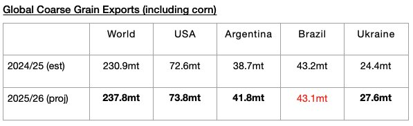

# Growth in Global Grain Trade Still Expected

**Date:** July 18, 2025  
**Publisher:** Breakwave Advisors | **Category:** Market Insights  
**Original URL:** [https://www.breakwaveadvisors.com/insights/2025/7/18/growth-in-global-grain-trade-still-expected](https://www.breakwaveadvisors.com/insights/2025/7/18/growth-in-global-grain-trade-still-expected)  

---

*By*[*Jeffrey Landsberg*](https://www.linkedin.com/in/jeffrey-landsberg-70ab957/)

The United States Department of Agriculture (USDA) has released its latest forecast for the upcoming 2025/26 grain trade season and is now predicting that global coarse grain, wheat, soybean, and soymeal exports will collectively total 720.5 million tons. This is 1.8 million tons less than was predicted a month ago but would mark a year-on-year increase of 22.1 million tons (3%). Significant, too, is that for the soon-to-be-concluded current 2024/25 global grain season, a year-on-year contraction of 11.9 million tons (-2%) is now expected. Overall, we have been stressing in Commodore Research's Weekly Executive Report that a return of growth in grain trade (and growth in all major dry bulk commodity trade) has been needed considering that the entire dry bulk fleet this year has been set to grow by a net addition of at least 350 vessels.

> **Figure 1: Chart**  
> [Local Asset](file:///C:/Users/Dell/Github/Shipping/corpus/03-breakwave/insights/2025/assets/2025-07-18_growth-in-global-grain-trade-still-expected_img_chart_9df04fb975a6.jpg)

The USDA is forecasting that global coarse grain exports in 2025/26 will total 237.8 million tons. This would mark a year-on-year increase of 6.9 million tons (3%) from the 230.9 million tons expected for the current 2024/25 season. Coarse grain exports will remain the grain market’s largest cargo by volume. Small to moderate year-on-year increases in coarse grain exports are expected from the United States, Argentina, and Ukraine. A small year-on-year decline is expected from Brazil.

---

**Tags:** Markets, Drybulk, Shipping  
