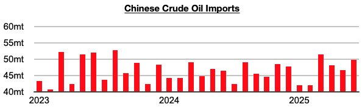
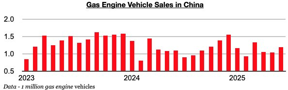

# Return of Growth in Gas Engine Vehicle Sales in China

**Date:** July 21, 2025  
**Publisher:** Breakwave Advisors | **Category:** Market Insights  
**Original URL:** [https://www.breakwaveadvisors.com/insights/2025/7/21/return-of-growth-in-gas-engine-vehicle-sales-in-china](https://www.breakwaveadvisors.com/insights/2025/7/21/return-of-growth-in-gas-engine-vehicle-sales-in-china)  

---

*By*[*Jeffrey Landsberg*](https://www.linkedin.com/in/jeffrey-landsberg-70ab957/)

As we discussed in Commodore Research's most recent Weekly China Report, China’s crude oil imports increased on a year-on-year basis by 8% in June. Imports have now increased on a year-on-year basis in three of the last four months. They had previously contracted on a year-on-year basis in nine of the prior ten months. Also of quite positive very recently is that gas engine vehicle sales in June finally experienced year-on-year growth.

> **Figure 1: Chart 1**  
> [Local Asset](file:///C:/Users/Dell/Github/Shipping/corpus/03-breakwave/insights/2025/assets/2025-07-21_return-of-growth-in-gas-engine-vehicle-sales-in-china_img_chart1_886b941c3a9b.jpg)

Coal-derived electricity generation totaled approximately 108.6 billion kilowatt hours. This is down month-on-month by 5.5 billion kilowatt hours (-5%) and down year-on-year by 12.1 billion kilowatt hours (-10%). India’s coal-derived generation has contracted on a year-on-year basis during seven of the last eleven months. Prior to the last eleven months, it had grown on a year-on-year basis for fifteen straight months.

> **Figure 2: Chart 2**  
> [Local Asset](file:///C:/Users/Dell/Github/Shipping/corpus/03-breakwave/insights/2025/assets/2025-07-21_return-of-growth-in-gas-engine-vehicle-sales-in-china_img_chart2_754bdc8c737c.jpg)

June saw a total of 2.31 million vehicles sold in China (and also 592,000 Chinese- made vehicles exported). Of the 2.31 million vehicles, 1.19 million were gas engine vehicles, which marked a year-on-year increase of 8%. Gas-engine vehicle sales in China had previously contracted on a year-on-year basis in fifteen of the prior sixteen months.

---

**Tags:** China, Coal, Commodities  
