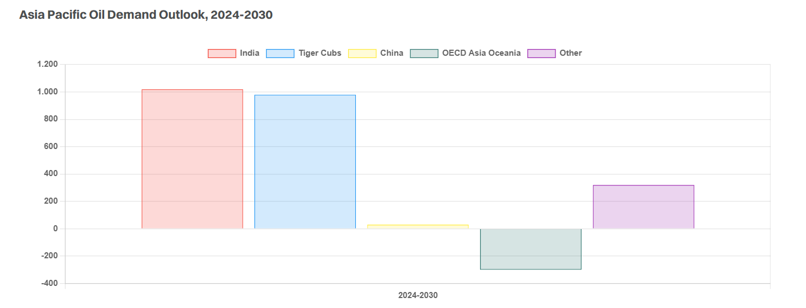

# The Tiger Cubs Roar

**Date:** July 22, 2025  
**Publisher:** Breakwave Advisors | **Category:** Market Insights  
**Original URL:** [https://www.breakwaveadvisors.com/insights/2025/7/21/the-tiger-cubs-roar](https://www.breakwaveadvisors.com/insights/2025/7/21/the-tiger-cubs-roar)  

---

> **Figure 1: Adobestock 276060210**  
> **Interactive Data & Source:** [Gibsons Co](https://www.gibsons.co.uk/market-reports) | [Local Asset](file:///C:/Users/Dell/Github/Shipping/corpus/03-breakwave/insights/2025/assets/2025-07-22_the-tiger-cubs-roar_img_adobestock-276060210_7ea17e802403.jpeg)

In the past decade, oil demand has been defined by rapid growth in the Chinese economy, with the country responsible for 60% of global growth. However, with the outlook for Chinese oil demand changing, the structure of global oil trade is also shifting. A combination of factors is contributing to plateauing Chinese demand, but the biggest factor is the significant penetration and widespread adoption of electric vehicles. In addition, there is an increasing uptake of LNG powered and electric trucks.

While China is stagnating and expected to experience a decline in demand in the long run, India has emerged as the world’s biggest driver of oil demand. As a rapidly growing economy, its demand is driven by urbanization, infrastructure development, and industrialization, all of which are heavily reliant on oil. What sets India apart is that its demand is highly concentrated in transport fuels. While the rest of the world is moving toward EVs, India is doubling down on oil-powered vehicles, with the country’s total oil consumption projected to jump by 1 mbd between 2024 and 2030.

Alongside India, a group of Southeast Asian countries, referred to as the Tiger Cubs – Indonesia, the Philippines, Thailand, Malaysia, and Vietnam – is significantly contributing to the eastward pull of oil trade. Indonesia is leading the pack.

All in all, oil demand in other non-OECD Asia (excl. China and India) is forecast to increase by nearly 1.3 mbd by 2030 from 2024 levels. The vast bulk of this growth will come from the Tiger Cubs, driven by diesel-intensive sectors, rapid economic growth and population expansion. Jet fuel/kerosene and gasoil will further catapult the group’s overall fuel consumption, underpinned by an emerging middle class and industrialization. These countries are also emerging as key nearshoring hubs in Asia, as international organisations diversify their manufacturing away from China. The expanding industrial base and rising demand for packaging and construction will also bring several new steam crackers online, supporting demand for naphtha.

As demand continues to grow, further gains in regional refining runs are also anticipated. Most notably, throughput in India could increase by 0.9 mbd by 2030, driven by several greenfield plants coming online. Refining runs in China are also expected to increase, but will see much smaller growth, up by just 250 kbd over the corresponding period, limited by weakening domestic demand for transportation fuels. Throughput in other non-OECD Asia is projected to grow by 0.3 mbd, with two new refineries expected to come online in Indonesia and Thailand but runs in developed Asian economies could see a drop on a similar scale. Overall, regional refining throughput could see a net growth of 1.3 mbd by 2030. Meanwhile, a modest decline in Asia’s production levels is also in the cards, down by circa 400 kbd, mainly driven by easing production in China, Malaysia, and Australia. This growing gap between regional production and rising refining runs suggests incremental gains in long-haul imports from the Atlantic Basin, and medium-haul imports from the Middle East.

While Chinese oil demand is plateauing, trade to Asia is still expected to increase, albeit at a slower pace than previously thought. The rise of India and the Tiger Cub economies is altering the structure of oil trade, with demand becoming more broadly distributed. As such, tanker owners will need to look beyond China, with growth driven by a wider group of countries.

> **Figure 2: Στιγμιότυπο Οθόνης 2025 07 21 142648**  
> **Interactive Data & Source:** [Gibsons Co](https://www.gibsons.co.uk/market-reports) | [Local Asset](file:///C:/Users/Dell/Github/Shipping/corpus/03-breakwave/insights/2025/assets/2025-07-22_the-tiger-cubs-roar_img_cea3cf84ceb9ceb3cebcceb9cf8ccf84cf85_59a0d0357b10.png)

Data source:[Gibson Shipbrokers](https://www.gibsons.co.uk/market-reports)

---

**Tags:** Crude, Tankers, Markets  
