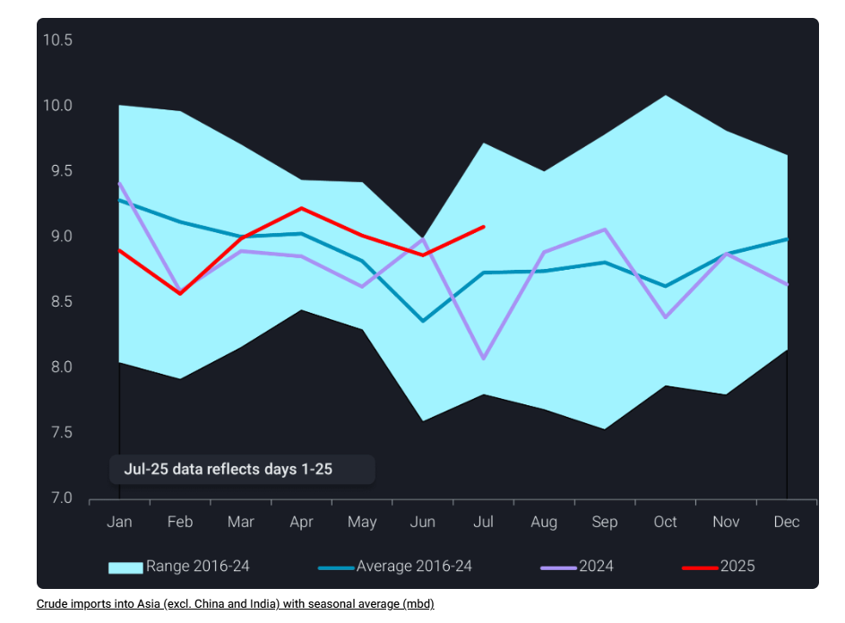
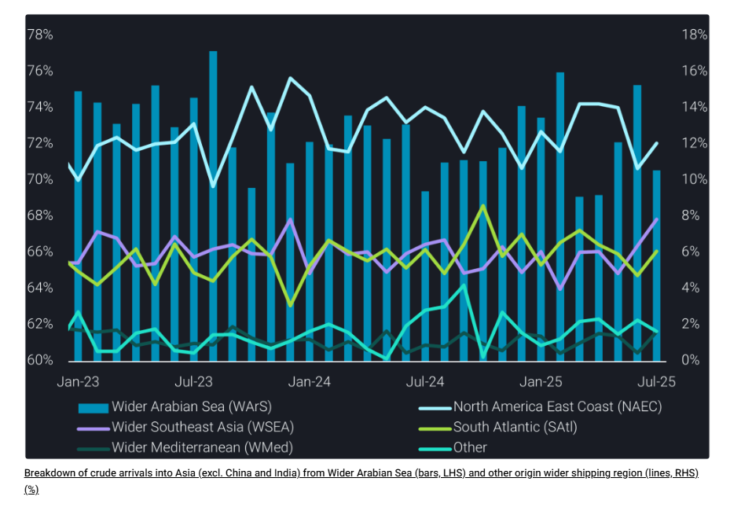
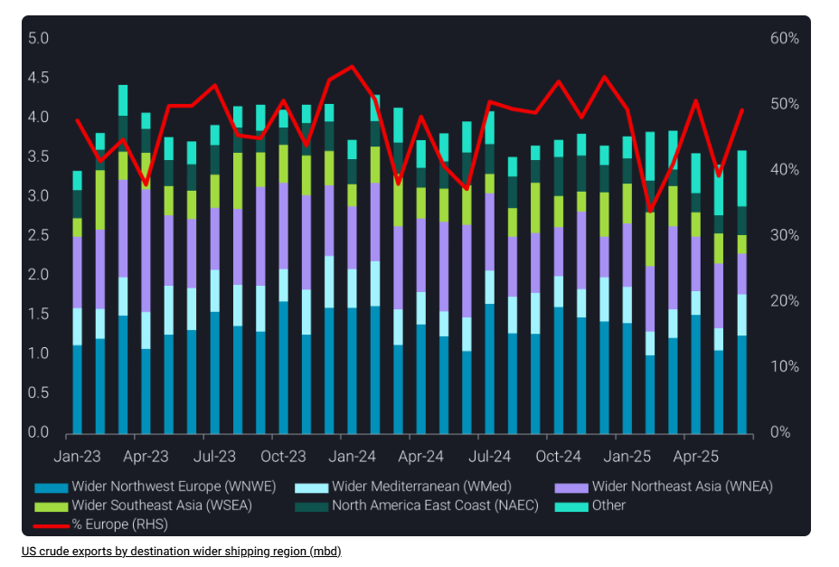

# Asia diversifies crude sources in July amid geopolitical flashpoints

**Date:** July 23, 2025  
**Publisher:** Breakwave Advisors | **Category:** Market Insights  
**Original URL:** [https://www.breakwaveadvisors.com/insights/2025/7/22/asia-diversifies-crude-sources-in-july-amid-geopolitical-flashpoints](https://www.breakwaveadvisors.com/insights/2025/7/22/asia-diversifies-crude-sources-in-july-amid-geopolitical-flashpoints)  

---

This blog explores how rising tensions in the Middle East have influenced Asia’s crude import patterns, particularly for non-sanctioned supply sources.

*By*[*Ivan Mathews*](https://www.linkedin.com/in/ivan-mathews-255689137/)

Crude arrivals into Asia (excluding China and India) are set to rise by 2.4% m-o-m in July. The increase is in line with seasonal patterns as refineries in Northeast and Southeast Asia typically ramp up imports throughput Q3 following scheduled maintenance in Q2. Additionally, export-oriented refineries may be running at higher rates in July amid strong diesel cracks.

> **Figure 1: Στιγμιότυπο Οθόνης 2025 07 22 120940**  
> **Interactive Data & Source:** [Analytics Vortexa](https://analytics.vortexa.com/Flows?dateRange=2016-01-01T00%3A00%3A00.000Z__2025-07-25T23%3A59%3A59.999Z&fromExcluded=%5B%22b996521be9c996db3560ca234a56286ac38f798d34be229437555fab4f12a6a5%22%2C%22a1acb291bb339d07faa0d9c7b62ea292aa0ea1a01813b26c890aeeb4e2334b09%22%2C%22d308ddc557e774187ad6c7da81b39db990def9a39e6c88e79cb163b6bdd6e8e5%22%5D&geoBreakdownOriginGlobal=wider_shipping_region&metric=bpd&movementEvent=unloading_start&originGlobalXFilter=%5B%22360ca6ba499f26f7dc481f99badda909af99c44466697f33e57ee628179183c6%22%5D&page=Flows&products=%5B%2254af755a090118dcf9b0724c9a4e9f14745c26165385ffa7f1445bc768f06f11%22%5D&tabId=ed656dc1-6f23-4811-a326-0e5c1ffe2ebc&timeSeriesPercentageEnabled=1&timeSeriesProperty=origin_country&to=%5B%22e6955a2c59dc90833986fe0894cf6718dddaa7816bb51bc955cdd3eb4470e554%22%5D&toExcluded=%5B%22934c47f36c16a58d68ef5e007e62a23f5f036ee3f3d1f5f85a48c572b90ad8b2%22%2C%2270425373a1836d6d0390dc6fef838a468717fba7776d66065a5043488f9f041b%22%5D&v=3) | [Local Asset](file:///C:/Users/Dell/Github/Shipping/corpus/03-breakwave/insights/2025/assets/2025-07-23_asia-diversifies-crude-sources-in-july-amid-geopolitical-flashpoints_img_cea3cf84ceb9ceb3cebcceb9cf8ccf84cf85_4b8298ade007.png)

While total crude arrivals into Asia will increase from June to July, the proportion of crude from the Wider Arabian Sea is forecasted to fall by 4 percentage points to 71% over the same period. This decline might be surprising given higher seaborne crude exports expected from OPEC+, as the group continued to unwind production cuts in July. Lower crude imports from the Wider Arabian Sea into Asia (excluding China and India) will be offset by higher arrivals from other wider shipping regions, particularly Wider Southeast Asia and North America East Coast.

This analysis investigates the drivers behind Asia’s shifting crude sources and whether the trend is likely to persist. To assess global dynamics of non-sanctioned crude, we exclude volumes from Iran, Venezuela, and Russia. Accordingly, we also exclude imports into China and India, given their significant trade with sanctioned producers – China imports oil from all three sanctioned countries while India imports from Russia.

> **Figure 2: Στιγμιότυπο Οθόνης 2025 07 22 121031**  
> **Interactive Data & Source:** [Analytics Vortexa](https://analytics.vortexa.com/Flows?dateRange=2016-01-01T00%3A00%3A00.000Z__2025-07-25T23%3A59%3A59.999Z&fromExcluded=%5B%22b996521be9c996db3560ca234a56286ac38f798d34be229437555fab4f12a6a5%22%2C%22a1acb291bb339d07faa0d9c7b62ea292aa0ea1a01813b26c890aeeb4e2334b09%22%2C%22d308ddc557e774187ad6c7da81b39db990def9a39e6c88e79cb163b6bdd6e8e5%22%5D&geoBreakdownOriginGlobal=wider_shipping_region&metric=bpd&movementEvent=unloading_start&originGlobalXFilter=%5B%22360ca6ba499f26f7dc481f99badda909af99c44466697f33e57ee628179183c6%22%5D&page=Flows&products=%5B%2254af755a090118dcf9b0724c9a4e9f14745c26165385ffa7f1445bc768f06f11%22%5D&tabId=ed656dc1-6f23-4811-a326-0e5c1ffe2ebc&timeSeriesPercentageEnabled=1&timeSeriesProperty=origin_country&to=%5B%22e6955a2c59dc90833986fe0894cf6718dddaa7816bb51bc955cdd3eb4470e554%22%5D&toExcluded=%5B%22934c47f36c16a58d68ef5e007e62a23f5f036ee3f3d1f5f85a48c572b90ad8b2%22%2C%2270425373a1836d6d0390dc6fef838a468717fba7776d66065a5043488f9f041b%22%5D&v=3) | [Local Asset](file:///C:/Users/Dell/Github/Shipping/corpus/03-breakwave/insights/2025/assets/2025-07-23_asia-diversifies-crude-sources-in-july-amid-geopolitical-flashpoints_img_cea3cf84ceb9ceb3cebcceb9cf8ccf84cf85_5ace66df4b49.png)

## Intra-Asia Crude Flows Rose in June and July Due to Geopolitical Tensions in the Middle East

Crude arrivals into Asia that originated from the Wider Southeast Asia region rose steadily in June and July. The escalation of the Israel-Iran conflict in June heightened concerns over supply disruptions along the Strait of Hormuz, prompting buyers to diversify supply sources. In response, many Asian importers increased spot purchases and Southeast Asia, where crude is more readily available for prompt loading. Notably,[crude arrivals from Australia and Malaysia had the largest m-o-m increase in June and July, respectively](https://analytics.vortexa.com/Flows?dateRange=2016-01-01T00%3A00%3A00.000Z__2025-07-25T23%3A59%3A59.999Z&fromExcluded=%5B%22b996521be9c996db3560ca234a56286ac38f798d34be229437555fab4f12a6a5%22%2C%22a1acb291bb339d07faa0d9c7b62ea292aa0ea1a01813b26c890aeeb4e2334b09%22%2C%22d308ddc557e774187ad6c7da81b39db990def9a39e6c88e79cb163b6bdd6e8e5%22%5D&geoBreakdownOriginGlobal=wider_shipping_region&metric=bpd&movementEvent=unloading_start&originGlobalXFilter=%5B%22360ca6ba499f26f7dc481f99badda909af99c44466697f33e57ee628179183c6%22%5D&page=Flows&products=%5B%2254af755a090118dcf9b0724c9a4e9f14745c26165385ffa7f1445bc768f06f11%22%5D&tabId=ed656dc1-6f23-4811-a326-0e5c1ffe2ebc&timeSeriesPercentageEnabled=1&timeSeriesProperty=origin_country&to=%5B%22e6955a2c59dc90833986fe0894cf6718dddaa7816bb51bc955cdd3eb4470e554%22%5D&toExcluded=%5B%22934c47f36c16a58d68ef5e007e62a23f5f036ee3f3d1f5f85a48c572b90ad8b2%22%2C%2270425373a1836d6d0390dc6fef838a468717fba7776d66065a5043488f9f041b%22%5D&v=3).

Looking ahead, intra-Asia crude flows are expected to ease in August. Buyers in Asia are likely to increase crude purchases from the Wider Arabian Sea as tensions between Israel and Iran have subsided, alleviating concerns of supply disruptions along the Strait of Hormuz. In addition, higher seaborne crude exports are expected from OPEC-8 in August (read more[here](https://analytics.vortexa.com/InsightsHubPage?articleId=5mimWAk0ZIPrWc4IiOcHvg&articleType=Highlight&categoryFilters=%5B%22highlight%22%5D&page=InsightsHubPage&tabId=bfb77bc2-ff38-4eba-97c9-c3447abcacd5)) as the group plans to accelerate their output hikes next month. These factors should reduce the need for crude purchases from the Wider Southeast Asia region in the months ahead.

## Less U.s. Crude Will Head to Asia in August Amid Increased Flows to Europe

Crude arrivals into Asia from North America East Coast is set to rebound m-o-m in July, mainly due to higher exports from the U.S. to South Korea, Taiwan and Japan in May. However, this trend will reverse as U.S. crude exports to Asia fell m-o-m in June. As shown from the chart below, more U.S. crude has been diverted to Europe, as refineries in the region increase crude runs to meet higher fuel demand for road transport and power generation during the summer season. As a result, U.S. crude arrivals into Asia are expected to fall in August. U.S. crude exports could see downside due to less surplus barrels available amid current quality issues with Mars crude, potentially impacting September arrivals given the ~50-day voyage from the U.S. Gulf Coast to Northeast Asia.

> **Figure 3: Στιγμιότυπο Οθόνης 2025 07 22 121141**  
> **Interactive Data & Source:** [Vortexa](https://www.vortexa.com//oil-gas-data-traders-analysts-data-scientists?gclid=Cj0KCQjw8_qRBhCXARIsAE2AtRZKOvMnbilZ_6_91d7huSFFy71pWLrnPwGwOHVzXsmsG-1a1mZnQw8aAt89EALw_wcB&hsa_acc=1782073842&hsa_ad=548425387665&hsa_cam=14746637662&hsa_grp=125038601902&hsa_kw=&hsa_mt=&hsa_net=adwords&hsa_src=g&hsa_tgt=dsa-1431852288425&hsa_ver=3&utm_campaign=%5BCD%5D%20-%20DSA%20-%20EMEA&utm_medium=cpc&utm_medium=ppc&utm_source=google&utm_source=adwords&utm_term=) | [Local Asset](file:///C:/Users/Dell/Github/Shipping/corpus/03-breakwave/insights/2025/assets/2025-07-23_asia-diversifies-crude-sources-in-july-amid-geopolitical-flashpoints_img_cea3cf84ceb9ceb3cebcceb9cf8ccf84cf85_3aa6cd5c2907.png)

Overall, crude arrivals from the Wider Arabian Sea into Asia (excluding China and India) are expected to rebound in the coming months. Higher seaborne exports from OPEC-8 and easing tensions along the Strait of Hormuz are likely to drive stronger MEG crude purchases. Although the Brent-Dubai Exchange of Futures for Swaps (EFS) narrowed in July compared to H1 June (Argus), ongoing quality issues with Mars crude and elevated European demand will likely continue to divert Atlantic Basin crude away from Asia through the summer.

Data Source:[Vortexa](https://www.vortexa.com//oil-gas-data-traders-analysts-data-scientists?gclid=Cj0KCQjw8_qRBhCXARIsAE2AtRZKOvMnbilZ_6_91d7huSFFy71pWLrnPwGwOHVzXsmsG-1a1mZnQw8aAt89EALw_wcB&hsa_acc=1782073842&hsa_ad=548425387665&hsa_cam=14746637662&hsa_grp=125038601902&hsa_kw=&hsa_mt=&hsa_net=adwords&hsa_src=g&hsa_tgt=dsa-1431852288425&hsa_ver=3&utm_campaign=%5BCD%5D%20-%20DSA%20-%20EMEA&utm_medium=cpc&utm_medium=ppc&utm_source=google&utm_source=adwords&utm_term=)

---

**Tags:** Crude, Markets, Tankers  
