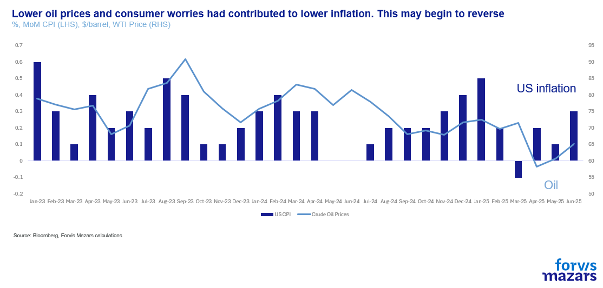
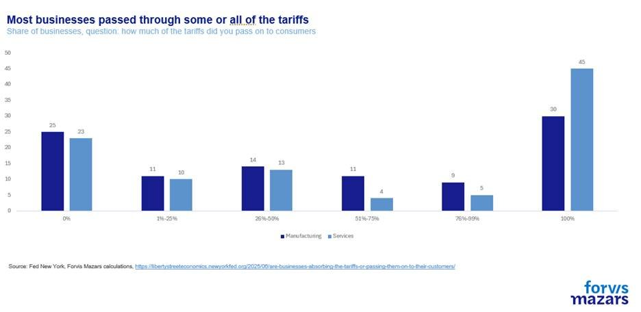
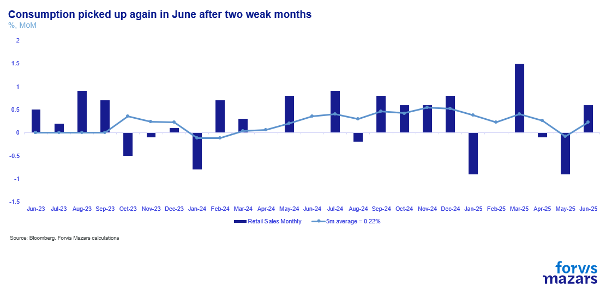
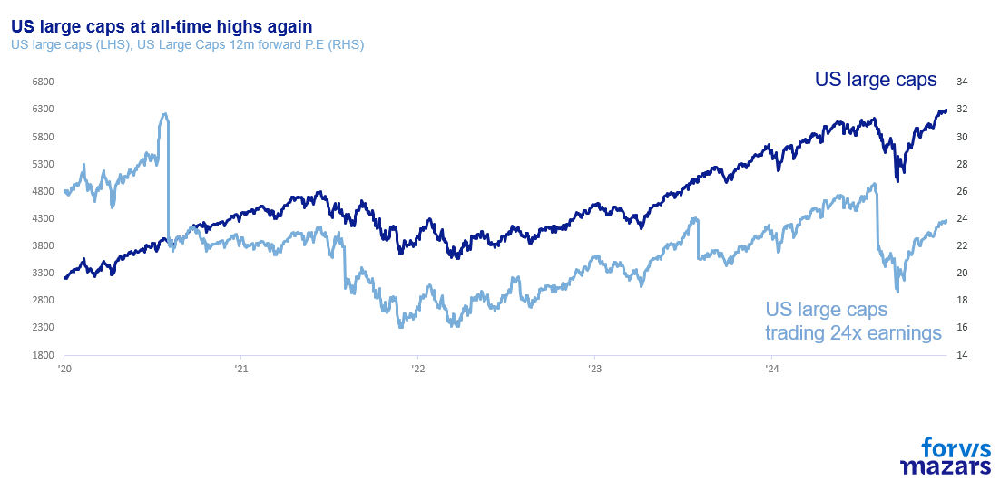
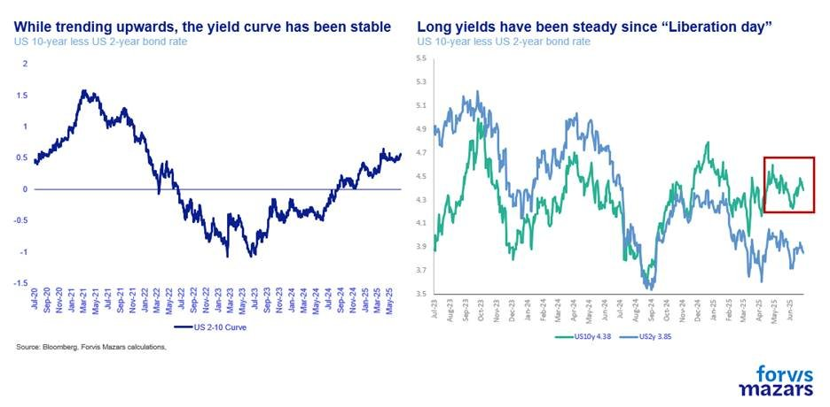
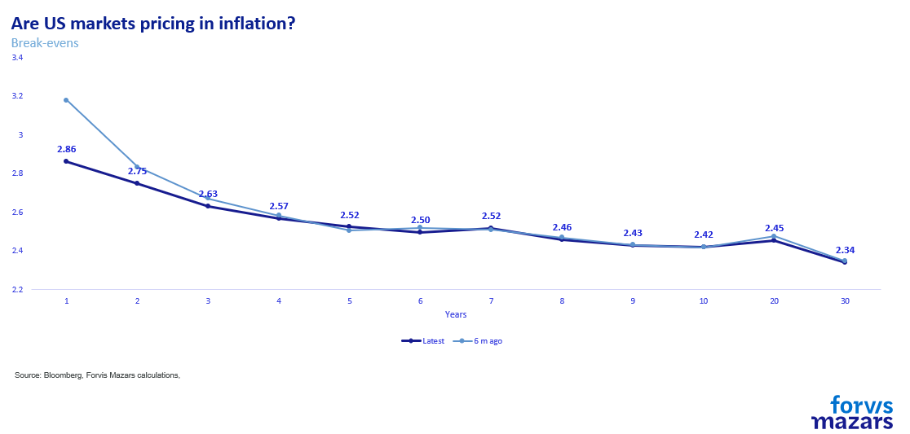
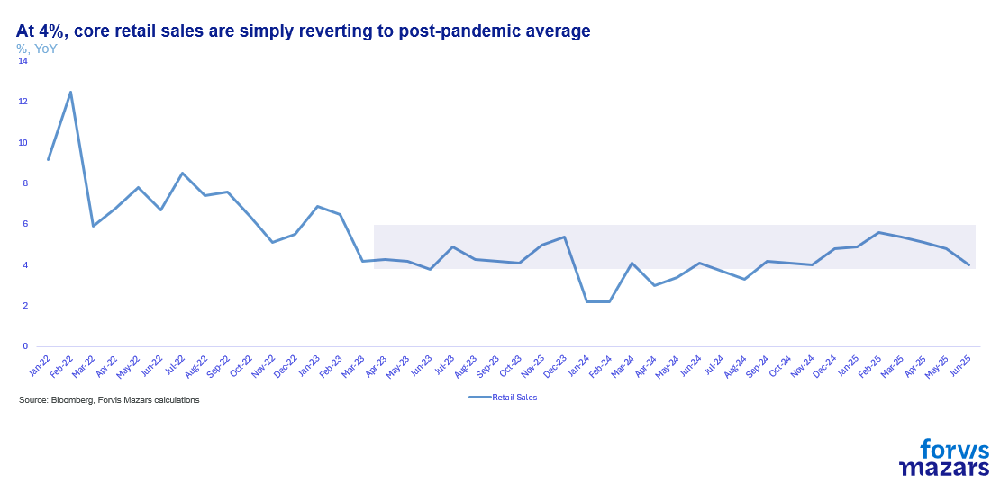
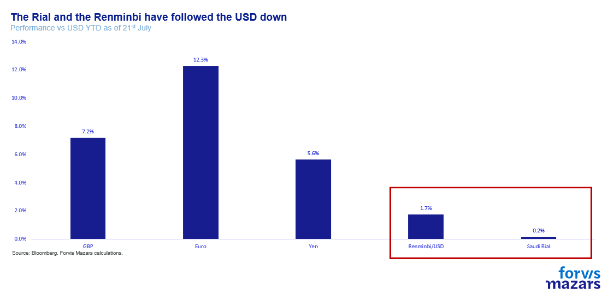
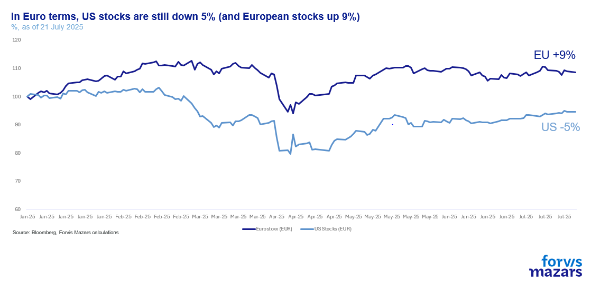

# The trade war is not a shock. It is a slow train.

**Date:** July 23, 2025  
**Publisher:** Breakwave Advisors | **Category:** Market Insights  
**Original URL:** [https://www.breakwaveadvisors.com/insights/2025/7/22/the-trade-war-is-not-a-shock-it-is-a-slow-train](https://www.breakwaveadvisors.com/insights/2025/7/22/the-trade-war-is-not-a-shock-it-is-a-slow-train)  

---

The three things investors need to know this week:

1. Economic volatility and uncertainty persist, but despite a slowdown in growth and a pickup in US inflation, numbers still remain well within normal bounds.
2. Robust supply chains and consumption inertia, pre-tariff inventories and low energy prices have contributed to economic stability.
3. If we assume that the slow-moving economic consequences will eventually materialise, by reducing their appetite for forecasts, investors may be under-pricing economic downside risks.

*By*[*George Lagarias*](https://www.linkedin.com/in/george-lagarias-mba-3baa769/)

Summary

Despite rising U.S. inflation and heightened trade tensions, markets remain stable—perhaps too stable. Robust supply chains, early inventory buildup, and low energy prices have buffered short-term shocks. However, investors may be underestimating longer-term risks. With tariffs at historic highs and political interference pressuring the Fed, inflation could become more entrenched, especially if monetary policy shifts. Bond markets appear complacent, at least not pricing in a regime change, while equities ride on dollar weakness and steady earnings. The economic impact of the trade war is a slow-moving threat, but a real one. By ignoring it, markets risk mispricing downside.

Another week passed that felt like a month.

- Trade[negotiations](https://www.ft.com/content/43c98c4b-8772-4279-ad55-e46bd22409de)are taking place between the US and the EU, which essentially boils down to Europeans trying to come to some sort of a solution as to what tribute they need to pay to avoid some of the unavoidable economic pain.
- The White House yet again[threatens to fire Powell](https://edition.cnn.com/2025/07/19/business/powell-trump-interest-rates-fed)– before denying it, in the old “will he, won’t he?” pattern. At the same time, when the White House destabilises the Fed, with external threats and internal undermining of Powell (see[Christopher Waller,](https://www.msn.com/en-us/money/markets/fed-s-waller-pushes-rate-cut-to-neutral-3-citing-slower-inflation-labor-market-risks/ar-AA1IXhY8?ocid=finance-verthp-feeds)a Republican-appointed former hawk who now insists on quick rate cuts),[US inflation](assets/2025-07-23_the-trade-war-is-not-a-shock-it-is-a-slow-train_cpi-inflation-report-june-2025_e76536489f64.html)is -finally- picking up as a result of tariffs and with pre-tariff inventories nowhere near depletion yet.
- The first[cryptocurrency legislation](https://www.euronews.com/business/2025/07/18/win-for-the-crypto-industry-us-passed-the-first-major-bill-to-regulate-digital-assets)in the US, which, amongst other things, represents an effort to increase internal demand for US Treasuries (as they can be collateral for stablecoin funds).

The most important issue of the time is, of course, US inflation.

> **Figure 1: Market Chart 1**  
> [Local Asset](file:///C:/Users/Dell/Github/Shipping/corpus/03-breakwave/insights/2025/assets/2025-07-23_the-trade-war-is-not-a-shock-it-is-a-slow-train_img_image001_22f35c105d8f.png)

The long-expected pickup last week even cheered some economists who were wondering why US prices didn’t rise earlier, despite more than half the firms passing tariffs on to consumers. It’s not just a slight rebound in oil prices, but also higher core services prices that drove up headline inflation.

> **Figure 2: Market Chart 2**  
> [Local Asset](file:///C:/Users/Dell/Github/Shipping/corpus/03-breakwave/insights/2025/assets/2025-07-23_the-trade-war-is-not-a-shock-it-is-a-slow-train_img_image002_1aadf0da2a06.jpg)

Despite the pickup, most of the US economic data remains robust. Growth at 1.5% this year isn’t great, but certainly it’s not a recession either. Consumption data from June was also good, suggesting that consumers aren’t shocked.

> **Figure 3: Market Chart 3**  
> [Local Asset](file:///C:/Users/Dell/Github/Shipping/corpus/03-breakwave/insights/2025/assets/2025-07-23_the-trade-war-is-not-a-shock-it-is-a-slow-train_img_image003_ee0ce4ca31fb.png)

Meanwhile, the US stock market is near all-time highs once again.

> **Figure 4: Market Chart 4**  
> [Local Asset](file:///C:/Users/Dell/Github/Shipping/corpus/03-breakwave/insights/2025/assets/2025-07-23_the-trade-war-is-not-a-shock-it-is-a-slow-train_img_image004_91e23e85871a.png)

And even as the White House presses for Jay Powell to be replaced (presumably with a chair that will be willing to floor short term rates long enough for the US to refinance a record amount of short-term debt this year), long-term borrowing rates (where inflation lives) and the yield curve (the difference between long and short-term rates) haven’t really reflected rising inflation risks.

> **Figure 5: Market Chart 5**  
> [Local Asset](file:///C:/Users/Dell/Github/Shipping/corpus/03-breakwave/insights/2025/assets/2025-07-23_the-trade-war-is-not-a-shock-it-is-a-slow-train_img_image005_c1420584e179.jpg)

> **Figure 6: Nor Have Market-Implied Inflation Expectations**  
> [Local Asset](file:///C:/Users/Dell/Github/Shipping/corpus/03-breakwave/insights/2025/assets/2025-07-23_the-trade-war-is-not-a-shock-it-is-a-slow-train_img_image006_b5f18aa11516.png)

In other words, the US economy is not collapsing, even as tariffs are 6x the previous long-term average and the highest they have been since the Second World War.

Why is that? Why hasn’t inflation skyrocketed along with borrowing costs yet, and growth collapsed? And why are equity markets so unfazed?

For one,**supply chains are proving robust**. Unlike China, whose pandemic-related economic convulsions shocked global supply chains, leading to shortages and spikes in demand, skyrocketing container costs and blocked ports, the US is at the end of the supply chain, not at the heart of it. The inflation spike of the time was a combination of supply-side disruptions (the pandemic, the war in Ukraine) and the wake of sharp US monetary expansion during the early stages of the pandemic. These conditions are not met today. Supply chains work, and, since the trade war hasn’t proliferated between third countries (yet), the main problem is one of US erratic and possibly slower future demand. Inventories were built early, so that economic activity was brought forward.

Second, some assumed that their own dismal forward-looking outlook would instantly translate into consumer and investor disappointment. But, as we know from Brexit, economic decisions are not the same as market/financial shocks, or event-driven shocks like the pandemic. They are. Consumerism is specifically designed to induce consumption, over possible economic fears. While consumers may be worried about what they read in the news (and worried they are), they paradoxically vent those worries with a weekend spent in shopping therapy! (In case you ever wondered why three Economics Nobel Prizes have been given to behaviourists). US core retail spending is slowing, but at 4% it is still at the post-pandemic average.

> **Figure 7: Decidedly Slower-Moving Trains**  
> [Local Asset](file:///C:/Users/Dell/Github/Shipping/corpus/03-breakwave/insights/2025/assets/2025-07-23_the-trade-war-is-not-a-shock-it-is-a-slow-train_img_image007_9f212780b09c.png)

Third,. Whether by design (a deal) or not, Oil prices are down 10% since the inauguration, and nearly double that in Euro or GBP terms. Saudis, like the Chinese, have pegged their currency to the Dollar. Because they are not big importers, they don’t suffer much from their own devaluation (China might eventually if commodity prices begin to spike as product-focused tariffs pick up). Now to be fair, this hasn’t quite translated at prices “at the pump” (average gasoline prices are at $3.63, nearly at the same level as they were in January ($3.59) mostly because of inventories and maintenance issues, seasonal issues, as well as increased export demand, but, considering the lower Dollar it’s still a boon that American consumers may enjoy.

> **Figure 8: Energy Prices Are Persistently Low**  
> [Local Asset](file:///C:/Users/Dell/Github/Shipping/corpus/03-breakwave/insights/2025/assets/2025-07-23_the-trade-war-is-not-a-shock-it-is-a-slow-train_img_image008_c1f1f5ae7269.png)

Now, equity markets are not really unphased. In fact, they have wisely priced-in the lower US Dollar. While US equities are at all-time highs, and trading at expensive multiples, they are in fact negative for Euro and GBP Investors. Investors expect a healthy 5.3% year-on-year growth in US earnings, a bit lower than the 7.7% average but still well on track to deliver 10.7% by the end of the year.

> **Figure 9: Market Chart 9**  
> [Local Asset](file:///C:/Users/Dell/Github/Shipping/corpus/03-breakwave/insights/2025/assets/2025-07-23_the-trade-war-is-not-a-shock-it-is-a-slow-train_img_image009_a5ee3cefeb16.png)

Our bigger worry is the bond market. The market has not priced in a meaningful shift in the inflation regime, which means that investors are quite relaxed about a change of paradigm at the central bank. They also don’t see risks rising from fiscal incontinence in the US and across the globe. This creates upside risks, especially for longer-dated bonds, where inflation lives. Conversely, it could create opportunities for short-term bonds if the Fed somehow capitulates and embarks on a rate-cutting binge.

**The larger picture is one of summer lull (some would argue complacency), where investors, tired from the noise, don’t extrapolate economic and financial risks into the future until something actually happens, be it a negative inflation or growth surprise, an escalation of trade wars or any other such similar event. In other words, i**f we assume that the slow-moving economic consequences will eventually materialise**(as the Fed says, “tariffs will eventually hit inflation”), by reducing their appetite for forecasts, investors may be under-pricing economic downside risks.**

---

**Tags:** Macro, Economy, Markets  
