# Spotlight on Brazilian Iron Ore Shipments to the Far East

**Date:** July 24, 2025  
**Publisher:** Breakwave Advisors | **Category:** Market Insights  
**Original URL:** [https://www.breakwaveadvisors.com/insights/2025/7/24/spotlight-on-brazilian-iron-ore-shipments-to-the-far-east](https://www.breakwaveadvisors.com/insights/2025/7/24/spotlight-on-brazilian-iron-ore-shipments-to-the-far-east)  

---

WEEKLY DRY MARKET MONITOR
*Spot Rates | Supply-Demand Trends | Port Congestion Overview*
Week 30, 2025 | Date: July 23, 2025

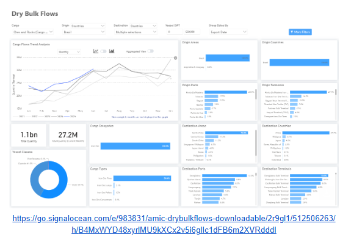

> **Figure 1: Στιγμιότυπο Οθόνης 2025 07 24 105540**  
> **Interactive Data & Source:** [Signal Ocean Platform](https://go.signalocean.com/e/983831/arket-monitor-dry-week-28-2025/2r9glq/512506263/h/B4MxWYD48xyrlMU9kXCx2v5i6glIc1dFB6m2XVRdddI) | [Local Asset](file:///C:/Users/Dell/Github/Shipping/corpus/03-breakwave/insights/2025/assets/2025-07-24_spotlight-on-brazilian-iron-ore-shipments-to-the-far-east_img_cea3cf84ceb9ceb3cebcceb9cf8ccf84cf85_cc976ff0ad79.png)

This week’s Chart Monitor highlights a continued upward trend in Brazilian iron ore shipments. Since the end of Q1, each month's closing volume has exceeded levels seen in previous years. The first quarter of 2025 closed with approximately 70 million tons shipped, followed by over 80 million tons in Q2. These figures are notably higher than the lows recorded in 2021—around 50 million tons in Q1 and 67 million tons in Q2.

Looking ahead, recent news from Vale’s Q2 production report adds to the bullish sentiment. The Brazilian miner reported 83.6 million metric tons of iron ore output in Q2, a 3.7% year-on-year increase. The growth was largely attributed to a new second-quarter production record at the S11D mine in northern Brazil, Vale’s largest operation, and a strong performance at the Brucutu mine in the southeast. With production ramping up and iron ore flows increasing, we are likely to see continued upward pressure on the C3 route in the coming weeks, as tightening vessel supply and rising cargo volumes converge to support a firmer freight market.

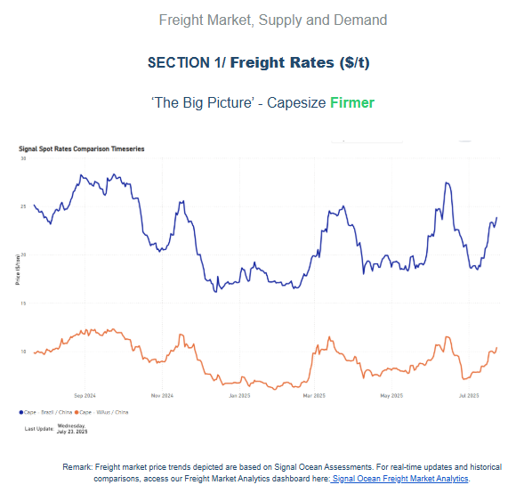

> **Figure 2: Στιγμιότυπο Οθόνης 2025 07 24 105552**  
> **Interactive Data & Source:** [Signal Ocean Platform](https://go.signalocean.com/e/983831/arket-monitor-dry-week-28-2025/2r9glq/512506263/h/B4MxWYD48xyrlMU9kXCx2v5i6glIc1dFB6m2XVRdddI) | [Local Asset](file:///C:/Users/Dell/Github/Shipping/corpus/03-breakwave/insights/2025/assets/2025-07-24_spotlight-on-brazilian-iron-ore-shipments-to-the-far-east_img_cea3cf84ceb9ceb3cebcceb9cf8ccf84cf85_1a653276bebb.png)

On the C3 and C5 routes, we've seen signs of firmness, with rates surpassing $20/ton for Brazil–China and $10/ton for Australia–China. A comparison of the number of ballasters versus Baltic rates suggests that the recovery on the C5 route is primarily driven by a decline in available ballasters. In contrast, the recent strength on the C3 appears to be more sentiment-driven for now, as there hasn't been a notable drop in the number of vessels ballasting toward the South Atlantic. This sentiment may be partly fueled by the recent news of Vale's iron ore production update, which has raised forward expectations for increased iron ore cargo flows.

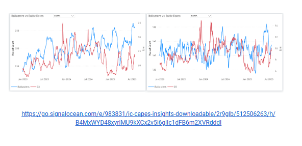

> **Figure 3: Στιγμιότυπο Οθόνης 2025 07 24 105559**  
> **Interactive Data & Source:** [Signal Ocean Platform](https://go.signalocean.com/e/983831/arket-monitor-dry-week-28-2025/2r9glq/512506263/h/B4MxWYD48xyrlMU9kXCx2v5i6glIc1dFB6m2XVRdddI) | [Local Asset](file:///C:/Users/Dell/Github/Shipping/corpus/03-breakwave/insights/2025/assets/2025-07-24_spotlight-on-brazilian-iron-ore-shipments-to-the-far-east_img_cea3cf84ceb9ceb3cebcceb9cf8ccf84cf85_ef7cde932a61.png)

Panamax - ECSA / Far East**Softer**

Panamax spot rates from East Coast South America (ECSA) to the Far East, after peaking in mid-July, have started to gradually soften, although levels remain significantly higher than the lows recorded at the beginning of June. ECSA–Far East rates are still around 9% higher than a month ago, which can be partially supported by forward optimism linked to the U.S. summer crop season. Additionally, Panamax vessel supply to ECSA has seen a continuous downward trend since March, while the daily loaded volume has remained consistently noticeable throughout the year.

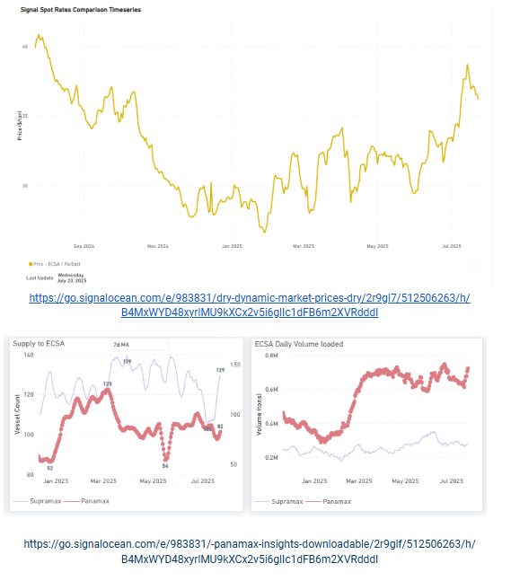

> **Figure 4: Στιγμιότυπο Οθόνης 2025 07 24 105613**  
> **Interactive Data & Source:** [Signal Ocean Platform](https://go.signalocean.com/e/983831/arket-monitor-dry-week-28-2025/2r9glq/512506263/h/B4MxWYD48xyrlMU9kXCx2v5i6glIc1dFB6m2XVRdddI) | [Local Asset](file:///C:/Users/Dell/Github/Shipping/corpus/03-breakwave/insights/2025/assets/2025-07-24_spotlight-on-brazilian-iron-ore-shipments-to-the-far-east_img_cea3cf84ceb9ceb3cebcceb9cf8ccf84cf85_7e2db11377d1.png)

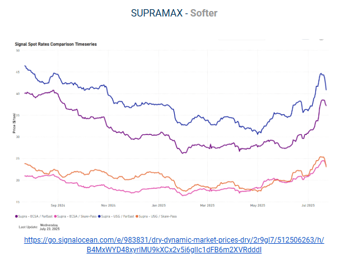

> **Figure 5: Στιγμιότυπο Οθόνης 2025 07 24 105622**  
> **Interactive Data & Source:** [Signal Ocean Platform](https://go.signalocean.com/e/983831/arket-monitor-dry-week-28-2025/2r9glq/512506263/h/B4MxWYD48xyrlMU9kXCx2v5i6glIc1dFB6m2XVRdddI) | [Local Asset](file:///C:/Users/Dell/Github/Shipping/corpus/03-breakwave/insights/2025/assets/2025-07-24_spotlight-on-brazilian-iron-ore-shipments-to-the-far-east_img_cea3cf84ceb9ceb3cebcceb9cf8ccf84cf85_dbb3c20cb256.png)

Supramax spot rates from the U.S. Gulf to the Far East declined to $40/tonne this week, marking an 8% drop from the previous week. A similar softening is observed on the ECSA–Far East route, where rates fell to $37/tonne, though still approximately 20% higher than a month ago. The recent bullish sentiment appears to stem from a tightening supply, with the number of available vessels falling below 90. Meanwhile, daily loading volumes from the USG/USEC have recently eased, dropping to under 0.3 million tonnes.

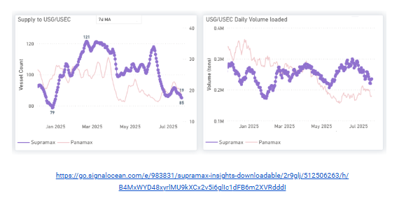

> **Figure 6: Στιγμιότυπο Οθόνης 2025 07 24 105629**  
> **Interactive Data & Source:** [Signal Ocean Platform](https://go.signalocean.com/e/983831/arket-monitor-dry-week-28-2025/2r9glq/512506263/h/B4MxWYD48xyrlMU9kXCx2v5i6glIc1dFB6m2XVRdddI) | [Local Asset](file:///C:/Users/Dell/Github/Shipping/corpus/03-breakwave/insights/2025/assets/2025-07-24_spotlight-on-brazilian-iron-ore-shipments-to-the-far-east_img_cea3cf84ceb9ceb3cebcceb9cf8ccf84cf85_251deda82df6.png)

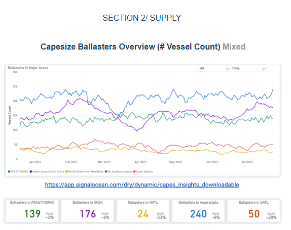

> **Figure 7: Στιγμιότυπο Οθόνης 2025 07 24 105637**  
> **Interactive Data & Source:** [Signal Ocean Platform](https://go.signalocean.com/e/983831/arket-monitor-dry-week-28-2025/2r9glq/512506263/h/B4MxWYD48xyrlMU9kXCx2v5i6glIc1dFB6m2XVRdddI) | [Local Asset](file:///C:/Users/Dell/Github/Shipping/corpus/03-breakwave/insights/2025/assets/2025-07-24_spotlight-on-brazilian-iron-ore-shipments-to-the-far-east_img_cea3cf84ceb9ceb3cebcceb9cf8ccf84cf85_874e8c3c8fa9.png)

**Capesize ballasters view**: Capesize ballast availability in the Atlantic remained tight. In contrast, the Pacific continued to see elevated ballast vessel counts, particularly in Australasia. Meanwhile, ballaster activity in the Indian Ocean and South Africa began to ease, with a 6% week-on-week decline.

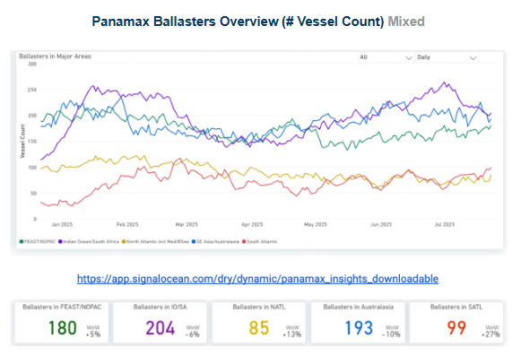

> **Figure 8: Στιγμιότυπο Οθόνης 2025 07 24 105644**  
> **Interactive Data & Source:** [Signal Ocean Platform](https://go.signalocean.com/e/983831/arket-monitor-dry-week-28-2025/2r9glq/512506263/h/B4MxWYD48xyrlMU9kXCx2v5i6glIc1dFB6m2XVRdddI) | [Local Asset](file:///C:/Users/Dell/Github/Shipping/corpus/03-breakwave/insights/2025/assets/2025-07-24_spotlight-on-brazilian-iron-ore-shipments-to-the-far-east_img_cea3cf84ceb9ceb3cebcceb9cf8ccf84cf85_97d23ace0785.png)

**Panamax ballasters view**: An oversupply emerged in the Atlantic, while ballast numbers in the Indian Ocean/South Africa and Australasia declined by 6% and 10% week-on-week, respectively.

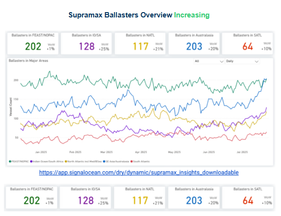

> **Figure 9: Στιγμιότυπο Οθόνης 2025 07 24 105652**  
> **Interactive Data & Source:** [Signal Ocean Platform](https://go.signalocean.com/e/983831/arket-monitor-dry-week-28-2025/2r9glq/512506263/h/B4MxWYD48xyrlMU9kXCx2v5i6glIc1dFB6m2XVRdddI) | [Local Asset](file:///C:/Users/Dell/Github/Shipping/corpus/03-breakwave/insights/2025/assets/2025-07-24_spotlight-on-brazilian-iron-ore-shipments-to-the-far-east_img_cea3cf84ceb9ceb3cebcceb9cf8ccf84cf85_e76364d4c824.png)

**Supramax ballasters view**: Oversupply appeared in both basins. In the Atlantic, ballast supply increased significantly by 20% in the North and 10% in the South. Meanwhile, the Pacific market saw significant increase, with the Indian Ocean/South Africa rising 25% and Australasia increasing 20% week-over-week.

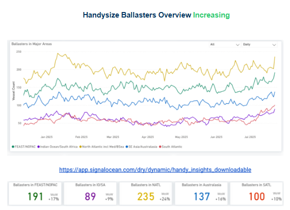

> **Figure 10: Στιγμιότυπο Οθόνης 2025 07 24 105659**  
> **Interactive Data & Source:** [Signal Ocean Platform](https://go.signalocean.com/e/983831/arket-monitor-dry-week-28-2025/2r9glq/512506263/h/B4MxWYD48xyrlMU9kXCx2v5i6glIc1dFB6m2XVRdddI) | [Local Asset](file:///C:/Users/Dell/Github/Shipping/corpus/03-breakwave/insights/2025/assets/2025-07-24_spotlight-on-brazilian-iron-ore-shipments-to-the-far-east_img_cea3cf84ceb9ceb3cebcceb9cf8ccf84cf85_b663f5a6444a.png)

**Handysize ballasters**: Vessel oversupply has seen continuous and significant increases in both the Pacific and North Atlantic basins. Ballasters in the North Atlantic increased by 24% and in the Far East/NOPAC region by 17%.

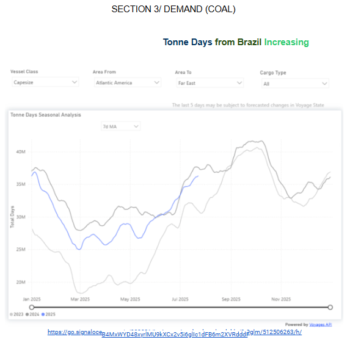

> **Figure 11: Στιγμιότυπο Οθόνης 2025 07 24 105707**  
> **Interactive Data & Source:** [Signal Ocean Platform](https://go.signalocean.com/e/983831/arket-monitor-dry-week-28-2025/2r9glq/512506263/h/B4MxWYD48xyrlMU9kXCx2v5i6glIc1dFB6m2XVRdddI) | [Local Asset](file:///C:/Users/Dell/Github/Shipping/corpus/03-breakwave/insights/2025/assets/2025-07-24_spotlight-on-brazilian-iron-ore-shipments-to-the-far-east_img_cea3cf84ceb9ceb3cebcceb9cf8ccf84cf85_9b4ac603be34.png)

Toward the end of Q2 this year, we began to observe a rise in Capesize tonne-day demand on the Brazil-to-China route, aligning closely with last year’s trend around the 37 million mark. This increase appears to be supported by stronger iron ore output from Vale, Brazil’s leading miner.

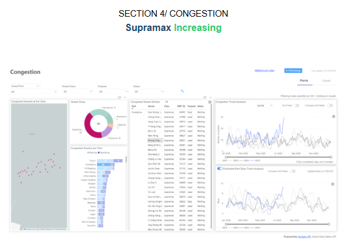

> **Figure 12: Στιγμιότυπο Οθόνης 2025 07 24 105715**  
> **Interactive Data & Source:** [Signal Ocean Platform](https://go.signalocean.com/e/983831/arket-monitor-dry-week-28-2025/2r9glq/512506263/h/B4MxWYD48xyrlMU9kXCx2v5i6glIc1dFB6m2XVRdddI) | [Local Asset](file:///C:/Users/Dell/Github/Shipping/corpus/03-breakwave/insights/2025/assets/2025-07-24_spotlight-on-brazilian-iron-ore-shipments-to-the-far-east_img_cea3cf84ceb9ceb3cebcceb9cf8ccf84cf85_7115cd782e4c.png)

As highlighted in our[previous report](https://go.signalocean.com/e/983831/arket-monitor-dry-week-28-2025/2r9glq/512506263/h/B4MxWYD48xyrlMU9kXCx2v5i6glIc1dFB6m2XVRdddI), Chittagong showed elevated congestion levels for Supramax vessels, particularly those in waiting status.

This week, we observed a gradual increase in congestion at Huanghua, reaching levels rarely seen over the past year. The Supramax segment, in particular, appears to be experiencing growing port congestion pressures. While[Typhoon Wipha](https://go.signalocean.com/e/983831/m-south-china-mainland-5248901/2r9glt/512506263/h/B4MxWYD48xyrlMU9kXCx2v5i6glIc1dFB6m2XVRdddI)primarily impacted southern China affecting Guangdong, Hong Kong, and nearby coastal provinces, weather alerts this week also noted heavy rainfall and localized flooding in parts of eastern and northern China. Although Huanghua was not directly mentioned in weather reports, its proximity to the Bohai Sea means it could be indirectly affected by broader regional weather disruptions. These conditions may be contributing to operational delays or vessel backlogs. We will continue to monitor the situation to determine whether this congestion is temporary or signals a sustained trend.

Data Source:[Signal Ocean Platform](https://www.thesignalgroup.com/signal-ocean-platform)

---

**Tags:** Drybulk, Shipping, Ironore  
