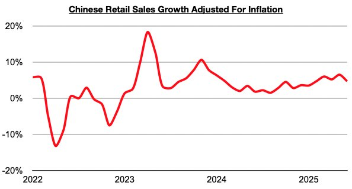
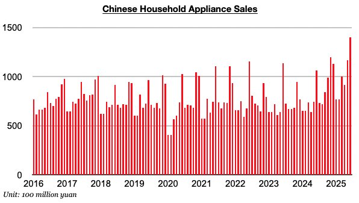

# Lower Consumption Growth in China, But Appliance Sales Set Record

**Date:** July 25, 2025  
**Publisher:** Breakwave Advisors | **Category:** Market Insights  
**Original URL:** [https://www.breakwaveadvisors.com/insights/2025/7/25/lower-consumption-growth-in-china-but-appliance-sales-set-record](https://www.breakwaveadvisors.com/insights/2025/7/25/lower-consumption-growth-in-china-but-appliance-sales-set-record)  

---

*By*[*Jeffrey Landsberg*](https://www.linkedin.com/in/jeffrey-landsberg-70ab957/)

As we discussed for clients in Commodore Research's most recent Weekly China Report, China’s retail sales in June grew year-on-year by 4.8% which has marked the lowest growth seen since February. Taking June’s 0.1% inflation into account, sales adjusted for inflation/deflation grew year-on-year by 4.7%. This has also marked the lowest growth seen since February.

> **Figure 1: Chart 1**  
> [Local Asset](file:///C:/Users/Dell/Github/Shipping/corpus/03-breakwave/insights/2025/assets/2025-07-25_lower-consumption-growth-in-china-but-appliance-sales-set-record_img_chart1_97bb3d9f2edf.jpg)

While growth has declined, important is that retail sales growth has again come in higher than any inflation. This has now occurred for thirty straight months. Prior to the last thirty months, retail sales came in lower than inflation for four straight months. Of note on the consumer side is that furniture sales, clothing sales, and appliance sales (which includes consumer electronics) again all experienced year-on-year growth, with appliance sales (which includes consumer electronics) impressively setting a record.

> **Figure 2: Chart 2**  
> [Local Asset](file:///C:/Users/Dell/Github/Shipping/corpus/03-breakwave/insights/2025/assets/2025-07-25_lower-consumption-growth-in-china-but-appliance-sales-set-record_img_chart2_cf5f2790eea6.jpg)

---

**Tags:** China, Markets, Economy  
