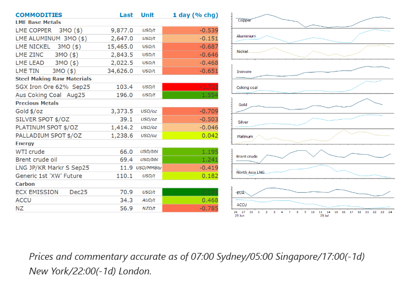
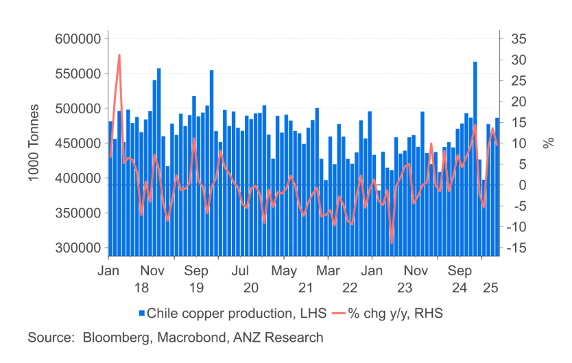

# Supply side issues resurface in energy and metal markets

**Date:** July 25, 2025  
**Publisher:** Breakwave Advisors | **Category:** Market Insights  
**Original URL:** [https://www.breakwaveadvisors.com/insights/2025/7/25/supply-side-issues-resurface-in-energy-and-metal-markets](https://www.breakwaveadvisors.com/insights/2025/7/25/supply-side-issues-resurface-in-energy-and-metal-markets)  

---

Energy and metal markets struggled for direction amid conflicting supply side issues. A resilient US labour market weighed on sentiment in the gold market.

*By*[*Daniel Hynes*](https://www.linkedin.com/in/dahynes/)

> **Figure 1: Στιγμιότυπο Οθόνης 2025 07 25 133426**  
> [Local Asset](file:///C:/Users/Dell/Github/Shipping/corpus/03-breakwave/insights/2025/assets/2025-07-25_supply-side-issues-resurface-in-energy-and-metal-markets_img_cea3cf84ceb9ceb3cebcceb9cf8ccf84cf85_c0f59822c2f9.png)

### Market Commentary

**Crude oil**extended gains as US-EU trade talks progressed. Reports that both parties are working towards a deal that would set a 15% tariff for most goods, similar to the US’s agreement with Japan, has boosted confidence that a worst-case scenario of a 30% tariff is avoidable. The positive sentiment was supported by technical buying, after WTI, the US benchmark for crude, pushed through its 50-day moving average. The move erased an earlier slide spurred by the US administration’s decision to allow Chevron to resume pumping oil in Venezuela. US imports of Venezuelan crude have ground to a halt, down from 300kb/d in January after President Trump banned imports. While Venezuelan exports, which would previously have found a home in the US, have been picked up by China, the spectre of Venezuelan supply flooding a market already facing oversupply from OPEC’s increased production weighed on sentiment.

**European natural gas**extended its slide for a sixth day as ample supply overshadows other factors impacting energy demand. Europe is facing a challenge to refill its storage facilities ahead of winter after consuming large volumes during the last heating season. However, with the diminished availability of Russian piped gas, it is competing with other LNG buyers on the global market. So far this year, that has been made easier by a slump in Chinese LNG imports, which have fallen almost 20% in the first half of the year. The relatively calm in LNG markets may be short lived, with Egypt recently starting new regasification terminals that will allow it to import more LNG.**North Asia LNG**prices were also under pressure amid signs of weak demand. China’s Unipec sold several LNG cargoes overseas this week, indicating domestic demand is subdued. Forecasts of heavy rain over the northern and southwestern parts of China may further ease demand.

**Copper**led the**base metal**sector lower as the recent rally petered out. However, conflicting signals on supply left traders in two minds over the outlook. First Quantum said it is encouraged by recent progress at its stalled copper mine in Panama. The firm is loading the last shipment of copper that was stranded when the mine was ordered to shut in late 2023. Recent polling shows Panamanians understand the mine’s economic importance, and President Mulino commented that the slate is now clean to start talks. The mine accounted for 1% of global supply before becoming a target of mass protests. Even if a deal is to be reached, First Quantum warned it would take up to nine months to resume mining at a reduced rate. This is in contrast to reports from Chile of increasing struggles to maintain current production levels. Teck Resources’ Quebrada Blanca mine is grappling with tailing storage issues that could see output fall by 40–50kt this year. This comes as it tries to double the output of the operation following major capital expenditure.

**Gold**fell after the latest US jobs report pointed to strength in the labour market. This reinforced views in the market that the[**US Federal Reserve will keep interest rates on hold for now**](../pdfs/2025-07-25_supply-side-issues-resurface-in-energy-and-metal-markets_fomc-dovish-hold-in-july-ahead-of-cu_76e984246692.pdf). Swap traders slightly trimmed their expectations of a rate cut, projecting fewer than two cuts this year. That triggered buying in the USD, while bond yields pushed higher, weighing on investor demand for gold. Sentiment wasn’t helped by data showing outflows from Chinese exchange-traded funds backed by gold

### Chart of the Day

Copper production in Chile has staged a recovery in recent months. Output returned to growth in 2024 as miners overcame operational issues. However, reports the Teck Resources is finding conditions challenging at its Blanc mine suggests the underlying issues facing the Chilean copper industry remain.

> **Figure 2: Στιγμιότυπο Οθόνης 2025 07 25 133527**  
> **Interactive Data & Source:** [Linkedin](https://www.linkedin.com/newsletters/commodities-wrap-6692196755876012032/?fbclid=IwAR3kiXJqZdxmp9ZcRwBNI7FsBySI-XSC0pfPur1qzjt7OZp7PTE59Tsl1QI) | [Local Asset](file:///C:/Users/Dell/Github/Shipping/corpus/03-breakwave/insights/2025/assets/2025-07-25_supply-side-issues-resurface-in-energy-and-metal-markets_img_cea3cf84ceb9ceb3cebcceb9cf8ccf84cf85_b71aa2fc453d.png)

Data source:[Commodities Wrap](https://www.linkedin.com/newsletters/commodities-wrap-6692196755876012032/?fbclid=IwAR3kiXJqZdxmp9ZcRwBNI7FsBySI-XSC0pfPur1qzjt7OZp7PTE59Tsl1QI)

---

**Tags:** Shipping, Commodities, Markets  
