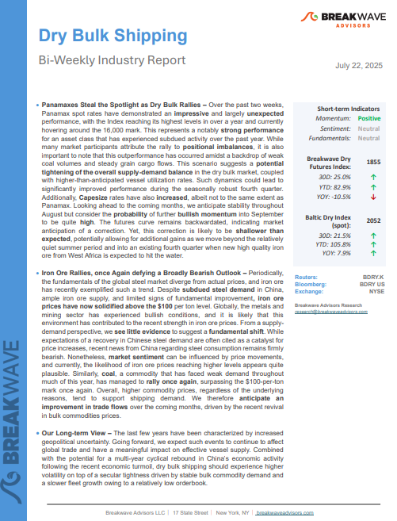
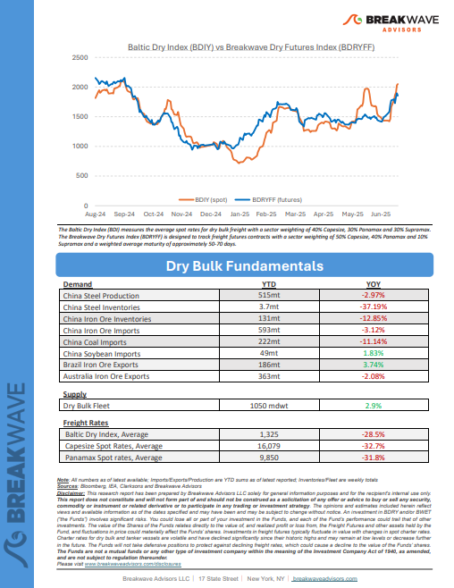
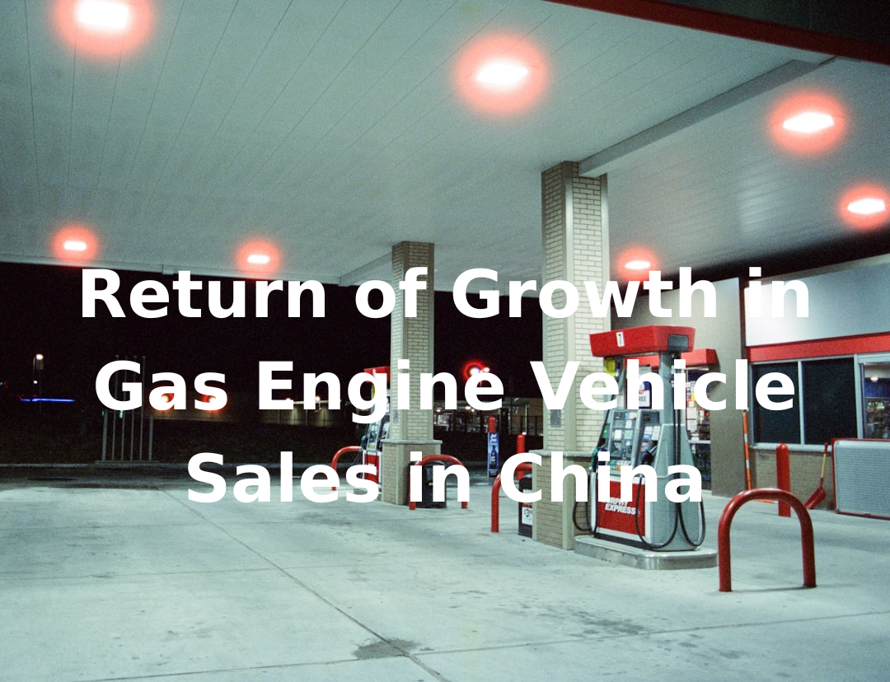

# Breakwave Weekend Read

**Date:** July 26, 2025  
**Publisher:** Breakwave Advisors | **Category:** Market Insights  
**Original URL:** [https://www.breakwaveadvisors.com/insights/2024/10/25/breakwave-weekend-read-547kk-rw7zy-awmfb-mf26k-dk29d-56ysb-x3jbe-xbwk9-dnpbr-n4n83](https://www.breakwaveadvisors.com/insights/2024/10/25/breakwave-weekend-read-547kk-rw7zy-awmfb-mf26k-dk29d-56ysb-x3jbe-xbwk9-dnpbr-n4n83)  

---

## Welcome Tobreakwave Advisorsweekend Read

***As the week comes to a close, take a moment to review the key insights from the past few days. Missed something? We've gathered all the top insights for you to catch up at your convenience.***

## Breakwave Shipping Report

**Panamaxes Steal the Spotlight as Dry Bulk Rallies**– Over the past two weeks, Panamax spot rates have demonstrated an**impressive**and largely**unexpected**performance, with the Index reaching its highest levels in over a year and currently hovering around the 16,000 mark.

[Read More](../pdfs/2025-07-26_breakwave-weekend-read-547kk-rw7zy-awmfb-mf26k-dk29d-56ysb-x3jbe-xbwk9-dnpbr-n4n_breakwavedryjuly222025report_101100e3e7a5.pdf)

> **Figure 1: Στιγμιότυπο Οθόνης 2025 07 23 115741**  
> **Interactive Data & Source:** [Breakwave Advisors Market Insights](https://www.breakwaveadvisors.com/insights/2025/7/21/chinas-economy-remains-on-track) | [Local Asset](file:///C:/Users/Dell/Github/Shipping/corpus/03-breakwave/insights/2025/assets/2025-07-26_breakwave-weekend-read-547kk-rw7zy-awmfb-mf26k-dk29d-56ysb-x3jbe-xbwk9-dnpbr-n4n_img_cea3cf84ceb9ceb3cebcceb9cf8ccf84cf85_6fbbe3578826.png)

> **Figure 2: Στιγμιότυπο Οθόνης 2025 07 23 115757**  
> **Interactive Data & Source:** [Breakwave Advisors Market Insights](https://www.breakwaveadvisors.com/insights/2025/7/21/chinas-economy-remains-on-track) | [Local Asset](file:///C:/Users/Dell/Github/Shipping/corpus/03-breakwave/insights/2025/assets/2025-07-26_breakwave-weekend-read-547kk-rw7zy-awmfb-mf26k-dk29d-56ysb-x3jbe-xbwk9-dnpbr-n4n_img_cea3cf84ceb9ceb3cebcceb9cf8ccf84cf85_679320035b51.png)

## China’s Economy Remains on Track

> **Figure 3: Ανώνυμο Σχέδιο**  
> **Interactive Data & Source:** [Breakwave Advisors Market Insights](https://www.breakwaveadvisors.com/insights/2025/7/21/chinas-economy-remains-on-track) | [Local Asset](file:///C:/Users/Dell/Github/Shipping/corpus/03-breakwave/insights/2025/assets/2025-07-26_breakwave-weekend-read-547kk-rw7zy-awmfb-mf26k-dk29d-56ysb-x3jbe-xbwk9-dnpbr-n4n_img_ce91cebdcf8ecebdcf85cebccebfcf83cf87_e652fa9b4250.png)

In 2002, an electronics shop on a dusty street in Hangzhou stood as a quiet witness to China’s accelerating transformation.

Doric Weekly Market Insights

## Return of Growth in Gas Engine Vehicle Sales in China

> **Figure 4: Ανώνυμο Σχέδιο (1)**  
> **Interactive Data & Source:** [Breakwave Advisors Market Insights](https://www.breakwaveadvisors.com/insights/2025/7/21/return-of-growth-in-gas-engine-vehicle-sales-in-china) | [Local Asset](file:///C:/Users/Dell/Github/Shipping/corpus/03-breakwave/insights/2025/assets/2025-07-26_breakwave-weekend-read-547kk-rw7zy-awmfb-mf26k-dk29d-56ysb-x3jbe-xbwk9-dnpbr-n4n_img_ce91cebdcf8ecebdcf85cebccebfcf83cf87_b92111a5b09b.png)

As we discussed in Commodore Research's most recent Weekly China Report, China’s crude oil imports increased on a year-on-year basis by 8% in June.

From Commodore's Weekly Dry Bulk Reports

## The Tiger Cubs Roar

> **Figure 5: Ανώνυμο Σχέδιο (2)**  
> **Interactive Data & Source:** [Breakwave Advisors Market Insights](https://www.breakwaveadvisors.com/insights/2025/7/21/the-tiger-cubs-roar) | [Local Asset](file:///C:/Users/Dell/Github/Shipping/corpus/03-breakwave/insights/2025/assets/2025-07-26_breakwave-weekend-read-547kk-rw7zy-awmfb-mf26k-dk29d-56ysb-x3jbe-xbwk9-dnpbr-n4n_img_ce91cebdcf8ecebdcf85cebccebfcf83cf87_aa9418795552.png)

In the past decade, oil demand has been defined by rapid growth in the Chinese economy, with the country responsible for 60% of global growth.

Gibson Tanker Market Report

## The Trade War Is Not a Shock. It Is a Slow Train.

> **Figure 6: The Trade War Is Not a Shock. It Is a Slow Train.**  
> **Interactive Data & Source:** [Breakwave Advisors Market Insights](https://www.breakwaveadvisors.com/insights/2025/7/22/the-trade-war-is-not-a-shock-it-is-a-slow-train) | [Local Asset](file:///C:/Users/Dell/Github/Shipping/corpus/03-breakwave/insights/2025/assets/2025-07-26_breakwave-weekend-read-547kk-rw7zy-awmfb-mf26k-dk29d-56ysb-x3jbe-xbwk9-dnpbr-n4n_img_thetradewarisnotashockitisaslowtrain_382ad8b95011.png)

Despite rising U.S. inflation and heightened trade tensions, markets remain stable—perhaps too stable.

Forvis Mazars Weekly Note

## Asia Diversifies Crude Sources in July Amid Geopolitical Flashpoints

> **Figure 7: Ανώνυμο Σχέδιο (3)**  
> **Interactive Data & Source:** [Breakwave Advisors Market Insights](https://www.breakwaveadvisors.com/insights/2025/7/22/asia-diversifies-crude-sources-in-july-amid-geopolitical-flashpoints) | [Local Asset](file:///C:/Users/Dell/Github/Shipping/corpus/03-breakwave/insights/2025/assets/2025-07-26_breakwave-weekend-read-547kk-rw7zy-awmfb-mf26k-dk29d-56ysb-x3jbe-xbwk9-dnpbr-n4n_img_ce91cebdcf8ecebdcf85cebccebfcf83cf87_de4b60771ee1.png)

China’s property sector remains entrenched in a deep correction in 2025, with no signs of near-term stabilization.

Vortexa Freight Weekly

## From Coal to Bauxite: Africa’s Growing Role in China’s Dry Bulk Supply Chain

> **Figure 8: Προσθέστε Επικεφαλίδα**  
> **Interactive Data & Source:** [Breakwave Advisors Market Insights](https://www.breakwaveadvisors.com/insights/2025/7/24/from-coal-to-bauxite-africas-growing-role-in-chinas-dry-bulk-supply-chain) | [Local Asset](file:///C:/Users/Dell/Github/Shipping/corpus/03-breakwave/insights/2025/assets/2025-07-26_breakwave-weekend-read-547kk-rw7zy-awmfb-mf26k-dk29d-56ysb-x3jbe-xbwk9-dnpbr-n4n_img_cea0cf81cebfcf83ceb8ceadcf83cf84ceb5_47a03c3e2364.png)

Allied Quantumsea’s latest research reviews how China’s shifting commodity demand, from coal to bauxite and high-grade iron ore, is elevating Africa’s role in dry bulk trade, with Guinea and South Africa at the center of the supply chain realignment.

Allied Weekly Report

## Spotlight on Brazilian Iron Ore Shipments to the Far East

> **Figure 9: Ανώνυμο Σχέδιο (4)**  
> **Interactive Data & Source:** [Breakwave Advisors Market Insights](https://www.breakwaveadvisors.com/insights/2025/7/24/spotlight-on-brazilian-iron-ore-shipments-to-the-far-east) | [Local Asset](file:///C:/Users/Dell/Github/Shipping/corpus/03-breakwave/insights/2025/assets/2025-07-26_breakwave-weekend-read-547kk-rw7zy-awmfb-mf26k-dk29d-56ysb-x3jbe-xbwk9-dnpbr-n4n_img_ce91cebdcf8ecebdcf85cebccebfcf83cf87_aa5f994e77a3.png)

This week’s Chart Monitor highlights a continued upward trend in Brazilian iron ore shipments. Since the end of Q1, each month's closing volume has exceeded levels seen in previous years.

Signal Ocean Dry Weekly Market Monitor

## Lower Consumption Growth in China, But Appliance Sales Set Record

> **Figure 10: Lower Consumption Growth in China, But Appliance Sales Set Record**  
> **Interactive Data & Source:** [Breakwave Advisors Market Insights](https://www.breakwaveadvisors.com/insights/2025/7/25/lower-consumption-growth-in-china-but-appliance-sales-set-record) | [Local Asset](file:///C:/Users/Dell/Github/Shipping/corpus/03-breakwave/insights/2025/assets/2025-07-26_breakwave-weekend-read-547kk-rw7zy-awmfb-mf26k-dk29d-56ysb-x3jbe-xbwk9-dnpbr-n4n_img_lowerconsumptiongrowthinchina2cbutap_d2b1417c6e0e.png)

As we discussed for clients in Commodore Research's most recent Weekly China Report, China’s retail sales in June grew year-on-year by 4.8% which has marked the lowest growth seen since February.

From Commodore's Weekly Dry Bulk Reports

## Supply Side Issues Resurface in Energy and Metal Markets

> **Figure 11: Ανώνυμο Σχέδιο (5)**  
> **Interactive Data & Source:** [Breakwave Advisors Market Insights](https://www.breakwaveadvisors.com/insights/2025/7/25/supply-side-issues-resurface-in-energy-and-metal-markets) | [Local Asset](file:///C:/Users/Dell/Github/Shipping/corpus/03-breakwave/insights/2025/assets/2025-07-26_breakwave-weekend-read-547kk-rw7zy-awmfb-mf26k-dk29d-56ysb-x3jbe-xbwk9-dnpbr-n4n_img_ce91cebdcf8ecebdcf85cebccebfcf83cf87_72a9f9a6423c.png)

Energy and metal markets struggled for direction amid conflicting supply side issues. A resilient US labour market weighed on sentiment in the gold market.

Commodities Wrap

---

**Tags:** Shipping, Tankers, Drybulk  
