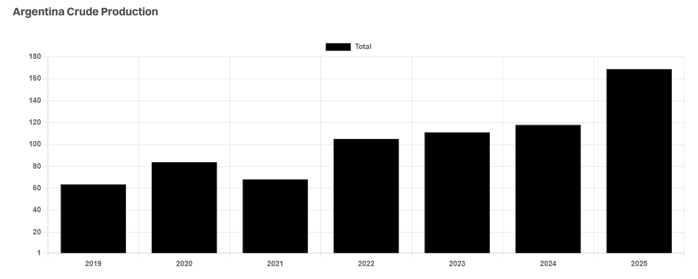

# Tankers learn to Tango

**Date:** July 28, 2025  
**Publisher:** Breakwave Advisors | **Category:** Market Insights  
**Original URL:** [https://www.breakwaveadvisors.com/insights/2025/7/28/tankers-learn-to-tango](https://www.breakwaveadvisors.com/insights/2025/7/28/tankers-learn-to-tango)  

---

> **Figure 1: Crude Tanker**  
> **Interactive Data & Source:** [Gibsons Co](https://www.gibsons.co.uk/report/cash-cow/) | [Local Asset](file:///C:/Users/Dell/Github/Shipping/corpus/03-breakwave/insights/2025/assets/2025-07-28_tankers-learn-to-tango_img_crude-tanker_fb6f869b3cec.jpg)

Argentina has turned into one of the biggest growth stories in oil production globally. Home to the world’s fourth largest shale oil reserves, the country has long struggled to properly exploit its resources. In recent years, rapid economic and fiscal reforms have enabled investment and production to take off. We covered this progress in our[**report**](https://www.gibsons.co.uk/report/cash-cow/)last year, at which point shale oil production stood at around 300 kbd. This year has seen production rise to 450 kbd, revealing the rapid pace of development taking place. Total oil production is expected to average 890 kbd in 2025, increasing steadily to 1.3 mbd by 2030, of which 900 kbd will be light tight oil, whilst conventional supply will decline over the same period.

Though Argentinian oil demand is projected to grow throughout the rest of the decade, production growth will outpace it by far, thus earmarking most of this new supply for export. So far this year, average crude exports have increased from 120 kbd to 170 kbd, with nearly half of these barrels carried on Aframaxes. Suezmax loadings are expected to rise in the second half of the year, as the Puerto Rosales crude oil loading facility is expanded to accommodate Suezmaxes. In fact, the port saw its first Suezmax cargo loaded this week, and further exports on Suezmaxes could pressure Aframax market share going forward. Currently, over half of seaborne exports are shipped to the USWC, with Honolulu and Long Beach the most prominent ports. Longer haul distances will become more economical as Suezmax capacity is expanded.

Late last year, YPF announced that the Vaca Muerta Norte pipeline was completed, enabling 160 kbd of shale oil to be transported to the Lujan de Cuyo refinery in Mendoza (105 kbd). It also connects to the Trans Andean (OTASA) pipeline, connecting Medanito grade crude to ENAP’s 116kbd Bío Bío refinery as well as the Pacific Ocean. In theory, this would allow Argentinian crude to be exported from San Vicente (Concepcion) to global markets, however, no cargoes have been exported to date.

In the longer term, the 600km Vaca Muerta Sur Pipeline connecting the Vaca Muerta shale field to Punta Colorada port in the Atlantic Basin is being constructed to help facilitate further increases in exports. Supported by a variety of major operators including YPF, Chevron, and Shell, nameplate capacity for the pipeline is set at 550 kbd, with already contracted capacity recently reported at 280 kbd. In late 2026, the first phase of the pipeline will be able to transport 180 kbd, expected to be ramped up to 550 kbd in 2027, with expansion to 700 kbd possible if necessary. Notably, the Punta Colorada loading terminal will be equipped with two single point moorings designed to accommodate VLCCs.

This rise in exports will need to find outlets in crude markets globally. With global demand growth projected to be centred in the East throughout the rest of the decade, this likely means most additional Argentinian supply is destined for long haul export. Moreover, the Atlantic Basin is facing oversupply when it comes to light oil grades, which may further complicate finding short haul outlets.

Overall, the country will grow to be a notable crude exporter by the end of the decade, providing welcome support to tonne mile demand for crude tankers. Currently around half of crude exports are carried on Aframaxes, which may see a significant shift to Suezmaxes in the near term. VLCCs will begin to take market share once the Punta Colorada loading terminal is upgraded to handle this vessel class from late 2026 onwards, if there are no delays.

> **Figure 2: Στιγμιότυπο Οθόνης 2025 07 28 121357**  
> **Interactive Data & Source:** [Gibsons Co](https://www.gibsons.co.uk/market-reports) | [Local Asset](file:///C:/Users/Dell/Github/Shipping/corpus/03-breakwave/insights/2025/assets/2025-07-28_tankers-learn-to-tango_img_cea3cf84ceb9ceb3cebcceb9cf8ccf84cf85_4e9a4b3670b1.png)

Data source:[Gibson Shipbrokers](https://www.gibsons.co.uk/market-reports)

---

**Tags:** Crude, Tankers, Markets  
