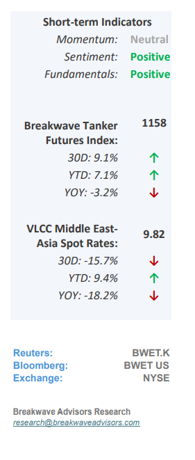
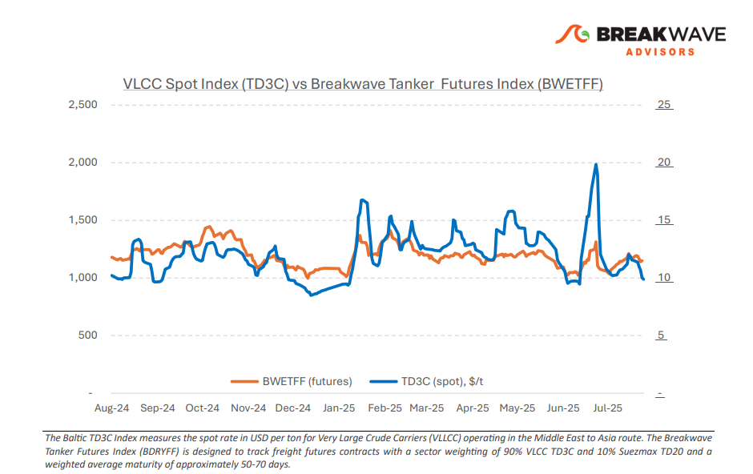
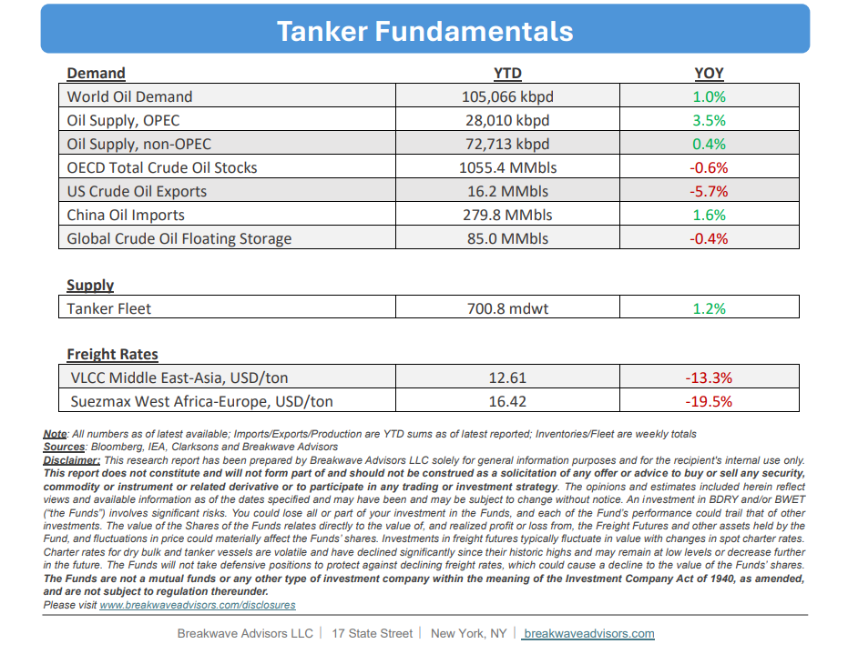

# Breakwave Bi-Weekly Tanker Report - July 29, 2025

**Date:** July 29, 2025  
**Publisher:** Breakwave Advisors | **Category:** Market Insights  
**Original URL:** [https://www.breakwaveadvisors.com/insights/2025729wetreport145-koi256](https://www.breakwaveadvisors.com/insights/2025729wetreport145-koi256)  

---

•**VLCC Mid-July Gains Reverse as Charterers Regain Control**– The VLCC freight market now seems to**have shifted back to a charterer-led environment**, reversing the modest gains seen in mid-July. Rates in both the Arabian Gulf (AG) and West Africa (WAF) have come under**renewed pressure**as charterers regain control by slowing down the pace of their inquiries for early August cargoes. This renewed cargo inquiry pressure, combined with ample vessel availability, has shifted the balance in**favor of freight buyers,**leading to lower rates and weaker sentiment across both basins. In the Arabian Gulf, the early-August fixing window was notably sluggish, allowing charterers to take their time while evaluating options. The**tonnage list remained lengthy**, leaving owners competing aggressively to secure limited opportunities. This oversupply has prevented any meaningful upward pressure on rates, despite the earlier optimism during the July upturn. West Africa mirrored the trends seen in the AG. Although mid-week saw a slight uptick in cargo inquiries, it lacked the follow-through necessary to tighten the market. The region continues to suffer from an**overhang of available VLCCs,**with little urgency from charterers to fix early. In summary, the VLCC market's short-lived mid-July recovery has given way to a renewed downturn, driven by plentiful tonnage and cautious chartering behavior. Unless there is a significant tightening in vessel availability or a sharp uptick in demand, freight rates in both the AG and WAF are likely to remain under pressure into early August.

> **Figure 1: Στιγμιότυπο Οθόνης 2025 07 28 235408**  
> [Local Asset](file:///C:/Users/Dell/Github/Shipping/corpus/03-breakwave/insights/2025/assets/2025-07-29_2025729wetreport145-koi256_img_cea3cf84ceb9ceb3cebcceb9cf8ccf84cf85_ebdbc552cb0d.png)

•**Oil Prices Under Renewed Pressure as OPEC+ Adds Barrels**– Recent weeks have been relatively uneventful for the oil markets, as geopolitical risks have subsided and**demand**projections remain**stable**. However, the addition of OPEC+ production to the market has made it**increasingly challenging**to identify a catalyst for a sustained increase in oil prices. Consequently,**Brent**crude has reverted to its familiar**$65–$70**per barrel**range**and has since maintained a relatively stable trajectory. While oil demand growth forecasts have slightly increased over the past few months, they continue to fall well below historical levels. Looking ahead, OPEC+ has**reaffirmed**its commitment to increasing production by**548,000 barrels per day**in August. We believe this move underscores the group’s strategic focus on regaining**market share**following years of disciplined output restraint. Nonetheless, with global demand growth appearing fragile, this increase in production risks tipping the market toward oversupply. Such a shift is now becoming a topic of discussion even among major industry players and could signal a**significant shift**in**OPEC+ strategy,**with substantial implications for the broader oil exploration and production landscape.

•**Our Long-term View**– The tanker market is recovering from a long period of staggered rates as the growth in new vessel supply shrinks while oil demand remains elevated in line with the global economy. A historically low orderbook combined with favorable shifting trade patterns should continue to support increased spot rate volatility, which combined with the ongoing geopolitical turmoil, should sustain freight rates in the medium to long term.

> **Figure 2: Στιγμιότυπο Οθόνης 2025 07 28 235420**  
> [Local Asset](file:///C:/Users/Dell/Github/Shipping/corpus/03-breakwave/insights/2025/assets/2025-07-29_2025729wetreport145-koi256_img_cea3cf84ceb9ceb3cebcceb9cf8ccf84cf85_7a374bd35e80.png)

> **Figure 3: Στιγμιότυπο Οθόνης 2025 07 28 235433**  
> [Local Asset](file:///C:/Users/Dell/Github/Shipping/corpus/03-breakwave/insights/2025/assets/2025-07-29_2025729wetreport145-koi256_img_cea3cf84ceb9ceb3cebcceb9cf8ccf84cf85_adcc1635a0e1.png)

### Subscribe:
