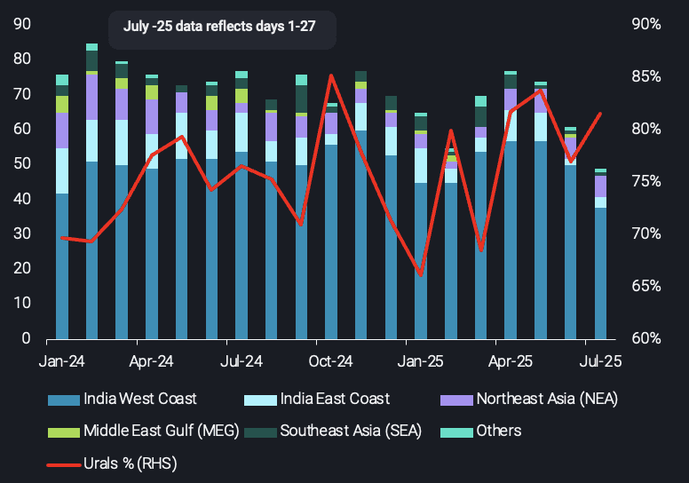
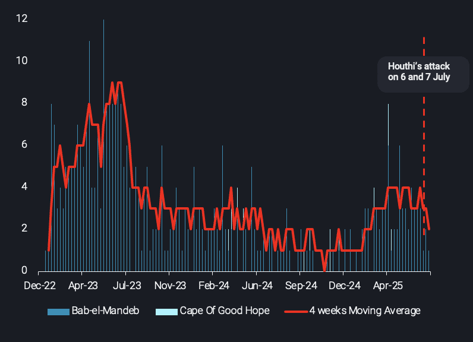

# Southbound Crude Transits via Bab-el-Mandeb Ease on Rising Security Risk

**Date:** July 31, 2025  
**Publisher:** Breakwave Advisors | **Category:** Market Insights  
**Original URL:** [https://www.breakwaveadvisors.com/insights/2025/7/31/southbound-crude-transits-via-bab-el-mandeb-ease-on-rising-security-risk](https://www.breakwaveadvisors.com/insights/2025/7/31/southbound-crude-transits-via-bab-el-mandeb-ease-on-rising-security-risk)  

---

July saw a dip in southbound crude transits via Bab-el-Mandeb as renewed Red Sea attacks, and growing compliance pressures prompted selective rerouting and owner caution.

*By*[*Wanying Zhang*](https://www.linkedin.com/in/wanying-zhang/)

### Renewed Attacks and Softer Demand Trim Bem Crude Flows

On 6 and 7 July, Houthi forces launched renewed attacks in the Red Sea, this time striking bulk carriers. While tankers were not directly impacted, the incidents have reignited security concerns among shipowners operating in the region—particularly those with exposure to Bab-el-Mandeb (BEM) transits. Southbound tanker transits via BEM (from Atlantic basin to Pacific) dropped to 49 vessels in July, down from 55 in the first 27 days of June. This marks the lowest monthly total since February.

Russian Urals continue to dominate southbound crude flows via Bab-el-Mandeb, accounting for an estimated 75% of volumes between January 2024 and July 2025. The majority of these cargoes discharge into India, with around 9% heading to China. However, Indian refiners have scaled back intake in recent weeks, driven by softer domestic demand and ahead of planned maintenance in August.

> **Figure 1: 241**  
> **Interactive Data & Source:** [Analytics Vortexa](https://analytics.vortexa.com/VoyagesFlows?dateRange=2024-01-01T00%3A00%3A00.000Z__2025-07-27T23%3A59%3A59.999Z&filtersEnabled=%5B%22v_v_st%22%2C%22v%22%2C%22l_c%22%2C%22o%22%2C%22d%22%2C%22d_r%22%2C%22v_or%22%2C%22v_de%22%2C%22dwt%22%2C%22v_i%22%2C%22v_cg_st%22%2C%22v_l_st%22%2C%22v_co_st%22%2C%22v_m_st%22%2C%22v_wt%22%2C%22v_c%22%2C%22l%22%2C%22v_o%22%2C%22intra_d%22%2C%22v_t%22%2C%22v_a%22%5D&from=%5B%2267be333ea46a3cd312e207b05e2c5c4502a9353e39ec81642a93e3b23cc3c10a%22%5D&latestProducts=%5B%2254af755a090118dcf9b0724c9a4e9f14745c26165385ffa7f1445bc768f06f11%22%5D&location=%5B%2234810d4a19fdf3d1de110ee44732bc8671179c28426b6a29f8585fed8bffec35%22%2C%22d10056e8bf4109ebf0370c511953f046ff75552b3dc6ed788fcb4d5ea6b71d3f%22%5D&metric=t&page=VoyagesFlows&tabId=35c33f02-21ca-4ecc-9554-a72055e20a3c&timeSeriesBreakdown=location-waypoint&to=%5B%22715b6aab56723cb55c3ddbdc12a2851b379919010f119cf98765d4debbdb793d%22%5D&toExcluded=%5B%22bccc82037cc13217d1b05bdbf1e8cea8ef6858b7ed20e9c33e957ec348694e40%22%5D&tsAnalysisSeasonalEnabled=0&vessels=%5B%22pv-2e8f5f22-d8be-4baf-a96a-0517ae91adb2%22%5D&voyageDateRangeActivity=waypoint&voyageStatus=%5B%22laden%22%5D) | [Local Asset](file:///C:/Users/Dell/Github/Shipping/corpus/03-breakwave/insights/2025/assets/2025-07-31_southbound-crude-transits-via-bab-el-mandeb-ease-on-rising-security-risk_img_241_69bdb6f9d28b.png)

[Monthly southbound crude voyages from Atlantic basin split by destination shipping region](https://analytics.vortexa.com/VoyagesFlows?dateRange=2024-01-01T00%3A00%3A00.000Z__2025-07-27T23%3A59%3A59.999Z&filtersEnabled=%5B%22v_v_st%22%2C%22v%22%2C%22l_c%22%2C%22o%22%2C%22d%22%2C%22d_r%22%2C%22v_or%22%2C%22v_de%22%2C%22dwt%22%2C%22v_i%22%2C%22v_cg_st%22%2C%22v_l_st%22%2C%22v_co_st%22%2C%22v_m_st%22%2C%22v_wt%22%2C%22v_c%22%2C%22l%22%2C%22v_o%22%2C%22intra_d%22%2C%22v_t%22%2C%22v_a%22%5D&from=%5B%2267be333ea46a3cd312e207b05e2c5c4502a9353e39ec81642a93e3b23cc3c10a%22%5D&latestProducts=%5B%2254af755a090118dcf9b0724c9a4e9f14745c26165385ffa7f1445bc768f06f11%22%5D&location=%5B%2234810d4a19fdf3d1de110ee44732bc8671179c28426b6a29f8585fed8bffec35%22%2C%22d10056e8bf4109ebf0370c511953f046ff75552b3dc6ed788fcb4d5ea6b71d3f%22%5D&metric=t&page=VoyagesFlows&tabId=35c33f02-21ca-4ecc-9554-a72055e20a3c&timeSeriesBreakdown=location-waypoint&to=%5B%22715b6aab56723cb55c3ddbdc12a2851b379919010f119cf98765d4debbdb793d%22%5D&toExcluded=%5B%22bccc82037cc13217d1b05bdbf1e8cea8ef6858b7ed20e9c33e957ec348694e40%22%5D&tsAnalysisSeasonalEnabled=0&vessels=%5B%22pv-2e8f5f22-d8be-4baf-a96a-0517ae91adb2%22%5D&voyageDateRangeActivity=waypoint&voyageStatus=%5B%22laden%22%5D)(no. of voyages, LHS) and[Urals](https://analytics.vortexa.com/VoyagesFlows?dateRange=2024-01-01T00%3A00%3A00.000Z__2025-07-27T23%3A59%3A59.999Z&filtersEnabled=%5B%22v_v_st%22%2C%22v%22%2C%22l_c%22%2C%22o%22%2C%22d%22%2C%22d_r%22%2C%22v_or%22%2C%22v_de%22%2C%22dwt%22%2C%22v_i%22%2C%22v_cg_st%22%2C%22v_l_st%22%2C%22v_co_st%22%2C%22v_m_st%22%2C%22v_wt%22%2C%22v_c%22%2C%22l%22%2C%22v_o%22%2C%22intra_d%22%2C%22v_t%22%2C%22v_a%22%5D&from=%5B%2267be333ea46a3cd312e207b05e2c5c4502a9353e39ec81642a93e3b23cc3c10a%22%5D&latestProducts=%5B%2254af755a090118dcf9b0724c9a4e9f14745c26165385ffa7f1445bc768f06f11%22%5D&location=%5B%2234810d4a19fdf3d1de110ee44732bc8671179c28426b6a29f8585fed8bffec35%22%2C%22d10056e8bf4109ebf0370c511953f046ff75552b3dc6ed788fcb4d5ea6b71d3f%22%5D&metric=t&page=VoyagesFlows&tabId=35c33f02-21ca-4ecc-9554-a72055e20a3c&timeSeriesBreakdown=product-grade&to=%5B%22715b6aab56723cb55c3ddbdc12a2851b379919010f119cf98765d4debbdb793d%22%5D&toExcluded=%5B%22bccc82037cc13217d1b05bdbf1e8cea8ef6858b7ed20e9c33e957ec348694e40%22%5D&tsAnalysisSeasonalEnabled=0&vessels=%5B%22pv-2e8f5f22-d8be-4baf-a96a-0517ae91adb2%22%5D&voyageDateRangeActivity=waypoint&voyageStatus=%5B%22laden%22%5D)(%, RHS)

The cost of transiting BEM has also risen sharply, with Additional War Risk Premiums (AWRP) now around 0.7% of hull & machinery, up from 0.25–0.4% earlier this year, according to Argus. Many owners still prefer BEM for its shorter routing, but recent diversions reflect a widening gap in risk appetite, with some now opting for longer, safer alternatives.

Amid heightened threat perception,[one laden Suezmax](https://analytics.vortexa.com/Map?metric=t&page=Map&tabId=f8cb7786-6d2a-492f-8270-af6bc1b32246&v=3&vessels=%5B%22f3b21592b05551d413a77a5db70c7f842928185543afccafed7ac58f9461092d%22%5D)diverted via the longer Cape of Good Hope route in mid-July, despite having previously transited BEM on similar voyages.[Two additional Suezmaxes](https://analytics.vortexa.com/Map?metric=t&page=Map&tabId=f4d6f4a9-735f-44cd-b21c-cc549530aff1&v=3&vessels=%5B%22d7ab13b3dcd2bf2ab343aef3a43fdf7c6e3d20a4ab94a623a0b8eeb2aa6e3f85%22%2C%229d118e275f3d0bec407eeb184fed94c247ca33c4d27e052de4e35ec7c8dded7a%22%5D), both laden on their northbound return to Europe, also opted for the Cape of Good Hope route. This reflects a pattern of selective repositioning, as certain owners seek to mitigate exposure amid heightened geopolitical risk.

While these diversions may seem isolated, several other vessels have been consistently taking the Cape route, with some last transiting BEM more than a year ago. This suggests the routing reflects a longer-standing operational choice, rather than a direct response to the latest attacks.

> **Figure 2: 242**  
> **Interactive Data & Source:** [Analytics Vortexa](https://analytics.vortexa.com/InsightsHubPage?articleId=6lsSyOqxM3FQT78zkEScx5&articleType=Highlight&authorFilters=%5B%226fgSz5JGNPjH4xUKVxverr%22%5D&page=InsightsHubPage&searchTerm=&tabId=ad8f998c-9243-4d7a-bd1c-afa49a881c7e) | [Local Asset](file:///C:/Users/Dell/Github/Shipping/corpus/03-breakwave/insights/2025/assets/2025-07-31_southbound-crude-transits-via-bab-el-mandeb-ease-on-rising-security-risk_img_242_dfb960a0f75a.png)

Weekly southbound voyages carrying Russian crude via waypoint entry

### Strategic Pullback in Greek Participation

Weekly voyage counts by Greek operators in moving Russian crude via BEM peaked in Q2 2023—coinciding with a period when Urals was trading below the G7 price cap. A similar uptick occurred in January 2025, when prices once again fell below the cap and a new wave of OFAC sanctions was introduced.

Since mid-2023, however, this participation has been on a gradual decline. Three weeks on from the July attacks, southbound transits via BEM have continued, with only a handful of diversions recorded so far. Should the attack resume,[up to 20% of the fleet with prior links to Israel](https://analytics.vortexa.com/InsightsHubPage?articleId=6lsSyOqxM3FQT78zkEScx5&articleType=Highlight&authorFilters=%5B%226fgSz5JGNPjH4xUKVxverr%22%5D&page=InsightsHubPage&searchTerm=&tabId=ad8f998c-9243-4d7a-bd1c-afa49a881c7e)may opt for rerouting. This could create additional logistical hurdles especially for Russian flows.

### Bem Corridor Open, But Confidence Fading

Bab-el-Mandeb remains the main conduit for southbound crude flows, with overall transit volumes holding steady. The recent dip in flows is primarily a function of weaker Indian demand, driven by seasonal refinery maintenance in the short-term future could come due to a reduction in purchases by private refiners such as Nayara Energy. This comes against the backdrop of the EU’s latest sanctions package targeting Russian crude, which reportedly has disrupted discharge activity into Nayara’s terminal.

While the majority of tankers continue to favour BEM, the diversions recorded in July point to a shift in behaviour among a subset of owners—particularly those with prior exposure to Israel or heightened regulatory scrutiny. While not yet widespread, these shifts point to a potential growing divergence in routing strategies, as some operators take a more conservative stance amid evolving geopolitical and regulatory pressures.

Data Source:[Vortexa](https://www.vortexa.com//oil-gas-data-traders-analysts-data-scientists?gclid=Cj0KCQjw8_qRBhCXARIsAE2AtRZKOvMnbilZ_6_91d7huSFFy71pWLrnPwGwOHVzXsmsG-1a1mZnQw8aAt89EALw_wcB&hsa_acc=1782073842&hsa_ad=548425387665&hsa_cam=14746637662&hsa_grp=125038601902&hsa_kw=&hsa_mt=&hsa_net=adwords&hsa_src=g&hsa_tgt=dsa-1431852288425&hsa_ver=3&utm_campaign=%5BCD%5D%20-%20DSA%20-%20EMEA&utm_medium=cpc&utm_medium=ppc&utm_source=google&utm_source=adwords&utm_term=)

---

**Tags:** Crude, Markets, Tankers  
