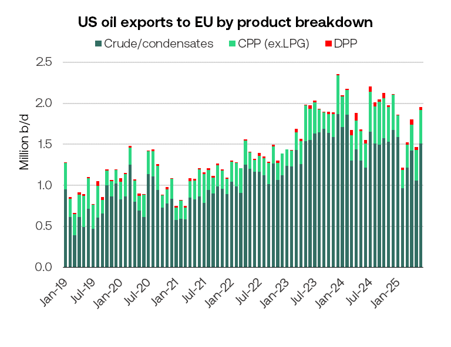
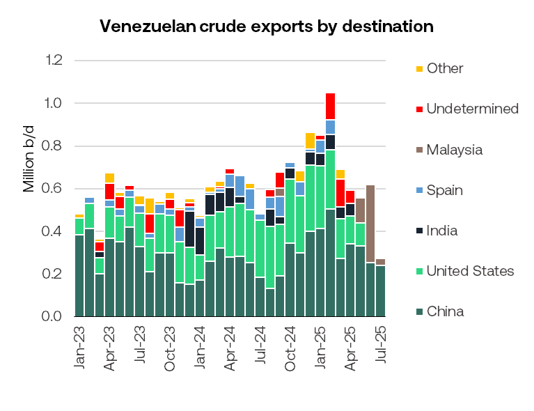

# Tankers Research Update

**Date:** July 31, 2025  
**Publisher:** Breakwave Advisors | **Category:** Market Insights  
**Original URL:** [https://www.breakwaveadvisors.com/insights/2025/7/31/tankers-research-update](https://www.breakwaveadvisors.com/insights/2025/7/31/tankers-research-update)  

---

### Eu/us Trade Deal – Can Europe Really Lift Us Energy Imports to $250bn/year?

- Brent has gained over $6/bbl since Friday as Trump’s trade deal with Europe and more aggressive stance on Russia raise fears of oil supply shortages.
- As the long-awaited US-EU trade agreement last week settled on a 15% US import tariff on most EU goods, excluding steel and aluminium, which will remain at 50%. The import tariff on autos and auto parts was cut to 15%, down from 25 – 27.5%. As part of the deal, the EU agreed to purchase $250bn/year of US energy exports (crude, refined products, LNG, and Coal) over three years. For context, total EU-27 purchases of US oil, LNG, LPG, and Coal in 2024 were roughly $80.5bn. The EU has also committed to an additional $600bn in foreign direct investment into the United States.
- $250 bn/year would represent a more than three-fold increase in EU imports of US energy compared to 2024’s roughly $80bn - $50 bn of which was crude oil and refined products.
- It is unclear, however, how European governments will influence the oil purchasing decision of Europe’s privately-owned refineries. The bloc can replace what remains of Russia’s oil flows into the bloc (roughly 210k b/d into Hungary and Slovakia) with US crude, but refiners would prefer to take medium sour crude. Replacing those remaining Russian barrels could, in theory, be achieved by diverting around 20% of today’s long-haul US/Asia flows to Europe. Since Russia declared war on Ukraine, the US has stepped in to replace the lion’s share of Russian barrels in Europe, both for crude oil and refined products. In 2024, the EU accounted for 28% of total US oil exports and 39% of its crude exports.
- Thus far this year, EU-27 imports of US oil are roughly 13% down on 2024 levels. In June this year, the EU imported 1.17m b/d of US crude/condensates, 411k b/d of US clean products (excluding LPG but including chems, lubes and biofuels) and 34k b/d of US dirty refined products. This equates to 13% of the EU’s total crude/condensate imports from outside the bloc, 9.5% of its clean petroleum product imports and 6% of its dirty refined products.

> **Figure 1: 241**  
> [Local Asset](file:///C:/Users/Dell/Github/Shipping/corpus/03-breakwave/insights/2025/assets/2025-07-31_tankers-research-update_img_241_f832c054cd90.png)

- Since Russia invaded Ukraine, Europe has sharply increased US crude imports, rising by nearly 500k b/d from pre-war, reaching around 1.5m b/d in 2024—roughly 20% of total crude imports, with Northwest Europe as the primary recipient.

- However, challenges remain due to the mismatch in crude quality – US WTI Midland, a light sweet grade, does not match the refining needs for middle distillates (diesel, jet fuel) previously met by Russian Urals (medium sour). The EU also lacks centralised energy procurement, limiting its ability to compel higher US crude usage among private refiners. Refining capacity is shrinking where Europe faces refinery closures, with 900k b/d in shutdowns projected for 2025 in Europe and North America. This pushes Europe further toward fuel imports, especially for middle distillates. As Russian product bans tighten in 2026, the refined fuel deficit in Europe is expected to widen, while US refiners—geared toward gasoline—may not be able to fill the gap.

### Will Trump Really Impose Secondary Tariffs on Importers of Russian Oil in Just Over a Week’s Time?

- On Friday, Trump brought forward his threat to slap 100% tariffs on buyers of Russian oil – notably India, China and Turkey from September 2 to August 7-9. Just today, Trump announced the US will levy 25% tariffs on imports from India from August 1. Putin can avoid the tariffs by negotiating a peace deal with Ukraine. Alternatively, he can ignore the threat, believing that Trump has more to lose from the resulting high oil prices and inevitable political backlash.
- For crude oil, this would most acutely impact China (1.03m b/d of Russian crude imports in June), India (1.46m b/d) and Turkey (370k b/d). Together, the three countries have accounted for over 90% of Russia’s crude exports of 3.23m b/d so far in 2025.
- For clean products excluding LPG, this would notably impact Turkey (which received 386k b/d of Russian product exports in June - representing 22% of Russia’s total refined product exports).
- If secondary sanctions are enacted, India – currently Russia’s top seaborne crude buyer– would be forced to pay more for Middle Eastern barrels to avoid jeopardising its broader trade ties with Washington.
- China would perhaps be less likely to alter buying patterns, as they are already facing several layers of US tariffs and considers its relations with Russia to be strategic. China imported around 2m b/d of Russian crude in June, according to Platts, 1.03m b/d of which was seaborne (Vortexa).
- As Russia exports the equivalent of around 4.5% of global oil demand, the imposition of secondary sanctions would doubtless inflate oil prices. The reversal of OPEC+ voluntary output cuts in recent months has boosted oil supply, but global oil stocks are still below long-term averages. Saudi Arabia could theoretically bring online an extra 2.3m b/d within 90 days or so, and the UAE and Kuwait could probably add another 900kb/d and 600k b/d, respectively. But this would likely fall well short of lost Russian exports. As Russia relies on oil and gas revenues for approximately 30%-50% of its federal budget in recent years, Putin would be unlikely to respond forcefully to any move to restrict its exports.

### Us Allows Chevron to Restart Pumping Venezuelan Oil

- The United States has reinstated Chevron’s license to resume crude oil production and exports from Venezuela. On July 25, Trump reversed a two-month-old decision that had halted one of the last remaining legal crude flows out of the sanctions-hit country. The move is part of a broader political détente between Washington and Caracas.
- The revised authorisation was structured to ensure that no royalties or taxes from Chevron’s joint ventures will directly benefit the Maduro regime. Chevron’s operations in Venezuela — primarily conducted through joint ventures with state oil company PDVSA — were producing over 240k b/d in May before the ban - representing around one quarter of national output.
- The timeline for ramp-up of Chevron’s production will depend on political sensitivities, operational maintenance lags, and an opaque revenue-sharing framework with PDVSA.
- With the US driving season nearing its end and domestic refineries preparing for seasonal maintenance, near-term appetite for Venezuelan Merey crude — a heavy sour blend favoured by Gulf Coast refiners — may be limited. Chevron are likely to resume steady liftings in Q4.
- In 2024, the US imported approximately 242k b/d of Venezuelan crude — equivalent to around 10 Aframax cargoes — primarily through Chevron-linked loadings under prior OFAC exemptions. These Venezuelan flows to the US Gulf have historically provided steady employment for Aframax tankers, mostly on time-charter contracts. Recently, several Chevron-chartered Aframaxes had been unexpectedly redelivered into the West Aframax market after completing Venezuelan crude voyages. With Chevron now permitted to resume crude production and exports from Venezuela, these Aframaxes are expected to return to their previous role, shuttling Venezuelan barrels to the US Gulf.
- With Chevron seen as a strategic counterweight to growing Chinese influence over Venezuela’s remaining oil exports, the reinstatement may be aimed at reasserting Western commercial presence in a region otherwise dominated by opaque STS operations, shadow tankers, and Chinese trading entities.
- Still, structural uncertainties remain. PDVSA had previously demanded that Chevron return a cargo of nearly 1 million barrels due to unresolved issues over non-payment.

> **Figure 2: 242**  
> [Local Asset](file:///C:/Users/Dell/Github/Shipping/corpus/03-breakwave/insights/2025/assets/2025-07-31_tankers-research-update_img_242_47de13579c37.png)

### Small Shandong Refiners Restart Under New Ownership, Threatening Overcapacity and Margins

- A number of bankrupt small-scale independent refiners in China’s Shandong province are resuming operations under new ownership.
- Shandong Changyi Petrochemical, formerly operated by Sinochem, was declared bankrupt in Q3 2024 amid persistently poor refining margins and sluggish domestic demand. It has since been acquired by Weifang Hongrun Petrochemical Co. and restarted operations at the end of June.
- Bankrupt refiners Zhenghe Group and Shandong Huaxing Petrochemical Co. are in talks with potential investors, according to Bloomberg.
- All three refineries are seeking government crude import quotas, which could boost crude imports by up to 300k b/d.
- China’s total crude imports reached 10.7m b/d in June, with Shandong’s independent refiners accounting for around 3.48m b/d, according to Vortexa.
- The return of these smaller refiners postpones Beijing’s efforts to rationalise the sector. While the central government continues to push back against inefficient capacity, local authorities in Shandong remain supportive of its independent refining sector - viewing them as key engines of regional economic activity.
- Six local refiners have recently received enhanced tax rebates from local authorities on fuel oil imports, part of a broader effort to improve margins.

---

**Tags:** Tankers, Crude, Shipping  
