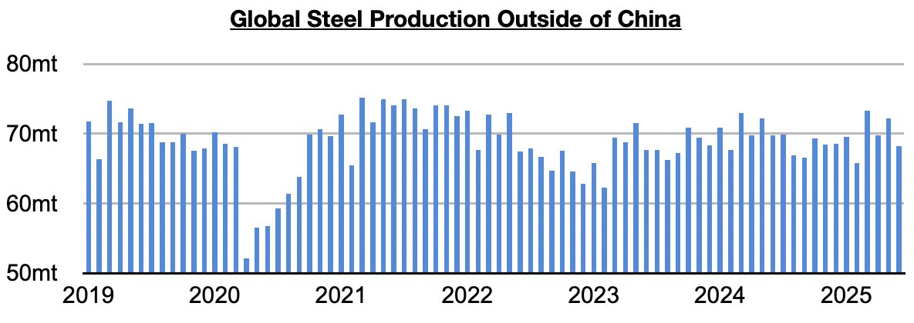
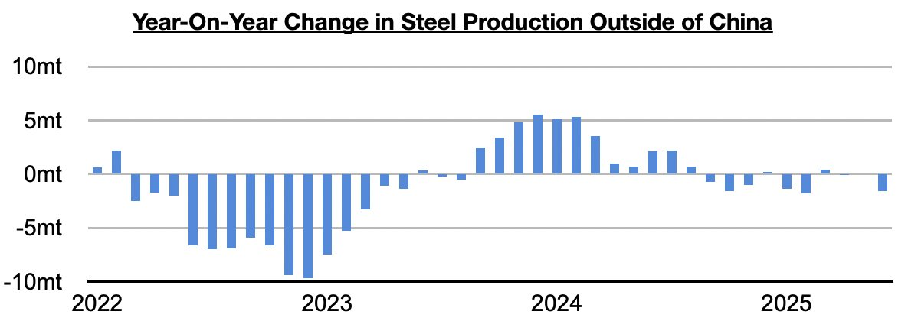
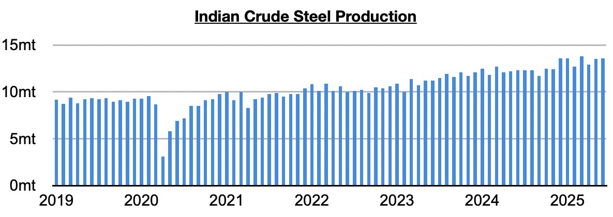

# India Buoying Global Steel Production

**Date:** August 02, 2025  
**Publisher:** Breakwave Advisors | **Category:** Market Insights  
**Original URL:** [https://www.breakwaveadvisors.com/insights/2025/8/2/india-buoying-global-steel-production](https://www.breakwaveadvisors.com/insights/2025/8/2/india-buoying-global-steel-production)  

---

*By*[*Jeffrey Landsberg*](https://www.linkedin.com/in/jeffrey-landsberg-70ab957/)

The most recently released data shows that global steel production totaled approximately 151.4 million tons in June. This is down month-on-month by 7.4 million tons (-4%) and is down year-on-year by 10 million tons (-6%). Steel production outside of China totaled approximately 68.2 million tons last month. This is down month-on-month by 4 million tons (-6%) and is down year-on-year by 1.7 million tons (-2%).

> **Figure 1: 241**  
> [Local Asset](file:///C:/Users/Dell/Github/Shipping/corpus/03-breakwave/insights/2025/assets/2025-08-02_india-buoying-global-steel-production_img_241_b10039271283.jpg)

Steel production ex-China has now either contracted on a year-on-year basis or has been flat during eight of the last ten months. However, taking India out of the equation, it has contracted on a year-on-year basis during all ten of these months.

> **Figure 2: 242**  
> [Local Asset](file:///C:/Users/Dell/Github/Shipping/corpus/03-breakwave/insights/2025/assets/2025-08-02_india-buoying-global-steel-production_img_242_c02248ffec99.jpg)

India’s steel production has remained quite strong. Indian steel production totaled 13.6 million tons in June. This is up month-on-month by 100,000 tons (1%) and is up year-on-year by 1.3 million tons (11%). India’s steel production has now grown for twenty-eight straight months.

> **Figure 3: 243**  
> [Local Asset](file:///C:/Users/Dell/Github/Shipping/corpus/03-breakwave/insights/2025/assets/2025-08-02_india-buoying-global-steel-production_img_243_4567f13ca5b7.jpg)

---

**Tags:** China, India, Steel  
