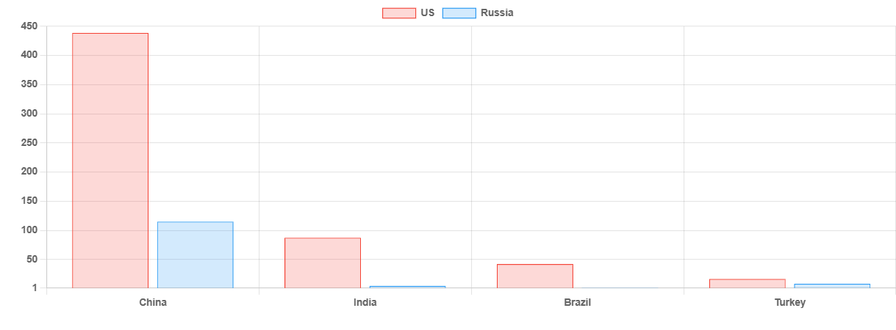

# Choosing a side

**Date:** August 03, 2025  
**Publisher:** Breakwave Advisors | **Category:** Market Insights  
**Original URL:** [https://www.breakwaveadvisors.com/insights/2025/8/3/choosing-a-side](https://www.breakwaveadvisors.com/insights/2025/8/3/choosing-a-side)  

---

> **Figure 1: 242**  
> **Interactive Data & Source:** [Gibsons Co](https://www.gibsons.co.uk/market-reports) | [Local Asset](file:///C:/Users/Dell/Github/Shipping/corpus/03-breakwave/insights/2025/assets/2025-08-03_choosing-a-side_img_242_2b501372fef3.jpg)

Throughout the war in Ukraine, key buyers of Russian commodities such as India, China, Turkey and Brazil have managed to walk a tightrope between the US, EU and Russia. These countries have benefitted from discounted Russian energy and undisrupted trade to the US and EU over the past three years. However, now that dynamic is changing. The EU recently finalised its 18th sanctions package, which subject to final details, will bar the import of refined products made from Russian oil from 2026 onwards and now President Trump is also upping the pressure.

Two weeks ago, Trump appeared to change his stance towards his old “friend” Vladimir Putin, signalling that the Trump-Putin bromance might endure the same fate as Elon Musk. Initially he gave Putin 50 days to reach a deal to end the war, cutting it to just 10 days earlier this week. If Trump follows through, then by the 8th of August (1 week from now), Russian oil exports could start to come under heavy pressure. Reuters reported yesterday that state owned Indian refiners were already taking steps to reduce their Russian intake.

As is often the case, specific details are lacking but the strategy to pressure Russian exports lower appears to be focused on the use of “secondary tariffs”. Such tariffs would involve placing levies on exports to the US from buyers of Russian oil. In theory, this would mean that if India, China, Turkey and Brazil (among others) continued to buy Russian barrels, they would face 100% tariffs on trade to the US, forcing these countries to choose between the US and Russia. How this would be enforced and what exceptions might be remains to be seen, but in theory it could create significant upheaval in both Russian and mainstream oil trade.

The value of goods exported from China, India, Brazil and Turkey to the United States far outweighs the value exported to Russia, meaning that if Trump really does impose such secondary tariffs, these countries might be forced to at least partially appease the US. Nevertheless, it remains difficult to envisage China bowing to US pressure and reducing Russian imports significantly. Buyers and sellers are likely to find ways to circumvent the new rules and may increasingly go dark with their trading practices to ensure cargoes find a way to the market.

India, which also remains bogged down in trade negotiations with the US, is possibly the biggest swing factor for the crude tanker market. With EU plans to ban imports of products refined from Russian oil from January and the recent sanctioning of a Nayara Energy, the country’s refiners were already having to reconsider their crude procurement strategy. Now, with US pressure also ramping up, refiners could soon be forced to return to alternative markets in West Africa, the Americas and Middle East; all of which would benefit mainstream tanker owners. Turkey, which also faces similar challenges and given its interdependence on the EU and trade with the US, would also likely be forced to side with the West. Brazil, and other smaller importers of Russian clean products might have more flexibility but will still be wary of upsetting the US President, particularly when it comes to companies with an international presence.

Given the scale of Russian exports, the diversity of buyers on the products side and strong footholds gained in China and India, it is difficult to envisage a collapse in Russian exports to these countries. However, if Trump is committed to ending the war and follows through on his “secondary” tariff plan, then renewed volatility in the tanker market can be expected until a new status quo is found.

> **Figure 2: 241**  
> **Interactive Data & Source:** [Gibsons Co](https://www.gibsons.co.uk/market-reports) | [Local Asset](file:///C:/Users/Dell/Github/Shipping/corpus/03-breakwave/insights/2025/assets/2025-08-03_choosing-a-side_img_241_6622b8d24bba.png)

Data source:[Gibson Shipbrokers](https://www.gibsons.co.uk/market-reports)

---

**Tags:** Crude, Tankers, Markets  
