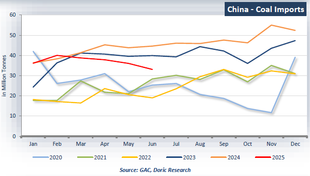
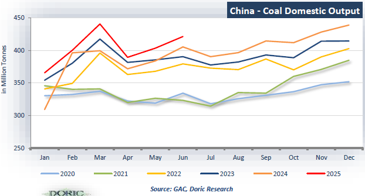

# China - Coal

**Date:** August 04, 2025  
**Publisher:** Breakwave Advisors | **Category:** Market Insights  
**Original URL:** [https://www.breakwaveadvisors.com/insights/2025/8/4/china-coal](https://www.breakwaveadvisors.com/insights/2025/8/4/china-coal)  

---

*By*[*Michalis Voutsinas*](https://www.linkedin.com/in/michalis-voutsinas-587544163/)

> **Figure 1: Screenshot 2025 08 04 09.49.33**  
> **Interactive Data & Source:** [Doric](https://www.doric.gr/) | [Local Asset](file:///C:/Users/Dell/Github/Shipping/corpus/03-breakwave/insights/2025/assets/2025-08-04_china-coal_img_screenshot2025-08-04094933_bb9776613370.png)

• China’s coal imports slumped to 33.04 million tonnes in June, the lowest monthly total since February 2023 marking a sharp 25.9% year on year decline and an 8.3% drop from May.

• Cumulatively, seaborne coal arrivals over the first half fell to 221.7 million tonnes, down 11.1% compared to the same period last year, signalling a structural downturn in import demand.

• The contraction in total imports was further compounded by a steep 30.0% year on year fall in volumes from Indonesia while Russian coal shipments dropped 19.7% over the same period.

> **Figure 2: Screenshot 2025 08 04 09.49.39**  
> **Interactive Data & Source:** [Doric](https://www.doric.gr/) | [Local Asset](file:///C:/Users/Dell/Github/Shipping/corpus/03-breakwave/insights/2025/assets/2025-08-04_china-coal_img_screenshot2025-08-04094939_4e5b85320850.png)

• China’s coal market continues to undergo a significant realignment, driven by record high domestic production and reduced coal fired power generation. Following a historic surge in imports that surpassed 500 million tonnes in 2024, weaker demand has set in since early 2025.

• Domestic raw coal output rose 3.0% year on year in June to 421.0 million tonnes further exacerbating the oversupply.

• For the January-June period, production climbed 6.8% on the year to 2.49 billion tonnes.

Data source:[Doric](https://www.doric.gr/)

---

**Tags:** China, Coal, Shipping  
