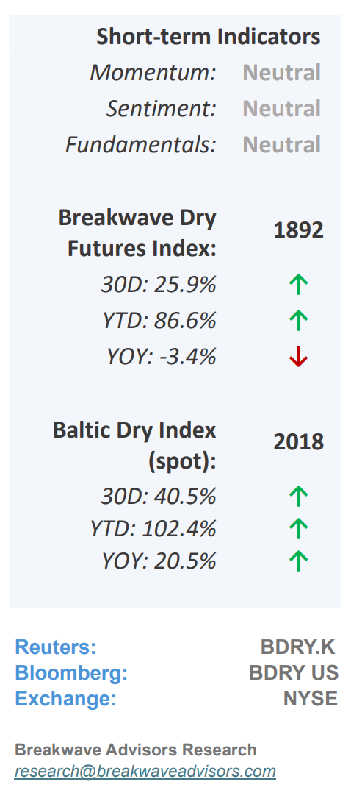
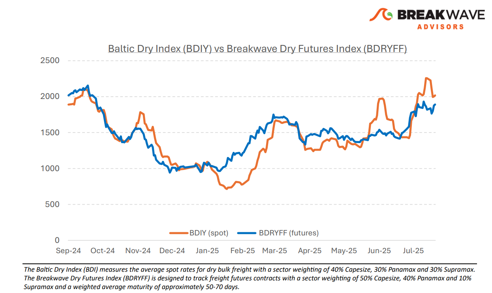
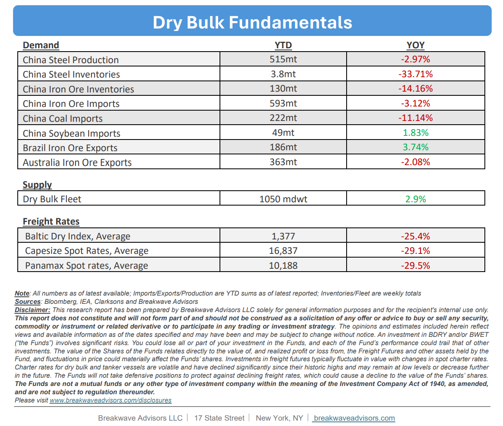

# Breakwave Bi-Weekly Dry Bulk Report - August 5, 2025

**Date:** August 05, 2025  
**Publisher:** Breakwave Advisors | **Category:** Market Insights  
**Original URL:** [https://www.breakwaveadvisors.com/insights/202585db](https://www.breakwaveadvisors.com/insights/202585db)  

---

•**Panamaxes Spot rates Ease, as Capesizes Find a Higher Level –**Despite some moderation in broader dry bulk market balances,**spot rates across sectors remain elevated**compared to last month. While Panamax rates are gradually declining,**Capesize**rates continue to be robust, remaining in the high 20,000 range, marking the**highest levels in ten years**(excluding 2021) for this time of the year. This development is somewhat**surprising and unexpected**, given the prevailing economic outlook and the global geopolitical risks that have negatively impacted other commodities markets. Although there is**regional tightness**in certain local markets, the overall dry bulk sector is experiencing a brief revival during a typically weak period. Looking ahead, we anticipate a degree of market stability and potential easing in spot rates, though a**complete collapse is unlikely**. Futures remain relatively steady, slightly backwardated relative to spot rates, as the recent steep rally appears unsustainable according to most market participants. As we move beyond the summer months and**improved weather conditions return to West Africa**, where heavy rains during the past weekend turned deadly in Guinea, demand from that region, combined with Brazilian iron ore exports, is expected to provide**further support to the Capesize**segment. Overall, concerns regarding a potential demand slowdown from China do not currently appear to impact export demand for iron ore and bauxite, which remains resilient. Consequently, we continue to view the**current market conditions as favorable**for the broader dry bulk sector.

> **Figure 1: Indicators**  
> [Local Asset](file:///C:/Users/Dell/Github/Shipping/corpus/03-breakwave/insights/2025/assets/2025-08-05_202585db_img_indicators_ac4d279e3bf5.png)

•**Iron Ore Price Stabilize Around $100 per Ton –**Last week’s rally in the metals market had a favorable impact on**iron ore**, with**prices**exceeding the**$100 per ton**threshold once again. Although most metals markets subsequently experienced a significant correction,**iron ore remained resilient**and continues to hover around the $100 per ton level. While**current market dynamics**and future outlooks generally suggest**downward pressure**on iron ore prices, the market has historically demonstrated resilience against such fundamental factors. The**Chinese****steel industry**is gradually**tightening due to capacity reductions**in the least efficient segments of the supply chain. This tightening is supporting steel prices, which, in turn, positively influence iron ore, despite sector-specific supply-demand imbalances. Additionally, we are**only a few months away**from the commencement of new iron ore shipments from the**Simandou**project in West Africa. Although we anticipate a slow and gradual increase in exports, market expectations and overall sentiment are likely to influence both physical supply and shipping forecasts as we approach 2026.

•**Our Long-term View**– The last few years have been characterized by increased geopolitical uncertainty. Going forward, we expect such events to continue to affect global trade and have a meaningful impact on effective vessel supply. Combined with the potential for a multi-year cyclical rebound in China’s economic activity following the recent economic turmoil, dry bulk shipping should experience higher volatility on top of a secular tightness driven by stable bulk commodity demand and a slower fleet growth owing to a relatively low orderbook.

> **Figure 2: Chart**  
> [Local Asset](file:///C:/Users/Dell/Github/Shipping/corpus/03-breakwave/insights/2025/assets/2025-08-05_202585db_img_chart_2c5ef1b314f6.png)

> **Figure 3: Fundamentals**  
> [Local Asset](file:///C:/Users/Dell/Github/Shipping/corpus/03-breakwave/insights/2025/assets/2025-08-05_202585db_img_fundamentals_55bc9965bf94.png)

### Subscribe:
