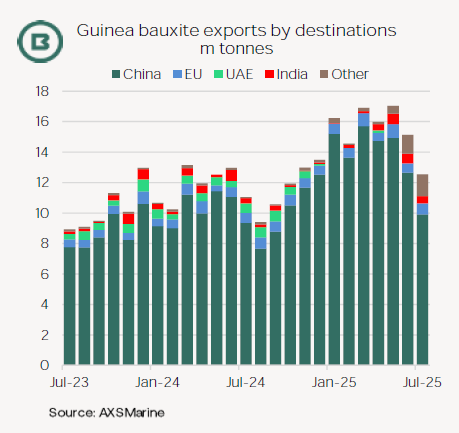
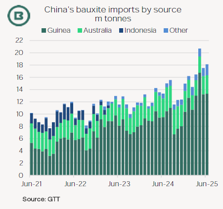
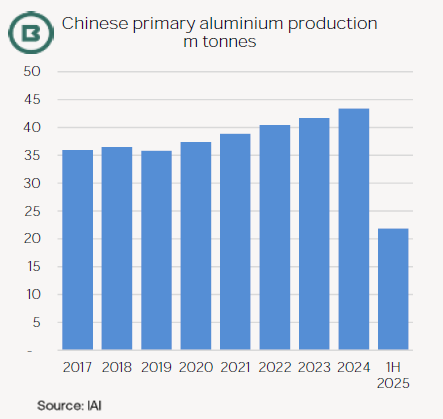

# The Big Picture: Guinea’s Q3 bauxite supply

**Date:** August 08, 2025  
**Publisher:** Breakwave Advisors | **Category:** Market Insights  
**Original URL:** [https://www.breakwaveadvisors.com/insights/2025/8/8/the-big-picture-guineas-q3-bauxite-supply](https://www.breakwaveadvisors.com/insights/2025/8/8/the-big-picture-guineas-q3-bauxite-supply)  

---

·*Guinea’s bauxite trade to China has been the leading Capesize fronthaul trade growth story of 2025, although mining licence revocations in Guinea and the arrival of the rainy season cast doubt on Q3 performance.*

·*Guinea’s bauxite exports leapt to 99.8m tonnes in the 1H 2025, up a massive 26.4m tonnes year-on-year, official data showed, but experienced a seasonal drop in tracked shipments in July.*

·*In the light of these new development we look at how Guinea’s bauxite sector is evolving.*

Owing to disruption caused by seasonal heavy rainfall, the**Q3 has consistently been the lowest quarter**for Guinea’s bauxite exports.

Now more than half the size of Brazil’s iron ore exports, Guinea’s bauxite export influence on Atlantic Capesize demand is increasingly apparent.

This year, however, the picture of rapid expansion in Guinea’s bauxite mining has been**clouded by bauxite mining licence revocations by the government**.

First, in**October 2024**, a dispute emerged between Guinea’s authorities and Dubai-based Emirates Global Aluminium (EGA) which halted shipments of bauxite from its mining subsidiary, Guinea Alumina Corporation (GAC), which were partly used in EGA’s UAE alumina refinery.

On 4 August GAC’s mining licence for the 11.9m tonne/year Boké bauxite mine was officially revoked and was transferred to a new state-owned entity, named Nimba Mining.

The move finalises EGA’s enforced switch in sourcing bauxite for its alumina refinery in the UAE away from Guinea to Australia for most of its requirements. AXSMarine data show Panamaxes employed most often.

Then, in**May 2025**, Guinea’s government announced the repossession of around 50 mining concessions (see our*360 Degrees*from 27 May).

> **Figure 1: Screenshot 2025 08 08 10.28.19**  
> [Local Asset](file:///C:/Users/Dell/Github/Shipping/corpus/03-breakwave/insights/2025/assets/2025-08-08_the-big-picture-guineas-q3-bauxite-supply_img_screenshot2025-08-08102819_988226e95244.png)

> **Figure 2: Screenshot 2025 08 08 10.28.30**  
> [Local Asset](file:///C:/Users/Dell/Github/Shipping/corpus/03-breakwave/insights/2025/assets/2025-08-08_the-big-picture-guineas-q3-bauxite-supply_img_screenshot2025-08-08102830_86b956facecd.png)

While some of the May concessions were dismissed at the time as including projects not in operation and some previously expired permits, the mines run by**Guinea Investment Corporation (GIC) and SD (Sunda) Mining**, which were originally part of a joint venture (AGB2A) in the Boffa-Fria corridor, were affected.

According to Shanghai Metals Market (SMM), these projects were expanding rapidly.

For example, SD Mining’s output grew from 1.5m tonnes in 2022, to 9m in 2023, then to 20m in 2024, with more than 25m expected this year.

At end-July, SD Mining advised SMM it has begun the technical steps required to restart operations, though it could not confirm when it might resume. GIC on the other hand was seeking to appeal, possibly involving international arbitration.

At end-July SMM estimated that, if SD Mining were allowed to resume mining in the Q4, then Guinea’s bauxite production would reach 174m tonnes this year, marking a yearly jump of 28m tonnes.

SMM added that, while robust, even this total would be 10.5m tonnes lower than its expectations at the start of the year.

Guinea’s aim is not**merely to expand bauxite exports**, but to**refine more bauxite into alumina**.

March marked the official start of construction of the State Power Investment Corporation (SPIC)’s**alumina refinery**with production capacity of 1.2m tonnes/year, with commissioning due in June 2028.

This would be Guinea’s second alumina refinery and provides another example of value extraction by the government from the country’s huge bauxite supply.

> **Figure 3: Annual Production Cap of 45m Tonnes Was Announced by China’s**  
> *An annual production cap of 45m tonnes was announced by China’s authorities in 2017 and reportedly reconfirmed in the aluminium sector’sAction Plan for 2025-27.*  
> [Local Asset](file:///C:/Users/Dell/Github/Shipping/corpus/03-breakwave/insights/2025/assets/2025-08-08_the-big-picture-guineas-q3-bauxite-supply_img_screenshot2025-08-08102847_27c1c293dd7a.png)

Moreover, China’s appetite for bauxite might run up against**self-imposed limitations on aluminium output by the end of next year**.

In the last 12 months the country’s smelters produced 43.9m tonnes of aluminium (which followed 42.7m tonnes in the preceding 12-month period), data from the International Aluminium Institute show.

---

**Tags:** Bauxite, Drybulk, Shipping  
