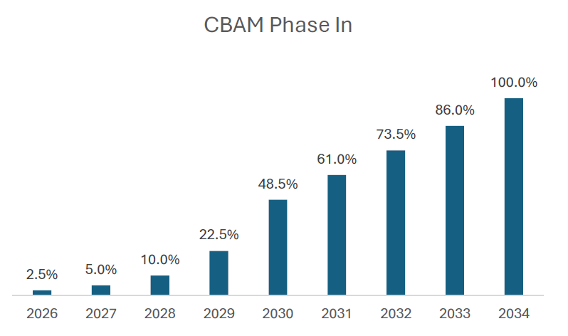

# CBAM: The Under-the-Radar Regulation That Could Reshape Dry Bulk Flows

**Date:** August 11, 2025  
**Publisher:** Breakwave Advisors | **Category:** Market Insights  
**Original URL:** [https://www.breakwaveadvisors.com/insights/2025/8/11/cbam-the-under-the-radar-regulation-that-could-reshape-dry-bulk-flows](https://www.breakwaveadvisors.com/insights/2025/8/11/cbam-the-under-the-radar-regulation-that-could-reshape-dry-bulk-flows)  

---

*By*[*Albion Sllamniku*](https://www.linkedin.com/in/albion-sllamniku-1540ba78/)

EU regulations have become a central theme for dry bulk market participants, with the rollout of EU ETS and FuelEU Maritime already influencing vessel deployment and chartering strategies. But there’s another piece of legislation on the horizon that’s received far less attention—despite its potential to significantly reshape trade flows.

Enter**CBAM (Carbon Border Adjustment Mechanism)**, set to be enforced from 2026. It’s a climate policy tool that effectively places a carbon price on imported goods into the EU, based on the emissions generated during their production. The objective is twofold: discourage carbon leakage and push non-EU exporters toward cleaner industrial processes by aligning their carbon costs with those paid by EU-based producers.

CBAM will initially apply to imports of:

• Cement

• Iron & Steel

• Aluminium

• Fertilizers

• Hydrogen

> **Figure 1: Screenshot 2025 08 11 11.37.43**  
> **Interactive Data & Source:** [Windward-shipping](https://www.windward-shipping.com) | [Local Asset](file:///C:/Users/Dell/Github/Shipping/corpus/03-breakwave/insights/2025/assets/2025-08-11_cbam-the-under-the-radar-regulation-that-could-reshape-dry-bulk-flows_img_screenshot2025-08-11113743_3e7c9551565b.png)

Importers will need to report embedded emissions and purchase CBAM certificates, priced in line with the EU ETS. The financial impact will be phased in gradually starting at 2.5% of the ETS price in 2026, ramping up to 100% by 2034.

For the shipping industry, CBAM doesn’t impose a direct cost like ETS or FuelEU—but its impact on trade patterns will be unavoidable. As carbon costs begin to bite, we’re likely to see a gradual shift away from high-emission producers like India toward lower-emission suppliers such as South Korea. That shift could favour longer-haul trades in some cases—more Korean steel into Europe, for instance—but in other cases, trades may contract entirely or pivot to intra-regional flows.

Data Source:[Windward Shipping](https://www.windward-shipping.com)

---

**Tags:** Drybulk, Shipping, Decarbonization  
