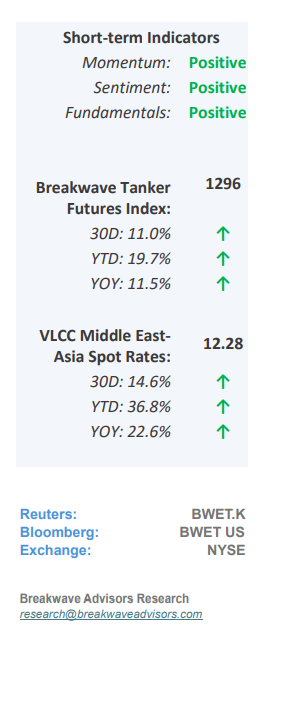
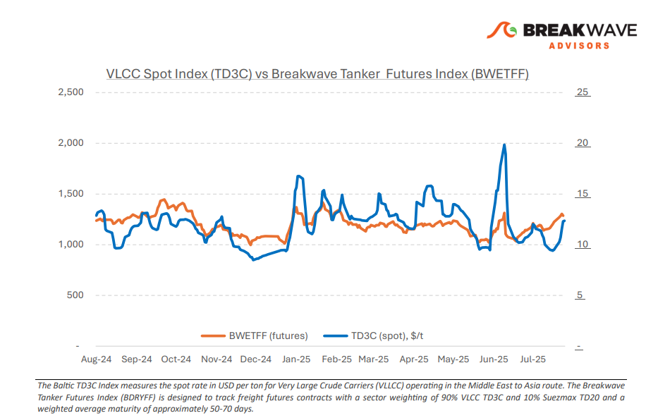
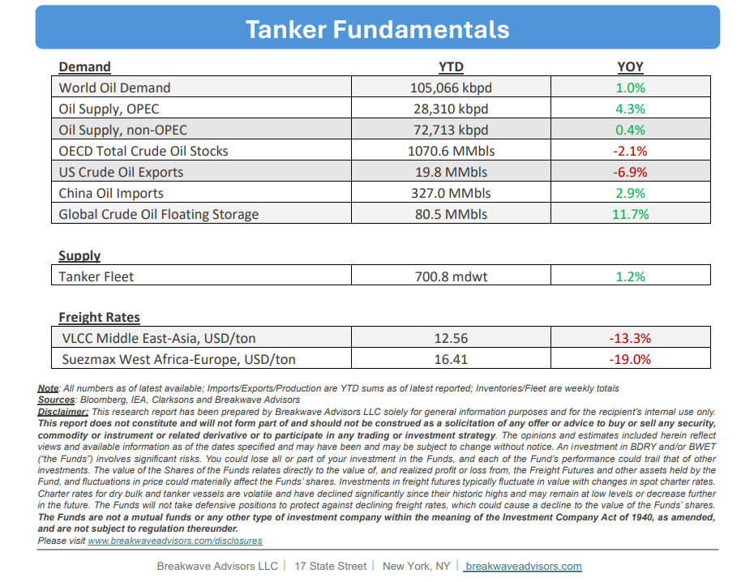

# Breakwave Bi-Weekly Tanker Report - August 12, 2025

**Date:** August 12, 2025  
**Publisher:** Breakwave Advisors | **Category:** Market Insights  
**Original URL:** [https://www.breakwaveadvisors.com/insights/2025812wetreport18876-t6bl](https://www.breakwaveadvisors.com/insights/2025812wetreport18876-t6bl)  

---

•**VLCC Market Rebounds on Stronger MEG Activity**– Following the charterer-led softness at the end of July, the VLCC market has**regained firmer footing**in mid-August, particularly in the Middle East Gulf (MEG). Early-month enquiry for lateAugust stems has been more active than expected, helping to absorb part of the tonnage overhang that had weighed on sentiment.**Owners have resisted**last-done levels, pushing AG/China and AG/Singapore freight higher than earlier in the summer. In West Africa,**fundamentals also appear supportive**, though competition from the Suezmax segment remains a factor in Atlantic trades. Meanwhile, US Gulf and Brazil VLCC routes have strengthened, with recent fixture volumes providing enough momentum to sustain the market’s firmness. Looking ahead to the remainder of August, recent weekly gains are**boosting sentiment**in the dirty freight market, even as it continues to face challenges from U.S. policy actions and, more recently, the potential enactment of tariffs on Indian exports aimed at reducing reliance on Russian crude. On the demand side,**China’s crude import appetite remains a bright spot.**July crude oil imports averaged 11.12 million bpd, up 11.5% year-on-year, with January–July imports totaling 11.25 million bpd, up 2.8% y/y. On the supply side, OPEC+ implemented a 548,000-bpd production increase in August, followed by a further 547,000-bpd boost scheduled for September, reflecting ongoing efforts to restore supply and support market stability.

> **Figure 1: Στιγμιότυπο Οθόνης 2025 08 12 123806**  
> [Local Asset](file:///C:/Users/Dell/Github/Shipping/corpus/03-breakwave/insights/2025/assets/2025-08-12_2025812wetreport18876-t6bl_img_cea3cf84ceb9ceb3cebcceb9cf8ccf84cf85_63165dedaed0.png)

•**Oil Prices at Two-Month Lows as OPEC+ Adds More Barrels**– The combination of OPEC+**production increases**and expectations for**gradual progress**in resolving the Russia-Ukraine conflict has contributed to crude prices retreating to two-month lows. Despite an improved demand outlook, supported by relatively strong Chinese import activity, oil prices remain near the bottom of their recent range, with**few catalysts visible**to sustain a rebound. Since March, OPEC+ has added about 2.5 million barrels per day, marking the first significant increase in nearly three years. In the current price environment, the move appears aimed at**gaining market share**from higher-cost U.S. producers while moderating the pace of price declines.**Chinese stockpiling**is providing some price**support**, but without a sustained and meaningful shift in transportation fuel demand, an outcome that seems unlikely, the global oil demand outlook remains modest.

•**Our Long-term View**– The tanker market is recovering from a long period of staggered rates as the growth in new vessel supply shrinks while oil demand remains elevated in line with the global economy. A historically low orderbook combined with favorable shifting trade patterns should continue to support increased spot rate volatility, which combined with the ongoing geopolitical turmoil, should sustain freight rates in the medium to long term.

> **Figure 2: Στιγμιότυπο Οθόνης 2025 08 12 123820**  
> [Local Asset](file:///C:/Users/Dell/Github/Shipping/corpus/03-breakwave/insights/2025/assets/2025-08-12_2025812wetreport18876-t6bl_img_cea3cf84ceb9ceb3cebcceb9cf8ccf84cf85_b36478f5f0f9.png)

> **Figure 3: Στιγμιότυπο Οθόνης 2025 08 12 123831**  
> [Local Asset](file:///C:/Users/Dell/Github/Shipping/corpus/03-breakwave/insights/2025/assets/2025-08-12_2025812wetreport18876-t6bl_img_cea3cf84ceb9ceb3cebcceb9cf8ccf84cf85_e247bf3e2232.png)

### Subscribe:
