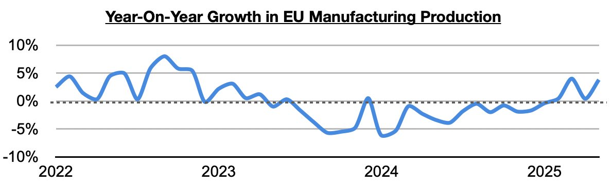
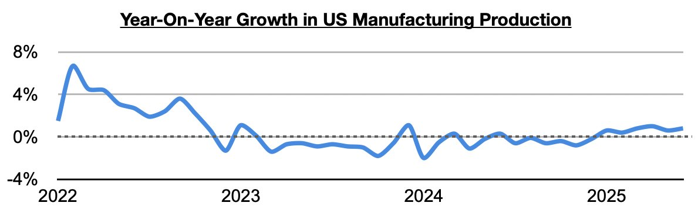
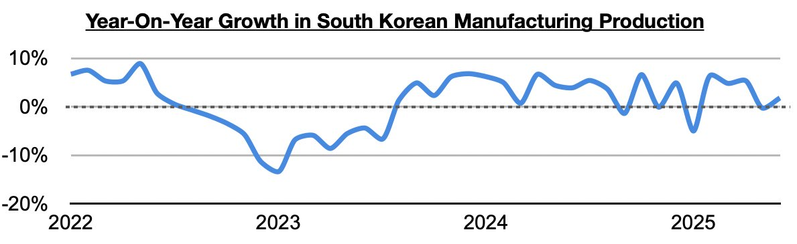
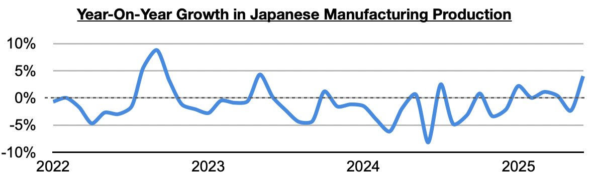
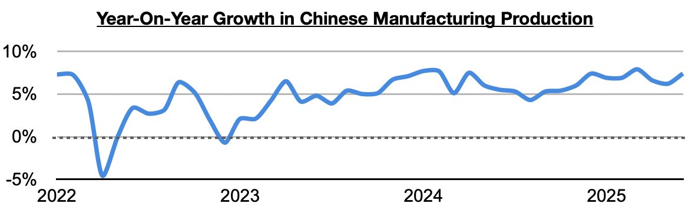
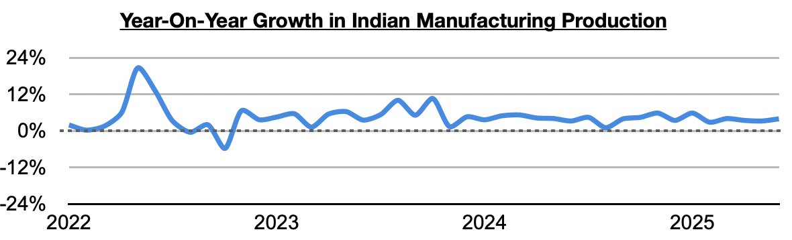
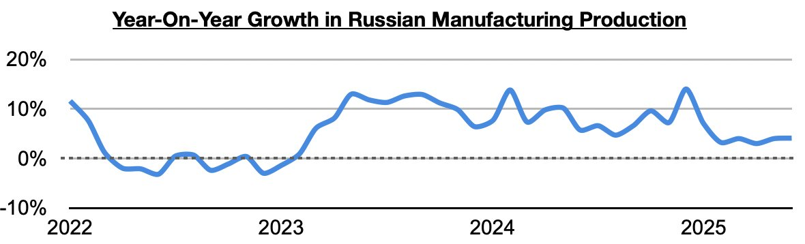

# Sustained Global Manufacturing Production Growth

**Date:** August 13, 2025  
**Publisher:** Breakwave Advisors | **Category:** Market Insights  
**Original URL:** [https://www.breakwaveadvisors.com/insights/2025/8/13/sustained-global-manufacturing-production-growth](https://www.breakwaveadvisors.com/insights/2025/8/13/sustained-global-manufacturing-production-growth)  

---

*By*[*Jeffrey Landsberg*](https://www.linkedin.com/in/jeffrey-landsberg-70ab957/)

In Commodore Research's Weekly Executive Reports, we have long been discussing how manufacturing production has been able to continue to enjoy sustained year-on-year growth in China, India, and Russia. All have seen at least twenty-nine months of sustained year-on-year growth. Of note more recently is that the European Union, the United States, South Korea, and Japan have all finally been enjoying sustained growth as well.

> **Figure 1: Chart 1**  
> [Local Asset](file:///C:/Users/Dell/Github/Shipping/corpus/03-breakwave/insights/2025/assets/2025-08-13_sustained-global-manufacturing-production-growth_img_chart1_9b1f977c3f5c.jpg)

In the United States, manufacturing production has now grown on a year-on-year basis for six straight months. Previously, it had contracted on a year-on-year basis during nineteen of the prior twenty-two months.

> **Figure 2: Chart 2**  
> [Local Asset](file:///C:/Users/Dell/Github/Shipping/corpus/03-breakwave/insights/2025/assets/2025-08-13_sustained-global-manufacturing-production-growth_img_chart2_7b0bb10e9a2c.jpg)

In South Korea, manufacturing production has now grown on a year-on-year basis during four of the last five months. Previously, it had contracted on a year-on-year basis during three of the prior five months.

> **Figure 3: Chart 3**  
> [Local Asset](file:///C:/Users/Dell/Github/Shipping/corpus/03-breakwave/insights/2025/assets/2025-08-13_sustained-global-manufacturing-production-growth_img_chart3_0d241ad5420b.jpg)

In Japan, manufacturing production has now grown on a year-on-year basis during five of the last six months. Previously, it had contracted on a year-on-year basis during eleven of the prior fourteen months.

> **Figure 4: Chart 4**  
> [Local Asset](file:///C:/Users/Dell/Github/Shipping/corpus/03-breakwave/insights/2025/assets/2025-08-13_sustained-global-manufacturing-production-growth_img_chart4_1f55a807f0d1.jpg)

China, India, and Russia have remained the global stalwarts. In China, manufacturing production has now grown on a year-on-year basis for thirty straight months.

> **Figure 5: Chart 5**  
> [Local Asset](file:///C:/Users/Dell/Github/Shipping/corpus/03-breakwave/insights/2025/assets/2025-08-13_sustained-global-manufacturing-production-growth_img_chart5_052c1a12dc62.jpg)

In India, manufacturing production has now grown on a year-on-year basis for thirty-two straight months.

> **Figure 6: Chart 6**  
> [Local Asset](file:///C:/Users/Dell/Github/Shipping/corpus/03-breakwave/insights/2025/assets/2025-08-13_sustained-global-manufacturing-production-growth_img_chart6_09ed6fd4a2e6.jpg)

In Russia, manufacturing production has now grown on a year-on-year basis for twenty-nine straight months.

> **Figure 7: Chart 7**  
> [Local Asset](file:///C:/Users/Dell/Github/Shipping/corpus/03-breakwave/insights/2025/assets/2025-08-13_sustained-global-manufacturing-production-growth_img_chart7_359875d7dddc.jpg)

---

**Tags:** China, Markets, Economy  
