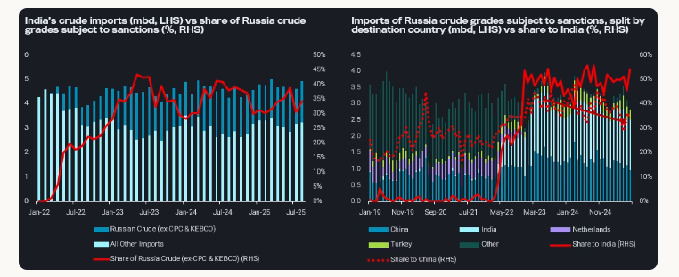
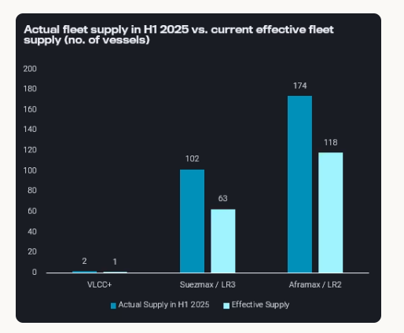
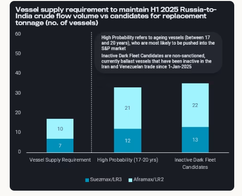

# Overcoming logistical pressures in Russia-India crude trade

**Date:** August 14, 2025  
**Publisher:** Breakwave Advisors | **Category:** Market Insights  
**Original URL:** [https://www.breakwaveadvisors.com/insights/2025/8/14/overcoming-logistical-pressures-in-russia-india-crude-trade](https://www.breakwaveadvisors.com/insights/2025/8/14/overcoming-logistical-pressures-in-russia-india-crude-trade)  

---

Russia-India crude flows can rebound to normal levels, contingent on additions to vessel supply of shadow fleet.

*By*[*Delia He*](https://www.linkedin.com/in/hedelia/)

India’s crude imports from Russia fell 20% m-o-m in July. Sanctions enforcement has intensified in recent months - especially with mounting US scrutiny on India, EU sanctions on Vadinar Refinery, and the EU’s dynamic price cap regulation on Russia to be implemented in Sep-25.

However, the incremental pressure it imposes on the supply chain tends towards logistical inefficiencies, rather than structural barriers.

Since both parties have strong incentives to restore flows, we could see the Russia-to-India crude trade maintained at H1 2025 volumes (monthly average of 1.6 mbd) in the medium-term. However, a critical bottleneck pressuring this supply chain is the shortage of non-sanctioned tonnage. Vortexa finds that the existing fleet supply could sustain up to 93% of H1 2025 flows, with only minimal vessel additions required to fully restore flows.

A caveat, however, is the steadily shrinking pool of vessels suitable to enter the sale-and-purchase (S&P) market, and join the Russia-trading fleet. At the same time, the Tier-1 fleet servicing mainstream crude flows continues to tighten as more tonnage is lost to sanctioned trade. This has supported crude freight rates in 2025, and could discourage Tier-1 vessels from defecting into the shadow fleet.

## India Is Key Demand Outlet for Russian Crude

Russia crude grades have accounted for over one-third of India’s total crude slate so far this year. On the supply side, Russia has remained heavily reliant on India as its largest demand outlet. Russian crude imports into India in H1 2025 have remained slightly elevated (~0.5%) compared to H1 2024, with India’s import volumes continuing to pull further ahead of China’s (see RHS chart below).

> **Figure 1: Στιγμιότυπο Οθόνης 2025 08 14 120932**  
> **Interactive Data & Source:** [Analytics Vortexa](https://analytics.vortexa.com/Flows?dateRange=2022-01-01T00%3A00%3A00.000Z__2025-08-10T23%3A59%3A59.999Z&filtersEnabled=%5B%22p%22%2C%22o%22%2C%22d%22%2C%22d_r%22%2C%22v%22%2C%22intra_d%22%2C%22sts_o%22%2C%22c_o%22%2C%22v_o%22%2C%22w%22%5D&geoBreakdownDestinationGlobal=region&metric=bpd&movementEvent=unloading_start&page=Flows&products=%5B%2254af755a090118dcf9b0724c9a4e9f14745c26165385ffa7f1445bc768f06f11%22%5D&tabId=24bc47eb-4456-4eb2-a4a4-ff1808288686&timeSeriesSeasonalStart=2020&to=%5B%2270425373a1836d6d0390dc6fef838a468717fba7776d66065a5043488f9f041b%22%5D&v=3) | [Local Asset](file:///C:/Users/Dell/Github/Shipping/corpus/03-breakwave/insights/2025/assets/2025-08-14_overcoming-logistical-pressures-in-russia-india-crude-trade_img_cea3cf84ceb9ceb3cebcceb9cf8ccf84cf85_9cca8b54b862.png)

LHS:[India’s crude imports](https://analytics.vortexa.com/Flows?dateRange=2022-01-01T00%3A00%3A00.000Z__2025-08-10T23%3A59%3A59.999Z&filtersEnabled=%5B%22p%22%2C%22o%22%2C%22d%22%2C%22d_r%22%2C%22v%22%2C%22intra_d%22%2C%22sts_o%22%2C%22c_o%22%2C%22v_o%22%2C%22w%22%5D&geoBreakdownDestinationGlobal=region&metric=bpd&movementEvent=unloading_start&page=Flows&products=%5B%2254af755a090118dcf9b0724c9a4e9f14745c26165385ffa7f1445bc768f06f11%22%5D&tabId=24bc47eb-4456-4eb2-a4a4-ff1808288686&timeSeriesSeasonalStart=2020&to=%5B%2270425373a1836d6d0390dc6fef838a468717fba7776d66065a5043488f9f041b%22%5D&v=3)versus[share of Russia crude](https://analytics.vortexa.com/Flows?dateRange=2022-01-01T00%3A00%3A00.000Z__2025-08-10T23%3A59%3A59.999Z&filtersEnabled=%5B%22p%22%2C%22o%22%2C%22d%22%2C%22d_r%22%2C%22v%22%2C%22intra_d%22%2C%22sts_o%22%2C%22c_o%22%2C%22v_o%22%2C%22w%22%5D&geoBreakdownDestinationGlobal=region&metric=bpd&movementEvent=unloading_start&page=Flows&products=%5B%22c8803c073c2980d9849784c16bcd41d7f7b7561d2c8c1799a16166527b120242%22%2C%2204c4ea46fc6fccfe8388717f399b40e5e348f9a98c451d99e7366caa998191a7%22%2C%22a6c0a31f361b480bddfb93b1b93f38f4989013ae54b2b147ab18116fdfbebdb7%22%2C%2220c87d7477f8cfe103904d9af911668c9a69bd03690e74e52e4386ad34e054ee%22%2C%220c703e0e14d99572c62f15a26fdf2c9f0c00e111e625cd40b8b337154e81d46d%22%2C%22fef83ff1194c77d969693ee17c08e1112878e184e3449400e5904bc47b0119fe%22%2C%227cab5376bbb441feabdafc7b9f6272c2f9cbd10deb604bed8fa7f9986b2a39a9%22%2C%220fff12441aa3bf28aa568134ef527d09f741c543a49c0db8c03a195a0bbc481e%22%2C%224aebc156649b4c9691cdf3a9c81758426d10ffc944ba441f907f9fbe0964e879%22%5D&tabId=24bc47eb-4456-4eb2-a4a4-ff1808288686&timeSeriesSeasonalStart=2020&to=%5B%2270425373a1836d6d0390dc6fef838a468717fba7776d66065a5043488f9f041b%22%5D&v=3)(ex-CPC and Kebco)

RHS:[Imports of Russia crude (ex-CPC and Kebco), split by destination country](https://analytics.vortexa.com/Flows?dateRange=2019-01-01T00%3A00%3A00.000Z__2025-08-10T23%3A59%3A59.999Z&filtersEnabled=%5B%22p%22%2C%22o%22%2C%22d%22%2C%22d_r%22%2C%22v%22%2C%22intra_d%22%2C%22sts_o%22%2C%22c_o%22%2C%22w%22%5D&geoBreakdownOriginGlobal=shipping_region_v2&metric=bpd&movementEvent=unloading_start&page=Flows&products=%5B%22c8803c073c2980d9849784c16bcd41d7f7b7561d2c8c1799a16166527b120242%22%2C%2204c4ea46fc6fccfe8388717f399b40e5e348f9a98c451d99e7366caa998191a7%22%2C%22a6c0a31f361b480bddfb93b1b93f38f4989013ae54b2b147ab18116fdfbebdb7%22%2C%2220c87d7477f8cfe103904d9af911668c9a69bd03690e74e52e4386ad34e054ee%22%2C%220c703e0e14d99572c62f15a26fdf2c9f0c00e111e625cd40b8b337154e81d46d%22%2C%22fef83ff1194c77d969693ee17c08e1112878e184e3449400e5904bc47b0119fe%22%2C%227cab5376bbb441feabdafc7b9f6272c2f9cbd10deb604bed8fa7f9986b2a39a9%22%2C%220fff12441aa3bf28aa568134ef527d09f741c543a49c0db8c03a195a0bbc481e%22%5D&tabId=c2c726a8-fba5-4cad-8235-e245c73ed99e&timeSeriesProperty=destination_country&v=3)versus[share to India](https://analytics.vortexa.com/Flows?dateRange=2019-01-01T00%3A00%3A00.000Z__2025-08-10T23%3A59%3A59.999Z&filtersEnabled=%5B%22p%22%2C%22o%22%2C%22d%22%2C%22d_r%22%2C%22v%22%2C%22intra_d%22%2C%22sts_o%22%2C%22c_o%22%2C%22w%22%5D&geoBreakdownOriginGlobal=shipping_region_v2&metric=bpd&movementEvent=unloading_start&page=Flows&products=%5B%22c8803c073c2980d9849784c16bcd41d7f7b7561d2c8c1799a16166527b120242%22%2C%2204c4ea46fc6fccfe8388717f399b40e5e348f9a98c451d99e7366caa998191a7%22%2C%22a6c0a31f361b480bddfb93b1b93f38f4989013ae54b2b147ab18116fdfbebdb7%22%2C%2220c87d7477f8cfe103904d9af911668c9a69bd03690e74e52e4386ad34e054ee%22%2C%220c703e0e14d99572c62f15a26fdf2c9f0c00e111e625cd40b8b337154e81d46d%22%2C%22fef83ff1194c77d969693ee17c08e1112878e184e3449400e5904bc47b0119fe%22%2C%227cab5376bbb441feabdafc7b9f6272c2f9cbd10deb604bed8fa7f9986b2a39a9%22%2C%220fff12441aa3bf28aa568134ef527d09f741c543a49c0db8c03a195a0bbc481e%22%5D&tabId=c2c726a8-fba5-4cad-8235-e245c73ed99e&timeSeriesProperty=destination_country&to=%5B%2270425373a1836d6d0390dc6fef838a468717fba7776d66065a5043488f9f041b%22%5D&v=3)[and China](https://analytics.vortexa.com/Flows?dateRange=2019-01-01T00%3A00%3A00.000Z__2025-08-10T23%3A59%3A59.999Z&filtersEnabled=%5B%22p%22%2C%22o%22%2C%22d%22%2C%22d_r%22%2C%22v%22%2C%22intra_d%22%2C%22sts_o%22%2C%22c_o%22%2C%22w%22%5D&geoBreakdownOriginGlobal=shipping_region_v2&metric=bpd&movementEvent=unloading_start&page=Flows&products=%5B%22c8803c073c2980d9849784c16bcd41d7f7b7561d2c8c1799a16166527b120242%22%2C%2204c4ea46fc6fccfe8388717f399b40e5e348f9a98c451d99e7366caa998191a7%22%2C%22a6c0a31f361b480bddfb93b1b93f38f4989013ae54b2b147ab18116fdfbebdb7%22%2C%2220c87d7477f8cfe103904d9af911668c9a69bd03690e74e52e4386ad34e054ee%22%2C%220c703e0e14d99572c62f15a26fdf2c9f0c00e111e625cd40b8b337154e81d46d%22%2C%22fef83ff1194c77d969693ee17c08e1112878e184e3449400e5904bc47b0119fe%22%2C%227cab5376bbb441feabdafc7b9f6272c2f9cbd10deb604bed8fa7f9986b2a39a9%22%2C%220fff12441aa3bf28aa568134ef527d09f741c543a49c0db8c03a195a0bbc481e%22%5D&tabId=c2c726a8-fba5-4cad-8235-e245c73ed99e&timeSeriesProperty=destination_country&to=%5B%22934c47f36c16a58d68ef5e007e62a23f5f036ee3f3d1f5f85a48c572b90ad8b2%22%5D&v=3)

[Russian crude imports to India](https://analytics.vortexa.com/Flows?dateRange=2023-01-01T00%3A00%3A00.000Z__2025-07-31T23%3A59%3A59.999Z&filtersEnabled=%5B%22p%22%2C%22o%22%2C%22d%22%2C%22d_r%22%2C%22v%22%2C%22intra_d%22%2C%22sts_o%22%2C%22c_o%22%2C%22v_o%22%2C%22w%22%5D&from=%5B%22b996521be9c996db3560ca234a56286ac38f798d34be229437555fab4f12a6a5%22%5D&geoBreakdownDestinationGlobal=region&metric=bpd&movementEvent=unloading_start&page=Flows&products=%5B%2254af755a090118dcf9b0724c9a4e9f14745c26165385ffa7f1445bc768f06f11%22%5D&productsExcluded=%5B%22bb70cf56200f5b72ba69a90bda2c6b47ba29da23945c6f1994cfd4c2ef2fe0ff%22%2C%22578b0722570521d64e6a1527e1fb88ddb1a064cc15afe1d6023d2a0b6d66be6b%22%5D&tabId=a973444c-c834-4af9-b649-efe99b8a6877&timeSeriesProperty=product_grade&timeSeriesSeasonalStart=2021&timeSeriesSeasonalToggle=1&to=%5B%2270425373a1836d6d0390dc6fef838a468717fba7776d66065a5043488f9f041b%22%5D&v=3)in July fell by over 20% m-o-m to 1.4 mbd. Further downside is anticipated in the near-term due to discharge disruptions in Nayara’s Vadinar Refinery, and as India’s state-owned refiners scale back spot purchases under mounting US pressure.

Overall, if India’s off-take is reduced to term contract volumes alone, an estimated maximum of 600 kbd of Urals crude could be displaced (read more[here](https://analytics.vortexa.com/InsightsHubPage?articleId=4hMeptKhy2qXyC2sL3361X&articleType=Highlight&page=InsightsHubPage&searchTerm=&tabId=90ad0d2c-d0a8-418a-bce8-3cdce4895219)). Though some of this surplus could be temporarily re-directed to China, these are stop-gap measures. Importantly, China absorbing all surplus volumes is not entirely a realistic scenario either, given that[China’s imports of Urals has been steadily trending down since 2023](https://analytics.vortexa.com/Flows?dateRange=2019-01-01T00%3A00%3A00.000Z__2025-08-12T23%3A59%3A59.999Z&filtersEnabled=%5B%22p%22%2C%22o%22%2C%22d%22%2C%22d_r%22%2C%22v%22%2C%22intra_d%22%2C%22sts_o%22%2C%22c_o%22%2C%22w%22%5D&geoBreakdownOriginGlobal=shipping_region_v2&metric=bpd&movementEvent=unloading_start&page=Flows&products=%5B%22c8803c073c2980d9849784c16bcd41d7f7b7561d2c8c1799a16166527b120242%22%5D&tabId=c2c726a8-fba5-4cad-8235-e245c73ed99e&timeSeriesProperty=destination_country&to=%5B%22934c47f36c16a58d68ef5e007e62a23f5f036ee3f3d1f5f85a48c572b90ad8b2%22%5D&v=3), sitting at an average of 63 kbd so far in 2025.

As the Russia-to-India crude trade is deeply entrenched, a repeat of substitution patterns seen earlier this year in January (post-OFAC sanctions) would be likely (read more here). India would likely source replacement barrels for its spot purchases from Mideast Gulf, West Africa and South America, though increased crude purchasing from the US remains to be seen. So far in August,[India’s crude imports from MEG and WAf](https://analytics.vortexa.com/Flows?dateRange=2023-01-01T00%3A00%3A00.000Z__2025-08-10T23%3A59%3A59.999Z&filtersEnabled=%5B%22p%22%2C%22o%22%2C%22d%22%2C%22d_r%22%2C%22v%22%2C%22intra_d%22%2C%22sts_o%22%2C%22c_o%22%2C%22w%22%2C%22c%22%2C%22v_o%22%5D&from=%5B%220427e0f9d52b38c1a98b68c59b8fd80cb1c508e44882e96611e48ef5b140d927%22%2C%228ad76c1c935d5a9598fa1b9545b7f6befd12e71fdd814a14e001bdaf99ef0448%22%5D&geoBreakdownOriginGlobal=port&metric=bpd&page=Flows&products=%5B%2254af755a090118dcf9b0724c9a4e9f14745c26165385ffa7f1445bc768f06f11%22%5D&tabId=0f2cf5de-43a9-4ee7-b6b2-ac0b81bad40f&timeSeriesPercentageEnabled=1&timeSeriesProperty=origin_shipping_region_v2&to=%5B%2270425373a1836d6d0390dc6fef838a468717fba7776d66065a5043488f9f041b%22%5D&v=3)have stepped up ~20% m-o-m. Prompt freight rates for MEG VLCCs have surged ~30% w-o-w to $13/t, and ~20% w-o-w to $20/t for WAf VLCCs; similarly, MEG-to-India WC Suezmax prompt rates have risen 10% w-o-w to $8.41/t (Argus).

Despite short-term pullbacks, could Russia-India crude trade recover to H1 2025 volumes, which sit at a monthly average of 1.6 mbd? As the lack of non-sanctioned tonnage capable of calling at India’s ports remains a critical bottleneck in Russia-India crude supply chain, a key question to address is the likelihood of logistical workarounds in terms of additions to fleet supply.

## Logistical Bottlenecks From Insufficient Non-Sanctioned Tonnage Can Be Bypassed Relatively Quickly

Vessels sanctioned by OFAC have been the most effective for neutralising the servicing of the Russia-to-India crude trade. As this trend is expected to persist, all newly OFAC-sanctioned vessels (both Russia-related and Iran-related designations) in 2025 would cease discharging at India’s ports. Additionally, non-sanctioned Western-operated vessels, which are increasingly risk-averse amid the EU’s expanded sanctions enforcement, would likely withdraw from this trade altogether. While it remains to be seen how far this trend would extend, Vortexa data shows that the average voyage counts per day made by Greek-operated vessels lifting Russian crude have stepped down by over 40% m-o-m so far in August (days 1-12). This trend would likely take hold with EU’s dynamic price-cap regulation on Russian crude, which is set to take effect 03-Sep-25 with a 45-day winddown period.

Assuming similar behavioral shifts among other non-sanctioned Western-operated vessels, the effective supply of the Russia-India fleet would be limited to vessels without OFAC-designations, and non-sanctioned vessels that are not Western-operated. On this basis, the fleet servicing this trade could shrink by 35% from the actual fleet size in H1 2025.

> **Figure 2: Στιγμιότυπο Οθόνης 2025 08 14 121037**  
> **Interactive Data & Source:** [Analytics Vortexa](https://analytics.vortexa.com/VoyagesFlows?dateRange=2025-01-01T00%3A00%3A00.000Z__2025-08-12T23%3A59%3A59.999Z&filtersEnabled=%5B%22v_v_st%22%2C%22v%22%2C%22l_c%22%2C%22o%22%2C%22d%22%2C%22v_or%22%2C%22v_de%22%2C%22d_r%22%2C%22v_a%22%2C%22v_o%22%2C%22ve_ow%22%2C%22l%22%2C%22intra_d%22%5D&from=%5B%22b996521be9c996db3560ca234a56286ac38f798d34be229437555fab4f12a6a5%22%5D&latestProducts=%5B%22c8803c073c2980d9849784c16bcd41d7f7b7561d2c8c1799a16166527b120242%22%2C%2204c4ea46fc6fccfe8388717f399b40e5e348f9a98c451d99e7366caa998191a7%22%2C%22a6c0a31f361b480bddfb93b1b93f38f4989013ae54b2b147ab18116fdfbebdb7%22%2C%2220c87d7477f8cfe103904d9af911668c9a69bd03690e74e52e4386ad34e054ee%22%2C%220c703e0e14d99572c62f15a26fdf2c9f0c00e111e625cd40b8b337154e81d46d%22%2C%22fef83ff1194c77d969693ee17c08e1112878e184e3449400e5904bc47b0119fe%22%2C%227cab5376bbb441feabdafc7b9f6272c2f9cbd10deb604bed8fa7f9986b2a39a9%22%2C%220fff12441aa3bf28aa568134ef527d09f741c543a49c0db8c03a195a0bbc481e%22%2C%224aebc156649b4c9691cdf3a9c81758426d10ffc944ba441f907f9fbe0964e879%22%5D&metric=t&originBreakdown=port&page=VoyagesFlows&tabId=acaf8c92-77c3-48e3-bb87-52fd74189e0b&timeSeriesMetric=duration-avg&to=%5B%2270425373a1836d6d0390dc6fef838a468717fba7776d66065a5043488f9f041b%22%5D&tsAnalysisSeasonalEnabled=0&voyageDateRangeActivity=arrivals&voyageStatus=%5B%22laden%22%5D) | [Local Asset](file:///C:/Users/Dell/Github/Shipping/corpus/03-breakwave/insights/2025/assets/2025-08-14_overcoming-logistical-pressures-in-russia-india-crude-trade_img_cea3cf84ceb9ceb3cebcceb9cf8ccf84cf85_c6f87ded18a3.png)

If we further assume that India’s appetite for Russian crude would, in the medium-term, ultimately return to H1 2025 volumes - a monthly average of 1.6 mbd - what is therefore needed in terms of vessel supply?

As it stands, 93% of monthly volumes could be delivered with an effective supply of 182 vessels (as above). This suggests that the Russia-India crude supply chain could remain relatively stable despite heightened sanctions enforcement and regulatory scrutiny from the EU and US.

To compensate for the 7% shortfall - approximately 105kbd - a minimum of 17 additional vessels would be required to join the Russia-India fleet. Assuming that the volume would be traded on direct Russia-to-India voyages via Red Sea transits on non-sanctioned tonnage, this would require an additional 7 Suezmaxes and 10 Aframaxes, based on an[average voyage duration of 39 days](https://analytics.vortexa.com/VoyagesFlows?dateRange=2025-01-01T00%3A00%3A00.000Z__2025-08-12T23%3A59%3A59.999Z&filtersEnabled=%5B%22v_v_st%22%2C%22v%22%2C%22l_c%22%2C%22o%22%2C%22d%22%2C%22v_or%22%2C%22v_de%22%2C%22d_r%22%2C%22v_a%22%2C%22v_o%22%2C%22ve_ow%22%2C%22l%22%2C%22intra_d%22%5D&from=%5B%22b996521be9c996db3560ca234a56286ac38f798d34be229437555fab4f12a6a5%22%5D&latestProducts=%5B%22c8803c073c2980d9849784c16bcd41d7f7b7561d2c8c1799a16166527b120242%22%2C%2204c4ea46fc6fccfe8388717f399b40e5e348f9a98c451d99e7366caa998191a7%22%2C%22a6c0a31f361b480bddfb93b1b93f38f4989013ae54b2b147ab18116fdfbebdb7%22%2C%2220c87d7477f8cfe103904d9af911668c9a69bd03690e74e52e4386ad34e054ee%22%2C%220c703e0e14d99572c62f15a26fdf2c9f0c00e111e625cd40b8b337154e81d46d%22%2C%22fef83ff1194c77d969693ee17c08e1112878e184e3449400e5904bc47b0119fe%22%2C%227cab5376bbb441feabdafc7b9f6272c2f9cbd10deb604bed8fa7f9986b2a39a9%22%2C%220fff12441aa3bf28aa568134ef527d09f741c543a49c0db8c03a195a0bbc481e%22%2C%224aebc156649b4c9691cdf3a9c81758426d10ffc944ba441f907f9fbe0964e879%22%5D&metric=t&originBreakdown=port&page=VoyagesFlows&tabId=acaf8c92-77c3-48e3-bb87-52fd74189e0b&timeSeriesMetric=duration-avg&to=%5B%2270425373a1836d6d0390dc6fef838a468717fba7776d66065a5043488f9f041b%22%5D&tsAnalysisSeasonalEnabled=0&voyageDateRangeActivity=arrivals&voyageStatus=%5B%22laden%22%5D).

Should re-routing around the Cape of Good Hope become necessary with intensified Houthi attacks, in addition to any above-average delays in loading/discharging, the vessel supply requirement would increase. Nonetheless, the relatively modest injections needed to the Russia-India fleet in terms of vessel supply illustrates how maintaining a resilient Russia-India crude supply chain is operationally feasible.

> **Figure 3: Στιγμιότυπο Οθόνης 2025 08 14 121117**  
> **Interactive Data & Source:** [Analytics Vortexa](https://analytics.vortexa.com/VoyagesFlows?dateRange=2025-01-01T00%3A00%3A00.000Z__2025-08-12T23%3A59%3A59.999Z&filtersEnabled=%5B%22v_v_st%22%2C%22v%22%2C%22l_c%22%2C%22o%22%2C%22d%22%2C%22v_or%22%2C%22v_de%22%2C%22d_r%22%2C%22v_a%22%2C%22v_o%22%2C%22ve_ow%22%2C%22l%22%2C%22intra_d%22%2C%22v_r%22%5D&latestProducts=%5B%2254af755a090118dcf9b0724c9a4e9f14745c26165385ffa7f1445bc768f06f11%22%5D&metric=t&originBreakdown=port&page=VoyagesFlows&tabId=acaf8c92-77c3-48e3-bb87-52fd74189e0b&timeSeriesFrequency=week&to=%5B%2270425373a1836d6d0390dc6fef838a468717fba7776d66065a5043488f9f041b%22%5D&tsAnalysisSeasonalEnabled=0&vesselRiskLevelExcluded=%5B%22sanctioned%22%5D&voyageDateRangeActivity=arrivals&voyageStatus=%5B%22laden%22%5D) | [Local Asset](file:///C:/Users/Dell/Github/Shipping/corpus/03-breakwave/insights/2025/assets/2025-08-14_overcoming-logistical-pressures-in-russia-india-crude-trade_img_cea3cf84ceb9ceb3cebcceb9cf8ccf84cf85_888e4c0ab14b.png)

## Additional Russia-Trading Tonnage Could Come From S&p Market, Dark Fleet Candidates

The demand for additional tonnage required to maintain Russia-to-India crude flows would likely be met by ageing or operationally less competitive vessels finding renewed utility through the sale-and-purchase (S&P) market. Rising freight rates - as Argus reports, Urals freight from the Baltic- and Black Sea-to-India WC has surged by 11% and 17% w-o-w respectively - alongside the need to replace sanctioned and defecting vessels, would readily incentivise additional tonnage to join the Russia-trading fleet.

The higher probability candidates are Suezmaxes and Aframaxes aged between 17 and 20 years, that currently operate in the Wider Mediterranean and Russia Baltic/Black Sea regions. Currently, there are 33 vessels that fit the profile. The age profile of 17-20 years was chosen as[older, non-sanctioned crude-trading vessels calling at India’s ports predominantly fall in that age group](https://analytics.vortexa.com/VoyagesFlows?dateRange=2025-01-01T00%3A00%3A00.000Z__2025-08-12T23%3A59%3A59.999Z&filtersEnabled=%5B%22v_v_st%22%2C%22v%22%2C%22l_c%22%2C%22o%22%2C%22d%22%2C%22v_or%22%2C%22v_de%22%2C%22d_r%22%2C%22v_a%22%2C%22v_o%22%2C%22ve_ow%22%2C%22l%22%2C%22intra_d%22%2C%22v_r%22%5D&latestProducts=%5B%2254af755a090118dcf9b0724c9a4e9f14745c26165385ffa7f1445bc768f06f11%22%5D&metric=t&originBreakdown=port&page=VoyagesFlows&tabId=acaf8c92-77c3-48e3-bb87-52fd74189e0b&timeSeriesFrequency=week&to=%5B%2270425373a1836d6d0390dc6fef838a468717fba7776d66065a5043488f9f041b%22%5D&tsAnalysisSeasonalEnabled=0&vesselRiskLevelExcluded=%5B%22sanctioned%22%5D&voyageDateRangeActivity=arrivals&voyageStatus=%5B%22laden%22%5D). Moreover, profitability in the S&P market, particularly for ageing VLCCs, is on the rise (TradeWinds), which could be an indicator of growing S&P demand to replace tonnage lost to intensifying sanctions and regulations.

Additionally, non-sanctioned dark fleet candidates that are currently ballast, and have yet to lift an Iranian or Venezuelan cargo so far this year, would have the most operational flexibility in pivoting to service the Russia-India crude flow. This is, however, provided they meet India’s higher vetting and safety requirements. Many inactive dark fleet vessels are poorly-maintained and/or aged beyond acceptance thresholds for India’s ports, and that would limit their realistic deployment compared with lower-standards required for STS zones or certain discharge ports in China.

The operational flexibility of the shadow fleet underpins a resilient Russia-to-India crude supply chain, despite ongoing sanctions and regulatory pressures. Given that India remains the top demand outlet for Russia’s crude, and as India has entrenched reliance on Russian barrels, both parties have strong incentives to restore flows. While the relatively modest vessel additions required represent a manageable logistical hurdle that could be rather swiftly resolved, this workaround assumes S&P liquidity and accessibility for older tonnage. The pool of suitable candidates is steadily shrinking, and Tier-1 vessels remain anchored in mainstream trades as firm freight rates deter defections to the shadow fleet. This workaround also hinges on India’s import behaviour holding steady under US pressure.

Data Source:[Vortexa](https://www.vortexa.com//oil-gas-data-traders-analysts-data-scientists?gclid=Cj0KCQjw8_qRBhCXARIsAE2AtRZKOvMnbilZ_6_91d7huSFFy71pWLrnPwGwOHVzXsmsG-1a1mZnQw8aAt89EALw_wcB&hsa_acc=1782073842&hsa_ad=548425387665&hsa_cam=14746637662&hsa_grp=125038601902&hsa_kw=&hsa_mt=&hsa_net=adwords&hsa_src=g&hsa_tgt=dsa-1431852288425&hsa_ver=3&utm_campaign=%5BCD%5D%20-%20DSA%20-%20EMEA&utm_medium=cpc&utm_medium=ppc&utm_source=google&utm_source=adwords&utm_term=)

---

**Tags:** Crude, Markets, Tankers  
