# Spotlight on Brazilian Iron Ore Shipments

**Date:** August 14, 2025  
**Publisher:** Breakwave Advisors | **Category:** Market Insights  
**Original URL:** [https://www.breakwaveadvisors.com/insights/2025/8/14/spotlight-on-brazilian-iron-ore-shipments](https://www.breakwaveadvisors.com/insights/2025/8/14/spotlight-on-brazilian-iron-ore-shipments)  

---

**WEEKLY DRY MARKET MONITOR
*Spot Rates | Supply-Demand Trends | Port Congestion Overview***

### Week 33, 2025 | Date: Aug 14, 2025

### Chart of the Week: Spotlight on Brazilian Iron Ore Shipments & C3 Market Rates

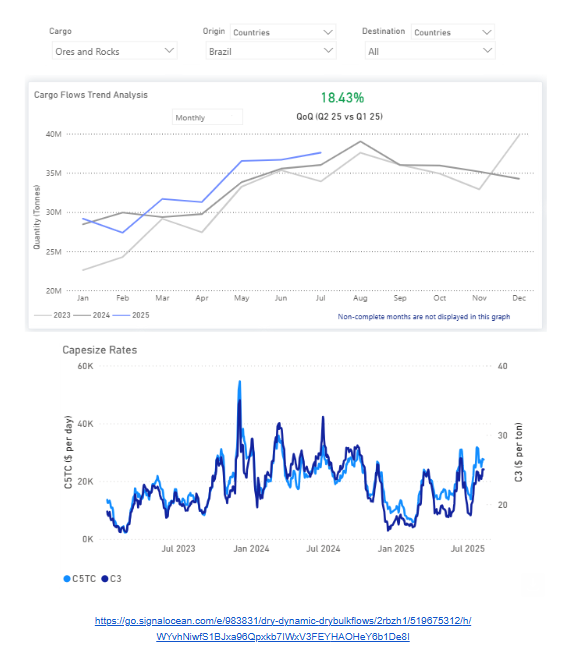

> **Figure 1: Στιγμιότυπο Οθόνης 2025 08 14 140609**  
> **Interactive Data & Source:** [Signal Ocean Platform](https://go.signalocean.com/e/983831/y-minor-bulk-radar-august-2025/2rbzh4/519675312/h/WYvhNiwfS1BJxa96Qpxkb7IWxV3FEYHAOHeY6b1De8I) | [Local Asset](file:///C:/Users/Dell/Github/Shipping/corpus/03-breakwave/insights/2025/assets/2025-08-14_spotlight-on-brazilian-iron-ore-shipments_img_cea3cf84ceb9ceb3cebcceb9cf8ccf84cf85_3f4ea9b2881d.png)

This week’s Chart Monitor highlights a significant increase in Brazilian iron ore shipments, up 18% in Q2 compared to Q1, with July volumes reaching nearly 38 million tonnes (from about 29 million tonnes at the start of 2025). This marks the strongest monthly level since the beginning of the year and outpaces the same period over the past two years. While this rise aligns with typical seasonal momentum, July has now set a new high for the period, closely trailing last August’s record of 39 Mt.

Vale’s production performance helps explain this momentum. Q2 output rose to 83.6 Mt, a 3.7% year-on-year increase, driven by elevated performance at its S11D and Brucutu mines. The company remains firmly on track toward its 2025 production goal of 325–335 million tonnes. This rebound follows seasonal disruptions in Q1, when heavy rains caused production to decrease to 67.7 million tonnes. Historically, Vale’s output has dipped early in the year due to weather before rebounding in Q2 and Q3 as operational conditions improve.

On the demand side, a Reuters survey indicates that Chinese iron ore imports are expected to remain strong in 2025 despite weakness in the domestic steel sector. This is being driven by traders building stockpiles at favorable prices and steady supply flows from Brazil and Australia. The combination of sustained Chinese demand and increased Brazilian export volumes has strengthened Capesize freight market dynamics. C3 Tubarao–Qingdao rates are holding near $25/ton, while 5TC average earnings have risen to $30,000/day, a $7,600 increase over the past month.

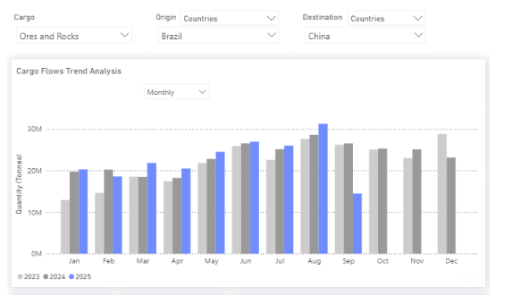

> **Figure 2: Στιγμιότυπο Οθόνης 2025 08 14 140847**  
> **Interactive Data & Source:** [Signal Ocean Platform](https://go.signalocean.com/e/983831/y-minor-bulk-radar-august-2025/2rbzh4/519675312/h/WYvhNiwfS1BJxa96Qpxkb7IWxV3FEYHAOHeY6b1De8I) | [Local Asset](file:///C:/Users/Dell/Github/Shipping/corpus/03-breakwave/insights/2025/assets/2025-08-14_spotlight-on-brazilian-iron-ore-shipments_img_cea3cf84ceb9ceb3cebcceb9cf8ccf84cf85_e92860c909f5.png)

A new factor is also emerging in the trade flow: India has begun importing Brazilian iron ore. This diversification of end-market demand adds another layer of support to the already bullish Capesize freight sentiment, alongside the additional tonnage movements from projects such as Simandou’s new[bauxite](https://go.signalocean.com/e/983831/y-minor-bulk-radar-august-2025/2rbzh4/519675312/h/WYvhNiwfS1BJxa96Qpxkb7IWxV3FEYHAOHeY6b1De8I)activity.

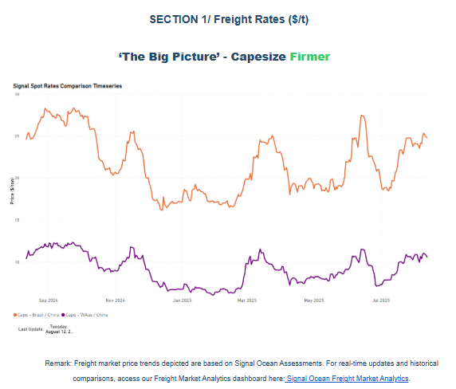

> **Figure 3: Στιγμιότυπο Οθόνης 2025 08 14 140948**  
> **Interactive Data & Source:** [Signal Ocean Platform](https://go.signalocean.com/e/983831/y-minor-bulk-radar-august-2025/2rbzh4/519675312/h/WYvhNiwfS1BJxa96Qpxkb7IWxV3FEYHAOHeY6b1De8I) | [Local Asset](file:///C:/Users/Dell/Github/Shipping/corpus/03-breakwave/insights/2025/assets/2025-08-14_spotlight-on-brazilian-iron-ore-shipments_img_cea3cf84ceb9ceb3cebcceb9cf8ccf84cf85_30a69827cc29.png)

Signs of an upward correction are primarily observed on the**C3**route. Rates are currently at $25/ton for Brazil–China and $10.6/ton for Australia–China. The oversupply issues in the South Atlantic have begun to alleviate, evidenced by a decrease of almost 15 ballasters, now totaling 255, while daily loaded volumes remain low at approximately 1.1 million tonnes.

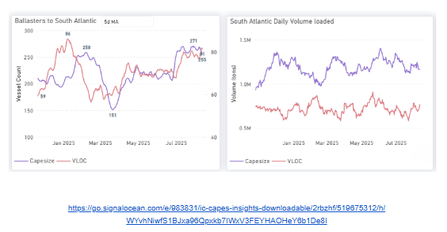

> **Figure 4: Στιγμιότυπο Οθόνης 2025 08 14 141037**  
> **Interactive Data & Source:** [Signal Ocean Platform](https://go.signalocean.com/e/983831/y-minor-bulk-radar-august-2025/2rbzh4/519675312/h/WYvhNiwfS1BJxa96Qpxkb7IWxV3FEYHAOHeY6b1De8I) | [Local Asset](file:///C:/Users/Dell/Github/Shipping/corpus/03-breakwave/insights/2025/assets/2025-08-14_spotlight-on-brazilian-iron-ore-shipments_img_cea3cf84ceb9ceb3cebcceb9cf8ccf84cf85_becb5e78f7f5.png)

### Panamax - Ecsa / Far East | USG / China Weaker

Mid-August has seen a continued decline in spot rates for**Panamax**vessels on routes from East Coast South America (ECSA) and the US Gulf (USG) to the Far East, with monthly drops of 11% and 8% respectively. This weak momentum is exacerbated by an increasing trend in ECSA Panamax ballasters, now numbering 260, approaching the early February high of 280. Despite the rise in ballasters, the ECSA daily loaded volume remains high, contributing to owners' resistance against a stronger freight market.

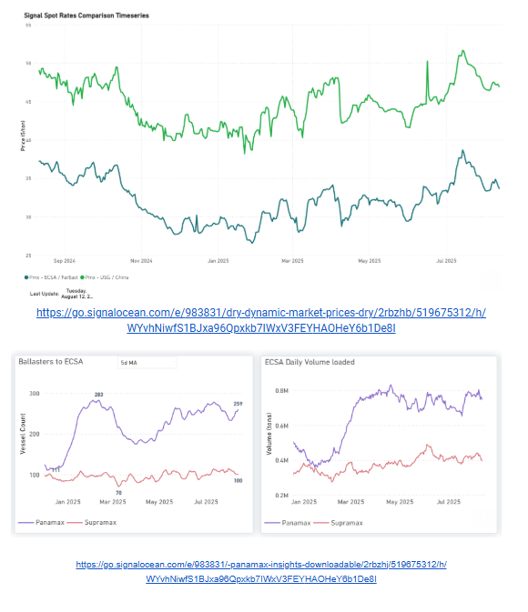

> **Figure 5: Στιγμιότυπο Οθόνης 2025 08 14 142527**  
> **Interactive Data & Source:** [Signal Ocean Platform](https://go.signalocean.com/e/983831/y-minor-bulk-radar-august-2025/2rbzh4/519675312/h/WYvhNiwfS1BJxa96Qpxkb7IWxV3FEYHAOHeY6b1De8I) | [Local Asset](file:///C:/Users/Dell/Github/Shipping/corpus/03-breakwave/insights/2025/assets/2025-08-14_spotlight-on-brazilian-iron-ore-shipments_img_cea3cf84ceb9ceb3cebcceb9cf8ccf84cf85_de08eecf4f8b.png)

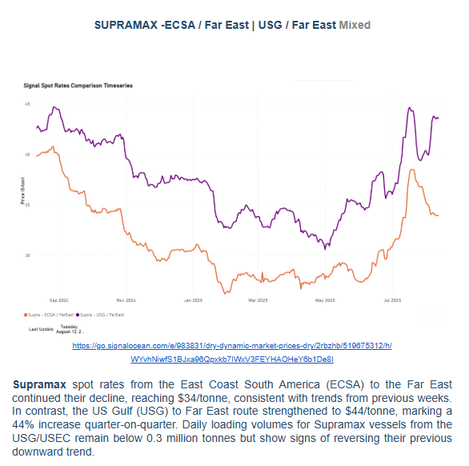

> **Figure 6: Στιγμιότυπο Οθόνης 2025 08 14 142536**  
> **Interactive Data & Source:** [Signal Ocean Platform](https://go.signalocean.com/e/983831/y-minor-bulk-radar-august-2025/2rbzh4/519675312/h/WYvhNiwfS1BJxa96Qpxkb7IWxV3FEYHAOHeY6b1De8I) | [Local Asset](file:///C:/Users/Dell/Github/Shipping/corpus/03-breakwave/insights/2025/assets/2025-08-14_spotlight-on-brazilian-iron-ore-shipments_img_cea3cf84ceb9ceb3cebcceb9cf8ccf84cf85_81a6d7cfce1c.png)

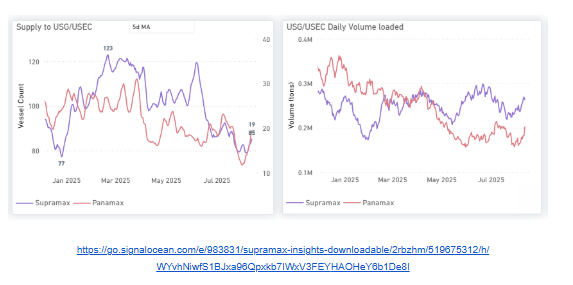

> **Figure 7: Στιγμιότυπο Οθόνης 2025 08 14 142651**  
> **Interactive Data & Source:** [Signal Ocean Platform](https://go.signalocean.com/e/983831/y-minor-bulk-radar-august-2025/2rbzh4/519675312/h/WYvhNiwfS1BJxa96Qpxkb7IWxV3FEYHAOHeY6b1De8I) | [Local Asset](file:///C:/Users/Dell/Github/Shipping/corpus/03-breakwave/insights/2025/assets/2025-08-14_spotlight-on-brazilian-iron-ore-shipments_img_cea3cf84ceb9ceb3cebcceb9cf8ccf84cf85_d97ce32eed4f.png)

### Section 2/ Supply

### Capesize Ballasters Overview (# Vessel Count) Mixed

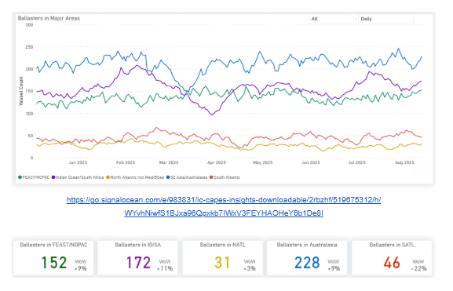

> **Figure 8: Στιγμιότυπο Οθόνης 2025 08 14 142743**  
> **Interactive Data & Source:** [Signal Ocean Platform](https://go.signalocean.com/e/983831/y-minor-bulk-radar-august-2025/2rbzh4/519675312/h/WYvhNiwfS1BJxa96Qpxkb7IWxV3FEYHAOHeY6b1De8I) | [Local Asset](file:///C:/Users/Dell/Github/Shipping/corpus/03-breakwave/insights/2025/assets/2025-08-14_spotlight-on-brazilian-iron-ore-shipments_img_cea3cf84ceb9ceb3cebcceb9cf8ccf84cf85_e6729c49a504.png)

**Capesize ballasters view:**Capesize ballast availability saw a notable decline in the South Atlantic, plummeting by 20%, while the North Atlantic experienced a slight increase of 3%. In contrast, the Pacific region observed an upward trend in ballast activity, with an 11% rise in the Indian Ocean and a 9% increase in both the Far East/NOPAC and Australasia.

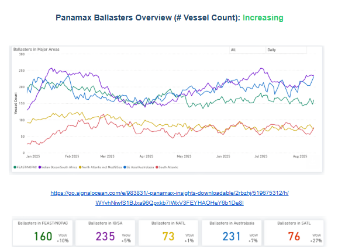

> **Figure 9: Στιγμιότυπο Οθόνης 2025 08 14 142918**  
> **Interactive Data & Source:** [Signal Ocean Platform](https://go.signalocean.com/e/983831/y-minor-bulk-radar-august-2025/2rbzh4/519675312/h/WYvhNiwfS1BJxa96Qpxkb7IWxV3FEYHAOHeY6b1De8I) | [Local Asset](file:///C:/Users/Dell/Github/Shipping/corpus/03-breakwave/insights/2025/assets/2025-08-14_spotlight-on-brazilian-iron-ore-shipments_img_cea3cf84ceb9ceb3cebcceb9cf8ccf84cf85_018d21ce37cb.png)

**Panamax ballasters view:**Pacific ballast activity continued to reflect an oversupplied market. The South Atlantic also saw a significant 27% weekly increase, with the North Atlantic being the only region showing an easing trend.

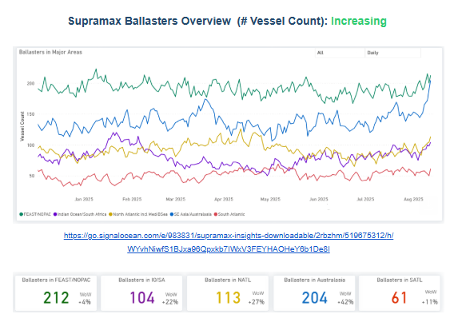

> **Figure 10: Στιγμιότυπο Οθόνης 2025 08 14 143008**  
> **Interactive Data & Source:** [Signal Ocean Platform](https://go.signalocean.com/e/983831/y-minor-bulk-radar-august-2025/2rbzh4/519675312/h/WYvhNiwfS1BJxa96Qpxkb7IWxV3FEYHAOHeY6b1De8I) | [Local Asset](file:///C:/Users/Dell/Github/Shipping/corpus/03-breakwave/insights/2025/assets/2025-08-14_spotlight-on-brazilian-iron-ore-shipments_img_cea3cf84ceb9ceb3cebcceb9cf8ccf84cf85_4fe31f172066.png)

**Supramax ballasters view**: Oversupply worsened in both the Atlantic and Pacific basins. In the Atlantic, ballast supply surged, rising 11% in the South and 27% in the North. Similarly, the Pacific market experienced increases, with the Indian Ocean/South Africa region seeing a 20% rise, and Australasia increasing by 40% week-over-week.

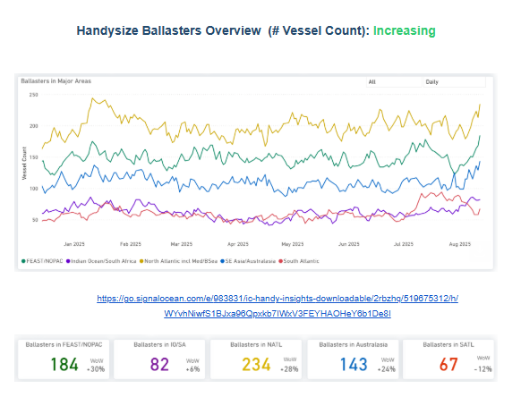

> **Figure 11: Στιγμιότυπο Οθόνης 2025 08 14 143055**  
> **Interactive Data & Source:** [Signal Ocean Platform](https://go.signalocean.com/e/983831/y-minor-bulk-radar-august-2025/2rbzh4/519675312/h/WYvhNiwfS1BJxa96Qpxkb7IWxV3FEYHAOHeY6b1De8I) | [Local Asset](file:///C:/Users/Dell/Github/Shipping/corpus/03-breakwave/insights/2025/assets/2025-08-14_spotlight-on-brazilian-iron-ore-shipments_img_cea3cf84ceb9ceb3cebcceb9cf8ccf84cf85_ad970619ecfa.png)

**Handysize ballasters**: Vessel oversupply has increased significantly, with a 28% rise in the North Atlantic. The Pacific region has also seen substantial increases: 30% in the Far East/NOPAC and 24% in Australasia.

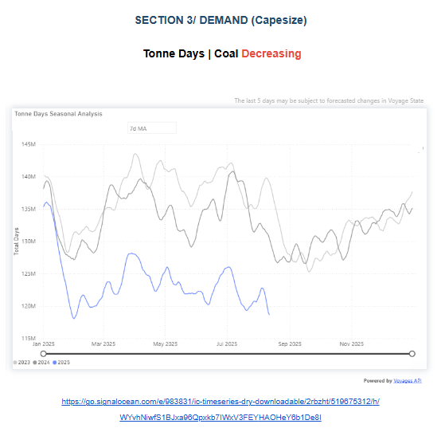

> **Figure 12: Στιγμιότυπο Οθόνης 2025 08 14 143201**  
> **Interactive Data & Source:** [Signal Ocean Platform](https://go.signalocean.com/e/983831/y-minor-bulk-radar-august-2025/2rbzh4/519675312/h/WYvhNiwfS1BJxa96Qpxkb7IWxV3FEYHAOHeY6b1De8I) | [Local Asset](file:///C:/Users/Dell/Github/Shipping/corpus/03-breakwave/insights/2025/assets/2025-08-14_spotlight-on-brazilian-iron-ore-shipments_img_cea3cf84ceb9ceb3cebcceb9cf8ccf84cf85_d1e50e92b617.png)

A notable decline has been observed in the tonne-days seasonal analysis for coal cargo, reaching the lowest levels in three years. This downward trend is anticipated to continue as China and India focus on boosting domestic production and reducing imports. Conversely, a significant upward trend has been recorded in minor bulk tonne-days growth, as highlighted in a previous weekly insight. This week, particular attention is drawn to the increase in chemical bulks tonne-days. Furthermore,[our latest minor radar commodities insights](https://go.signalocean.com/e/983831/y-minor-bulk-radar-august-2025/2rbzh4/519675312/h/WYvhNiwfS1BJxa96Qpxkb7IWxV3FEYHAOHeY6b1De8I)indicate a rise in fertilizer tonne-days destined for Brazil or India.

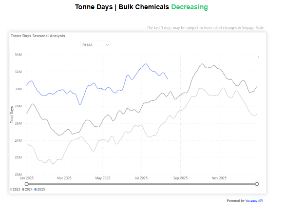

> **Figure 13: Στιγμιότυπο Οθόνης 2025 08 14 143249**  
> **Interactive Data & Source:** [Signal Ocean Platform](https://www.thesignalgroup.com/signal-ocean-platform) | [Local Asset](file:///C:/Users/Dell/Github/Shipping/corpus/03-breakwave/insights/2025/assets/2025-08-14_spotlight-on-brazilian-iron-ore-shipments_img_cea3cf84ceb9ceb3cebcceb9cf8ccf84cf85_73ca7421c85d.png)

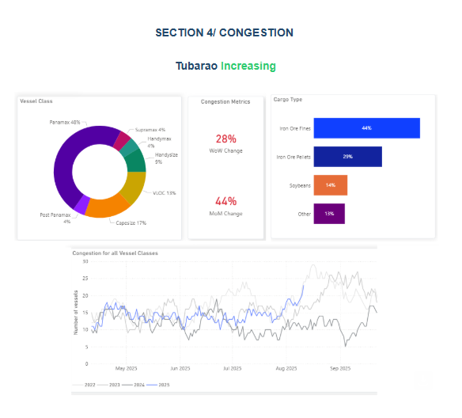

> **Figure 14: Στιγμιότυπο Οθόνης 2025 08 14 143300**  
> **Interactive Data & Source:** [Signal Ocean Platform](https://www.thesignalgroup.com/signal-ocean-platform) | [Local Asset](file:///C:/Users/Dell/Github/Shipping/corpus/03-breakwave/insights/2025/assets/2025-08-14_spotlight-on-brazilian-iron-ore-shipments_img_cea3cf84ceb9ceb3cebcceb9cf8ccf84cf85_f6ef9dbf1ac8.png)

This week's focus is on the rising port congestion in Tubarao, Brazil, potentially linked to the recent surge in Brazilian iron ore shipments. Congestion metrics indicate a 28% increase over the last week and a 44% increase within the last month.

Data Source:[Signal Ocean Platform](https://www.thesignalgroup.com/signal-ocean-platform)

---

**Tags:** Drybulk, Shipping, Ironore  
