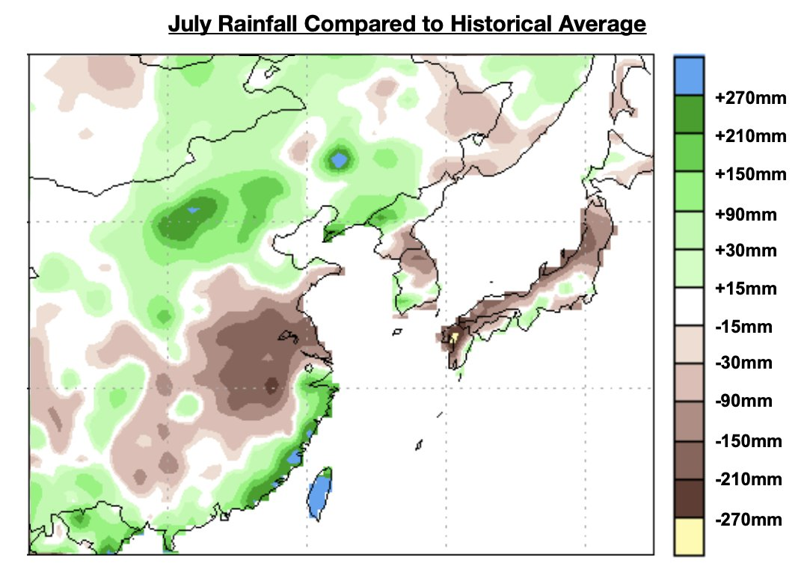

# Low Rainfall Remains Saving Grace For Thermal Coal in China

**Date:** August 15, 2025  
**Publisher:** Breakwave Advisors | **Category:** Market Insights  
**Original URL:** [https://www.breakwaveadvisors.com/insights/2025/8/14/low-rainfall-remains-saving-grace-for-thermal-coal-in-china](https://www.breakwaveadvisors.com/insights/2025/8/14/low-rainfall-remains-saving-grace-for-thermal-coal-in-china)  

---

*By*[*Jeffrey Landsberg*](https://www.linkedin.com/in/jeffrey-landsberg-70ab957/)

As we have been highlighting in Commodore Research's Weekly China Reports, December 2024 though April 2025 were five straight months that saw China’s coal-derived electricity generation contract on a year-on-year basis. May only ushered in a now sustained return of year-on-year growth in coal-derived electricity generation because of lower than normal rainfall in much of southern and eastern China, which has been causing hydropower output to contract (several of China’s largest hydropower stations are located where rainfall has remained lower than usual). Rainfall was again lower than normal in the south and east last month, and it has remained lower than usual so far this month.

> **Figure 1: Chart**  
> [Local Asset](file:///C:/Users/Dell/Github/Shipping/corpus/03-breakwave/insights/2025/assets/2025-08-15_low-rainfall-remains-saving-grace-for-thermal-coal-in-china_img_chart_f3461f592317.jpg)

Overall, the dry bulk and thermal coal markets have been catching a break with rainfall staying lower than usual where so many of China’s major hydropower stations are located. Unfortunately, we have been continuing to stress in our reports that rainfall, of course, will not always be lower than usual here — and China’s coal-derived electricity generation will very likely come under pressure again whenever the rainfall does eventually normalize.

---

**Tags:** China, Coal, Drybulk  
