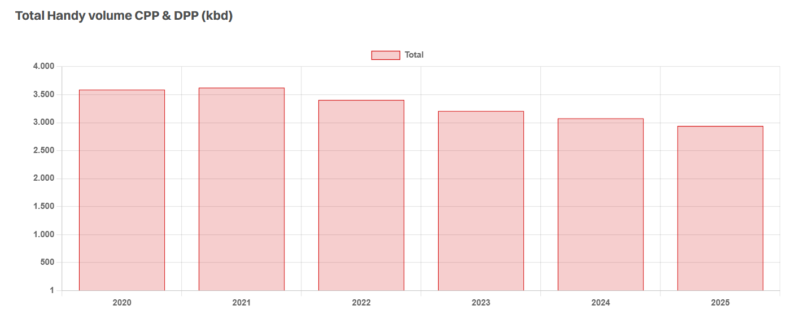

# Still Handy?

**Date:** August 18, 2025  
**Publisher:** Breakwave Advisors | **Category:** Market Insights  
**Original URL:** [https://www.breakwaveadvisors.com/insights/2025/8/18/still-handy](https://www.breakwaveadvisors.com/insights/2025/8/18/still-handy)  

---

> **Figure 1: Istock 1155718700**  
> **Interactive Data & Source:** [Gibsons Co](https://www.gibsons.co.uk/market-reports) | [Local Asset](file:///C:/Users/Dell/Github/Shipping/corpus/03-breakwave/insights/2025/assets/2025-08-18_still-handy_img_istock-1155718700_fabb1516784c.jpg)

The Handy tanker market continues to shrink. This has been an ongoing trend for many years, which was rapidly accelerated by the conflict in Ukraine. With spot fixtures in the Baltic and the Black Sea going from around a third of total fixtures to less than 10% each year since 2023, Handies had to find demand elsewhere. Nevertheless, total volumes have continued their ongoing downwards trend, and this year seems to be no different. If the trend doesn’t change going into Q4, numbers for 2025 look set to drop compared with 2024. So far this year, total clean and dirty volumes carried on Handies have declined by about 5% YTD compared to 2024. The total number of spot fixtures has also declined, though possible underreporting due to dark fleet activity may affect these numbers.

The Mediterranean remains the most active region for Handies, with over 50% of spot activity taking place here. Earnings in this region are the most representative of the wider Handy market, though they have at times shown extreme volatility. TC6 this year declined significantly from 2024, though now on par with the 10-year average. Freight rates in the UKC have been less volatile but are generally underperforming the Mediterranean market. MRs cannibalising Handy cargoes has led to constant pressure this year with MRs in the UKC and Med MR regions weaker compared to previous years. On the dirty side, the markets have been comparatively stronger this year, possibly helped by the Med ECA. Notably, Handy CPP tonne miles have declined by a substantial 17% year to date, and dirty Handy tonne miles by a mere 3%.

The orderbook for Handies remains favourable at only a modest 6%, despite 2024 seeing the largest number of Handy orders in over a decade. 75% of the fleet over 15 and 41% over 20 years old. If current scrapping trends hold, over 50% of the fleet will be above the age of 20 in 2027. Given that the top charterers for Handies are typically European oil majors and large commodity traders, the aging of the fleet may be a significant supportive factor to watch in the years to come for the few modern ships remaining. However, oil majors have been forced to adjust vetting policies for Handies, with some increasing their age limits beyond 15 years in response to the changing fleet dynamics.

MRs could also exert downward pressure. The MR orderbook is larger at 18%, with a significant number of vessels set to be delivered in the next couple of years. If the MR market weakens as a consequence, more of the larger vessels may encroach on the Handy market, with the trend towards larger stems another factor to watch.

As such, the balance between the size of the addressable market and the employable fleet may be the driving factor of the Handy market in the years to come. Although hard to envisage, if Russia eventually reintegrates into the mainstream oil markets, Handies could see some of their lost demand return.

> **Figure 2: Στιγμιότυπο Οθόνης 2025 08 18 114819**  
> **Interactive Data & Source:** [Gibsons Co](https://www.gibsons.co.uk/market-reports) | [Local Asset](file:///C:/Users/Dell/Github/Shipping/corpus/03-breakwave/insights/2025/assets/2025-08-18_still-handy_img_cea3cf84ceb9ceb3cebcceb9cf8ccf84cf85_8b93672aa88f.png)

Data source:[Gibson Shipbrokers](https://www.gibsons.co.uk/market-reports)

---

**Tags:** Crude, Tankers, Markets  
