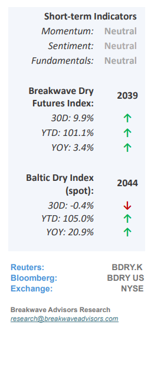
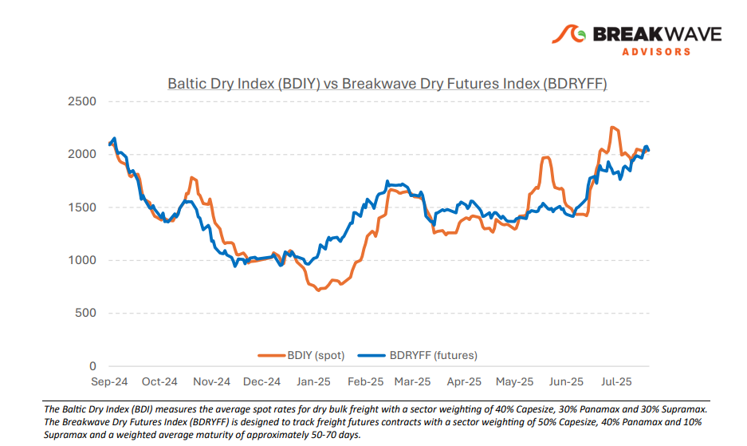
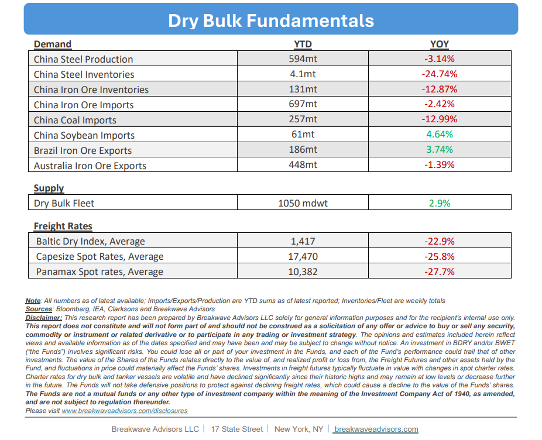

# Breakwave Bi-Weekly Dry Bulk Report - August 19, 2025

**Date:** August 19, 2025  
**Publisher:** Breakwave Advisors | **Category:** Market Insights  
**Original URL:** [https://www.breakwaveadvisors.com/insights/2025819db-5cnlk458](https://www.breakwaveadvisors.com/insights/2025819db-5cnlk458)  

---

•**August Blues Depress Volatility but Rates Hold Strong**– An**uneventful****fortnight**in terms of cargo flow has reduced near-term activity, contributing to a**decline**in spot rate**volatility**. Nevertheless,**spot freight rates**for Capesizes remain at**historically high levels**for this time of year, a notable achievement given the current economic headwinds facing the dry bulk market. Contributing to the current strength are seasonal**rains**in West Africa that have been**weaker**than in prior years, while**iron ore exports**from Brazil have been**stronger**than historical norms. Additionally, a**heavy drydocking**schedule is constraining vessel supply to some extent. As a result, the environment appears conducive to**increasing volatility**in the months ahead despite the current apparent stability. We believe**September**could be a particularly strong month for Capesizes, given the current elevated spot market and the broadly upbeat industry sentiment which could enhance the**positive seasonality****of the particular month.**The freight futures market indicates relatively flat rates for the remainder of the year; however, spot freight rates have a track record of rapidly moving outside of futures expectations as rate steadiness is rare. While the risk of a correction remains a consideration, the current**risk-reward balance**in the short term is**favorable**, supported by both seasonal patterns and underlying sector fundamentals that point to stronger spot rates.

> **Figure 1: Cea3cf84ceb9ceb3cebcceb9cf8ccf84cf85**  
> [Local Asset](file:///C:/Users/Dell/Github/Shipping/corpus/03-breakwave/insights/2025/assets/2025-08-19_2025819db-5cnlk458_img_cea3cf84ceb9ceb3cebcceb9cf8ccf84cf85_d3c0dea7b7c6.png)

•**Chinese Economy Continues to Struggle**–**Chinese economic data**for July came in**weaker**than expected. In the absence of additional stimulus, the risk of missing the 5% annual GDP growth target is now rising. The**real estate**sector continues to act as a major**drag**on the economy, while**consumer**spending remains weak, as indicated by softer-than-expected July retail sales. Industrial activity slowed further, and unemployment, particularly among younger workers, remains a concern. There is**little sign of imminent improvement**in overall activity absent additional government intervention. Although dry bulk shipping is currently at a relatively strong level, it is important to remember China’s outsized influence on demand for key bulk commodities such as**iron ore**and coal. Prices for those two important commodities have once again reached the high end of the recent range but have failed to break out. We expect iron ore prices to revert and remain**under pressure**as new supply and tepid demand growth are structurally bearish factors for this market while shifts in Chinese demand could temper or reverse current strength in these markets as almost 2/3 of demand originates in that part of the world.

•**Our Long-term View**– The last few years have been characterized by increased geopolitical uncertainty. Going forward, we expect such events to continue to affect global trade and have a meaningful impact on effective vessel supply. Combined with the potential for a multi-year cyclical rebound in China’s economic activity following the recent economic turmoil, dry bulk shipping should experience higher volatility on top of a secular tightness driven by stable bulk commodity demand and a slower fleet growth owing to a relatively low orderbook.

> **Figure 2: Στιγμιότυπο Οθόνης 2025 08 19 090327**  
> [Local Asset](file:///C:/Users/Dell/Github/Shipping/corpus/03-breakwave/insights/2025/assets/2025-08-19_2025819db-5cnlk458_img_cea3cf84ceb9ceb3cebcceb9cf8ccf84cf85_31c86f1e0c68.png)

> **Figure 3: Στιγμιότυπο Οθόνης 2025 08 19 101821**  
> [Local Asset](file:///C:/Users/Dell/Github/Shipping/corpus/03-breakwave/insights/2025/assets/2025-08-19_2025819db-5cnlk458_img_cea3cf84ceb9ceb3cebcceb9cf8ccf84cf85_efef7a5a285f.png)

### Subscribe:
