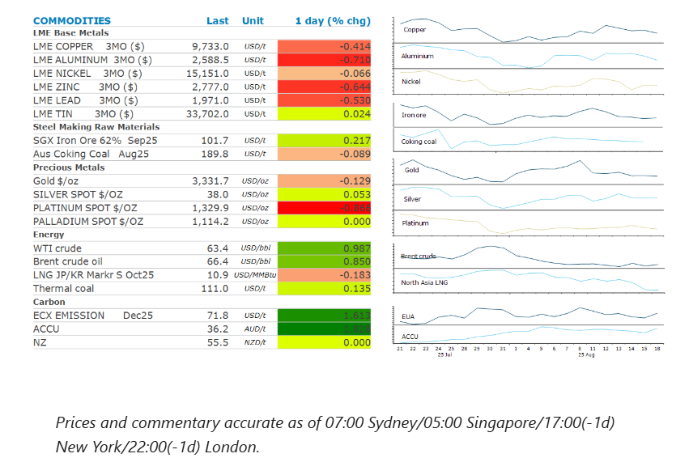
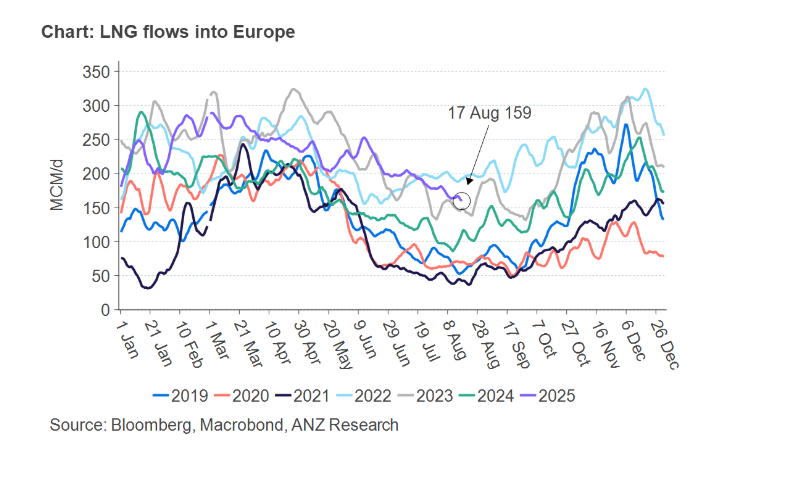

# Markets mixed amid subdued trading

**Date:** August 19, 2025  
**Publisher:** Breakwave Advisors | **Category:** Market Insights  
**Original URL:** [https://www.breakwaveadvisors.com/insights/2025/8/19/markets-mixed-amid-subdued-trading](https://www.breakwaveadvisors.com/insights/2025/8/19/markets-mixed-amid-subdued-trading)  

---

A lack of progress towards a peace deal in Ukraine pushed oil higher. However, a stronger USD weighed on investor appetite across the reset of the complex.

*By*[*Daniel Hynes*](https://www.linkedin.com/in/dahynes/)

> **Figure 1: Στιγμιότυπο Οθόνης 2025 08 19 112143**  
> **Interactive Data & Source:** [Linkedin](https://www.linkedin.com/newsletters/commodities-wrap-6692196755876012032/?fbclid=IwAR3kiXJqZdxmp9ZcRwBNI7FsBySI-XSC0pfPur1qzjt7OZp7PTE59Tsl1QI) | [Local Asset](file:///C:/Users/Dell/Github/Shipping/corpus/03-breakwave/insights/2025/assets/2025-08-19_markets-mixed-amid-subdued-trading_img_cea3cf84ceb9ceb3cebcceb9cf8ccf84cf85_d50076e6180a.png)

### Market Commentary

**Crude oil**prices gained as expectations of a ceasefire in Ukraine fell. Zelenskiy said during a meeting with Trump at the White House that Russia and Ukraine would need to find diplomatic ways to end the war. A quick resolution to the conflict with Russia now seems unlikely. Prices had been under pressure late last week as he planned meeting between Trump and Putin raised hopes of a peace deal. Putin praised Trump’s efforts to broker an end to the three-year conflict. While the summit ultimately ended without any agreement, there was enough progress to suggest supply risks are even lower. However, the apparent pushback from Ukraine suggests progress on a peace deal is still some way off. This brings back the risk of additional US sanctions on Russia. For the moment, Trump has singled out India for buying Russian crude. Peter Navaro, the White House counsellor for trade and manufacturing, criticised India’s purchases of Moscow’s barrels of oil in an editorial in the Financial Times.

**Global gas**prices followed oil prices higher amid the uncertain geopolitical backdrop. This was exacerbated by rising trade tensions. Several LNG tankers from a Russian export facility that is sanctioned by the US are heading to Asia, potentially testing the US administration’s resolve to crack down on the trade, amid high level talks over the war in Ukraine. After being idle for weeks, the Iris and Voskhod vessels, carrying gas from the Artic LNG 2 plant in Siberia, began travelling to North Asia on 15 August. The most likely destination is China. This comes as Beijing ramps up its purchases of the fuel amid stronger demand. The 30-day average for LNG imports has been above the five-year average so far for August, according to ship tracking data. However, prices in the North Asian LNG market could come under pressure amid a surge in supply in the Pacific Basin. Canada has joined as the newest exporter alongside new supply from Mexico and Australia.

**Aluminium**and**copper**prices eased following the cautious tone emanating from the White House meeting between Trump and Zelenskiy. However, the uncertain economic backdrop has caused traders to pull back on their bullish expectations. Data released last week showed that fixed asset investment fell the most since early COVID (2020), with industrial activity growth the weakest in eight months. Investors have also been monitoring prospects for US rate cuts and have firm expectations for a rate cut next month.

**Iron ore**snapped a three-day selloff to push higher on expectations of a seasonal bounce in demand in China. Apparent demand for steel typically reaches its lowest point of the year in August, raising hope that the worst is behind the market. Data released recently showed that steel output fell below 80mt to post its weakest performance for the month of July since 2017. The allure of stronger steel prices amid a renewed push to close some steel mills is also providing some support.

**Gold**prices wavered as traders wait for any further signals that rate cuts are imminent. This may come at the Jackson Hole later this week, where Powell is expected to set the scene for rate cuts as early as September. However, the stronger USD tempered investor demand. Easing geopolitical tensions also weighed on haven buying.

### Chart of the Day

LNG has become increasingly imports for Europe as piped gas from Russia drys up. LNG markets have been able to withstand the additional demand from Europe to date, much due to weaker imports from China. However recent data shows that Chinese imports have started to rise. This could be problematic for Europe, with storage levels still well below targeted levels.

> **Figure 2: Στιγμιότυπο Οθόνης 2025 08 19 112232**  
> **Interactive Data & Source:** [Linkedin](https://www.linkedin.com/newsletters/commodities-wrap-6692196755876012032/?fbclid=IwAR3kiXJqZdxmp9ZcRwBNI7FsBySI-XSC0pfPur1qzjt7OZp7PTE59Tsl1QI) | [Local Asset](file:///C:/Users/Dell/Github/Shipping/corpus/03-breakwave/insights/2025/assets/2025-08-19_markets-mixed-amid-subdued-trading_img_cea3cf84ceb9ceb3cebcceb9cf8ccf84cf85_4db6e59f7c1e.png)

Data source:[Commodities Wrap](https://www.linkedin.com/newsletters/commodities-wrap-6692196755876012032/?fbclid=IwAR3kiXJqZdxmp9ZcRwBNI7FsBySI-XSC0pfPur1qzjt7OZp7PTE59Tsl1QI)

---

**Tags:** Shipping, Commodities, Markets  
