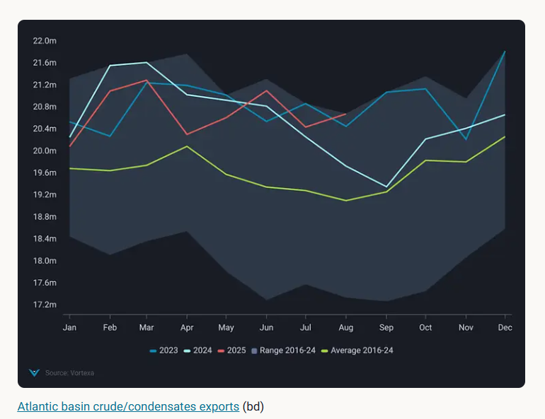
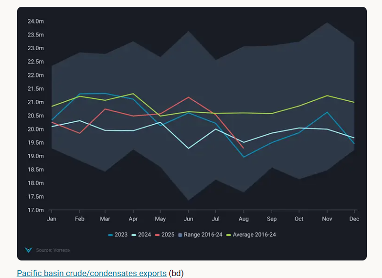
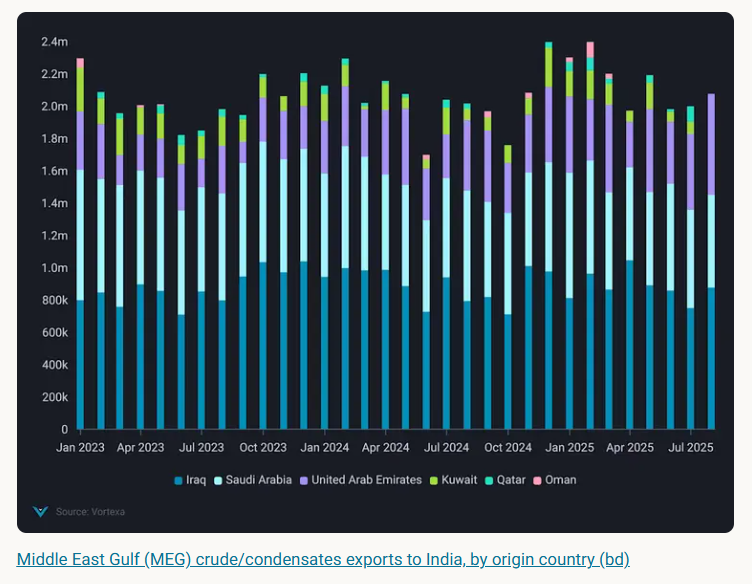
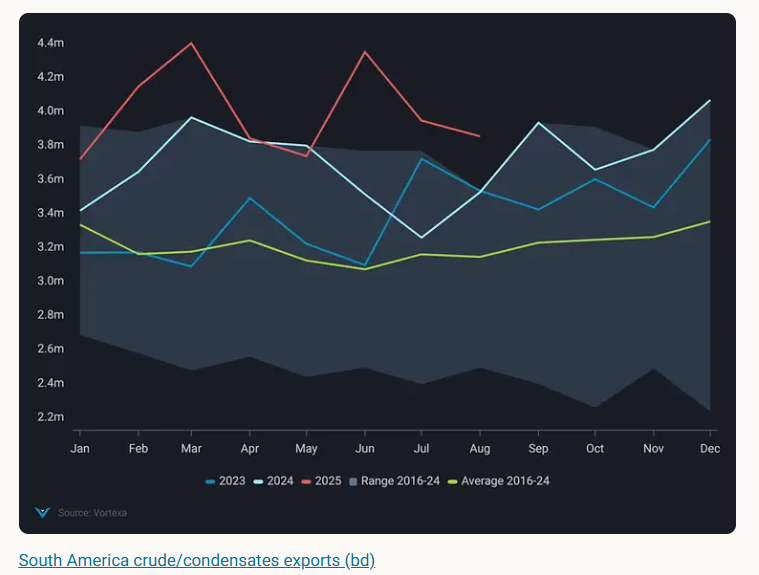

# Global crude exports remain strong as oversupply fears loom

**Date:** August 20, 2025  
**Publisher:** Breakwave Advisors | **Category:** Market Insights  
**Original URL:** [https://www.breakwaveadvisors.com/insights/2025/8/20/global-crude-exports-remain-strong-as-oversupply-fears-loom](https://www.breakwaveadvisors.com/insights/2025/8/20/global-crude-exports-remain-strong-as-oversupply-fears-loom)  

---

In this piece, we take a look at Atlantic and Pacific basin crude export dynamics, the state of OPEC+ and South America exports, and price dynamics.

*By*[*Mark Toth*](https://www.linkedin.com/in/markototh/)

Global crude/condensates departures remained elevated during the first 15 days of August 2025 at around 41mbd,[2% above the 2016-2024 seasonal average](https://analytics.vortexa.com/Flows?dateRange=2023-01-01T00%3A00%3A00.000Z__2025-08-15T23%3A59%3A59.999Z&geoBreakdownDestinationGlobal=region&metric=bpd&page=Flows&products=%5B%2254af755a090118dcf9b0724c9a4e9f14745c26165385ffa7f1445bc768f06f11%22%5D&tabId=5497ec4e-594d-456a-8ff3-0c520431496a&timeSeriesChartView=seasonal&timeSeriesHiddenSeries=%5B%22seasonal_comparison_24%22%2C%22seasonal_comparison_12%22%5D&timeSeriesProperty=destination_shipping_region_v2&v=3)and above both 2023 and 2024 levels.

Nevertheless, despite fears that the swift unwinding of production cuts from the eight core OPEC+ members, and subsequent increased exports mainly from Saudi Arabia and the UAE could push crude markets into oversupply, this has not concretely materialised as of yet. Wider Pacific Basin exports remain below the seasonal average[by around 7%](https://analytics.vortexa.com/Flows?dateRange=2023-01-01T00%3A00%3A00.000Z__2025-08-15T23%3A59%3A59.999Z&from=%5B%22715b6aab56723cb55c3ddbdc12a2851b379919010f119cf98765d4debbdb793d%22%5D&geoBreakdownDestinationGlobal=region&metric=bpd&page=Flows&products=%5B%2254af755a090118dcf9b0724c9a4e9f14745c26165385ffa7f1445bc768f06f11%22%5D&tabId=5497ec4e-594d-456a-8ff3-0c520431496a&timeSeriesChartView=seasonal&timeSeriesHiddenSeries=%5B%22seasonal_comparison_24%22%2C%22seasonal_comparison_12%22%5D&timeSeriesProperty=destination_shipping_region_v2&v=3)during the first 15 days of August.

Instead, the primary driver of late summer strength versus previous years remains the barrels loaded from South America, being[9% above the 2016-2024 seasonal high](https://analytics.vortexa.com/Flows?dateRange=2023-01-01T00%3A00%3A00.000Z__2025-08-15T23%3A59%3A59.999Z&geoBreakdownDestinationGlobal=region&geoBreakdownOriginGlobal=region&metric=bpd&originGlobalXFilter=%5B%22eb51f8315cf769b317615f7fcbdad3ff8612baaea0e9a39d3a63550c44784658%22%5D&page=Flows&products=%5B%2254af755a090118dcf9b0724c9a4e9f14745c26165385ffa7f1445bc768f06f11%22%5D&tabId=5497ec4e-594d-456a-8ff3-0c520431496a&timeSeriesChartView=seasonal&timeSeriesHiddenSeries=%5B%22seasonal_comparison_24%22%2C%22seasonal_comparison_12%22%5D&timeSeriesProperty=origin_country&v=3)for August during the first 15 days, and strong exports from the wider Atlantic basin region in general.

> **Figure 1: Στιγμιότυπο Οθόνης 2025 08 20 131426**  
> **Interactive Data & Source:** [Analytics Vortexa](https://analytics.vortexa.com/Flows?dateRange=2023-01-01T00%3A00%3A00.000Z__2025-08-15T23%3A59%3A59.999Z&from=%5B%220427e0f9d52b38c1a98b68c59b8fd80cb1c508e44882e96611e48ef5b140d927%22%5D&geoBreakdownDestinationGlobal=region&metric=bpd&page=Flows&products=%5B%2254af755a090118dcf9b0724c9a4e9f14745c26165385ffa7f1445bc768f06f11%22%5D&tabId=5497ec4e-594d-456a-8ff3-0c520431496a&timeSeriesChartView=seasonal&timeSeriesHiddenSeries=%5B%22seasonal_comparison_24%22%2C%22seasonal_comparison_12%22%5D&timeSeriesProperty=destination_shipping_region_v2&v=3) | [Local Asset](file:///C:/Users/Dell/Github/Shipping/corpus/03-breakwave/insights/2025/assets/2025-08-20_global-crude-exports-remain-strong-as-oversupply-fears-loom_img_cea3cf84ceb9ceb3cebcceb9cf8ccf84cf85_5ad070098da3.png)

> **Figure 2: Στιγμιότυπο Οθόνης 2025 08 20 131434**  
> **Interactive Data & Source:** [Analytics Vortexa](https://analytics.vortexa.com/Flows?dateRange=2023-01-01T00%3A00%3A00.000Z__2025-08-15T23%3A59%3A59.999Z&from=%5B%220427e0f9d52b38c1a98b68c59b8fd80cb1c508e44882e96611e48ef5b140d927%22%5D&geoBreakdownDestinationGlobal=region&metric=bpd&page=Flows&products=%5B%2254af755a090118dcf9b0724c9a4e9f14745c26165385ffa7f1445bc768f06f11%22%5D&tabId=5497ec4e-594d-456a-8ff3-0c520431496a&timeSeriesChartView=seasonal&timeSeriesHiddenSeries=%5B%22seasonal_comparison_24%22%2C%22seasonal_comparison_12%22%5D&timeSeriesProperty=destination_shipping_region_v2&v=3) | [Local Asset](file:///C:/Users/Dell/Github/Shipping/corpus/03-breakwave/insights/2025/assets/2025-08-20_global-crude-exports-remain-strong-as-oversupply-fears-loom_img_cea3cf84ceb9ceb3cebcceb9cf8ccf84cf85_dad64fd0886e.png)

## Middle East Exports Stable Despite Unwind

Exports from the Middle East Gulf during the first 15 days of August are down by[over 860kbd m-o-m to around 16mbd](https://analytics.vortexa.com/Flows?dateRange=2023-01-01T00%3A00%3A00.000Z__2025-08-15T23%3A59%3A59.999Z&from=%5B%220427e0f9d52b38c1a98b68c59b8fd80cb1c508e44882e96611e48ef5b140d927%22%5D&geoBreakdownDestinationGlobal=region&metric=bpd&page=Flows&products=%5B%2254af755a090118dcf9b0724c9a4e9f14745c26165385ffa7f1445bc768f06f11%22%5D&tabId=5497ec4e-594d-456a-8ff3-0c520431496a&timeSeriesChartView=seasonal&timeSeriesHiddenSeries=%5B%22seasonal_comparison_24%22%2C%22seasonal_comparison_12%22%5D&timeSeriesProperty=destination_shipping_region_v2&v=3), below the seasonal average by around 8%. Given the tendency to front-load Middle Eastern cargoes, exports are projected to dip slightly below[2023 & 2024 levels](https://analytics.vortexa.com/Flows?dateRange=2023-01-01T00%3A00%3A00.000Z__2025-08-31T23%3A59%3A59.999Z&from=%5B%220427e0f9d52b38c1a98b68c59b8fd80cb1c508e44882e96611e48ef5b140d927%22%5D&geoBreakdownDestinationGlobal=region&metric=bpd&page=Flows&products=%5B%2254af755a090118dcf9b0724c9a4e9f14745c26165385ffa7f1445bc768f06f11%22%5D&tabId=5497ec4e-594d-456a-8ff3-0c520431496a&timeSeriesChartView=seasonal&timeSeriesHiddenSeries=%5B%22seasonal_comparison_24%22%2C%22seasonal_comparison_12%22%5D&timeSeriesProperty=destination_shipping_region_v2&v=3), on a full month basis by the end of August.

Until now, the implementation of compensation for past overproduction by some members, as a well as increased domestic use has moderated onshore inventory build within the wider OPEC+ group, with onshore crude stocks 4% below the seasonal average (15 August 2025, Vortexa Global Inventory Report).

Increased demand for Middle Eastern barrels from India has also provided some support, with departures pointed towards India during the first 15 days of August being slightly[above 2024 and 2023 levels](https://analytics.vortexa.com/Flows?dateRange=2023-01-01T00%3A00%3A00.000Z__2025-08-15T23%3A59%3A59.999Z&from=%5B%220427e0f9d52b38c1a98b68c59b8fd80cb1c508e44882e96611e48ef5b140d927%22%5D&geoBreakdownDestinationGlobal=region&metric=bpd&page=Flows&products=%5B%2254af755a090118dcf9b0724c9a4e9f14745c26165385ffa7f1445bc768f06f11%22%5D&tabId=5497ec4e-594d-456a-8ff3-0c520431496a&timeSeriesChartView=seasonal&timeSeriesHiddenSeries=%5B%22seasonal_comparison_24%22%2C%22seasonal_comparison_12%22%5D&timeSeriesProperty=origin_country&to=%5B%2270425373a1836d6d0390dc6fef838a468717fba7776d66065a5043488f9f041b%22%5D&v=3), by 3% and 5%, respectively.

> **Figure 3: Στιγμιότυπο Οθόνης 2025 08 20 131527**  
> **Interactive Data & Source:** [Analytics Vortexa](https://analytics.vortexa.com/Flows?dateRange=2023-01-01T00%3A00%3A00.000Z__2025-08-15T23%3A59%3A59.999Z&geoBreakdownDestinationGlobal=region&geoBreakdownOriginGlobal=region&metric=bpd&originGlobalXFilter=%5B%22eb51f8315cf769b317615f7fcbdad3ff8612baaea0e9a39d3a63550c44784658%22%5D&page=Flows&products=%5B%2254af755a090118dcf9b0724c9a4e9f14745c26165385ffa7f1445bc768f06f11%22%5D&tabId=5497ec4e-594d-456a-8ff3-0c520431496a&timeSeriesChartView=seasonal&timeSeriesHiddenSeries=%5B%22seasonal_comparison_24%22%2C%22seasonal_comparison_12%22%5D&timeSeriesProperty=origin_country&v=3) | [Local Asset](file:///C:/Users/Dell/Github/Shipping/corpus/03-breakwave/insights/2025/assets/2025-08-20_global-crude-exports-remain-strong-as-oversupply-fears-loom_img_cea3cf84ceb9ceb3cebcceb9cf8ccf84cf85_78b021da4403.png)

However, as domestic demand decreases within OPEC+ as the summer season comes to an end, with further production increases in September, it is questionable whether the current level of price stability will persist. The backwardation in the Dubai market - between prompt month and third month forward contracts - has narrowed to $2.37/bl on the 15th of August from close to $3/bl at the start of the month, although it remains above the H1 2025 average of $2.104/bl (Argus).

## Crude Exports From South America and Wider Atlantic Basin Increase Pressure

During the first 15 days of August, crude/condensates exports from South America are down ~90kbd m-o-m but[remain 9% above the seasonal](https://analytics.vortexa.com/Flows?dateRange=2023-01-01T00%3A00%3A00.000Z__2025-08-15T23%3A59%3A59.999Z&geoBreakdownDestinationGlobal=region&geoBreakdownOriginGlobal=region&metric=bpd&originGlobalXFilter=%5B%22eb51f8315cf769b317615f7fcbdad3ff8612baaea0e9a39d3a63550c44784658%22%5D&page=Flows&products=%5B%2254af755a090118dcf9b0724c9a4e9f14745c26165385ffa7f1445bc768f06f11%22%5D&tabId=5497ec4e-594d-456a-8ff3-0c520431496a&timeSeriesChartView=seasonal&timeSeriesHiddenSeries=%5B%22seasonal_comparison_24%22%2C%22seasonal_comparison_12%22%5D&timeSeriesProperty=origin_country&v=3)high for August. The main drivers of growth in the region are Brazil and Guyana, as both countries continue to grow production.

> **Figure 4: Στιγμιότυπο Οθόνης 2025 08 20 132817**  
> **Interactive Data & Source:** [Analytics Vortexa](https://analytics.vortexa.com/Flows?dateRange=2023-01-01T00%3A00%3A00.000Z__2025-08-15T23%3A59%3A59.999Z&geoBreakdownDestinationGlobal=region&geoBreakdownOriginGlobal=shipping_region_v2&metric=bpd&originGlobalXFilter=%5B%228ad76c1c935d5a9598fa1b9545b7f6befd12e71fdd814a14e001bdaf99ef0448%22%5D&page=Flows&products=%5B%2254af755a090118dcf9b0724c9a4e9f14745c26165385ffa7f1445bc768f06f11%22%5D&tabId=5497ec4e-594d-456a-8ff3-0c520431496a&timeSeriesChartView=seasonal&timeSeriesHiddenSeries=%5B%22seasonal_comparison_24%22%2C%22seasonal_comparison_12%22%5D&timeSeriesProperty=origin_country&v=3) | [Local Asset](file:///C:/Users/Dell/Github/Shipping/corpus/03-breakwave/insights/2025/assets/2025-08-20_global-crude-exports-remain-strong-as-oversupply-fears-loom_img_cea3cf84ceb9ceb3cebcceb9cf8ccf84cf85_d3192e89c232.png)

Whilst remaining below 2024 levels and the seasonal average, exports from West Africa are also up ~[230kbd m-o-m](https://analytics.vortexa.com/Flows?dateRange=2023-01-01T00%3A00%3A00.000Z__2025-08-15T23%3A59%3A59.999Z&geoBreakdownDestinationGlobal=region&geoBreakdownOriginGlobal=shipping_region_v2&metric=bpd&originGlobalXFilter=%5B%228ad76c1c935d5a9598fa1b9545b7f6befd12e71fdd814a14e001bdaf99ef0448%22%5D&page=Flows&products=%5B%2254af755a090118dcf9b0724c9a4e9f14745c26165385ffa7f1445bc768f06f11%22%5D&tabId=5497ec4e-594d-456a-8ff3-0c520431496a&timeSeriesChartView=seasonal&timeSeriesHiddenSeries=%5B%22seasonal_comparison_24%22%2C%22seasonal_comparison_12%22%5D&timeSeriesProperty=origin_country&v=3)during the first 15 days of August, and exports from the US are also rebounding from a[500kbd drop-off m-o-m](https://analytics.vortexa.com/Flows?dateRange=2023-01-01T00%3A00%3A00.000Z__2025-08-15T23%3A59%3A59.999Z&geoBreakdownDestinationGlobal=region&metric=bpd&originGlobalXFilter=%5B%222d92cc08f22524dba59f6a7e340f132a9da0ce9573cca968eb8e3752ef17a963%22%5D&page=Flows&products=%5B%2254af755a090118dcf9b0724c9a4e9f14745c26165385ffa7f1445bc768f06f11%22%5D&tabId=5497ec4e-594d-456a-8ff3-0c520431496a&timeSeriesChartView=seasonal&timeSeriesHiddenSeries=%5B%22seasonal_comparison_24%22%2C%22seasonal_comparison_12%22%5D&timeSeriesProperty=origin_country&v=3)from June to July. The resumption of crude flow from Venezuela after the reinstatement of Chevron’s license, and Canadian flows after wildfire disruptions and summer maintenance season are further set to increase heavy crude supply to the US.

## Price Impact Begins to Materialise on Strong Exports

As overall Pacific basin exports during the first 15 days are down around[1.4mbd m-o-m](https://analytics.vortexa.com/Flows?dateRange=2023-01-01T00%3A00%3A00.000Z__2025-08-15T23%3A59%3A59.999Z&from=%5B%22715b6aab56723cb55c3ddbdc12a2851b379919010f119cf98765d4debbdb793d%22%5D&geoBreakdownDestinationGlobal=region&metric=bpd&page=Flows&products=%5B%2254af755a090118dcf9b0724c9a4e9f14745c26165385ffa7f1445bc768f06f11%22%5D&tabId=5497ec4e-594d-456a-8ff3-0c520431496a&timeSeriesChartView=seasonal&timeSeriesHiddenSeries=%5B%22seasonal_comparison_24%22%2C%22seasonal_comparison_12%22%5D&timeSeriesProperty=destination_shipping_region_v2&v=3)and remain below the seasonal average, Atlantic basin exports are up[by over 290kbd m-o-m](https://analytics.vortexa.com/Flows?dateRange=2023-01-01T00%3A00%3A00.000Z__2025-08-15T23%3A59%3A59.999Z&from=%5B%2267be333ea46a3cd312e207b05e2c5c4502a9353e39ec81642a93e3b23cc3c10a%22%5D&geoBreakdownDestinationGlobal=region&metric=bpd&page=Flows&products=%5B%2254af755a090118dcf9b0724c9a4e9f14745c26165385ffa7f1445bc768f06f11%22%5D&tabId=5497ec4e-594d-456a-8ff3-0c520431496a&timeSeriesChartView=seasonal&timeSeriesHiddenSeries=%5B%22seasonal_comparison_24%22%2C%22seasonal_comparison_12%22%5D&timeSeriesProperty=destination_shipping_region_v2&v=3)and are 8% above the seasonal average. Atlantic basin exports are likely to come-off over the full month based on preliminary data, but increased supply from Brazil and Guyana are expected to keep them at seasonally high levels[for the month of August](https://analytics.vortexa.com/Flows?dateRange=2023-01-01T00%3A00%3A00.000Z__2025-08-31T23%3A59%3A59.999Z&from=%5B%2267be333ea46a3cd312e207b05e2c5c4502a9353e39ec81642a93e3b23cc3c10a%22%5D&geoBreakdownDestinationGlobal=region&metric=bpd&page=Flows&products=%5B%2254af755a090118dcf9b0724c9a4e9f14745c26165385ffa7f1445bc768f06f11%22%5D&tabId=5497ec4e-594d-456a-8ff3-0c520431496a&timeSeriesChartView=seasonal&timeSeriesHiddenSeries=%5B%22seasonal_comparison_24%22%2C%22seasonal_comparison_12%22%5D&timeSeriesProperty=destination_shipping_region_v2&v=3)2025.

Strong exports from the Atlantic basin, coupled with an expected seasonal decline in demand for crude imports from Europe and the start of autumn refinery maintenances have already begun to convert into downward pressure on Atlantic basin crude prices, with the Brent-Dubai EFS dropping precipitously from their late June high of $3.70/bl to $0.23/bl on the 18th of August 2025 (Argus). Outright benchmark crude prices also appear to have come under increasing pressure, with pricing falling since a spike in late July. This is likely to provide impetus to increased exports from the Atlantic Basin towards the East of Suez markets driven by price action.

Data Source:[Vortexa](https://www.vortexa.com//oil-gas-data-traders-analysts-data-scientists?gclid=Cj0KCQjw8_qRBhCXARIsAE2AtRZKOvMnbilZ_6_91d7huSFFy71pWLrnPwGwOHVzXsmsG-1a1mZnQw8aAt89EALw_wcB&hsa_acc=1782073842&hsa_ad=548425387665&hsa_cam=14746637662&hsa_grp=125038601902&hsa_kw=&hsa_mt=&hsa_net=adwords&hsa_src=g&hsa_tgt=dsa-1431852288425&hsa_ver=3&utm_campaign=%5BCD%5D%20-%20DSA%20-%20EMEA&utm_medium=cpc&utm_medium=ppc&utm_source=google&utm_source=adwords&utm_term=)

---

**Tags:** Crude, Market, Tankers  
