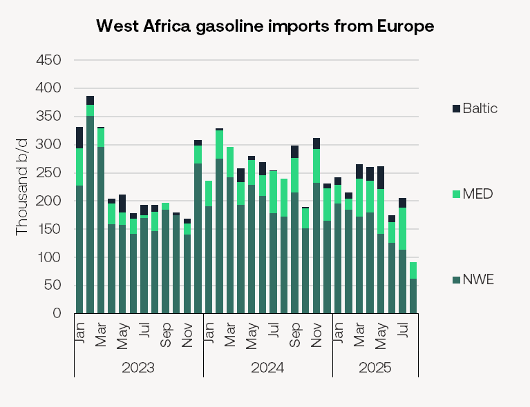

# Tankers Research Update

**Date:** August 21, 2025  
**Publisher:** Breakwave Advisors | **Category:** Market Insights  
**Original URL:** [https://www.breakwaveadvisors.com/insights/2025/8/21/tankers-research-update](https://www.breakwaveadvisors.com/insights/2025/8/21/tankers-research-update)  

---

### Dangote Gasoline Threatens European Refiners

• European refiners remain under pressure in the gasoline market as Nigeria’s 650k b/d Dangote refinery ramps up output.

• West African gasoline imports from Europe averaged just 270k b/d this year as of August 18, down from 260k b/d in 2024, according to Vortexa. Dangote has increased its crude intake — now above 500k b/d — as the refinery steadily brings units online. Nigeria, which previously accounted for one in five European gasoline barrels last year, now accounts for just one in ten.

> **Figure 1: Bfe8 Image 0 1755745751951**  
> [Local Asset](file:///C:/Users/Dell/Github/Shipping/corpus/03-breakwave/insights/2025/assets/2025-08-21_tankers-research-update_img_bfe8-image-0-1755745751951_14cf2a2999a4.png)

• The decline in European barrels heading to West Africa — historically a core employment route for MRs and LR1s — is leaving more gasoline trapped in Europe. Inventories in Rotterdam independent storage have climbed by over 25% year on year in 2025. While refiners have adjusted their yields to favour diesel amid stronger diesel crack margins, European gasoline cracks have still averaged just $9/bl this year, a third below 2024 levels.

• The loss of Nigerian demand represents a structural hit to MR tonne-miles. The UK and northwest Europe were key loading points for West Africa-bound flows, typically sailing 3,000–3,500 nautical miles to Lagos and other Nigerian ports. The reduction equates to a loss of around 50k b/d of MR trade into the region as of this year.

• Refinery closures are altering the trade flows. Prax’s 105k b/d Lindsey refinery in the UK shut earlier this year, eliminating around 50k b/d of gasoline output — including 20k b/d of higher-sulphur grades that previously moved into West Africa.

• Refineries in the UK, France, and Norway face the greatest closure risk with the loss of Nigerian imports. Some North European barrels have been redirected into the Mediterranean, which saw an increase of approximately 5 MR liftings per month this year compared to 2024.

---

**Tags:** Tankers, Crude, Shipping  
