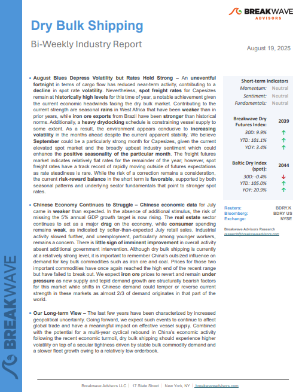
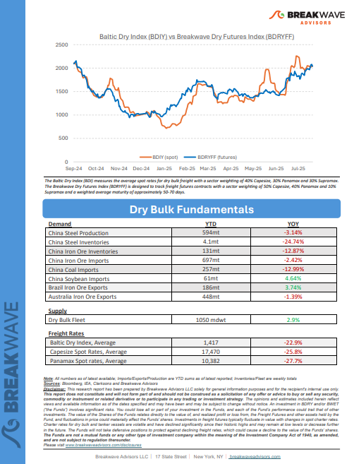

# Breakwave Weekend Read

**Date:** August 22, 2025  
**Publisher:** Breakwave Advisors | **Category:** Market Insights  
**Original URL:** [https://www.breakwaveadvisors.com/insights/2024/10/25/breakwave-weekend-read-547kk-rw7zy-awmfb-mf26k-dk29d-56ysb-x3jbe-xbwk9-dnpbr-b6jhc](https://www.breakwaveadvisors.com/insights/2024/10/25/breakwave-weekend-read-547kk-rw7zy-awmfb-mf26k-dk29d-56ysb-x3jbe-xbwk9-dnpbr-b6jhc)  

---

## Welcome Tobreakwave Advisorsweekend Read

***As the week comes to a close, take a moment to review the key insights from the past few days. Missed something? We've gathered all the top insights for you to catch up at your convenience.***

## Breakwave Shipping Report

**August Blues Depress Volatility but Rates Hold Strong**– An**uneventful****fortnight**in terms of cargo flow has reduced near-term activity, contributing to a**decline**in spot rate**volatility**.

[Read More](https://www.breakwaveadvisors.com/insights/2025819db-5cnlk458)

> **Figure 1: Στιγμιότυπο Οθόνης 2025 08 21 114641**  
> **Interactive Data & Source:** [Breakwave Advisors Market Insights](https://www.breakwaveadvisors.com/insights/2025/8/18/still-handy) | [Local Asset](file:///C:/Users/Dell/Github/Shipping/corpus/03-breakwave/insights/2025/assets/2025-08-22_breakwave-weekend-read-547kk-rw7zy-awmfb-mf26k-dk29d-56ysb-x3jbe-xbwk9-dnpbr-b6j_img_cea3cf84ceb9ceb3cebcceb9cf8ccf84cf85_12eaa8ed08c8.png)

> **Figure 2: Στιγμιότυπο Οθόνης 2025 08 21 114655**  
> **Interactive Data & Source:** [Breakwave Advisors Market Insights](https://www.breakwaveadvisors.com/insights/2025/8/18/still-handy) | [Local Asset](file:///C:/Users/Dell/Github/Shipping/corpus/03-breakwave/insights/2025/assets/2025-08-22_breakwave-weekend-read-547kk-rw7zy-awmfb-mf26k-dk29d-56ysb-x3jbe-xbwk9-dnpbr-b6j_img_cea3cf84ceb9ceb3cebcceb9cf8ccf84cf85_bc7e47a889b9.png)

## Still Handy?

> **Figure 3: Istock 1155718700**  
> **Interactive Data & Source:** [Breakwave Advisors Market Insights](https://www.breakwaveadvisors.com/insights/2025/8/18/still-handy) | [Local Asset](file:///C:/Users/Dell/Github/Shipping/corpus/03-breakwave/insights/2025/assets/2025-08-22_breakwave-weekend-read-547kk-rw7zy-awmfb-mf26k-dk29d-56ysb-x3jbe-xbwk9-dnpbr-b6j_img_istock-1155718700_fabb1516784c.jpg)

The Handy tanker market continues to shrink. This has been an ongoing trend for many years, which was rapidly accelerated by the conflict in Ukraine.

Gibson Tanker Market Report

## Markets Mixed Amid Subdued Trading

> **Figure 4: Unsplash Image Eqfu9ijtbqq**  
> **Interactive Data & Source:** [Breakwave Advisors Market Insights](https://www.breakwaveadvisors.com/insights/2025/8/19/markets-mixed-amid-subdued-trading) | [Local Asset](file:///C:/Users/Dell/Github/Shipping/corpus/03-breakwave/insights/2025/assets/2025-08-22_breakwave-weekend-read-547kk-rw7zy-awmfb-mf26k-dk29d-56ysb-x3jbe-xbwk9-dnpbr-b6j_img_unsplash-image-eqfu9ijtbqq_e6a3a25ed3ff.jpg)

A lack of progress towards a peace deal in Ukraine pushed oil higher. However, a stronger USD weighed on investor appetite across the reset of the complex.

Commodities Wrap

## Shipbuilding Sector Has Witnessed Notable Developments

> **Figure 5: Unsplash Image L3wpmto Zku**  
> **Interactive Data & Source:** [Breakwave Advisors Market Insights](https://www.breakwaveadvisors.com/insights/2025/8/20/shipbuilding-sector-has-witnessed-notable-developments) | [Local Asset](file:///C:/Users/Dell/Github/Shipping/corpus/03-breakwave/insights/2025/assets/2025-08-22_breakwave-weekend-read-547kk-rw7zy-awmfb-mf26k-dk29d-56ysb-x3jbe-xbwk9-dnpbr-b6j_img_unsplash-image-l3wpmto-zku_cd90fbebe1ad.jpg)

Recently, the shipbuilding sector has witnessed notable developments across the Atlantic, driven by President Trump’s long-term ambitions to revive US shipbuilding industry.

Intermodal Weekly Market Report

## Global Crude Exports Remain Strong As Oversupply Fears Loom

> **Figure 6: Στιγμιότυπο+οθόνης+2025 08 20+131204**  
> **Interactive Data & Source:** [Breakwave Advisors Market Insights](https://www.breakwaveadvisors.com/insights/2025/8/20/global-crude-exports-remain-strong-as-oversupply-fears-loom) | [Local Asset](file:///C:/Users/Dell/Github/Shipping/corpus/03-breakwave/insights/2025/assets/2025-08-22_breakwave-weekend-read-547kk-rw7zy-awmfb-mf26k-dk29d-56ysb-x3jbe-xbwk9-dnpbr-b6j_img_cea3cf84ceb9ceb3cebcceb9cf8ccf84cf85_5fd5dbcd366a.webp)

In this piece, we take a look at Atlantic and Pacific basin crude export dynamics, the state of OPEC+ and South America exports, and price dynamics.

Vortexa Freight Weekly

## Dry Bulk Carrier Newbuilding: Has the Supercycle Run Its Course?

> **Figure 7: Unsplash Image Gemrkzgh4tw**  
> **Interactive Data & Source:** [Breakwave Advisors Market Insights](https://www.breakwaveadvisors.com/insights/2025/8/20/dry-bulk-carrier-newbuilding-has-the-supercycle-run-its-course) | [Local Asset](file:///C:/Users/Dell/Github/Shipping/corpus/03-breakwave/insights/2025/assets/2025-08-22_breakwave-weekend-read-547kk-rw7zy-awmfb-mf26k-dk29d-56ysb-x3jbe-xbwk9-dnpbr-b6j_img_unsplash-image-gemrkzgh4tw_f8595ceb5e1b.jpg)

In the first seven months of 2025, dry bulker ordering activity has experienced an unusually deep slump compared to the last few years.

BRS Weekly Dry Bulk Newsletter

## Tankers Research Update

> **Figure 8: Unsplash Image Rmn7d4 8tjq**  
> **Interactive Data & Source:** [Breakwave Advisors Market Insights](https://www.breakwaveadvisors.com/insights/2025/8/21/tankers-research-update) | [Local Asset](file:///C:/Users/Dell/Github/Shipping/corpus/03-breakwave/insights/2025/assets/2025-08-22_breakwave-weekend-read-547kk-rw7zy-awmfb-mf26k-dk29d-56ysb-x3jbe-xbwk9-dnpbr-b6j_img_unsplash-image-rmn7d4-8tjq_ffdb31ec8900.jpg)

European refiners remain under pressure in the gasoline market as Nigeria’s 650k b/d Dangote refinery ramps up output.

Braemar Research

## Chinese Coal Import Demand Prospects Finally Improving

> **Figure 9: Unsplash Image 9bdt03k4ujw**  
> **Interactive Data & Source:** [Breakwave Advisors Market Insights](https://www.breakwaveadvisors.com/insights/2025/8/22/chinese-coal-import-demand-prospects-finally-improving) | [Local Asset](file:///C:/Users/Dell/Github/Shipping/corpus/03-breakwave/insights/2025/assets/2025-08-22_breakwave-weekend-read-547kk-rw7zy-awmfb-mf26k-dk29d-56ysb-x3jbe-xbwk9-dnpbr-b6j_img_unsplash-image-9bdt03k4ujw_a187ac2fb20a.jpg)

As we discussed in Commodore Research's most recent Weekly China Report, domestic coal production totaled 381 million tons in July.

From Commodore's Weekly Dry Bulk Reports

## Iran Flows Steady, Venezuela Exports Lag

> **Figure 10: Unsplash Image Xrdbdmqspdk**  
> **Interactive Data & Source:** [Breakwave Advisors Market Insights](https://www.breakwaveadvisors.com/insights/2025/8/22/iran-flows-steady-venezuela-exports-lag) | [Local Asset](file:///C:/Users/Dell/Github/Shipping/corpus/03-breakwave/insights/2025/assets/2025-08-22_breakwave-weekend-read-547kk-rw7zy-awmfb-mf26k-dk29d-56ysb-x3jbe-xbwk9-dnpbr-b6j_img_unsplash-image-xrdbdmqspdk_26479041ac63.jpg)

Iran exports steady near 1.2mbd; Venezuela lags at 540kbd on diluent shortages. Sanctioned flows hold but hinge on China demand, deep discounts.

Vortexa Freight Weekly

---

**Tags:** Shipping, Tankers, Drybulk  
