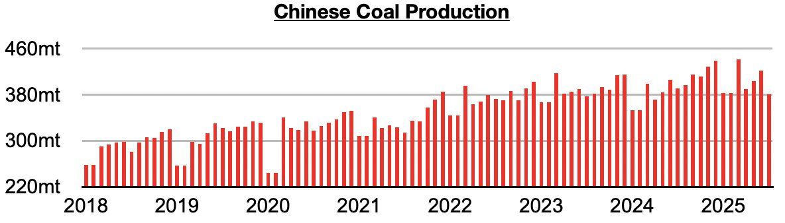
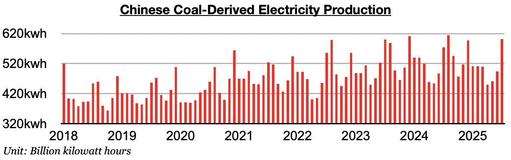
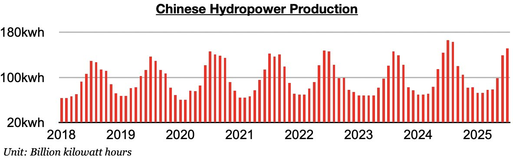

# Chinese Coal Import Demand Prospects Finally Improving

**Date:** August 22, 2025  
**Publisher:** Breakwave Advisors | **Category:** Market Insights  
**Original URL:** [https://www.breakwaveadvisors.com/insights/2025/8/22/chinese-coal-import-demand-prospects-finally-improving](https://www.breakwaveadvisors.com/insights/2025/8/22/chinese-coal-import-demand-prospects-finally-improving)  

---

*By*[*Jeffrey Landsberg*](https://www.linkedin.com/in/jeffrey-landsberg-70ab957/)

As we discussed in Commodore Research's most recent Weekly China Report, domestic coal production totaled 381 million tons in July. This is down month-on-month by 40.1 million tons (-10%), is down year-on-year by 9.4 million tons (-2%), and marks the first time since May 2024 without year-on-year growth.

> **Figure 1: Chart 1**  
> [Local Asset](file:///C:/Users/Dell/Github/Shipping/corpus/03-breakwave/insights/2025/assets/2025-08-22_chinese-coal-import-demand-prospects-finally-improving_img_chart1_9f409232212e.jpg)

Coal-derived electricity generation, which makes up the bulk of China's electricity generation, totaled 602 billion kilowatt hours. This is up month-on-month by 108.1 billion kilowatt hours (22%) and is up year-on-year by 27.1 billion kilowatt hours (5%). Overall, it is terrific for Chinese coal import demand prospects that coal-derived electricity generation growth has fared better domestic coal production growth. Previously, it had fared worse than coal production growth for nine straight months.

> **Figure 2: Chart 2**  
> [Local Asset](file:///C:/Users/Dell/Github/Shipping/corpus/03-breakwave/insights/2025/assets/2025-08-22_chinese-coal-import-demand-prospects-finally-improving_img_chart2_2571311d5623.jpg)

Hydropower output totaled 151.3 billion kilowatt hours. This is up month-on-month by 12.2 million kilowatt hours (9%) but is down year-on-year by 15.1 billion kilowatt hours (-9%). Hydropower output has now fallen on a year-on-year basis for four straight months (due to sustained lower than normal rainfall in parts of China). The weakness here has been very beneficial for Chinese thermal coal demand and coal-derived electricity generation.

> **Figure 3: Chart 3**  
> [Local Asset](file:///C:/Users/Dell/Github/Shipping/corpus/03-breakwave/insights/2025/assets/2025-08-22_chinese-coal-import-demand-prospects-finally-improving_img_chart3_0cd8af99fc55.jpg)

---

**Tags:** China, Coal, Drybulk  
