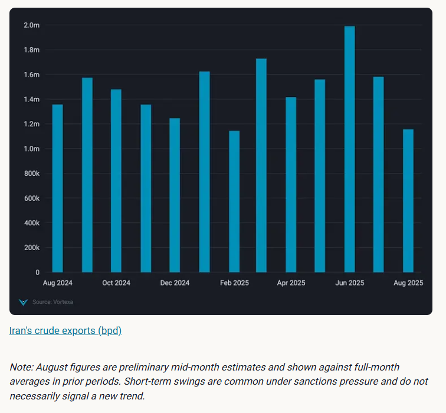
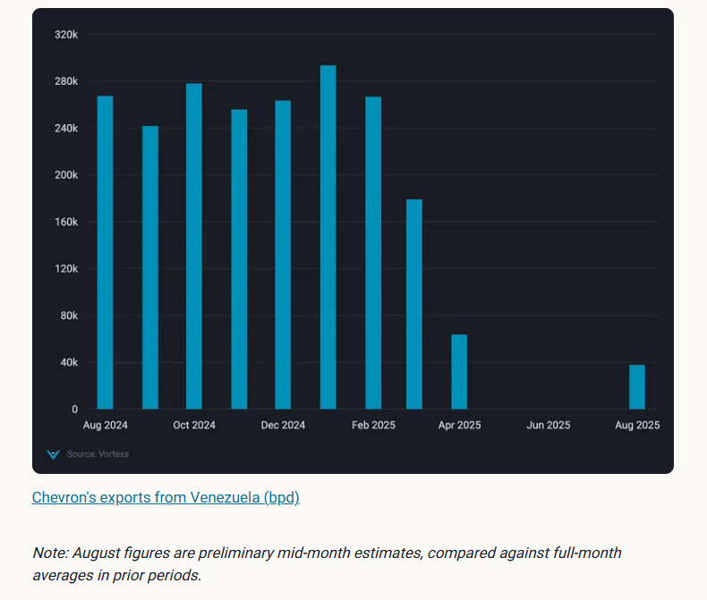

# Iran flows steady, Venezuela exports lag

**Date:** August 22, 2025  
**Publisher:** Breakwave Advisors | **Category:** Market Insights  
**Original URL:** [https://www.breakwaveadvisors.com/insights/2025/8/22/iran-flows-steady-venezuela-exports-lag](https://www.breakwaveadvisors.com/insights/2025/8/22/iran-flows-steady-venezuela-exports-lag)  

---

Iran exports steady near 1.2mbd; Venezuela lags at 540kbd on diluent shortages. Sanctioned flows hold but hinge on China demand, deep discounts.

*By*[*Claire Jungman*](https://www.linkedin.com/in/claire-jungman-b40a78110/)

Iran’s crude exports have averaged around 1.2mbd in the first half of August 2025 — roughly matching mid-August 2024 levels. Despite August 2024 ultimately closing higher, this mid-month parity underscores the resilience of Iranian flows amid sanctions.

It follows a July decline from June’s surge to nearly 2 mbd, when Tehran rushed barrels east amid fears of Israeli strikes. The slowdown that followed was temporary, and flows are now tracking closer to their long-term baseline.

## Methodology Comments: Bigger Is Not Always Better

While some market reports may publish higher Iranian export figures, bigger is not necessarily more accurate. Differences often come down to methodology. Including for example the following aspects:

- **Double-counting cargoes**by recording both the initial port loading*and*the subsequent ship-to-ship transfer as separate “exports”
- **Double-counting volumes**when vessel revisit the load port with a residual cargo on board after an STS of only a partial cargo
- **Prematurely assigning destinations and closing voyages**based on partial AIS pings before the cargo is actually discharged
- **Miss-judging evasive tactics**such as spoofing, loitering, or circuitous routing, leading to misclassification or overstatement of flows

Vortexa’s methodology is designed to avoid these pitfalls by combining multiple, cross-verified sources:

- **Global AIS tracking**continuously cleaned and enriched, supported by proprietary feeds with stronger coverage in high-risk regions
- **High-resolution satellite imagery**to confirm tanker loadings, discharges, and offshore transfers
- **Specialist analysis**that interprets evasive shipping behaviors typical of sanctioned flows

This layered approach means our figures may sometimes appear lower than competing reports, but they more accurately capture*delivered barrels*rather than inflated volumes caught mid-transfer. The result: consistent, dependable numbers that give confidence in both the scale and direction of Iranian exports.

With Asian demand steady and China absorbing the bulk of flows, exports are expected to settle the month of August above**1.2 mbd**.

> **Figure 1: Meanwhile**  
> *Meanwhile, Chevron has resumed crude liftings under its renewed US license. Tankers such asCanopus Voyager, Mediterranean VoyagerandNave Neutrinohave already loaded heavy blend crudes for US refineries. Chevron typically accounts for nearly 250kbd, or about one-third of Venezuela’s exports, and once blending feedstock supply improves, volumes are likely to rebound into the second half of August.*  
> **Interactive Data & Source:** [Vortexa](https://www.vortexa.com//oil-gas-data-traders-analysts-data-scientists?gclid=Cj0KCQjw8_qRBhCXARIsAE2AtRZKOvMnbilZ_6_91d7huSFFy71pWLrnPwGwOHVzXsmsG-1a1mZnQw8aAt89EALw_wcB&hsa_acc=1782073842&hsa_ad=548425387665&hsa_cam=14746637662&hsa_grp=125038601902&hsa_kw=&hsa_mt=&hsa_net=adwords&hsa_src=g&hsa_tgt=dsa-1431852288425&hsa_ver=3&utm_campaign=%5BCD%5D%20-%20DSA%20-%20EMEA&utm_medium=cpc&utm_medium=ppc&utm_source=google&utm_source=adwords&utm_term=) | [Local Asset](file:///C:/Users/Dell/Github/Shipping/corpus/03-breakwave/insights/2025/assets/2025-08-22_iran-flows-steady-venezuela-exports-lag_img_cea3cf84ceb9ceb3cebcceb9cf8ccf84cf85_57eaf6882c35.png)

## Venezuela Exports Fall on Diluent Shortages

Venezuela’s crude exports have averaged 540kbd in the first half of August 2025, markedly lower than the 660kbd shipped over the same period in August 2024. This shortfall underscores how critical diluents—lighter hydrocarbons used for blending heavy crude—have become to sustaining exports.

In 2024, PDVSA benefited from steady diluent supplies, which helped maintain higher export volumes. This year, however, those supplies have dried up. Russian diluent cargoes are making their way in, likely intended for blends headed to China, Venezuela’s primary crude destination.

> **Figure 2: Στιγμιότυπο Οθόνης 2025 08 22 123248**  
> **Interactive Data & Source:** [Vortexa](https://www.vortexa.com//oil-gas-data-traders-analysts-data-scientists?gclid=Cj0KCQjw8_qRBhCXARIsAE2AtRZKOvMnbilZ_6_91d7huSFFy71pWLrnPwGwOHVzXsmsG-1a1mZnQw8aAt89EALw_wcB&hsa_acc=1782073842&hsa_ad=548425387665&hsa_cam=14746637662&hsa_grp=125038601902&hsa_kw=&hsa_mt=&hsa_net=adwords&hsa_src=g&hsa_tgt=dsa-1431852288425&hsa_ver=3&utm_campaign=%5BCD%5D%20-%20DSA%20-%20EMEA&utm_medium=cpc&utm_medium=ppc&utm_source=google&utm_source=adwords&utm_term=) | [Local Asset](file:///C:/Users/Dell/Github/Shipping/corpus/03-breakwave/insights/2025/assets/2025-08-22_iran-flows-steady-venezuela-exports-lag_img_cea3cf84ceb9ceb3cebcceb9cf8ccf84cf85_7064d69d8d94.png)

## Forward Look

The mid-August export picture from Iran and Venezuela reinforces a broader theme: sanctioned crude has proven resilient, but not without costs.

- **Resilient but pressured:**Flows remain a stable component of global balances, yet current Venezuelan weakness and Iran’s fluctuations show that sanctions continue to exert pressure — especially when combined with logistical chokepoints such as diluent shortages
- **China as the anchor:**Demand is increasingly concentrated in a single market. China continues to absorb the bulk of sanctioned flows, with buyers there valuing discounted supply as part of their import mix. Outside China, appetite remains limited given reputational risks and compliance exposure
- **Discounts and competition:**Price discounts remain the key mechanism to keep barrels moving. These may need to deepen further as scrutiny on supply chains intensifies and competition grows between Iran, Venezuela, and Russia — all targeting the same set of risk-tolerant refiners

Data Source:[Vortexa](https://www.vortexa.com//oil-gas-data-traders-analysts-data-scientists?gclid=Cj0KCQjw8_qRBhCXARIsAE2AtRZKOvMnbilZ_6_91d7huSFFy71pWLrnPwGwOHVzXsmsG-1a1mZnQw8aAt89EALw_wcB&hsa_acc=1782073842&hsa_ad=548425387665&hsa_cam=14746637662&hsa_grp=125038601902&hsa_kw=&hsa_mt=&hsa_net=adwords&hsa_src=g&hsa_tgt=dsa-1431852288425&hsa_ver=3&utm_campaign=%5BCD%5D%20-%20DSA%20-%20EMEA&utm_medium=cpc&utm_medium=ppc&utm_source=google&utm_source=adwords&utm_term=)

---

**Tags:** Crude, Markets, Tankers  
