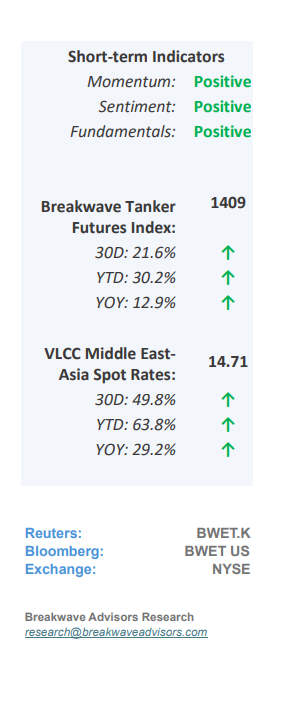
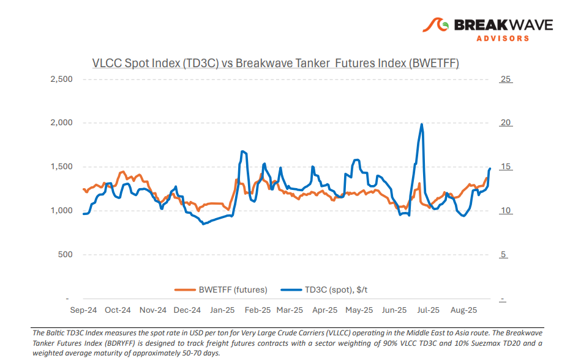
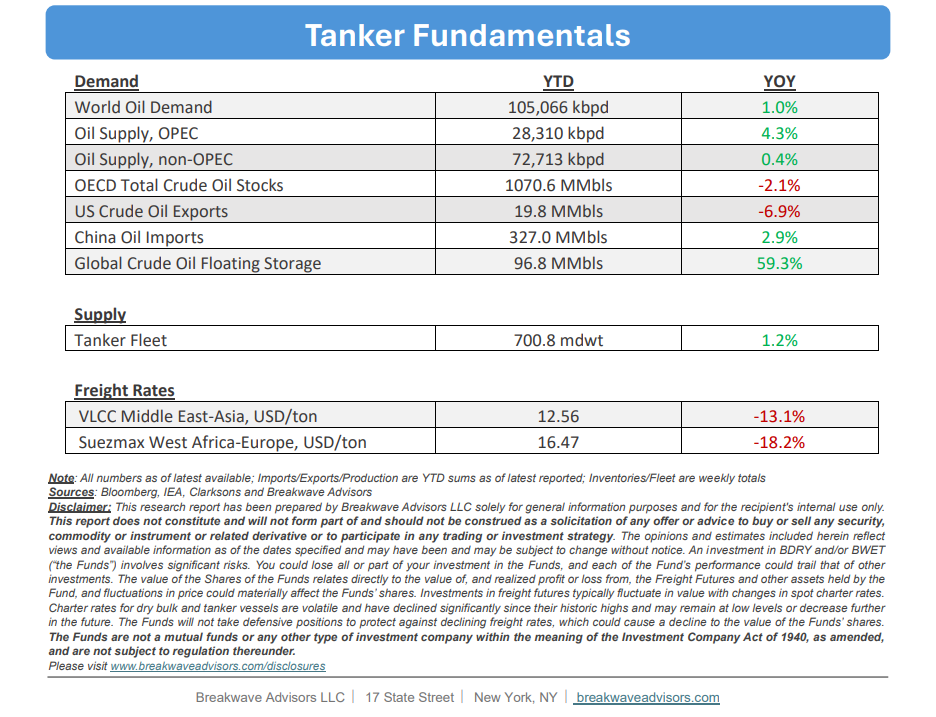

# Breakwave Bi-Weekly Tanker Report - August 26, 2025

**Date:** August 26, 2025  
**Publisher:** Breakwave Advisors | **Category:** Market Insights  
**Original URL:** [https://www.breakwaveadvisors.com/insights/2025826wetreportkil145](https://www.breakwaveadvisors.com/insights/2025826wetreportkil145)  

---

•**VLCC Market Closes August on a Stronger Footing**– In the final week of August, MEG**activity strengthened**sharply as cargo flows accelerated, with rates in some cases climbing nearly 10 points in a single day. This surge capped an**already robust August,**signaling a clear rebound from the late-July dip. Looking ahead, approximately 40 first-decade September cargoes are already in play, with another 10 likely to emerge. The key question is whether these volumes will be absorbed by regional players or larger owner groups. With**sentiment firm**and Chinese crude imports rising to 11.11 mbpd in July (+11.5% y/y), expectations remain for rates to continue trending upward. In the Atlantic basin, freight dynamics reflected the broader August strength. WAF/China rates firmed as cargo demand rose, supported by**increased Nigerian and Iraqi loadings**, with uneven OPEC+ compliance pushing additional barrels into the market. This activity provided momentum, enhancing Owners’ bargaining position as Charterer interest grew late in the month. Meanwhile, Brazil/China rates softened earlier in August, yet Brazil remains a crucial non-OPEC anchor supplier.**Steady Chinese demand for Brazilian crude**continues to underpin long-haul flows, reinforcing Brazil’s role as a stabilizer outside the OPEC+ framework. Overall, the VLCC market closed August on a considerably stronger footing than it began, with all major routes registering double-digit monthly growth.**Owners**have consolidated their**negotiating leverage**, validating our earlier view that tightening tonnage lists, robust Chinese imports, and geopolitical disruptions should sustain firm sentiment.

> **Figure 1: Στιγμιότυπο Οθόνης 2025 08 26 085711**  
> [Local Asset](file:///C:/Users/Dell/Github/Shipping/corpus/03-breakwave/insights/2025/assets/2025-08-26_2025826wetreportkil145_img_cea3cf84ceb9ceb3cebcceb9cf8ccf84cf85_9377b8e745ab.png)

•**Oil Remain Subdued as Fundamentals Point to Further Weakness**– Despite a substantial increase in global oil supply over the past year, estimated at roughly 2.5 million barrels per day as of the end of October,**oil prices**have remained relatively**resilient**, declining only about $5/bbl from last year’s levels. While**demand**has modestly**exceeded initial expectations**, the**market**remains**oversupplied**in our view, with**inventory adjustments**at times giving the appearance of stronger implied demand. Fundamentally,**Chinese transportation fuel demand is flat at best,**with only gas-related fuels continuing to show meaningful growth. Geopolitical uncertainty and sanctions remain potential disruptors; however, we believe the market is sufficiently supplied to absorb such shocks if they occur. Importantly, rising oil exports are a**clear positive for the tanker market**, and any further shifts in the oil forward curve could provide**additional support**to the large crude carrier segment going forward.

•**Our Long-term View**– The tanker market is recovering from a long period of staggered rates as the growth in new vessel supply shrinks while oil demand remains elevated in line with the global economy. A historically low orderbook combined with favorable shifting trade patterns should continue to support increased spot rate volatility, which combined with the ongoing geopolitical turmoil, should sustain freight rates in the medium to long term.

> **Figure 2: Στιγμιότυπο Οθόνης 2025 08 26 085643**  
> [Local Asset](file:///C:/Users/Dell/Github/Shipping/corpus/03-breakwave/insights/2025/assets/2025-08-26_2025826wetreportkil145_img_cea3cf84ceb9ceb3cebcceb9cf8ccf84cf85_5470b33f58ca.png)

> **Figure 3: Στιγμιότυπο Οθόνης 2025 08 26 085657**  
> [Local Asset](file:///C:/Users/Dell/Github/Shipping/corpus/03-breakwave/insights/2025/assets/2025-08-26_2025826wetreportkil145_img_cea3cf84ceb9ceb3cebcceb9cf8ccf84cf85_394ddf93cf06.png)

### Subscribe:
