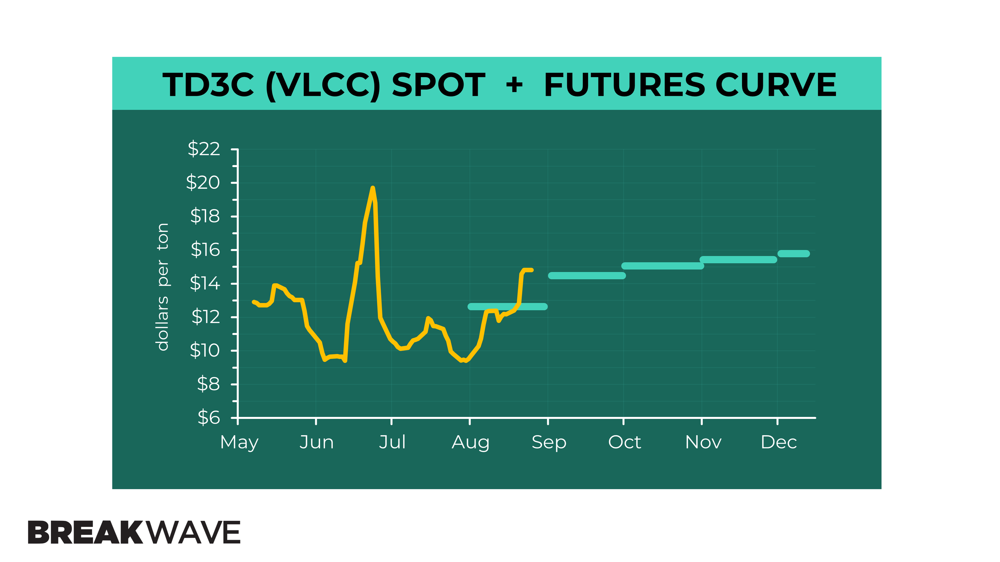

# Are VLCCs Poised for a Comeback?

**Date:** August 27, 2025  
**Publisher:** Breakwave Advisors | **Category:** Market Insights  
**Original URL:** [https://www.breakwaveadvisors.com/insights/2025/8/27/are-vlccs-poised-for-a-comeback](https://www.breakwaveadvisors.com/insights/2025/8/27/are-vlccs-poised-for-a-comeback)  

---

*By*[*Thanos Sofios*](https://www.linkedin.com/in/thanos-sofios/)

Poten & Partners recently shared a compelling outlook in their "Ready For A Rebound" report, suggesting that Very Large Crude Carriers (VLCCs) may be the first beneficiaries of an upcoming tanker market upturn.

### Why Vlccs Could Lead the Rebound

- **Tight orderbook**: Only one VLCC was delivered last year, with just six more expected by the end of 2025 - a stark contrast to higher deliveries forecast for mid-size vessels.

- **Long-haul trade strength**: Drewry notes that surging refinery throughput in regions like the Middle East and West Africa, combined with strong export demand from Brazil and Canada, will favor long-haul tonnage, especially VLCCs, over smaller segments.

- **Economic scale advantage**: VLCCs have historically offered lower cost-per-barrel over longer routes, critical as OPEC+ supply rebounds and global oil flows diversify.

### What the Data Is Telling Us

- **Spot rate strength**: As of late August, the Baltic VLCC TCE index is trading around $47,300/day, up approximately 41% year-over-year. Analysts at Jefferies project loadings from the Middle East could rise to 160–165 per month in Q4, up from 135/month earlier in 2025.

- **LatAm to Asia demand surge**: Signal Ocean reports that tonne-mile demand from Brazil to China has nearly doubled, adding roughly 1 billion nm to the weekly 7-day average since March. This trend is tightening availability in the Atlantic basin and further supporting VLCC freight momentum.

> **Figure 1: Td3ccurve82625**  
> [Local Asset](file:///C:/Users/Dell/Github/Shipping/corpus/03-breakwave/insights/2025/assets/2025-08-27_are-vlccs-poised-for-a-comeback_img_td3ccurve8262528129_38875f2526c1.png)

### Summary for Investors

VLCCs are structurally better positioned than ever:

- **Fleet additions remain limited**, preserving tight supply.

- **Trade patterns are shifting toward longer haul flows**, boosting tonne-mile demand.

- **Spot market fundamentals and loadings suggest pricing power is returning**to the largest vessels.

For investors monitoring shipping cycles, VLCC-centric strategies or exposure to freight rate-linked instruments may offer compelling upside as we move into Q4.

---

**Tags:** Tankers, Markets, Shipping  
