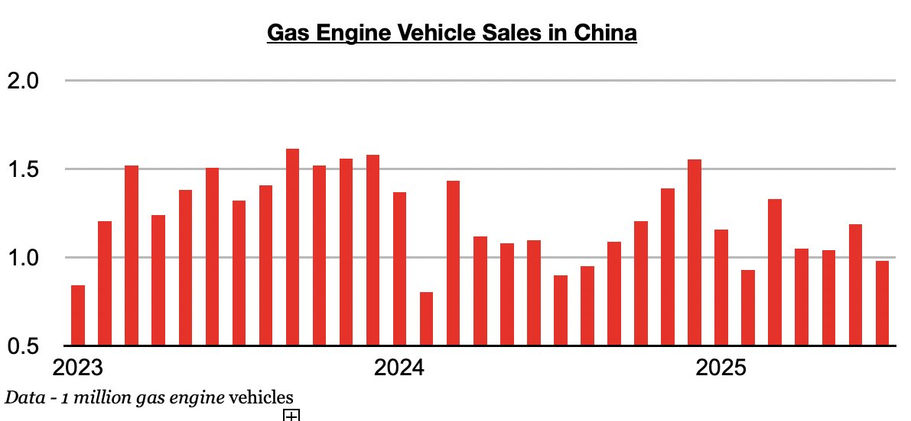
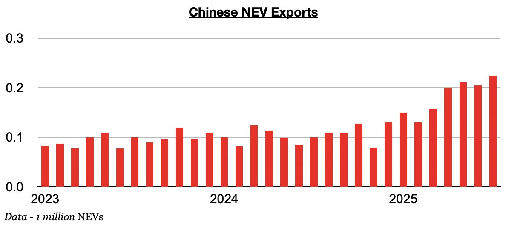

# Return of Growth in Gas Engine Vehicle Sales in China

**Date:** August 27, 2025  
**Publisher:** Breakwave Advisors | **Category:** Market Insights  
**Original URL:** [https://www.breakwaveadvisors.com/insights/2025/8/27/return-of-growth-in-gas-engine-vehicle-sales-in-china](https://www.breakwaveadvisors.com/insights/2025/8/27/return-of-growth-in-gas-engine-vehicle-sales-in-china)  

---

*By*[*Jeffrey Landsberg*](https://www.linkedin.com/in/jeffrey-landsberg-70ab957/)

As we discussed in Commodore Research's most recent Weekly China Report, July saw a total of 2.59 million vehicles sold in China (and also 575,000 Chinese-made vehicles exported). Of the 2.59 million vehicles, 981,000 were gas engine vehicles, which marked a year-on-year rise of 9%. Gas-engine vehicle sales in China have now grown on a year-on-year basis for two straight months. Previously, they had contracted on a year-on-year basis in fifteen of the prior sixteen months.

> **Figure 1: Chart 1 (1)**  
> [Local Asset](file:///C:/Users/Dell/Github/Shipping/corpus/03-breakwave/insights/2025/assets/2025-08-27_return-of-growth-in-gas-engine-vehicle-sales-in-china_img_chart128129_d7ab249fc1ff.jpg)

Of the 575,000 Chinese-made vehicles exported last month, 225,000 were electric vehicles (NEVs). This has marked a year-on-year increase of 125% and has set another record. China's NEV exports have now set a record in five of the last seven months.

> **Figure 2: Chart 2 (1)**  
> [Local Asset](file:///C:/Users/Dell/Github/Shipping/corpus/03-breakwave/insights/2025/assets/2025-08-27_return-of-growth-in-gas-engine-vehicle-sales-in-china_img_chart228129_72132e4cf88b.jpg)

---

**Tags:** China, Economy, Shipping  
