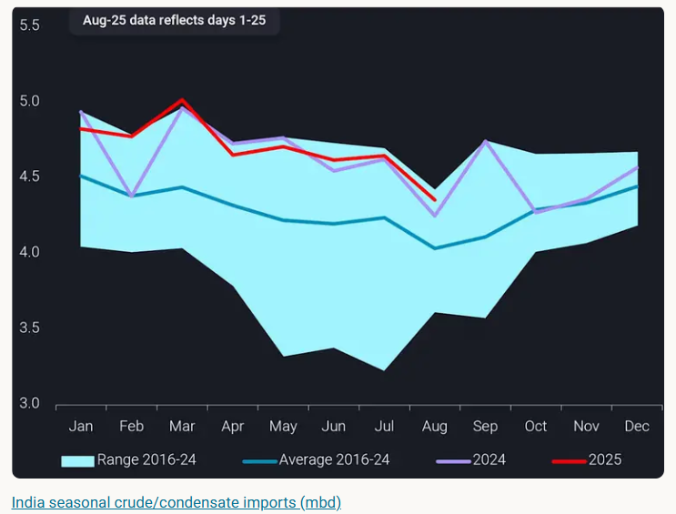
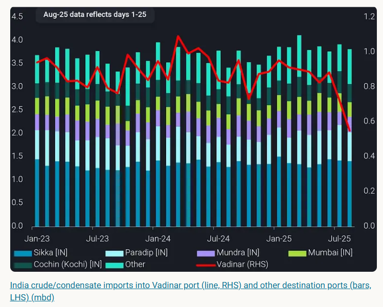
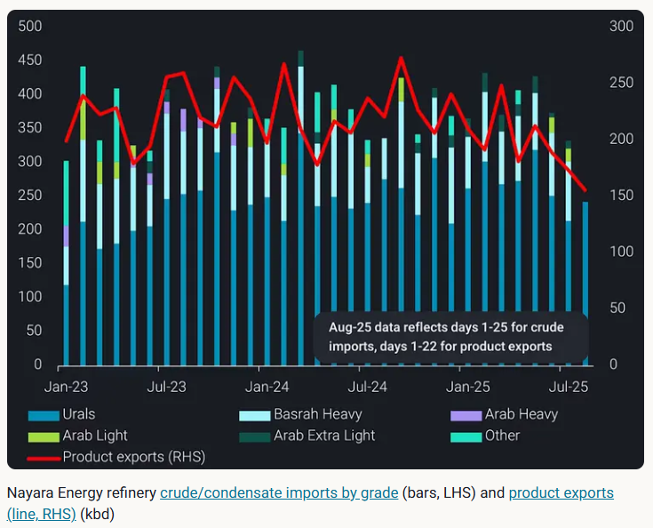
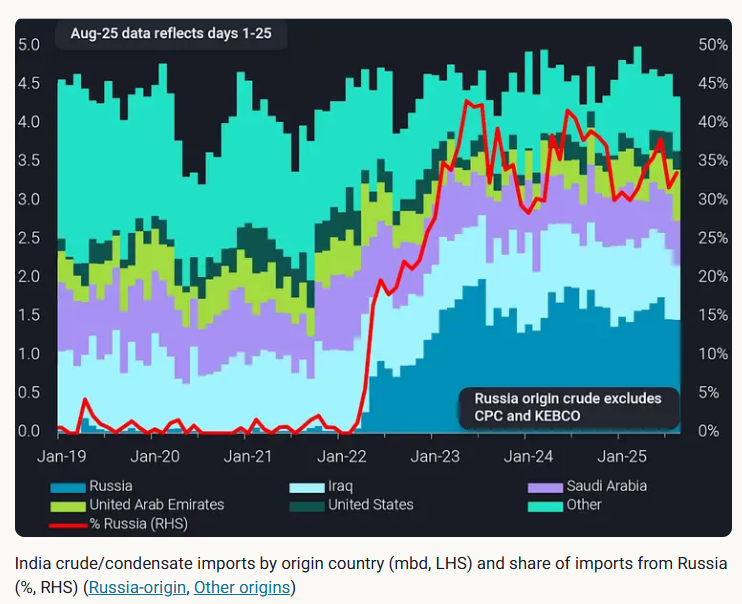

# India crude imports to rebound in September and October

**Date:** August 28, 2025  
**Publisher:** Breakwave Advisors | **Category:** Market Insights  
**Original URL:** [https://www.breakwaveadvisors.com/insights/2025/8/28/india-crude-imports-to-rebound-in-september-and-october](https://www.breakwaveadvisors.com/insights/2025/8/28/india-crude-imports-to-rebound-in-september-and-october)  

---

India crude imports fall in August due to lower arrivals into Nayara Energy refinery. We expect crude flows into India to rise in September and October.

*By*[*Ivan Mathews*](https://www.linkedin.com/in/ivan-m-255689137/)

India's crude imports are projected to fall by 0.3mbd m-o-m to 4.3mbd in August. Based on 9-year seasonal trends, arrivals of crude into India are typically the lowest in August. Domestic demand for gasoline and diesel used in road transport and agriculture decreases amid the monsoon season which begins in June and peaks in July-August. As such, most refineries conduct planned maintenance and reduce crude throughput during this period.

> **Figure 1: Στιγμιότυπο Οθόνης 2025 08 28 102243**  
> **Interactive Data & Source:** [Vortexa](https://www.vortexa.com/insights/russia-india-crude-vessel-supply) | [Local Asset](file:///C:/Users/Dell/Github/Shipping/corpus/03-breakwave/insights/2025/assets/2025-08-28_india-crude-imports-to-rebound-in-september-and-october_img_cea3cf84ceb9ceb3cebcceb9cf8ccf84cf85_b1a3b1c390e4.png)

The reason behind this year's decline is different. India's lower crude imports this month were mainly due to the decrease in flows into Nayara Energy's refinery. Analysing crude arrivals into India by port, it is evident that the major decline in arrivals occurred at Vadinar, where Nayara Energy's refinery oil terminals are located. In fact, crude imports into Vadinar have fallen steadily for two consecutive months since July.

> **Figure 2: Στιγμιότυπο Οθόνης 2025 08 28 102504**  
> **Interactive Data & Source:** [Vortexa](https://www.vortexa.com/insights/russia-india-crude-vessel-supply) | [Local Asset](file:///C:/Users/Dell/Github/Shipping/corpus/03-breakwave/insights/2025/assets/2025-08-28_india-crude-imports-to-rebound-in-september-and-october_img_cea3cf84ceb9ceb3cebcceb9cf8ccf84cf85_26516309a012.png)

Focusing on Vadinar port and selecting oil terminals linked to Nayara Energy, we see that crude arrivals into the refinery fell by 0.1mbd m-o-m in August. Imports of non-Russian crude completely ceased this month as mainstream vessels avoid calling at Nayara Energy refinery terminal. Meanwhile, imports of Urals crude into the refinery have risen slightly this month, as vessels plying the Russia-India trade route resume crude discharges after brief disruptions last month.

The overall drop in crude inflows impacted the refinery’s processing rates, resulting in a corresponding decrease in product exports. With the EU sanctions on Nayara Energy, the refinery will likely increase purchases of Russian crude in replacement of non-Russian barrels. Hence, we could see arrivals of crude into the refinery to rebound from August levels in the months ahead.

> **Figure 3: Στιγμιότυπο Οθόνης 2025 08 28 102545**  
> **Interactive Data & Source:** [Vortexa](https://www.vortexa.com/insights/russia-india-crude-vessel-supply) | [Local Asset](file:///C:/Users/Dell/Github/Shipping/corpus/03-breakwave/insights/2025/assets/2025-08-28_india-crude-imports-to-rebound-in-september-and-october_img_cea3cf84ceb9ceb3cebcceb9cf8ccf84cf85_f5de9739c5ce.png)

## India Crude Imports to Rebound in the Coming Months

Looking ahead, crude arrivals into India will likely increase in September and October, driven by higher inflows of Russian crude. We expect refineries in India to continue processing Russian oil, as their feedstock procurement decisions are mainly economics-driven. In fact, we hear from market sources that IOC and BPCL have resumed purchases of Russian crude for September and October loading. Additionally, discounts of Urals versus North Sea Brent crude have widened since the start of August (Argus), which increases the incentive for refiners to purchase Russian oil.

> **Figure 4: Στιγμιότυπο Οθόνης 2025 08 28 102630**  
> **Interactive Data & Source:** [Vortexa](https://www.vortexa.com/insights/russia-india-crude-vessel-supply) | [Local Asset](file:///C:/Users/Dell/Github/Shipping/corpus/03-breakwave/insights/2025/assets/2025-08-28_india-crude-imports-to-rebound-in-september-and-october_img_cea3cf84ceb9ceb3cebcceb9cf8ccf84cf85_a0db1c93600b.png)

India and Russia agreed on 21 August to expand bilateral trade ties, which implies that Russian oil purchases will likely continue (or even increase) despite US tariff pressure on India. The Russia-to-India crude supply chain is expected to remain resilient despite ongoing sanctions and regulatory pressures. Vortexa finds that the existing fleet supply could sustain up to 93% of H1 2025 Russian crude flows into India, with only minimal vessel additions required to fully restore flows. The demand for additional tonnage required to maintain Russia-to-India crude flows would likely be met by ageing or operationally less competitive vessels finding renewed utility through the sale-and-purchase market (read more[here](https://www.vortexa.com/insights/russia-india-crude-vessel-supply)).

Finally, refineries in India typically increase processing rates during September and October, which would necessitate higher crude imports. This is because domestic demand for fuels surges after the end of monsoon season in September and Diwali festivities in October. State-owned refineries focus on supplying fuels to the domestic market and could procure more crude in the coming months. Moreover, should HPCL commission their Residue Upgradation Facility, which we hear is slated to be by end of Q3, this will increase yields of more valuable products such as middle distillates over fuel oil. This would boost gross refining margins and lead to higher crude runs on the margin, providing further upside to imports.

Data Source:[Vortexa](https://www.vortexa.com//oil-gas-data-traders-analysts-data-scientists?gclid=Cj0KCQjw8_qRBhCXARIsAE2AtRZKOvMnbilZ_6_91d7huSFFy71pWLrnPwGwOHVzXsmsG-1a1mZnQw8aAt89EALw_wcB&hsa_acc=1782073842&hsa_ad=548425387665&hsa_cam=14746637662&hsa_grp=125038601902&hsa_kw=&hsa_mt=&hsa_net=adwords&hsa_src=g&hsa_tgt=dsa-1431852288425&hsa_ver=3&utm_campaign=%5BCD%5D%20-%20DSA%20-%20EMEA&utm_medium=cpc&utm_medium=ppc&utm_source=google&utm_source=adwords&utm_term=)

---

**Tags:** Crude, Tankers, Shipping  
