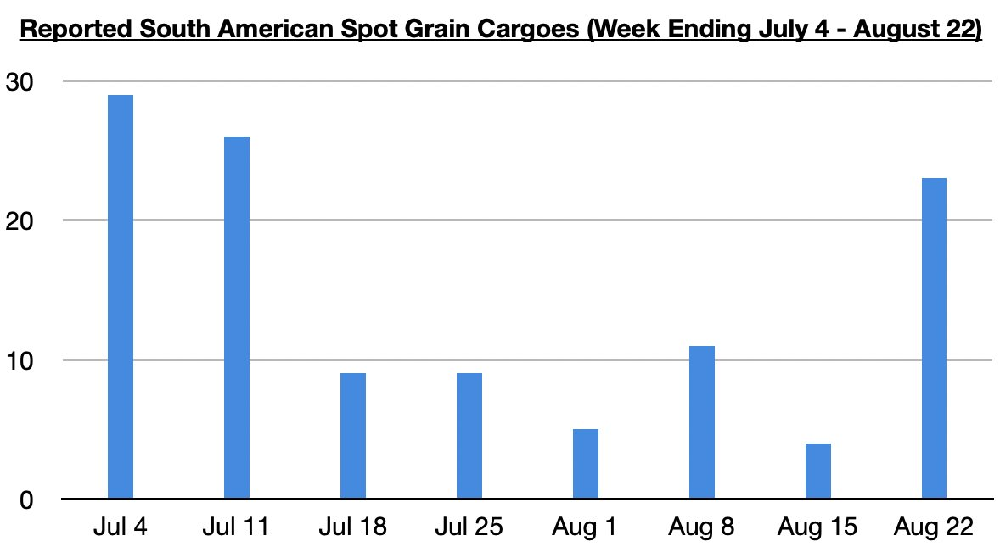

# Panamaxes Finding Strength

**Date:** August 28, 2025  
**Publisher:** Breakwave Advisors | **Category:** Market Insights  
**Original URL:** [https://www.breakwaveadvisors.com/insights/2025/8/28/panamaxes-finding-strength](https://www.breakwaveadvisors.com/insights/2025/8/28/panamaxes-finding-strength)  

---

*By*[*Jeffrey Landsberg*](https://www.linkedin.com/in/jeffrey-landsberg-70ab957/)

Overall dry bulk rates climbed last week, with all but capesize rates ending up week-on-week. Panamax rates rose by the largest amount. While capesize rates ended the week down by 15%, noteworthy is that capesize rates were able to rise on Friday. Previously, capesize rates had fallen for five straight days, with Thursday seeing rates fall to their lowest level since July 16th. Helpful for capesize rates recently has been that Brazilian spot iron ore cargo volume has been increasing. Also helpful has been the capesize-panamax ratio narrowing (as panamax rates have been strengthening).

For the panamax market, of note is that South American spot grain cargo volume jumped last week. South American spot grain cargo volume normally slows by this time of year, but this year has seen a longer than normal South American peak grain export season as we have continued to discuss in Commodore Research's Weekly Executive Reports.

> **Figure 1: Chart**  
> [Local Asset](file:///C:/Users/Dell/Github/Shipping/corpus/03-breakwave/insights/2025/assets/2025-08-28_panamaxes-finding-strength_img_chart_d9d46c79f509.jpg)

At the same time that South America’s peak grain export season has stretched on longer than usual, also new is that China’s coal import demand is finally strengthening. As we have been highlighting in Commodore Research's recent Weekly Executive Reports and Weekly China Reports, China’s domestic coal output has finally re-entered contraction, and China’s coal-derived electricity generation has also finally been faring better than domestic coal output again. The dynamics governing China’s coal import demand have become greatly improved. Overall, the shift in Chinese coal market dynamics and extended South American peak grain export season continue to lend significant support to the panamax sector.

---

**Tags:** Coal, Drybulk, China  
