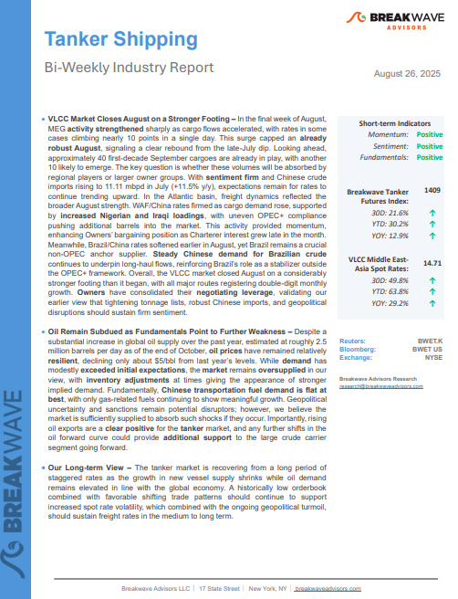
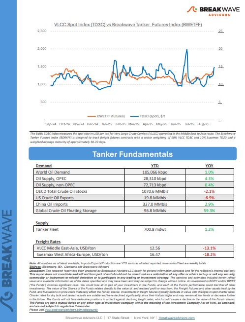
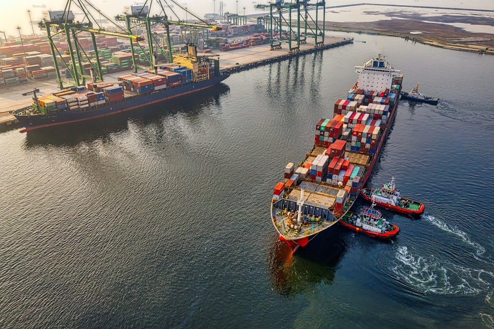

# Breakwave Weekend Read

**Date:** August 29, 2025  
**Publisher:** Breakwave Advisors | **Category:** Market Insights  
**Original URL:** [https://www.breakwaveadvisors.com/insights/2024/10/25/breakwave-weekend-read-547kk-rw7zy-awmfb-mf26k-dk29d-56ysb-x3jbe-xbwk9-dnpbr-b6jhc-l4mb2](https://www.breakwaveadvisors.com/insights/2024/10/25/breakwave-weekend-read-547kk-rw7zy-awmfb-mf26k-dk29d-56ysb-x3jbe-xbwk9-dnpbr-b6jhc-l4mb2)  

---

## Welcome Tobreakwave Advisorsweekend Read

***As the week comes to a close, take a moment to review the key insights from the past few days. Missed something? We've gathered all the top insights for you to catch up at your convenience.***

## Breakwave Shipping Report

**VLCC Market Closes August on a Stronger Footing**– In the final week of August, MEG**activity strengthened**sharply as cargo flows accelerated, with rates in some cases climbing nearly 10 points in a single day.

[Read More](https://www.breakwaveadvisors.com/insights/2025826wetreportkil145)

> **Figure 1: Στιγμιότυπο Οθόνης 2025 08 29 121147**  
> **Interactive Data & Source:** [TradeWinds](https://www.tradewindsnews.com/bulkers/dry-bulk-ffas-pull-back-after-hitting-highest-levels-of-2025/2-1-1863411) | [Local Asset](file:///C:/Users/Dell/Github/Shipping/corpus/03-breakwave/insights/2025/assets/2025-08-29_breakwave-weekend-read-547kk-rw7zy-awmfb-mf26k-dk29d-56ysb-x3jbe-xbwk9-dnpbr-b6j_img_cea3cf84ceb9ceb3cebcceb9cf8ccf84cf85_84187439f288.png)

> **Figure 2: Στιγμιότυπο Οθόνης 2025 08 29 121159**  
> **Interactive Data & Source:** [TradeWinds](https://www.tradewindsnews.com/bulkers/dry-bulk-ffas-pull-back-after-hitting-highest-levels-of-2025/2-1-1863411) | [Local Asset](file:///C:/Users/Dell/Github/Shipping/corpus/03-breakwave/insights/2025/assets/2025-08-29_breakwave-weekend-read-547kk-rw7zy-awmfb-mf26k-dk29d-56ysb-x3jbe-xbwk9-dnpbr-b6j_img_cea3cf84ceb9ceb3cebcceb9cf8ccf84cf85_31c04abedc7a.png)

## Highlight of the Week

## Dry Bulk Ffas Pull Back After Hitting Highest Levels of 2025

“As we look into the rest of the year, both Capes and Panamax spot rates are elevated versus recent history and if the seasonal pattern of stronger Q4 demand plays out this year, then 𝘄𝗲 𝗺𝗶𝗴𝗵𝘁 𝗯𝗲 𝗳𝗮𝗰𝗶𝗻𝗴 𝗮𝗻𝗼𝘁𝗵𝗲𝗿 𝘀𝘂𝗿𝗽𝗿𝗶𝘀𝗶𝗻𝗴𝗹𝘆 𝘀𝘁𝗿𝗼𝗻𝗴 𝗽𝗲𝗿𝗶𝗼𝗱 something that is not in the mind of traders right now as the futures curve is essentially flattish”,**Breakwave Advisors**' managing partner**John Kartsonas**told Tradewinds.

## Macroeconomic Forces and Structural Realignment: An Analysis of the Maritime Asset Markets (2025)

> **Figure 3: Pexels Danail Vasilev 247861001 29887019**  
> **Interactive Data & Source:** [Breakwave Advisors Market Insights](https://www.breakwaveadvisors.com/insights/2025/8/25/macroeconomic-forces-and-structural-realignment-an-analysis-of-the-maritime-asset-markets-2025) | [Local Asset](file:///C:/Users/Dell/Github/Shipping/corpus/03-breakwave/insights/2025/assets/2025-08-29_breakwave-weekend-read-547kk-rw7zy-awmfb-mf26k-dk29d-56ysb-x3jbe-xbwk9-dnpbr-b6j_img_pexels-danail-vasilev-247861001-2988_106b3b40d096.webp)

Disciplined Capital Allocation: means favoring eco, provenance -secure, and charter-backed assets, while this doesn’t necessarily means that shrewd seasoned ship-owners are avoiding tonnage whose upside is based on their cyclical nature.

Doric Weekly Market Insights

## Indian Salt Across Asian Waters

> **Figure 4: Unsplash Image Lpavwvgdqus**  
> **Interactive Data & Source:** [Breakwave Advisors Market Insights](https://www.breakwaveadvisors.com/insights/2025/8/26/indian-salt-across-asian-waters) | [Local Asset](file:///C:/Users/Dell/Github/Shipping/corpus/03-breakwave/insights/2025/assets/2025-08-29_breakwave-weekend-read-547kk-rw7zy-awmfb-mf26k-dk29d-56ysb-x3jbe-xbwk9-dnpbr-b6j_img_unsplash-image-lpavwvgdqus_92368279a001.jpg)

India’s salt sector is a global heavyweight, ranking among the top three producers worldwide with output averaging 30 mln mt annually.

BRS Weekly Dry Bulk Newsletter

## Are Vlccs Poised for a Comeback?

> **Figure 5: Td3c Curve 8.26.25**  
> **Interactive Data & Source:** [Breakwave Advisors Market Insights](https://www.breakwaveadvisors.com/insights/2025/8/27/are-vlccs-poised-for-a-comeback) | [Local Asset](file:///C:/Users/Dell/Github/Shipping/corpus/03-breakwave/insights/2025/assets/2025-08-29_breakwave-weekend-read-547kk-rw7zy-awmfb-mf26k-dk29d-56ysb-x3jbe-xbwk9-dnpbr-b6j_img_td3ccurve82625_38875f2526c1.png)

Poten & Partners recently shared a compelling outlook in their "Ready For A Rebound" report, suggesting that Very Large Crude Carriers (VLCCs) may be the first beneficiaries of an upcoming tanker market upturn.

VLCCs are structurally better positioned than ever

## Return of Growth in Gas Engine Vehicle Sales in China

> **Figure 6: Unsplash Image Sry2kbqcnts**  
> **Interactive Data & Source:** [Breakwave Advisors Market Insights](https://www.breakwaveadvisors.com/insights/2025/8/27/return-of-growth-in-gas-engine-vehicle-sales-in-china) | [Local Asset](file:///C:/Users/Dell/Github/Shipping/corpus/03-breakwave/insights/2025/assets/2025-08-29_breakwave-weekend-read-547kk-rw7zy-awmfb-mf26k-dk29d-56ysb-x3jbe-xbwk9-dnpbr-b6j_img_unsplash-image-sry2kbqcnts_879b5ae96153.jpg)

As we discussed in Commodore Research's most recent Weekly China Report, July saw a total of 2.59 million vehicles sold in China

From Commodore's Weekly Dry Bulk Reports

## Arctic Is No Longer a Distant “What If” for Container Shipping

> **Figure 7: Unsplash Image Nndkt2kf1l4**  
> **Interactive Data & Source:** [Breakwave Advisors Market Insights](https://www.breakwaveadvisors.com/insights/2025/8/27/arctic-is-no-longer-a-distant-what-if-for-container-shipping) | [Local Asset](file:///C:/Users/Dell/Github/Shipping/corpus/03-breakwave/insights/2025/assets/2025-08-29_breakwave-weekend-read-547kk-rw7zy-awmfb-mf26k-dk29d-56ysb-x3jbe-xbwk9-dnpbr-b6j_img_unsplash-image-nndkt2kf1l4_9ac4cd48a899.jpg)

China is set to mark a milestone this September with the launch of its first liner-type container service between Asia and Europe via the Northern Sea Route (NSR).

Intermodal Weekly Market Report

## Spot the Surge

> **Figure 8: Unsplash Image 983knf8azec**  
> **Interactive Data & Source:** [Breakwave Advisors Market Insights](https://www.breakwaveadvisors.com/insights/2025/8/27/spot-the-surge) | [Local Asset](file:///C:/Users/Dell/Github/Shipping/corpus/03-breakwave/insights/2025/assets/2025-08-29_breakwave-weekend-read-547kk-rw7zy-awmfb-mf26k-dk29d-56ysb-x3jbe-xbwk9-dnpbr-b6j_img_unsplash-image-983knf8azec_efb549cc7057.jpg)

Charlie Grey of Tankers International explains why the window to capitalise on the VLCC spot market is opening rapidly, demanding timely and strategic action.

Tankers International Editorial

## India Crude Imports to Rebound in September and October

> **Figure 9: Unsplash Image 1f3kodrtpxq**  
> **Interactive Data & Source:** [Breakwave Advisors Market Insights](https://www.breakwaveadvisors.com/insights/2025/8/28/india-crude-imports-to-rebound-in-september-and-october) | [Local Asset](file:///C:/Users/Dell/Github/Shipping/corpus/03-breakwave/insights/2025/assets/2025-08-29_breakwave-weekend-read-547kk-rw7zy-awmfb-mf26k-dk29d-56ysb-x3jbe-xbwk9-dnpbr-b6j_img_unsplash-image-1f3kodrtpxq_ebbf8e2605b0.jpg)

India crude imports fall in August due to lower arrivals into Nayara Energy refinery. We expect crude flows into India to rise in September and October.

Vortexa Freight Weekly

## Panamaxes Finding Strength

> **Figure 10: Unsplash Image F8paevamk3a**  
> **Interactive Data & Source:** [Breakwave Advisors Market Insights](https://www.breakwaveadvisors.com/insights/2025/8/28/panamaxes-finding-strength) | [Local Asset](file:///C:/Users/Dell/Github/Shipping/corpus/03-breakwave/insights/2025/assets/2025-08-29_breakwave-weekend-read-547kk-rw7zy-awmfb-mf26k-dk29d-56ysb-x3jbe-xbwk9-dnpbr-b6j_img_unsplash-image-f8paevamk3a_a83e477a3aec.jpg)

Overall dry bulk rates climbed last week, with all but capesize rates ending up week-on-week.

From Commodore's Weekly Dry Bulk Reports

## Metals Gain Amid Renewed Supply Restrictions

Crude oil markets pushed higher amid concerns of renewed restrictions on Russian supply. Constraints on Chinese output also supported base metals.

[Read More](https://www.breakwaveadvisors.com/insights/2025/8/29/metals-gain-amid-renewed-supply-restrictions)

Commodities Wrap

> **Figure 11: Unsplash Image 4dqwed3nc6e**  
> [Local Asset](file:///C:/Users/Dell/Github/Shipping/corpus/03-breakwave/insights/2025/assets/2025-08-29_breakwave-weekend-read-547kk-rw7zy-awmfb-mf26k-dk29d-56ysb-x3jbe-xbwk9-dnpbr-b6j_img_unsplash-image-4dqwed3nc6e_7ecaf652d6c7.jpg)

---

**Tags:** Shipping, Tankers, Drybulk  
