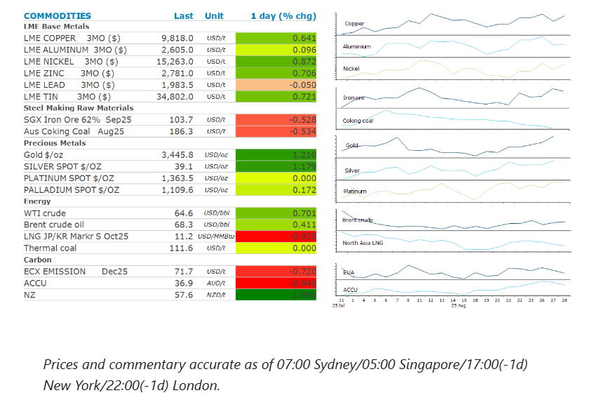
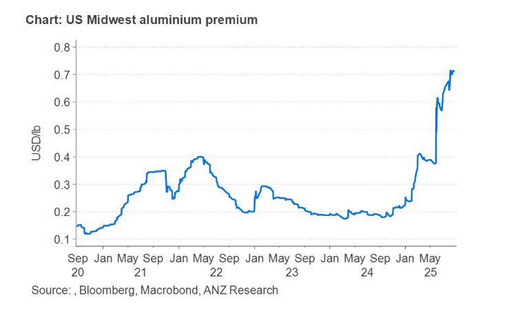

# Metals gain amid renewed supply restrictions

**Date:** August 29, 2025  
**Publisher:** Breakwave Advisors | **Category:** Market Insights  
**Original URL:** [https://www.breakwaveadvisors.com/insights/2025/8/29/metals-gain-amid-renewed-supply-restrictions](https://www.breakwaveadvisors.com/insights/2025/8/29/metals-gain-amid-renewed-supply-restrictions)  

---

Crude oil markets pushed higher amid concerns of renewed restrictions on Russian supply. Constraints on Chinese output also supported base metals.

*By*[*Daniel Hynes*](https://www.linkedin.com/in/dahynes/)

> **Figure 1: Στιγμιότυπο Οθόνης 2025 08 29 132533**  
> **Interactive Data & Source:** [Linkedin](https://www.linkedin.com/newsletters/commodities-wrap-6692196755876012032/?fbclid=IwAR3kiXJqZdxmp9ZcRwBNI7FsBySI-XSC0pfPur1qzjt7OZp7PTE59Tsl1QI) | [Local Asset](file:///C:/Users/Dell/Github/Shipping/corpus/03-breakwave/insights/2025/assets/2025-08-29_metals-gain-amid-renewed-supply-restrictions_img_cea3cf84ceb9ceb3cebcceb9cf8ccf84cf85_60f7906f57e1.png)

### Market Commentary

**Crude oil**rose as the prospect of a peace deal between Russia and Ukraine diminished. Germany’s Chancellor Merz said that a meeting between presidents Zelensky and Putin won’t happen. This was seen as a crucial step towards such a deal. That decreases the likelihood of more Russian supplies reaching broader markets. Moreover, it brings back the risk of the Trump administration applying additional sanctions on buyers of Russian crude in an effort to keep any ceasefire talks alive. White House trade advisor, Peter Navaro, stepped up pressure on India to halt purchases of Russian crude, repeating accusations that New Delhi is funding the Kremlin’s campaign in Ukraine and casting the conflict as “Modi’s war”. Trump is also set to release a statement on Russia and Ukraine. This comes amid increased attacks by Ukraine on Russia’s energy infrastructure. Ukrainian drone strikes on Russia’s oil export pipelines appear to be hitting Moscow’s crude oil flows. Weekly shipments from its ports dropped to a four-week low of 2.72mb/d last week, according to tanker tracker data. Besides the geopolitical risks, the market is contemplating a surge in OPEC supply that is expected to push the market into surplus later this year. The OPEC+ alliance is due to meet on 7 September to discuss its production agreement, although no talks have yet been held about its next move.

**European natural gas**fell for a third day as the risk of supply shortages over the coming heating season continues to fall. Europe is heading into the winter better prepared than predicted a few months ago. Fuel storage sites are more than 76%, putting them on track to reach 80% within a month, a level they are legally required to meet by 1 November. That was helped by increased availability of LNG cargoes after China reduced its purchases amid plentiful domestic supplies. However, the market is closely watching the geopolitical backdrop. A tanker with LNG from Russia’s sanctioned Arctic LNG 2 plant has docked at a Chinese terminal for the first time, with more vessels on their way. Some traders are assuming that there could be some breakthrough in Russia’s ability to sell cargoes, which would ease global competition for the fuel. This also dragged**North Asia LNG**prices lower.

**Aluminium**gained amid a broader rally across the**base metals**complex, after producers warned of supply constraints. South32 CEO, Graham Kerr, said that the availability of cheap, low-cost subsidised smelters in China is shifting, which provides price support. Beijing has capped aluminium smelting capacity at 45mt/y to rein in power consumption and emissions. Outside China, high energy prices have posed challenges for producers. South32 confirmed that its Mozal plant in Mozambique will likely be placed on ‘care and maintenance’ mode in March. China’s top state-owned producer, Aluminium Corp of China Ltd (Chalco), echoed that view, saying additions to global aluminium capacity will remain limited in the second half of 2025.

**Gold**pushed higher as traders take stock ahead of a key inflation report. Friday’s personal consumption report is expected to accelerate at the fastest annual pace in five months. However, swap markets are still showing a more than 80% chance that the Fed will cut rates at the next meeting. Haven demand received a boost after Fed governor, Lisa Cook, filed a lawsuit challenging Trump’s attempt to remove her.

### Chart of the Day

US tariffs on aluminium imports continued to play havoc with trade flows. The US Midwest premium, the additional cost of buying the metal in the US over the global benchmark LME prices, has continued to rise. It has jumped 815 since early June to reach USD0.715/lb in recent days. Rio Tinto, the global diversified miner is buying aluminium in the US and reselling it to American customers rather than moving its own metal from Canada due to tariffs.

> **Figure 2: Στιγμιότυπο Οθόνης 2025 08 29 132646**  
> **Interactive Data & Source:** [Linkedin](https://www.linkedin.com/newsletters/commodities-wrap-6692196755876012032/?fbclid=IwAR3kiXJqZdxmp9ZcRwBNI7FsBySI-XSC0pfPur1qzjt7OZp7PTE59Tsl1QI) | [Local Asset](file:///C:/Users/Dell/Github/Shipping/corpus/03-breakwave/insights/2025/assets/2025-08-29_metals-gain-amid-renewed-supply-restrictions_img_cea3cf84ceb9ceb3cebcceb9cf8ccf84cf85_8e1171b50e89.png)

Data source:[Commodities Wrap](https://www.linkedin.com/newsletters/commodities-wrap-6692196755876012032/?fbclid=IwAR3kiXJqZdxmp9ZcRwBNI7FsBySI-XSC0pfPur1qzjt7OZp7PTE59Tsl1QI)

---

**Tags:** Shipping, Commodities, Markets  
