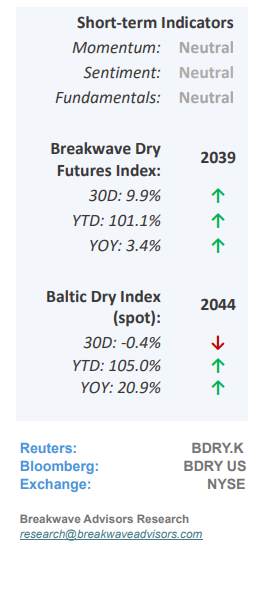
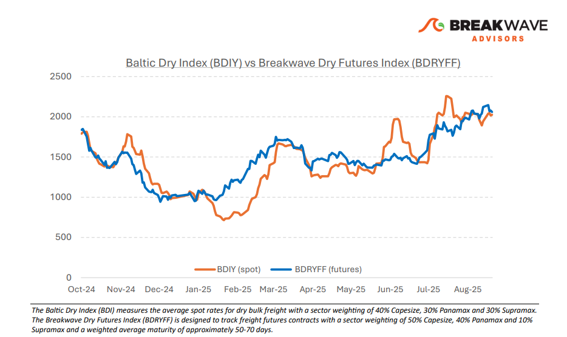
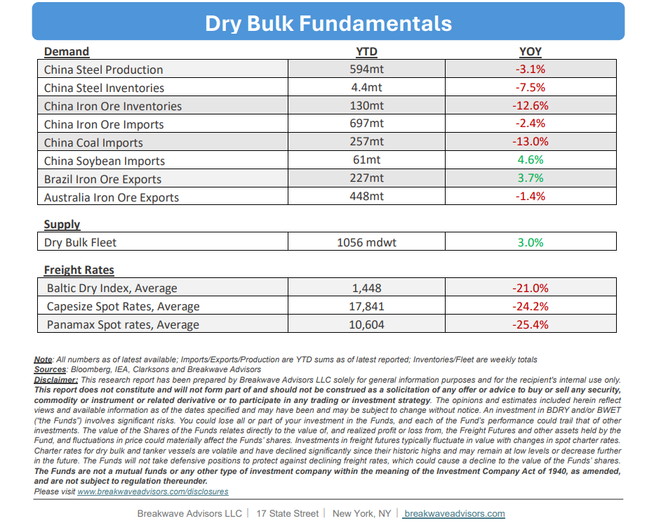

# Breakwave Bi-Weekly Dry Bulk Report - September 2, 2025

**Date:** September 02, 2025  
**Publisher:** Breakwave Advisors | **Category:** Market Insights  
**Original URL:** [https://www.breakwaveadvisors.com/insights/202592db-5cnlk417](https://www.breakwaveadvisors.com/insights/202592db-5cnlk417)  

---

•**Capesize Enters September on a High Note**– Following one of the strongest Augusts in recent history for Capesize spot rates,**early September appears equally promising**for large bulk carriers. In the Atlantic basin, steady demand has absorbed the excess tonnage that accumulated in recent weeks, keeping rates firm. In the Pacific,**robust iron ore exports**from Australia continue to drive demand and attract tonnage, thereby limiting the number of ballasting vessels.**Seasonality**also**supports further upside**, as September has historically been one of the strongest months for Capesize earnings. This optimism is reflected in the futures curve, with September contracts trading roughly $2,000 above spot levels.**Panamax**rates may face a modest correction but**remain elevated**for this time of year, ahead of what is typically a seasonally strong period for mid-sized bulk carriers. Overall, we remain constructive on the outlook for dry bulk rates into the fourth quarter. While risks persist, from China’s economic performance to broader geopolitical developments, we believe**the risk-reward balance remains favorable**for further gains, even at the current elevated absolute levels of spot rates.

> **Figure 1: Cea3cf84ceb9ceb3cebcceb9cf8ccf84cf85**  
> [Local Asset](file:///C:/Users/Dell/Github/Shipping/corpus/03-breakwave/insights/2025/assets/2025-09-02_202592db-5cnlk417_img_cea3cf84ceb9ceb3cebcceb9cf8ccf84cf85_70903fb322f7.png)

•**Iron Ore Prices Remain Supported Yet Rebar Margins Collapse**–**Benchmark steel margins**experienced a brief**spike**earlier in August, supported by stronger steel prices, but have since**collapsed**to their lowest levels of the year. While sentiment continues to drive iron ore prices, the**absence of fundamental**support makes it unlikely that prices can sustain levels above $100/ton for long. Ongoing announcements of steel production curbs, combined with the anticipated addition of new supply from West Africa’s Simandou project, point toward a persistently**oversupplied market**. Although inventories have normalized back to average for this time of year levels, the urgency to secure cargoes remains limited given the broader economic outlook. As such, we maintain a**cautious view**on iron ore, expecting prices to retreat into the low-$90 range ahead of the forthcoming increase in West African exports.

•**Our Long-term View**– The last few years have been characterized by increased geopolitical uncertainty. Going forward, we expect such events to continue to affect global trade and have a meaningful impact on effective vessel supply. Combined with the potential for a multi-year cyclical rebound in China’s economic activity following the recent economic turmoil, dry bulk shipping should experience higher volatility on top of a secular tightness driven by stable bulk commodity demand and a slower fleet growth owing to a relatively low orderbook.

> **Figure 2: Στιγμιότυπο Οθόνης 2025 09 02 084256**  
> [Local Asset](file:///C:/Users/Dell/Github/Shipping/corpus/03-breakwave/insights/2025/assets/2025-09-02_202592db-5cnlk417_img_cea3cf84ceb9ceb3cebcceb9cf8ccf84cf85_bcd2eac2887a.png)

> **Figure 3: Στιγμιότυπο Οθόνης 2025 09 02 084308**  
> [Local Asset](file:///C:/Users/Dell/Github/Shipping/corpus/03-breakwave/insights/2025/assets/2025-09-02_202592db-5cnlk417_img_cea3cf84ceb9ceb3cebcceb9cf8ccf84cf85_6e7e3adb5a78.png)

### Subscribe:
