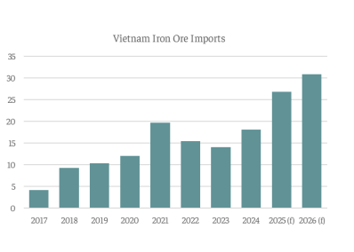

# The global iron ore market

**Date:** September 03, 2025  
**Publisher:** Breakwave Advisors | **Category:** Market Insights  
**Original URL:** [https://www.breakwaveadvisors.com/insights/2025/9/3/the-global-iron-ore-market](https://www.breakwaveadvisors.com/insights/2025/9/3/the-global-iron-ore-market)  

---

*By*[*Nikolaos Tagoulis*](https://www.linkedin.com/in/nikolaos-tagoulis-9317252a/)

The global iron ore market continues to navigate a period of uncertainty in 2025, affected by subdued demand conditions. Despite a recovery in the last two months, China’s iron ore imports which account for 75% of global imports, are projected to contract by 2% in 2025. This is set to lead to an overall marginal contraction of 0.8% in global iron ore trade for 2025 and a flat outlook in 2026.

Simultaneously, the supply landscape is set to evolve with the introduction of Guinea's Simandou mine, estimated to begin shipments by late 2025, with the potential to ramp up production of high-grade iron ore, to between 95–120 million tons annually, equivalent to about 6-8% of total global exports. Additionally, Brazil's iron ore exports are on track to reach a record 400 million tons in 2025, marking a 3% y-o-y increase and ranking second behind Australia. This growth is largely driven by the S11D (Serra Sul) project, one of the largest mining projects worldwide. Brazilian iron ore typically has a high iron content of 65-68% Fe, which is significantly above the global average of around 62%. With highquality iron ore from both Brazil and Guinea entering the market, less competitive producers, particularly those offering lowerquality ore or facing higher costs, could come under significant pressure.

Amid these challenging market conditions, a significant infrastructure investment program in Vietnam represents a positive development for the iron ore trade and the dry bulk sector in general. In August 2025, the Vietnamese government announced an ambitious infrastructure program, comprising 250 projects across 34 provinces and cities with an estimated value of $50 billion. This initiative covers a wide range of sectors, including expressways, bridges, urban development, education, and research facilities, with a strong focus on transportation, which accounts for 59 projects.

Strategic investments in key infrastructure, such as airports, bridges, and national roads, are expected to enhance domestic and international connectivity, streamline logistics processes, and reduce transport costs, thereby strengthening Vietnam’s position as a key logistics hub and unlocking new economic potential. The government has set an official GDP growth target of 6.5% to 7.0% for 2025, with an even more ambitious target of exceeding 10% average annual growth during the 2026–2030 period, placing infrastructure development at the center of its growth ambitions.

> **Figure 1: Στιγμιότυπο Οθόνης 2025 09 03 102050**  
> **Interactive Data & Source:** [Intermodal](https://www.intermodal.gr/) | [Local Asset](file:///C:/Users/Dell/Github/Shipping/corpus/03-breakwave/insights/2025/assets/2025-09-03_the-global-iron-ore-market_img_cea3cf84ceb9ceb3cebcceb9cf8ccf84cf85_7e595971a391.png)

Evidently, Vietnam's infrastructure program is poised to substantially benefit the seaborne iron ore trade and the dry bulk sector. As these large-scale projects require significant quantities of steel and other materials, iron ore inflows will play a central role in ensuring their successful realization. Iron ore inflows are forecast to surge by almost 50% y-o-y, from 18 million tons in 2024 to a record high of 27 million tons in 2025. Imports are projected to rise further, reaching an estimated 31 million tons in 2026. This stronger demand from Vietnam is estimated to underpin overall Indo-Pacific imports, which are forecast to grow by about 5% in 2025 to 239 million tons and by another 3.7% in 2026 to 248 million tons.

While Vietnam's contribution may not fundamentally alter the global iron ore market's supply-demand balance on its own, it is poised to inject fresh momentum into trade flows and provide vital support for the otherwise uncertain outlook. Finally, this strategic investment in infrastructure further underscores Vietnam's emergence as a key player and logistics hub in the region’s trade and shipping landscape.

Data Source:[Intermodal](https://www.intermodal.gr/)

---

**Tags:** Markets, Drybulk, Ironore  
